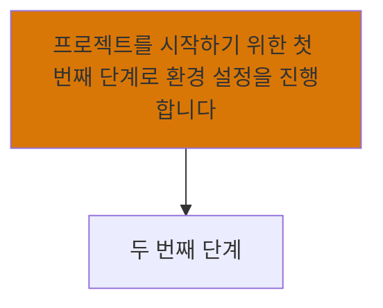
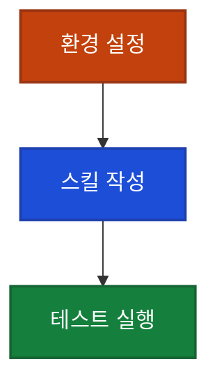

# 문서 템플릿 & 작성 규칙

> 이 파일은 /updateyoutube 스킬이 문서를 생성할 때 참조하는 템플릿과 규칙을 담고 있다.
> Step 4 (문서 생성) 시점에 읽는다. 서브에이전트에게도 이 파일 경로를 전달하여 직접 읽도록 한다.

## 대상 독자

**터미널을 열어본 적 없는 완전 생초보**부터 포함한다. Hook, YAML, 벡터 임베딩 같은 용어를 모르는 사람이 읽는다는 전제로 모든 문장을 작성한다. "이 정도는 알겠지"라는 가정을 하지 않는다.

## 문서 형식 (필수)

```markdown
---
date: "{YYYY-MM-DD 형식, /updateyoutube 실행한 당일 날짜}"
title: "문서 제목"
description: "한 줄 설명"
order: {기존 문서 최대 order + 1}
tags: ["관련", "태그", "목록"]
source_url: "https://youtube.com/watch?v={VIDEO_ID}"
---

## 이게 뭔가요?

{비개발자도 이해할 수 있는 쉬운 설명}
{일상 비유를 활용 — "카카오톡에서 메시지 보내듯이..." 같은 식}

## 왜 알아야 하나요?

{이걸 알면 뭐가 좋은지, 모르면 뭐가 불편한지}

## 어떻게 하나요?

### 방법 1: {구체적인 방법}

{단계별 설명}

<div class="example-case">
<strong>예시</strong>

{실제로 따라할 수 있는 구체적 예시}

</div>

### 방법 2: {있다면 추가}

## 실전 예시

<div class="example-case">
<strong>실전 케이스: {상황 설명}</strong>

{구체적인 시나리오와 해결 과정}

</div>

## 주의할 점

{흔한 실수, 주의사항}

## 정리

{핵심 요약 3줄 이내}
```

## 문서 작성 규칙

### 1. 전문 용어 처리 (최우선 규칙)

기술 용어가 등장할 때마다 반드시 괄호 안에 쉬운 설명을 붙인다. 독자는 터미널을 열어본 적 없는 사람이다.

**필수 괄호 설명 대상:**
- 영어 기술 용어: Hook(특정 시점에 자동 실행되는 기능), YAML(설정 파일 작성 형식), API(프로그램끼리 대화하는 통로)
- 약어: CLI(키보드로 명령어를 입력하는 화면), MCP(외부 도구 연결 기능), SDK(개발 도구 모음)
- 개발 개념: 벡터 임베딩(텍스트를 숫자로 변환하여 검색하는 기술), 프롬프트(AI에게 보내는 요청 메시지)

**나쁜 예:**
```
이 스킬에만 적용되는 훅 정의 (YAML 형식)
```

**좋은 예:**
```
이 스킬에만 적용되는 훅(특정 시점에 자동 실행되는 기능) 정의 — YAML(설정 파일 작성 형식)로 작성
```

**규칙:** 같은 문서 안에서 처음 등장할 때만 괄호 설명을 붙이면 된다. 두 번째부터는 괄호 없이 써도 괜찮다.

### 2. 비유 활용

모든 개념을 일상 비유로 한 번은 설명. 프로젝트 기존 스타일 참고:
- "게임 세이브 포인트" (체크포인트)
- "카카오톡 채팅창" (CLI 인터페이스)
- "의사의 처방" (프롬프트)
- "택배 송장 번호" (API 키)
- "집 열쇠" (인증 토큰)

### 3. 예시 필수

`<div class="example-case">` 블록 최소 2개 이상.

### 4. 빈 데이터 금지

자막이나 영상에서 구체적인 수치, 결과값, 코드 예시를 확인할 수 없으면 해당 섹션 자체를 넣지 않는다. 빈 공백이나 불완전한 표보다 섹션을 빼는 게 낫다.

**금지:**
```markdown
### 평가 결과
| 기준 | 통과율 |
|------|--------|
|      |        |
```

**올바른 대응:** 해당 섹션을 아예 제거하거나, 텍스트로 "영상에서 평가 결과를 시연하며, 전반적으로 높은 통과율을 보여줍니다"처럼 확인 가능한 수준에서만 서술.

### 5. 파일명

kebab-case (`youtube-tips.md`, `claude-workflow-pattern.md`)

### 6. 태그

영상 출처 태그 포함 (`"youtube"` 태그 필수)

### 7. 출처 표기

문서 하단에 참고 영상 링크 포함

### 8. Mac/Windows 병기

키보드 단축키나 터미널 조작 설명 시 반드시 Mac과 Windows 둘 다 표기

### 9. 영상-문서 정합성 (필수, 최우선)

이 문서는 YouTube 영상을 한국어로 옮긴 것이다. 자막에 없는 내용을 자연스러운 흐름이라며 보충하지 않는다. **LLM은 빈 곳을 메우려는 본능이 강하므로 의식적으로 절제할 것.**

#### A. 직접 인용 작성 규칙

"강사: ...", "AI: ..." 같은 직접 인용은 자막 원문 발췌만 허용. 자막에 없는 발화 창작 금지.

- 영문 원문 인용 명시: `AI(영상 자막): "..."` 또는 `Matt(자막 원문 "..."): "..."`
- 한국어 의역은 별도 줄에 "풀이: ..."로 분리
- **시점이 다른 두 발화를 한 발화처럼 묶지 않는다.** 각자 별도 단계/항목으로 분리

**나쁜 예** (영상에서 따로 등장한 두 발화를 합침):
```
Matt: "1:N으로 가자(correct). 그리고 Pitch는 비디오 0개로도 존재 가능(absolutely)."
```

**좋은 예** (시점 분리):
```
**2단계: cardinality 합의** [영상 9:30]
- AI: "one pitch holds many standalone videos vs 1:1?"
- Matt: "correct (1:N)"

**4단계: zero videos 가능 여부** [영상 10:30]
- AI: "Can a pitch exist with zero videos?"
- Matt: "Absolutely"
```

#### B. 데이터 모델·관계 주장 (방향성 주의)

"1:N", "cascade", "metadata" 같은 관계 주장은 풀어쓰기 과정에서 방향이 뒤집히기 쉽다. 자막 영문 원문을 옆에 함께 표기.

**나쁜 예**:
```
- Pitch: 하나의 Standalone Video는 여러 Pitch를 가질 수 있고...
```
(영상은 반대 방향이었는데 한국어로 옮기다 뒤집힘)

**좋은 예**:
```
- Pitch: 하나의 Pitch는 여러 Standalone Video를 가질 수 있음
  (영상 원문 "one pitch holds many standalone videos", 1:N)
```

#### C. 영상에 없는 조언·예시·비유

영상에 없는 모든 보충 내용은 **"(저자 보충)"** 명시. 화자가 한 말처럼 적지 않는다. 영상과 **반대되는** 보충은 더욱 신중히 — "영상과 다르지만 ..." 같은 명시 필요.

**나쁜 예**:
```
**1. context.md를 너무 일찍 만들지 말 것**
프로젝트 첫날 빈 repo에 만들어봐야 채울 내용이 없습니다.
```
(영상에서는 "초기 프로젝트도 일찍 시작하라"고 했는데 저자가 반대 조언을 화자 의견인 양 끼움)

**좋은 예**:
```
**1. 초기 프로젝트일수록 일찍 시작하라 (영상 입장)**
Matt: "if you are really early on in a project ... I'd still recommend using Grill with Docs"
(저자 보충: 사람마다 다를 수 있으나 영상의 명시적 입장은 "초기일수록 권장")
```

#### D. 화자 이름·신원·이력

영상에서 자기소개가 없으면 메타데이터(채널명·영상 설명)에서 가져온 정보임을 **"(저자 보충)"** 표시.

**나쁜 예**: `Matt Pocock(TypeScript 강의로 유명한 개발자)이 만든 스킬입니다.`
→ 영상에서 자기소개 없으면 마치 영상에서 그렇게 말한 것처럼 읽힘

**좋은 예**: `영상 화자(저자 보충: Total TypeScript 강의로 유명한 Matt Pocock, AI Hero 운영)가 만든 스킬입니다.`

#### E. 비개발자 풀어쓰기 — 자연어를 코드처럼 표기 금지

자막에서 자연어로 말한 것을 코드 표기(`===`, JS 연산자 등)로 바꾸지 않는다. 비개발자 독자에게 위화감.

**나쁜 예**: `Standalone Video는 'lessonId === null'인 비디오로 정의됨`
(영상에선 "lesson ID equals null"이라고 자연어로 말함)

**좋은 예**: `Standalone Video는 'Lesson에 연결되지 않은 비디오 (lessonId가 비어 있음)'로 정의됨`

#### F. 다이어그램·요약 라벨 — 영상의 분류 기준과 일치하는지 확인

분기 노드 라벨이 영상의 진의와 일치하는지 별도 확인. 미묘한 어긋남에 주의.

**나쁜 예**: 노드 라벨 `"코드베이스 있나?"` ← 영상은 "빈 repo라도 코드 프로젝트면 grill-with-docs 권장"이라고 명시했으므로 "코드베이스 유무"보다 "**코드 작업 vs 비코드 작업**"이 진짜 분기 기준

**좋은 예**: 노드 라벨 `"코드 프로젝트?"` 또는 `"도메인 용어가 쌓일 작업?"`

## Mermaid 다이어그램

### 사용 기준

"텍스트로 읽으면 머릿속에서 그림을 그려야 하는 내용"에만 사용:

- **흐름/프로세스**: 자동화 워크플로우 등 순서가 있는 구조
- **계층 구조**: 위아래 관계
- **의사결정 분기**: "어떤 방법을 써야 할까?" 같은 선택
- **관계도**: A와 B가 어떻게 연결되는지

**사용하지 않는 경우:**
- 단순 나열 (기능 목록, 팁 모음) -> 표나 불릿이 더 읽기 쉬움
- 단계별 가이드 (1->2->3) -> 번호 매긴 텍스트가 더 명확
- 문서당 3개 이상 -> 과하면 산만해짐

### 디자인 품질 규칙

Mermaid가 엉성하면 오히려 안 넣는 게 낫다. 아래 규칙을 반드시 지킨다:

1. **노드 텍스트 최대 15자** — 넘으면 `<br/>`로 줄바꿈. 긴 문장을 노드에 넣지 않는다.
2. **노드 최대 8개** — 넘으면 다이어그램을 분할하거나 표로 대체한다.
3. **색상 대비 보장** — 텍스트는 반드시 흰색(`#fff`), 배경은 충분히 진한 색만 사용. 다크모드/라이트모드/모바일 모두에서 읽을 수 있어야 한다.
4. **문서당 최대 2개**

**허용 색상 (텍스트 가시성 검증됨):**

```
배경: #c2410c (빨강)  텍스트: #fff
배경: #b45309 (주황)  텍스트: #fff
배경: #1d4ed8 (파랑)  텍스트: #fff
배경: #15803d (초록)  텍스트: #fff
배경: #6d28d9 (보라)  텍스트: #fff
배경: #475569 (회색)  텍스트: #fff
```

**나쁜 Mermaid 예시 (텍스트가 길고 색상 대비 부족):**


**좋은 Mermaid 예시:**


**Mermaid 코드 작성 규칙:**
- 노드 라벨은 반드시 한국어
- `<br/>`로 줄바꿈 가능 (`A["첫 번째 줄<br/>두 번째 줄"]`)

## 태그 규칙 (섹션 분류용)

youtube-update 카테고리는 태그로 섹션이 나뉜다. 문서마다 아래 태그 중 하나 이상을 반드시 포함:

- `신기능` 또는 `업데이트` -> "새로운 기능 & 업데이트" 섹션
- `활용법` 또는 `워크플로우` -> "활용법 & 워크플로우" 섹션
- `설정` 또는 `연동` -> "설정 & 연동" 섹션
- `비즈니스` 또는 `자동화` -> "비즈니스 & 자동화" 섹션

모든 문서에 `youtube` 태그도 필수 포함.

## 파일 저장 위치

```
content/youtube-update/{kebab-case-파일명}.md
```
