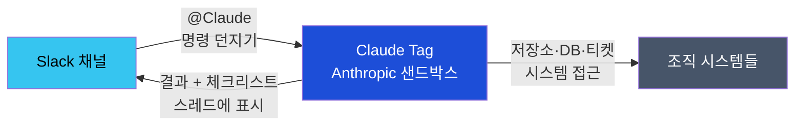

## 이게 뭔가요?

Claude Tag는 **Slack 채널 안에서 @Claude를 부르는 것만으로 AI 작업을 요청하는 기능**입니다. 회사 단톡방에 전문가를 한 명 초대해 두는 것처럼, 채널에 Claude를 초대해 두면 누가든 "@Claude, 이 버그 좀 봐줄래?" 하고 태그만 해도 Claude가 대화를 읽고 필요한 시스템(코드 저장소·이슈 추적·데이터베이스 등)에 접근해서 일을 처리해 줍니다.

핵심은 **모든 일이 채널 스레드에서 투명하게 진행**된다는 점입니다. 혼자 메일·메시지로 대화하는 게 아니라, 팀원 모두가 Claude의 작업 과정과 결과를 실시간으로 볼 수 있습니다. Claude가 체크리스트를 펼쳐 보여주며 "지금 코드 분석 중... PR 생성 중... 완료" 이렇게 진행 상황을 알립니다.



Claude Tag와 일반 Claude(또는 Claude Code)의 차이:

| 항목 | Claude Tag (Slack) | Claude Code (IDE) |
|------|---|---|
| **어디서** | Slack 채널 | 컴퓨터 IDE 또는 웹 |
| **누가 쓰나** | 팀원 누구나(설정 후) | 개별 개발자 |
| **진행 투명도** | 채널 공개 (팀원 모두 볼 수 있음) | 개인 대화 |
| **접근 가능** | 관리자가 미리 설정한 시스템만 | 개인 권한 범위 |
| **비용** | 사용량 기반 청구 | Claude Code 구독비 또는 API |

## 왜 알아야 하나요?

Claude Tag를 쓰면 좋은 점을 정리하면 이렇습니다.

| 장점 | 설명 |
|------|------|
| **빠른 응답** | 개발자가 직접 로그를 파고 재현할 필요 없이, Claude가 저장소·DB에 접근해 버그를 자동으로 찾아줍니다 |
| **팀원 모두 참여 가능** | 기술 용어를 몰라도 "@Claude 이거 어때?" 하면 됩니다. 결과도 채널에서 다함께 봅니다 |
| **기록이 남습니다** | Slack 스레드에 모든 작업이 기록되어 나중에 "누가 뭘 하고 왜 그 결정을 했나" 추적 가능 |
| **중앙 관리** | 관리자가 한 번만 "저장소 ○○, DB ▲▲, 이 채널에서 접근 가능"으로 설정하면, 팀원들은 추가 설정 없이 바로 쓸 수 있습니다 |
| **안전한 권한 관리** | 채널별로 "어디까지 접근 가능한지" 묶을 수 있어, 누군가 실수로 중요 시스템을 건드릴 위험을 줄입니다 |
| **비용 투명** | "이 달에 Claude를 몇 시간 썼나" 조회 가능, 지출 한도도 설정할 수 있습니다 |

반대로 모르면, 반복되는 작업(버그 재현·문서 작성·의사결정 기록)을 개인이 일일이 처리하거나, 외부 AI 도구에 정보를 유출하게 될 수 있습니다.

## 어떻게 하나요?

### 사전 작업: 관리자 설정 (한 번만)

Claude Tag를 조직에서 쓰려면, 관리자(Slack 워크스페이스의 Owner 또는 최고 권한자)가 먼저 Anthropic 측 설정을 해야 합니다. 개별 팀원이 설정할 수 없습니다.

1. **Anthropic 콘솔 접속**: `claude.ai/admin-settings/claude-tag`로 이동 (로그인 필수)
2. **채널 권한 설정**: 어느 Slack 워크스페이스·채널에서 Claude Tag를 쓸지 지정
3. **연결(Connections) 설정**: Claude가 접근할 수 있는 시스템들을 연결
   - 코드 저장소 (GitHub·GitLab 등)
   - 이슈 추적 시스템 (Jira·Linear 등)
   - 데이터웨어하우스 또는 DB
   - 기타 자격증명 저장소
4. **채널별 접근 범위 지정**: "마케팅 채널에서는 저장소 접근 금지, 분석 채널에서만 DB 쿼리 허용" 이런 식으로 세분화
5. **완료**: 설정된 채널의 팀원들이 바로 @Claude를 쓸 수 있음

### 실제 사용: 팀원이 하는 일 (매일)

설정이 끝나면, 팀원들은 Slack에서 이렇게 씁니다.

```
@Claude, 이 PR에서 성능 문제 찾아줄 수 있어?
```

Claude가 하는 일:

1. 채널 대화 맥락 읽기
2. 스레드에 체크리스트 펼치기: "PR 코드 분석 중 → 성능 프로파일링 → 개선안 작성 중..."
3. 저장소에 접근해 코드·커밋 이력·성능 메트릭 확인
4. 발견한 문제와 개선안을 스레드에 게시
5. 필요하면 수정 코드도 제안

모든 과정이 **공개 스레드**에서 일어나므로, 팀원들이 "Claude가 뭘 봤고 어떻게 결정했는지" 실시간으로 따라갈 수 있습니다.

### 설정 항목 (관리자 쪽)

관리자가 Claude Tag를 설정할 때 결정하는 것들:

| 항목 | 설명 |
|------|------|
| **활성화 채널** | Slack의 어느 워크스페이스·채널에서 @Claude를 쓸지 |
| **접근 시스템** | Claude가 연결할 저장소·DB·이슈 추적 시스템·API 등 |
| **채널별 권한** | "개발 채널은 모든 저장소 접근 가능, 마케팅 채널은 공개 문서만" 이런 식으로 채널마다 다르게 설정 가능 |
| **자격증명 저장** | GitHub 토큰·DB 비밀번호 같은 민감 정보를 Anthropic 측에서 안전하게 보관하는 방식 설정 |
| **채널 메모리** | Claude가 이전 대화를 기억할지 말지 (고급 기능) |
| **지출 한도** | 조직 크레딧으로 운영할 때, 월별 또는 누적 한도 설정 가능 |

### 비용 모델

Claude Tag는 **사용량 기반 청구**입니다.

- **프로모션 기간**: 2026년 9월 1일까지 조직 크레딧으로 사용 가능 (추가 비용 없음)
- **이후**: 실제 사용량(Claude의 "생각" 시간 + 도구 호출)에 따라 청구
- **한도 설정**: Owner가 월별 또는 누적 상한을 정할 수 있음

## 실전 예시

### 실전 케이스 1: 버그 재현 및 PR 생성

개발팀의 Slack 채널에서:

```
@Claude, iOS 앱 크래시 리포트 들어왔어.
로그는 ProfileVC에서 메모리 누수 신호.
이거 재현하고 PR 만들어줄 수 있어?
```

Claude Tag가 하는 일:

1. GitHub에 접근해 최신 코드 확인
2. 로그 패턴 분석 → 메모리 누수 의심 지점 특정
3. 테스트 코드 작성해서 재현 확인
4. 수정 코드 작성
5. PR 자동 생성 → 스레드에 링크 게시

팀원들은 스레드를 보며 "Claude가 뭘 확인했고 어느 부분을 고쳤나" 따라갈 수 있습니다.

### 실전 케이스 2: 의사결정 문서화

프로젝트 관리팀의 채널:

```
@Claude, 지난 회의의 핵심 결정 사항과
각각의 이유를 요약 문서로 만들어줄래?
```

Claude가:

1. 채널의 최근 대화 읽기
2. Jira 티켓·회의록 시스템에 접근
3. 결정 사항 정리 → 각 선택이 왜 나왔는지 맥락 기록
4. 마크다운 문서로 작성 → 공유 폴더 업로드

회의 이후 신입사원도 "왜 이렇게 하기로 했나" 문서로 한눈에 파악할 수 있습니다.

### 실전 케이스 3: 대시보드 상태 정리

데이터팀의 채널:

```
@Claude, 지난주 대시보드 성능 지표(응답 시간, 쿼리 실패율)를
요약해줄래? 트렌드도 함께.
```

Claude가:

1. 데이터웨어하우스에 접근
2. 지난주 메트릭 쿼리 및 분석
3. 그래프·요약을 스레드에 게시

주간 회의 전에 팀원들이 현황을 빠르게 파악할 수 있습니다.

## 주의할 점

- **공개 채널**: Claude Tag가 접근하는 모든 정보는 채널 멤버들에게 보입니다. 극도로 민감한 정보(예: 급여 DB)는 별도 채널이나 접근 제어로 보호하세요.
- **자격증명 보안**: GitHub 토큰·DB 비밀번호 같은 민감 정보는 절대 Slack 메시지에 붙여 넣지 말고, 관리자 설정에서 "Anthropic에 저장된 자격증명 사용"으로 처리하세요.
- **권한이 없으면 안 됩니다**: 채널에서 Claude를 부를 수 있어도, 관리자가 설정해 두지 않은 시스템에는 접근할 수 없습니다. "저장소 없음", "DB 연결 안 됨" 같은 오류가 나면 관리자에게 알리세요.
- **감사 추적**: Anthropic 쪽에서 "어느 채널의 누가, 언제 뭘 요청했고, Claude가 뭘 접근했나"를 기록하고 있습니다. 조직 보안 정책에 확인하세요.
- **공개 베타**: Claude Tag는 아직 공개 베타 단계입니다. 앞으로 기능이 변하거나 제약이 생길 수 있습니다.

## 정리

- Claude Tag는 **Slack 채널에서 @Claude를 태그해서 AI 작업을 요청하는 기능**입니다.
- 관리자가 한 번만 저장소·DB·권한을 설정하면, 팀원들은 추가 설정 없이 채널에서 Claude를 부르기만 하면 됩니다.
- 모든 작업이 **채널 스레드에서 투명하게 진행**되어, 팀이 함께 결과를 보고 배울 수 있습니다.
- 채널·팀별로 접근 범위를 나눠서 보안을 지킬 수 있습니다.

## 출처

- [Claude Tag Overview — Anthropic 공식 문서](https://claude.com/docs/claude-tag/overview)
- [Claude Tag Admin Settings — Anthropic 공식 문서](https://claude.com/docs/claude-tag)
