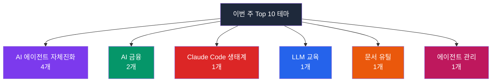

## 이번 주 트렌드 한눈에 보기

이번 주는 "AI 에이전트가 스스로 진화한다"는 흐름이 절정에 달했습니다. 상위 10개 중 4개 프로젝트가 **자체 진화형 에이전트**(사람이 다시 코딩하지 않아도 경험을 통해 능력이 늘어나는 AI) 테마로 묶였고, 금융 시장을 다루는 AI 두 개(헤지펀드 시뮬레이터, 금융 파운데이션 모델)도 동시에 등장했습니다. 마치 스마트폰 앱이 사용할수록 추천이 정교해지듯, AI 에이전트도 "쓸수록 영리해지는" 구조로 진화하는 주간이었습니다. 참고로 1, 2위는 이미 별도 문서에 단독 분석해 둔 프로젝트(andrej-karpathy-skills, hermes-agent)라서 이번 문서에서는 3위부터 다룹니다.

---

## 1위. thedotmack/claude-mem

| 항목 | 내용 |
|------|------|
| 만든 곳 | thedotmack (개인 개발자) |
| 주 언어 | TypeScript |
| 이번 주 ⭐ | +14,556 |
| 전체 ⭐ | 약 63,600 |
| 링크 | [thedotmack/claude-mem](https://github.com/thedotmack/claude-mem) |

### 이게 뭔가요?

Claude Code(클로드 코드, 터미널에서 AI에게 코딩을 시키는 도구)에 **자동 메모리**를 붙여주는 플러그인(기존 프로그램에 기능을 추가하는 확장 도구)입니다.

마치 회의 녹음기를 틀어놓고 회의 끝에 AI가 핵심 요점만 정리해서 다음 회의에 자동으로 꺼내주는 것처럼 — claude-mem은 코딩 세션 중 AI가 한 모든 작업을 캡처한 뒤 AI 자신으로 압축하고, 다음 대화를 시작하면 관련 맥락만 자동으로 불러옵니다. "저번에 내가 뭘 하고 있었지?"라고 다시 설명할 필요가 없어집니다.

### 왜 이번 주에 주목받았나요?

Claude Code를 쓰는 사람들이 가장 자주 겪는 고통은 **대화가 길어지면 AI가 초반 맥락을 잊는다는 점**입니다. 이걸 수동으로 정리하던 습관을 자동화한 첫 번째 성공적인 플러그인이라는 입소문이 나면서 이번 주 폭발적으로 퍼졌습니다. Claude의 공식 에이전트 SDK(개발 도구 모음)를 써서 압축을 수행한다는 점도 신뢰도를 높였습니다.

### 핵심 기능

- **자동 세션 캡처**: 코딩 중 AI가 한 모든 작업(파일 수정, 명령 실행, 의사결정)을 자동으로 기록합니다
- **AI 기반 압축**: 긴 세션을 중요한 결정 사항 중심으로 요약해 저장합니다
- **지능형 컨텍스트 주입**: 새 세션을 시작할 때 관련 있는 과거 맥락만 골라서 자동으로 불러옵니다

<strong>실전 예시: 3개월짜리 사이드 프로젝트를 이어가는 1인 개발자</strong>

주말에만 코딩할 시간이 나는 직장인 개발자 정민수 씨는 매번 Claude Code를 켤 때마다 "지난주에 어디까지 했더라"를 설명하느라 30분을 허비했습니다. claude-mem을 설치한 이후에는 Claude가 지난 세션의 핵심만 자동으로 요약해 가져와 주어, 바로 다음 기능 구현에 착수할 수 있게 되었습니다. 덕분에 주말 2시간 코딩 시간 중 실제 작업 시간이 1시간 50분으로 늘었습니다.

<strong>이런 분께 추천해요</strong>

- **긴 프로젝트를 혼자 관리하는 프리랜서 개발자**: 매번 맥락을 다시 설명하지 않아도 됩니다
- **여러 프로젝트를 오가는 개발팀 리더**: 프로젝트별로 기억이 분리되어 섞이지 않습니다
- **Claude Code 파워 유저**: 긴 세션의 토큰 비용을 크게 절감합니다

---

## 2위. microsoft/markitdown

| 항목 | 내용 |
|------|------|
| 만든 곳 | Microsoft |
| 주 언어 | Python |
| 이번 주 ⭐ | +9,018 |
| 전체 ⭐ | 약 112,900 |
| 링크 | [microsoft/markitdown](https://github.com/microsoft/markitdown) |

### 이게 뭔가요?

PDF, 워드, 엑셀, 파워포인트, 오디오, 이미지 등 **거의 모든 종류의 파일을 마크다운**(\*.md, AI가 가장 잘 이해하는 문서 형식)으로 변환해 주는 파이썬 도구입니다.

마치 구글 번역기가 한국어를 영어로 바꿔주듯, markitdown은 사람이 보는 문서 형식을 AI가 읽기 편한 형식으로 바꿔줍니다. AI에게 긴 사업계획서를 분석시킬 때 PDF를 그대로 넣으면 품질이 떨어지는데, 먼저 markitdown으로 마크다운으로 변환하면 AI 답변의 정확도가 눈에 띄게 올라갑니다.

### 왜 이번 주에 주목받았나요?

원래부터 인기 있던 프로젝트인데, 최근 AI 에이전트 열풍과 함께 **RAG**(검색 증강 생성, AI가 문서를 참고해 답하는 방식) 파이프라인의 표준 전처리 도구로 굳어지면서 스타가 다시 치솟았습니다. Microsoft가 공식으로 유지보수한다는 점도 기업 도입의 안전판이 되었습니다.

### 핵심 기능

- **거의 모든 포맷 지원**: PDF, DOCX, XLSX, PPTX, HTML, 이미지(OCR), 오디오(음성 인식) 모두 처리
- **AI 친화 출력**: LLM이 가장 잘 해석하는 깔끔한 마크다운 구조로 변환
- **간단한 명령 한 줄**: `markitdown file.pdf > file.md` 형태로 한 줄이면 끝

<strong>실전 예시: 법인 계약서 100건을 AI로 분석하려는 법무팀 담당자</strong>

중견기업 법무팀의 최서연 씨는 5년 치 계약서 PDF 100건에서 특정 조항을 찾아내야 했습니다. ChatGPT에 PDF를 하나씩 올리다 보니 일주일이 걸렸는데, markitdown으로 100건을 한꺼번에 마크다운으로 변환한 뒤 AI에게 전체를 분석시키니 반나절 만에 원하는 조항이 포함된 계약서 리스트가 나왔습니다.

<strong>이런 분께 추천해요</strong>

- **AI로 사내 문서를 분석하려는 지식노동자**: PDF/워드 파일 전처리 고민이 사라집니다
- **RAG 챗봇을 만드는 개발자**: 문서 수집 파이프라인의 표준 단계로 쓰기 좋습니다
- **노션/옵시디언 등 마크다운 기반 도구 사용자**: 기존 문서를 대량으로 이주시킬 수 있습니다

---

## 3위. multica-ai/multica

| 항목 | 내용 |
|------|------|
| 만든 곳 | Multica AI |
| 주 언어 | TypeScript |
| 이번 주 ⭐ | +7,831 |
| 전체 ⭐ | 약 17,000 |
| 링크 | [multica-ai/multica](https://github.com/multica-ai/multica) |

### 이게 뭔가요?

Claude, Cursor, Copilot 같은 **여러 코딩 AI 에이전트**를 실제 팀원처럼 배치하고, 작업을 할당하고, 진행 상황을 추적하는 오픈소스(누구나 무료로 쓸 수 있는 공개 소프트웨어) 매니지먼트 플랫폼입니다.

마치 카카오워크나 지라(Jira, 업무 관리 툴)에서 사람 팀원에게 티켓을 배분하듯, multica에서는 AI 에이전트에게 "이 버그 고쳐", "이 기능 설계해"라고 작업을 배분합니다. 에이전트가 작업하면서 축적한 스킬은 다른 프로젝트로 옮길 수 있어, 여러 에이전트의 경험이 누적됩니다.

### 왜 이번 주에 주목받았나요?

"Managed Agents"라는 개념이 최근 업계 화두인데, multica는 이걸 **실제 쓸 수 있는 제품 수준**으로 구현한 첫 오픈소스입니다. Anthropic의 Managed Agents API를 확장해서 커뮤니티 쪽에서 더 유연한 관리 기능을 제공한다는 점에서 빠르게 주목받았습니다.

### 핵심 기능

- **태스크 할당**: 에이전트에게 GitHub 이슈를 배정하듯 작업을 넘깁니다
- **진행 상황 추적**: 어느 에이전트가 무엇을 하고 있고, 얼마나 진전이 있는지 대시보드로 확인
- **스킬 누적**: 에이전트가 배운 스킬을 라이브러리로 저장해 다른 팀이 재사용

<strong>실전 예시: 5명 개발팀에 에이전트 3마리를 더한 스타트업 CTO</strong>

시리즈 A 스타트업 CTO 윤재호 씨는 개발자 채용이 더뎌 답답했습니다. multica를 도입해 "프런트엔드 버그 전담 에이전트", "테스트 작성 에이전트", "문서화 에이전트"를 팀에 합류시켰더니, 3개월 후 개발팀의 주간 처리 이슈 수가 40% 증가했습니다. 사람 개발자들은 설계·리뷰에 집중하고, 반복 작업은 에이전트가 맡는 구조가 자리잡았습니다.

<strong>이런 분께 추천해요</strong>

- **엔지니어링 리더**: 에이전트를 "팀원"으로 편입시키는 첫 실험에 적합합니다
- **1인 창업자**: 혼자지만 팀처럼 일하고 싶을 때 유용합니다
- **AI 에이전트 연구자**: 여러 에이전트의 협업을 관찰하기 좋은 환경입니다

---

## 4위. Lordog/dive-into-llms

| 항목 | 내용 |
|------|------|
| 만든 곳 | Lordog (중국 커뮤니티) |
| 주 언어 | Jupyter Notebook |
| 이번 주 ⭐ | +5,497 |
| 전체 ⭐ | 약 32,700 |
| 링크 | [Lordog/dive-into-llms](https://github.com/Lordog/dive-into-llms) |

### 이게 뭔가요?

《동수학대모형 Dive into LLMs》, 한국어로 옮기면 **《손으로 배우는 대규모 언어 모델》** 시리즈 실습 교재입니다. LLM이 어떻게 작동하는지 이론과 코드를 함께 다루는 중국어 무료 튜토리얼입니다.

마치 요리 레시피 책이 "요리 과학"과 "실전 조리법"을 같이 담듯, 이 프로젝트는 LLM 이론을 설명하면서 동시에 주피터 노트북(코드와 설명을 같이 적는 문서)으로 직접 돌려볼 수 있는 예제를 제공합니다.

### 왜 이번 주에 주목받았나요?

중국 대학들에서 AI 커리큘럼으로 채택되면서 바이럴된 것으로 보입니다. 영문 교재들이 대부분 유료이거나 복잡한데, 이 교재는 무료에 실습 중심이라 학생들 사이 입소문이 빠르게 퍼졌습니다. 언어는 중국어지만 코드와 그림이 많아 번역기로도 접근 가능합니다.

### 핵심 기능

- **이론 + 코드 동시 학습**: 각 챕터가 설명 + 실행 가능한 노트북으로 구성
- **최신 주제 커버**: 프리트레이닝, 파인튜닝, RLHF(사람 피드백 강화학습), 에이전트까지 폭넓게 포함
- **단계별 구성**: 초급부터 고급까지 연속된 학습 경로 제공

<strong>실전 예시: LLM을 사내 교육에 쓰려는 대기업 인사팀</strong>

금융사 HR 담당 임지훈 씨는 사내 AI 리터러시 교육용 콘텐츠를 고민하던 중 이 교재를 발견했습니다. 중국어 원문을 Claude로 번역하고 실습 노트북을 내부 직원 교육에 맞게 재구성해, 3주짜리 "LLM 이해 부트캠프"를 만들었습니다. 외부 강사 비용 없이 팀장급 30명의 AI 이해도를 끌어올렸습니다.

<strong>이런 분께 추천해요</strong>

- **AI 대학원 지망 학부생**: 무료로 체계적인 실습 경로를 얻을 수 있습니다
- **주니어 AI 엔지니어**: 현업 전 이론 부족분을 빠르게 메울 수 있습니다
- **사내 교육 담당자**: 실습 노트북을 사내 교재로 응용하기 좋습니다

---

## 5위. virattt/ai-hedge-fund

| 항목 | 내용 |
|------|------|
| 만든 곳 | virattt (개인 개발자) |
| 주 언어 | Python |
| 이번 주 ⭐ | +4,458 |
| 전체 ⭐ | 약 56,400 |
| 링크 | [virattt/ai-hedge-fund](https://github.com/virattt/ai-hedge-fund) |

### 이게 뭔가요?

워렌 버핏, 마이클 버리, 빌 애크먼 같은 **유명 투자자들의 투자 철학을 각각 하나의 AI 에이전트로 구현**해, 이들이 한 팀이 되어 주식을 분석·토론·매매 결정을 내리는 AI 헤지펀드 시뮬레이터입니다.

마치 "만약 워렌 버핏과 피터 린치가 한 사무실에 앉아 같은 종목을 두고 토론하면 어떤 결론이 날까?"라는 상상을 실제 코드로 구현한 것입니다. 실제 돈을 굴리는 것이 아니라 **교육·연구 목적**의 시뮬레이터입니다.

### 왜 이번 주에 주목받았나요?

멀티 에이전트(여러 AI가 협업) 구조의 교과서적인 예제로 계속 회자되어 왔는데, 이번 주에 에이전트 수 확장 및 백테스팅(과거 데이터로 전략을 검증) 기능이 강화되면서 다시 트렌딩에 진입했습니다. 금융과 AI의 교차점에 있는 보기 드문 오픈소스라는 희소성도 한몫했습니다.

### 핵심 기능

- **투자자 페르소나 에이전트**: 각 유명 투자자의 투자 원칙을 프롬프트로 구현
- **토론형 의사결정**: 에이전트들이 종목에 대해 서로 다른 의견을 내고 최종 결론 도출
- **백테스팅 내장**: 과거 시장 데이터로 전략 성과를 검증

<strong>실전 예시: 개인 투자자의 종목 스터디 도구</strong>

3년 차 개미 투자자 송하늘 씨는 특정 종목을 매수할지 결정하기 전에 ai-hedge-fund에 돌려 봅니다. "버핏 에이전트는 PER(주가수익비율)을 근거로 반대, 애크먼 에이전트는 경영진 교체 기대감으로 찬성"이라는 토론 로그를 읽으며 본인이 놓친 관점을 점검합니다. 실제 매매는 자기 판단으로 하지만, 의사결정 전 체크리스트로 유용하게 씁니다.

<strong>이런 분께 추천해요</strong>

- **투자 공부 중인 일반인**: 유명 투자자의 사고방식을 시뮬레이션으로 학습할 수 있습니다
- **퀀트 지망생**: 멀티 에이전트 투자 전략 연구의 입문 코드로 유용합니다
- **AI 교육자**: 멀티 에이전트 개념을 흥미로운 사례로 가르치기 좋습니다

---

## 6위. shiyu-coder/Kronos

| 항목 | 내용 |
|------|------|
| 만든 곳 | shiyu-coder (연구자) |
| 주 언어 | Python |
| 이번 주 ⭐ | +4,455 |
| 전체 ⭐ | 약 19,600 |
| 링크 | [shiyu-coder/Kronos](https://github.com/shiyu-coder/Kronos) |

### 이게 뭔가요?

주가·환율·원자재 같은 **금융 시계열 데이터를 하나의 "언어"처럼 취급**해 학습시킨 **파운데이션 모델**(특정 업무가 아니라 여러 업무의 기반이 되는 범용 AI 모델)입니다.

마치 GPT가 인간의 언어 패턴을 학습해 글을 쓰듯, Kronos는 금융 시장의 가격 움직임 패턴을 학습해 "다음에 어떤 움직임이 올지" 예측하거나 잘린 구간을 채워 넣습니다. 특정 종목·지역·시간대에 맞춰 미세 조정(파인튜닝) 해서 쓸 수 있는 범용 기반입니다.

### 왜 이번 주에 주목받았나요?

지금까지 금융 AI 모델은 대부분 특정 주식·특정 기간용으로 학습된 "전용 모델"이었습니다. Kronos는 **언어 모델처럼 한 번 학습된 범용 기반**을 제공하는 초기 시도 중 하나로, 퀀트(quantitative, 수학·통계 기반 투자) 연구 커뮤니티에서 빠르게 퍼졌습니다. 논문과 사전 학습된 가중치가 함께 공개됐다는 점도 큰 이유입니다.

### 핵심 기능

- **범용 금융 시계열 처리**: 주가, 외환, 원자재, 암호화폐 등 다양한 시계열에 공통 적용
- **사전 학습 가중치 제공**: 바로 내려받아 쓸 수 있는 모델 파일 배포
- **파인튜닝 친화**: 자기 데이터로 손쉽게 추가 학습 가능

<strong>실전 예시: 중소형 자산운용사의 퀀트 팀</strong>

30인 규모 자산운용사의 퀀트 박수진 씨는 매번 전략마다 새 모델을 학습시키는 데 지쳐 있었습니다. Kronos를 기반 모델로 채택한 뒤로는 새 전략을 만들 때 기반 모델을 파인튜닝만 하면 돼 실험 속도가 3배 빨라졌습니다. 다만 실제 운용 전 반드시 백테스팅과 리스크 평가를 거치도록 사내 규칙을 강화했습니다.

<strong>이런 분께 추천해요</strong>

- **퀀트 연구자**: 범용 금융 기반 모델 연구의 출발점으로 적합합니다
- **핀테크 스타트업 개발자**: 시계열 예측 기능을 빠르게 프로토타이핑할 수 있습니다
- **머신러닝 대학원생**: 시계열 파운데이션 모델 논문 실습에 활용하기 좋습니다

---

## 7위. lsdefine/GenericAgent

| 항목 | 내용 |
|------|------|
| 만든 곳 | lsdefine (개인 연구자) |
| 주 언어 | Python |
| 이번 주 ⭐ | +3,512 |
| 전체 ⭐ | 약 4,700 |
| 링크 | [lsdefine/GenericAgent](https://github.com/lsdefine/GenericAgent) |

### 이게 뭔가요?

3,300줄짜리 작은 "씨앗 코드"에서 시작해 **스킬 트리를 스스로 키워 나가며 컴퓨터 전체를 조작**할 수 있게 되는 자가 진화형 에이전트입니다. 같은 작업을 수행할 때 다른 에이전트 대비 **토큰(AI 사용량 단위)을 6배 덜 쓴다**는 점이 핵심입니다.

마치 게임 캐릭터가 "불 피우기" 같은 기초 스킬에서 출발해 퀘스트를 수행하며 "요리", "야영", "탐험" 같은 상위 스킬을 배워 나가듯, GenericAgent는 실제 작업을 하면서 재사용 가능한 스킬 노드를 계속 늘려 갑니다.

### 왜 이번 주에 주목받았나요?

자체 진화형 에이전트가 트렌드가 된 건 이번 주 공통 테마인데, GenericAgent는 그 중 **가장 작은 씨앗 코드**로 시작한다는 점이 참신해 주목받았습니다. 복잡한 프레임워크 없이 "왜 에이전트가 스스로 자라는가"의 원리를 들여다보고 싶은 연구자들에게 교재처럼 쓰이고 있습니다.

### 핵심 기능

- **씨앗 → 성장 구조**: 초기 코드는 작지만 사용할수록 스킬이 추가됨
- **토큰 효율**: 쌓인 스킬을 재사용해 매번 처음부터 생각하지 않음
- **시스템 전반 조작**: 파일, 네트워크, 프로세스 등 OS 수준 작업 수행

<strong>실전 예시: AI 에이전트 구조를 연구하는 대학원생</strong>

박사 과정 2년 차 한예린 씨는 "에이전트가 어떻게 스스로 능력을 넓히는가"를 논문 주제로 잡았지만, 기존 프레임워크(예: AutoGPT)는 내부가 너무 복잡해 분석이 어려웠습니다. GenericAgent의 3,300줄 씨앗 코드를 그대로 읽으며 진화 메커니즘을 파악할 수 있었고, 이를 기반으로 자체 실험용 변형을 만들 수 있었습니다.

<strong>이런 분께 추천해요</strong>

- **AI 에이전트 연구자**: 진화형 구조의 원리를 최소 코드로 이해할 수 있습니다
- **토큰 비용에 민감한 개발자**: 동일 작업을 1/6 비용으로 처리할 가능성을 엿볼 수 있습니다
- **해커톤 참가자**: 짧은 시간에 실제로 작동하는 에이전트를 만들고 싶을 때 출발점으로 좋습니다

---

## 8위. EvoMap/evolver

| 항목 | 내용 |
|------|------|
| 만든 곳 | EvoMap |
| 주 언어 | JavaScript |
| 이번 주 ⭐ | +3,434 |
| 전체 ⭐ | 약 5,800 |
| 링크 | [EvoMap/evolver](https://github.com/EvoMap/evolver) |

### 이게 뭔가요?

AI 에이전트가 **GEP**(Genome Evolution Protocol, 게놈 진화 프로토콜, 생물의 유전자 진화를 흉내 낸 규약)를 따라 세대를 거듭하며 스스로 개선되는 진화 엔진입니다.

마치 농부가 더 맛있는 토마토를 얻기 위해 우수한 개체끼리 교배해 다음 세대를 만들 듯, evolver는 성능이 좋은 에이전트를 "부모"로 삼아 다음 세대를 만들고, 가장 잘 작동하는 변형만 남기는 방식으로 에이전트 품질을 향상시킵니다.

### 왜 이번 주에 주목받았나요?

자체 진화형 에이전트 흐름의 또 다른 축으로, **생물학에서 영감을 받은 진화 알고리즘**을 전면에 내세운 점이 차별 포인트입니다. GenericAgent가 "스킬 트리를 키우는" 방식이라면 evolver는 "유전자를 교배하는" 방식에 가까워, 두 프로젝트를 같이 보는 독자가 많았습니다.

### 핵심 기능

- **게놈 기반 표현**: 에이전트의 특성을 유전자처럼 기술하고 조작
- **세대별 선택**: 성능 좋은 에이전트가 다음 세대로 유전자를 남김
- **대시보드 제공**: 세대별 성능 변화를 웹 UI로 시각화

<strong>실전 예시: 고객 응대 봇을 최적화하려는 이커머스 CTO</strong>

중견 이커머스 CTO 정유리 씨는 고객 응대 에이전트가 수많은 엣지 케이스에 잘 대응하지 못하는 문제를 안고 있었습니다. evolver로 초기 에이전트를 100마리 복제해 실제 문의 로그로 세대를 반복한 결과, 5세대 만에 고객 만족도 4.1 → 4.6점으로 향상된 최종 에이전트를 확보했습니다.

<strong>이런 분께 추천해요</strong>

- **AI 프로덕트 매니저**: "더 좋은 에이전트"를 실험적으로 만드는 프레임으로 유용합니다
- **머신러닝 엔지니어**: 진화 알고리즘을 실무 AI에 접목한 보기 드문 예제입니다
- **연구 관심 개발자**: 생물학적 진화를 소프트웨어에 투영한 접근이 흥미롭습니다

---

## 이번 주 인사이트

### 분야별 현황

| 분야 | 진입 수 | 대표 프로젝트 |
|------|---------|-------------|
| AI 에이전트 자체진화 | 4개 | hermes-agent, GenericAgent, evolver, multica |
| AI 금융 | 2개 | ai-hedge-fund, Kronos |
| Claude Code 생태계 | 2개 | andrej-karpathy-skills, claude-mem |
| LLM 교육 | 1개 | dive-into-llms |
| 문서 유틸 | 1개 | markitdown |

### 이번 주의 공통 테마

**"AI가 스스로 자란다"**가 이번 주를 관통하는 키워드였습니다. 지난 주의 "에이전트를 어떻게 관리할까"에서 한 발 더 나아가, 이번 주는 "에이전트가 관리 없이도 스스로 똑똑해지는가"를 실험하는 프로젝트들이 동시에 급부상했습니다. GenericAgent(스킬 트리 성장)와 evolver(유전자 진화)처럼 **접근 방식은 다르지만 목표는 같은** 두 프로젝트가 나란히 트렌딩에 오른 것이 상징적입니다. 금융 쪽에서는 AI 헤지펀드와 범용 금융 파운데이션 모델이 동시에 등장해, AI가 분석 보조를 넘어 **전략 기반 인프라**로 자리 잡으려는 흐름이 드러났습니다.

<strong>이번 주 하이라이트: thedotmack/claude-mem</strong>

AI 에이전트 자체가 진화하는 거대한 흐름 속에서, 정작 가장 많은 사람이 쓸 만한 실용 도구는 claude-mem이었습니다. 한 주에 스타가 **1만 4천 개 이상** 증가했다는 것은 단순히 기술 커뮤니티를 넘어 "AI 코딩 도우미가 내 과거 대화를 기억해 주면 좋겠다"는 광범위한 수요가 있었다는 뜻입니다.

비개발자 관점에서 이 프로젝트가 의미하는 바는 명확합니다. 지금까지 AI 도구의 한계였던 **"매번 처음부터 설명해야 한다"**는 불편이 플러그인 한 개로 해결될 수 있다는 신호입니다. 앞으로 ChatGPT, Claude, Gemini 같은 메이저 AI 도구들도 비슷한 자동 메모리 기능을 기본 탑재할 가능성이 높고, 이번 claude-mem의 폭발이 그 시작점으로 기록될 수 있습니다.

