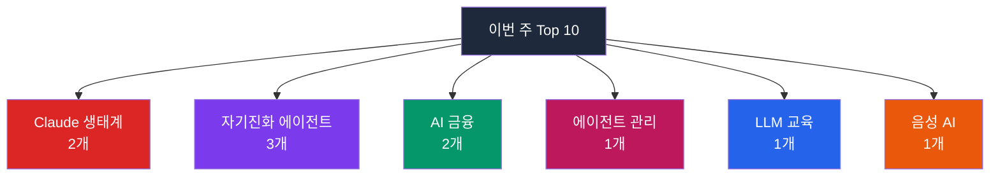

## 이번 주 트렌드 한눈에 보기

이번 주는 **"AI가 AI를 더 똑똑하게 만든다"** 라는 흐름이 한층 뚜렷해졌습니다. Top 10 중 자기진화형 에이전트(쓰면서 스스로 능력이 늘어나는 AI) 계열이 3개(#4 GenericAgent, #5 evolver, 그리고 지난주부터 이어온 #2 hermes-agent) 진입했고, 에이전트를 "팀원처럼" 관리하는 플랫폼(#8 multica)까지 합치면 "AI 팀워크" 테마가 절반에 가깝습니다. Claude 생태계는 Claude Code 통합 CLAUDE.md(#1)와 세션 기억 플러그인(#3) 두 개가 상위권에 동시 자리했고, AI 금융 분야(#7 헤지펀드 시뮬레이터, #10 캔들 파운데이션 모델)와 오픈소스 음성 합성(#9 voicebox)도 꾸준히 상위를 유지합니다.

> **참고: 1위·2위는 단독 분석 문서가 이미 있습니다.**
>
> - **1위. [forrestchang/andrej-karpathy-skills](https://github.com/forrestchang/andrej-karpathy-skills)** (+44,394 ⭐ / 67,760 ⭐) — Karpathy의 LLM 코딩 관찰을 단일 CLAUDE.md 파일로 정리한 저장소. 상세 해설은 `content/github-update/2026-04-09-andrej-karpathy-skills.md` 참고.
> - **2위. [NousResearch/hermes-agent](https://github.com/NousResearch/hermes-agent)** (+30,630 ⭐ / 105,866 ⭐) — "당신과 함께 성장하는 에이전트"라는 슬로건의 자기진화 AI 에이전트. 상세 해설은 `content/github-update/2026-04-13-hermes-agent.md` 참고.
>
> 아래에서는 **3위부터 10위까지** 8개 프로젝트를 다룹니다.

---

## 3위. thedotmack/claude-mem

| 항목 | 내용 |
|------|------|
| 만든 곳 | thedotmack |
| 주 언어 | TypeScript |
| 이번 주 ⭐ | +12,472 |
| 전체 ⭐ | 64,478 |
| 링크 | [thedotmack/claude-mem](https://github.com/thedotmack/claude-mem) |

### 이게 뭔가요?

Claude Code(앤트로픽의 AI 코딩 도우미)가 대화를 끝내면 그동안 나눈 내용을 잊어버리는 문제를 해결하는 플러그인(기존 프로그램에 기능을 추가하는 확장 도구)입니다. 마치 매일 퇴근할 때마다 기억을 잃는 직원이 있는데, 이 도구를 쓰면 다음 날 출근했을 때 어제 하던 일을 자동으로 브리핑해 주는 비서가 생기는 셈입니다. 세션이 끝날 때 대화를 요약해 저장해 두고, 다음 세션을 시작하면 그 요약을 다시 주입해 줍니다.

### 왜 이번 주에 주목받았나요?

지난주 Top 10에도 이미 진입했는데 이번 주에도 3위로 연속 랭크됐습니다. v6.5 업데이트로 Claude Code뿐 아니라 Gemini CLI·OpenCode 등 다른 AI 코딩 도구에도 설치할 수 있게 확장됐고, "mem-search"라는 자연어 검색 기능이 추가되며 활용도가 더 높아졌습니다. OpenClaw 게이트웨이 원클릭 설치 스크립트가 공개되며 설치 장벽이 낮아진 것도 영향입니다.

### 핵심 기능

- **세션 간 기억 유지**: AI가 대화를 끝내도 그간의 작업 내용을 자동으로 요약·저장. 다음 대화에서 "지난번에 우리가 뭘 하고 있었더라?" 하고 묻지 않아도 됩니다.
- **자연어로 과거 기록 검색**: "지난달에 고친 로그인 버그 뭐였더라?"처럼 평소 말투로 질문하면 관련 기록을 찾아줍니다.
- **프라이버시 태그**: 민감한 내용은 `<private>` 태그로 감싸 저장에서 제외할 수 있습니다.
- **웹 뷰어 UI**: 로컬 주소(`localhost:37777`)에서 저장된 기억을 눈으로 확인할 수 있습니다.

<strong>실전 예시: 3주 전 고친 결제 버그가 또 돌아왔을 때</strong>

스타트업 개발자 민지 씨는 3주 전 Claude Code와 함께 아임포트 결제 오류를 해결했습니다. 오늘 비슷한 증상이 또 나타나서 해결책을 떠올리려 했지만 기억이 안 납니다. claude-mem이 설치돼 있다면, Claude Code를 다시 켰을 때 과거에 어떤 원인으로 어떤 파일을 수정했는지 요약본이 자동으로 뜹니다. "지난번 결제 버그" 한 번 검색으로 수정 내역을 찾아 그대로 재적용합니다.

<strong>이런 분께 추천해요</strong>

- **AI 코딩 도구 장기 사용자**: 프로젝트가 길어질수록 누적된 맥락을 AI가 잃어버리는 고통을 크게 덜 수 있습니다.
- **여러 프로젝트를 병행하는 프리랜서**: 프로젝트별로 대화 맥락이 분리·보존되어 전환 비용이 줍니다.
- **Gemini CLI·OpenCode 사용자**: Claude 외 다른 CLI(키보드로 명령어를 입력해 조작하는 화면)도 지원되어 도구 교체 시 기억이 따라갑니다.

---

## 4위. lsdefine/GenericAgent

| 항목 | 내용 |
|------|------|
| 만든 곳 | lsdefine |
| 주 언어 | Python |
| 이번 주 ⭐ | +3,914 |
| 전체 ⭐ | 5,109 |
| 링크 | [lsdefine/GenericAgent](https://github.com/lsdefine/GenericAgent) |

### 이게 뭔가요?

사용자 컴퓨터 전체(브라우저, 터미널, 파일, 마우스·키보드, 심지어 안드로이드 휴대폰까지)를 자율적으로 조작하는 AI 에이전트(자율적으로 작업을 수행하는 AI 프로그램) 프레임워크입니다. 특이한 점은 "스킬을 미리 넣어 두지 않고, 쓰면서 스스로 키운다"는 설계 철학입니다. 처음 "배달앱에서 밀크티 주문해 줘"라고 시키면 AI가 시행착오를 겪으며 방법을 익히고, 그 과정을 스킬(기술)로 저장합니다. 두 번째부터는 한 마디로 끝납니다. 신입 비서가 처음엔 헤매다 두 번째부터 능숙하게 처리하는 것과 비슷합니다.

### 왜 이번 주에 주목받았나요?

핵심 코드가 약 3,000줄에 불과한데 Claude Code(수십만 줄)에 비견되는 일을 한다고 프로젝트 측이 주장합니다. 이번 주 arXiv에 기술 보고서가 공개되며 화제가 됐고, "이 저장소의 모든 git 커밋을 저자가 아닌 에이전트 본인이 자율적으로 수행했다"는 자체 증명 서사가 바이럴됐습니다. 토큰(AI가 처리하는 언어 단위) 사용량이 30K 이하로 다른 에이전트(200K~1M)의 10분의 1 수준이라는 점도 어필 포인트입니다.

> 주의: 전체 스타 5,109로 신생 프로젝트입니다. 이번 주 급증한 스타 수가 실제 성능을 보장하진 않으며, 프로젝트 측 주장 중 상당수는 아직 외부 검증이 부족합니다. 위챗·알리페이 등 중국 앱 연동 데모가 중심이라 한국 환경에서 그대로 쓰이지는 않습니다.

### 핵심 기능

- **자기 진화 스킬 트리**: 한 번 해본 일은 자동 저장되어 다음부터는 한마디 명령으로 실행됩니다.
- **9개 원자 도구만으로 시스템 제어**: 파일 읽기·쓰기, 코드 실행, 웹 스캔 등 최소 단위 도구 9개로 모든 작업을 조합합니다.
- **4계층 메모리로 토큰 절약**: L0~L4로 나눠 필요한 기억만 꺼내 쓰므로 AI 호출 비용이 낮습니다.
- **멀티 모델 호환**: Claude, Gemini, Kimi, MiniMax 등 여러 AI 모델에 물려 쓸 수 있습니다.

<strong>실전 예시: 매일 반복되는 주식 모니터링 자동화</strong>

개인 투자자 현수 씨는 매일 아침 증권앱에서 같은 조건(거래량 급증 종목)을 수동 검색해 왔습니다. GenericAgent에 "매일 9시에 거래량 급증 종목 알려 줘"라고 처음 시키면 AI가 관련 라이브러리를 직접 설치하고 스크립트를 짜고 cron(정기 실행 스케줄)에 등록합니다. 그 과정이 스킬로 저장되어, 다음 날부터는 자동으로 실행되고 결과가 알림으로 옵니다. 단, 실제로 내 계정·개인정보에 깊이 접근하므로 개발팀 검토 없이 바로 프로덕션에 쓰지 않는 것이 안전합니다.

<strong>이런 분께 추천해요</strong>

- **반복 작업이 많은 파워 유저**: 엑셀 자동화·데이터 수집처럼 정형화된 컴퓨터 작업을 줄일 수 있습니다.
- **AI 에이전트 연구자·실험가**: "자기 진화"라는 설계 실험을 직접 검증해 보고 싶은 분에게 맞습니다.
- **토큰 비용이 부담인 팀**: 에이전트 비용이 커지는 문제에 대한 대안 탐색용으로 참고할 만합니다.

*비개발자가 바로 쓰기엔 설치·보안 장벽이 높습니다. 개발팀 검토 후 도입 권장.*

---

## 5위. EvoMap/evolver

| 항목 | 내용 |
|------|------|
| 만든 곳 | EvoMap |
| 주 언어 | JavaScript |
| 이번 주 ⭐ | +4,032 |
| 전체 ⭐ | 6,068 |
| 링크 | [EvoMap/evolver](https://github.com/EvoMap/evolver) |

### 이게 뭔가요?

AI 에이전트의 프롬프트(AI에게 주는 지시문)를 "진화"시키는 엔진입니다. AI가 작업 로그를 스스로 분석해 자주 발생하는 오류·패턴을 찾고, 그 개선안을 "유전자(Gene)"와 "캡슐(Capsule)"이라는 재사용 가능한 자산으로 쌓습니다. GEP(Gene Expression Programming, 유전자 알고리즘의 일종)라는 진화 알고리즘을 차용했습니다. 반려 식물 앱이 물 주기·일조량 데이터를 계속 기록해 다음 식물을 키울 땐 더 잘 자라게 해 주듯, AI 에이전트의 행동 패턴을 축적·개선해 주는 도구입니다. 중요한 점은 **코드를 직접 고치는 게 아니라** "이렇게 고치면 좋겠다"는 프롬프트를 생성한다는 것입니다.

### 왜 이번 주에 주목받았나요?

"AI 에이전트 자기 진화"라는 최근 유행 키워드에 정면으로 편승했습니다. 라이선스 논란도 주목도를 키웠습니다. 프로젝트 측은 "다른 프로젝트가 우리 설계를 출처 표시 없이 베꼈다"며 향후 버전은 source-available(소스 공개는 하되 자유 이용 제한) 방식으로 전환한다고 공지했습니다. 현재 공개된 MIT/GPL 버전은 계속 사용 가능합니다.

> 주의: 전체 스타 6,068로 신생 프로젝트이고, "진화 엔진"이라는 개념이 마케팅적 수사일 수 있습니다. 실제 성능은 사용 기업·팀의 실측이 더 필요합니다. 또한 향후 라이선스 제한이 강화될 예정이라 장기 프로덕션 투자 전 라이선스 조항 재확인이 필수입니다.

### 핵심 기능

- **자동 로그 분석**: 에이전트가 남긴 기록에서 오류 패턴을 자동 추출합니다.
- **감사 가능한 진화 기록**: 언제 무엇을 왜 바꿨는지 흔적(EvolutionEvent)이 남아 규제 산업에서 유리합니다.
- **4가지 전략 프리셋**: `balanced`(균형), `innovate`(혁신), `harden`(안정화), `repair-only`(긴급 수리) 등 상황별로 선택할 수 있습니다.
- **Cursor·Claude Code 훅 연동**: AI 코딩 도구의 주요 이벤트(파일 편집 후 등)에 자동으로 끼어듭니다.

<strong>실전 예시: 반복되는 답변 실패 패턴을 자산화</strong>

SaaS 스타트업의 운영 엔지니어 준호 씨는 자사 AI 고객지원 봇이 특정 질문 유형에서 자꾸 같은 실수를 반복해 피로했습니다. evolver를 붙여 두면 로그에서 "이 패턴이 N회 이상 반복됨"을 감지해 "다음부터 이렇게 답변하라"는 표준 지침(Capsule)을 자동 제안합니다. 준호 씨는 제안을 검토 후 승인만 하면 되고, 승인 이력이 모두 기록되어 규제·감사 대응에도 쓸 수 있습니다.

<strong>이런 분께 추천해요</strong>

- **AI 에이전트 운영 팀**: 프롬프트를 수십 개씩 관리하며 반복 오류에 시달리는 팀.
- **규제·감사 대응이 중요한 도메인**: 의료·금융·법률 등 "왜 이렇게 바꿨는지" 근거가 필요한 현장.
- **Cursor·Claude Code 파워 유저**: 코딩 에이전트의 행동을 점진적으로 길들이고 싶은 개발자.

*비개발자에겐 개념이 추상적이므로, 개발팀이 먼저 PoC(소규모 검증)를 돌려본 뒤 도입 판단을 권장합니다.*

---

## 6위. Lordog/dive-into-llms

| 항목 | 내용 |
|------|------|
| 만든 곳 | Lordog (상하이교통대학교) |
| 주 언어 | Jupyter Notebook |
| 이번 주 ⭐ | +5,703 |
| 전체 ⭐ | 33,025 |
| 링크 | [Lordog/dive-into-llms](https://github.com/Lordog/dive-into-llms) |

### 이게 뭔가요?

상하이교통대학교에서 운영하는 대학 수업(자연어처리 전공, 인공지능 보안 수업) 실습 자료를 오픈소스(누구나 무료로 쓸 수 있는 공개 소프트웨어)로 공개한 무료 LLM(대규모 언어 모델, ChatGPT 같은 AI의 기반 기술) 입문 교재입니다. Jupyter Notebook(설명과 코드를 함께 담는 대화형 문서) 형식이라 읽으면서 바로 실행해 볼 수 있습니다. 요리책에 레시피 설명과 함께 "여기 클릭하면 바로 요리가 돌아가는 주방"이 붙어 있는 느낌입니다. 중요한 점은 **모든 자료가 중국어로 작성**되어 있어 한국어 독자는 구글 번역·DeepL 등을 병행해야 한다는 것입니다.

### 왜 이번 주에 주목받았나요?

2025년 6월 대규모 업데이트 이후 꾸준히 스타가 쌓여 전체 3만을 넘겼고, 이번 주에도 5,703개가 추가됐습니다. 수학 추론·GUI 에이전트·RLHF(인간 피드백 기반 강화학습) 안전 대응·은닉(스테가노그래피) 등 **최근 핫한 주제 11개를 한 저장소에서 커버**하는 점이 매력 포인트입니다. 화웨이 Ascend(중국 국산 AI 칩) 커뮤니티와의 협력 교재가 추가 공개된 것도 영향입니다.

### 핵심 기능

- **11개 챕터 무료 제공**: 파인튜닝·프롬프트·지식 편집·수학 추론·워터마크·탈옥 공격·스테가노그래피·멀티모달·GUI 에이전트·에이전트 보안·RLHF를 다룹니다.
- **PPT + 실습 코드 세트**: 각 챕터마다 강의 슬라이드와 실행 가능한 노트북을 함께 제공합니다.
- **학술 연구자 집필**: 상하이교통대 실제 교수·연구진이 작성해 내용 신뢰도가 상대적으로 높습니다.
- **보안·공격 실습 포함**: LLM 탈옥·워터마크 등 방어·공격 양면을 실습해 볼 수 있습니다.

<strong>실전 예시: 대학원 진학·AI 직무 전환을 준비하는 학생</strong>

개발 경력 2년 차인 도현 씨는 AI 대학원 준비 중 "기초부터 실습까지 체계적인 로드맵"이 필요했습니다. dive-into-llms를 따라가면 이론 강의(PPT)를 읽고 그 자리에서 노트북을 실행하며 파인튜닝·프롬프트·RLHF를 직접 돌려봅니다. 비용은 클라우드 GPU 임대비만 들고, 자료비는 0원입니다. 단 중국어라 구글 번역을 켠 채 읽어야 합니다.

<strong>이런 분께 추천해요</strong>

- **AI 직무 전환 준비자**: 이론과 실습을 동시에 무료로 익히고 싶은 분.
- **대학원 진학 준비생**: 실제 대학 강의 교재라 이력서 실습 경험으로도 활용 가능.
- **LLM 보안 관심자**: 탈옥 공격·워터마크 등 보안 주제가 한 저장소에 모인 드문 사례.

*전 자료가 중국어입니다. 영어·한국어 대체 교재(Hugging Face 코스, 네이버 부스트코스 등)도 병행 추천.*

---

## 7위. virattt/ai-hedge-fund

| 항목 | 내용 |
|------|------|
| 만든 곳 | virattt |
| 주 언어 | Python |
| 이번 주 ⭐ | +3,950 |
| 전체 ⭐ | 56,603 |
| 링크 | [virattt/ai-hedge-fund](https://github.com/virattt/ai-hedge-fund) |

### 이게 뭔가요?

워렌 버핏, 찰리 멍거, 캐시 우드 같은 전설적 투자자의 투자 철학을 각각 AI 에이전트로 만들어, 가상의 헤지펀드(위험을 분산·조작해 수익을 노리는 투자 조직) 팀처럼 서로 토론하며 매매 의사결정을 흉내 내게 하는 오픈소스 프로젝트입니다. 한 종목을 두고 버핏 에이전트는 가치투자 관점에서, 캐시 우드 에이전트는 성장주 관점에서 의견을 내는 식입니다. 회사의 투자 회의실을 코드로 재현해 놓은 시뮬레이터에 가깝습니다. **중요: 실제 매매는 절대 일어나지 않으며, 공식 README에도 "교육 목적 전용, 실제 투자용 아님"이 명시되어 있습니다.**

### 왜 이번 주에 주목받았나요?

한 주에 3,950개의 스타가 붙으며 전체 5.6만 스타를 돌파했습니다. 유명 투자자 14명의 의사결정 스타일을 에이전트로 옮긴다는 콘셉트 자체가 화제성이 크고, OpenAI·Anthropic·Groq·DeepSeek 등 여러 LLM을 선택해 돌릴 수 있어 "AI 에이전트 협업" 사례를 학습하려는 개발자들이 몰리고 있습니다.

### 핵심 기능

- **14명의 투자자 철학 에이전트**: 버핏·멍거·린치·버리 등 각자의 관점으로 종목을 평가합니다. 같은 종목을 놓고 에이전트마다 결론이 갈리는 과정을 볼 수 있습니다.
- **4개의 분석 모듈 + 리스크·포트폴리오 매니저**: 밸류에이션, 시장 심리, 재무제표, 기술적 지표를 각각 분석한 뒤 리스크 매니저가 포지션 한도를 정하고 포트폴리오 매니저가 최종 결정을 내립니다.
- **백테스트 지원**: 과거 기간을 골라 "만약 이 전략을 돌렸다면?"을 시뮬레이션할 수 있습니다. 실제 주문은 들어가지 않고 결과만 계산됩니다.

<strong>실전 예시: AI 에이전트 공부 중인 30대 직장인 개발자</strong>

서울에서 핀테크 스타트업에 다니는 김현우 씨(32세, 백엔드 개발자)는 "LLM 에이전트 여러 개를 협업시키는 구조"를 업무에 적용하려고 공부 중입니다. 논문만 봐서는 구조가 잘 안 잡혀서 답답했는데, ai-hedge-fund 코드를 받아 OpenAI 키를 연결하고 삼성전자 티커를 넣어 봅니다. 에이전트 14명이 각자 리포트를 내고 리스크 매니저가 최종 조율하는 흐름을 로그로 직접 보니, "역할을 나눈 멀티 에이전트가 실제로 어떻게 돌아가는지" 감이 잡힙니다. 본인 업무인 고객 문의 분류 에이전트 설계에 그 구조를 가져다 씁니다.

<strong>이런 분께 추천해요</strong>

- **LLM 에이전트 구조를 공부하는 개발자**: 14개 에이전트가 협업하는 실제 코드를 뜯어보며 멀티 에이전트 아키텍처를 학습할 수 있습니다.
- **AI 투자 리서치 기획자**: 각 투자 철학이 코드로 어떻게 표현되는지 보며, 자사 서비스의 자문 에이전트 톤을 설계하는 데 참고할 수 있습니다.
- **금융공학·데이터사이언스 전공 학생**: 백테스트와 LLM 기반 의사결정을 한 프로젝트에서 경험할 수 있습니다. 단, 여기서 나온 결론을 실제 매매에 쓰면 안 됩니다.

---

## 8위. multica-ai/multica

| 항목 | 내용 |
|------|------|
| 만든 곳 | multica-ai |
| 주 언어 | TypeScript |
| 이번 주 ⭐ | +7,009 |
| 전체 ⭐ | 17,787 |
| 링크 | [multica-ai/multica](https://github.com/multica-ai/multica) |

### 이게 뭔가요?

Claude Code, Codex, OpenCode 같은 여러 코딩 에이전트를 한 화면에서 "팀원처럼" 관리할 수 있게 해 주는 오픈소스 플랫폼입니다. 프로젝트 관리 도구에서 사람에게 이슈를 배정하듯 AI 에이전트에게 티켓을 할당하면, 에이전트가 알아서 작업을 집어 들고 진행 상황을 댓글로 보고합니다. 회사에서 프리랜서 여러 명에게 각자 다른 과제를 맡기고 칸반보드로 관리하는 그림을, AI 에이전트들에게 그대로 적용한 형태입니다. 프로젝트 소개 문구도 "당신의 다음 10명 직원은 사람이 아닐 겁니다"로 직설적입니다.

### 왜 이번 주에 주목받았나요?

한 주에 7,009개의 스타가 붙어 이번 주 Top 10 중에서도 상위권 스타 증가폭을 보였습니다. 지금까지 각자 따로 돌리던 여러 코딩 에이전트를 한 대시보드에서 통합 관리한다는 콘셉트가 "AI 팀원 시대"라는 흐름과 맞물려 소프트웨어 엔지니어 커뮤니티에서 빠르게 확산된 것으로 보입니다.

### 핵심 기능

- **에이전트에게 이슈 할당**: 사람 팀원에게 Jira 티켓 주듯 에이전트에게 작업을 맡기면, 에이전트가 스스로 집어서 처리하고 진행 상태를 실시간 스트리밍으로 보여줍니다.
- **여러 코딩 에이전트 통합 지원**: Claude Code, Codex, OpenCode 등을 한 대시보드에서 섞어 쓸 수 있습니다. "어떤 작업엔 A 에이전트, 어떤 작업엔 B 에이전트" 식으로 선택할 수 있습니다.
- **재사용 가능한 스킬 축적**: 한 번 해결한 작업 패턴을 스킬로 저장해 두면, 다음에 비슷한 이슈가 들어왔을 때 다시 꺼내 쓸 수 있습니다. 팀의 위키처럼 쌓여가는 구조입니다.
- **로컬·클라우드 런타임 혼용**: 내 컴퓨터에서 돌릴지, 클라우드 환경에서 돌릴지를 작업별로 선택할 수 있습니다.

<strong>실전 예시: 1인 개발팀을 운영하는 스타트업 CTO</strong>

판교의 초기 스타트업에서 혼자 개발을 맡고 있는 오세훈 씨(35세, CTO)는 매일 쏟아지는 버그 리포트와 자잘한 기능 요청을 감당하기 어렵습니다. Multica를 셀프 호스팅(자기 서버에 직접 설치해 운영)으로 띄우고, 이슈 트래커에서 "로그인 버튼 색상 변경", "결제 실패 에러 로그 분석" 같은 작은 티켓을 Claude Code 에이전트에게 할당합니다. 아침에 커피 한 잔 하는 동안 에이전트가 PR을 올려 두면, 오 씨는 리뷰만 하면 됩니다. 본인이 직접 손대야 할 핵심 설계에만 집중할 시간이 생깁니다. 다만 PR 리뷰는 사람이 반드시 해야 하며, 에이전트가 낸 코드를 그대로 믿고 배포하는 건 위험합니다.

<strong>이런 분께 추천해요</strong>

- **소규모 개발팀 리드·CTO**: 반복적이고 범위가 좁은 작업을 에이전트에게 위임하고, 본인은 아키텍처와 리뷰에 집중하고 싶은 경우 유용합니다.
- **여러 AI 코딩 도구를 비교 중인 개발자**: 각 에이전트의 결과물을 같은 이슈 위에서 비교할 수 있어, 어떤 도구가 어떤 작업에 강한지 데이터가 쌓입니다.
- **사내 개발 생산성 담당자**: 셀프 호스팅이 가능해 사내망 내부에서 에이전트 운영 체계를 실험해 볼 수 있습니다. 단, Node.js 20+, Go 1.26+, Docker 등 셋업 진입장벽이 있어 인프라 이해가 필요합니다.

---

## 9위. jamiepine/voicebox

| 항목 | 내용 |
|------|------|
| 만든 곳 | jamiepine |
| 주 언어 | TypeScript |
| 이번 주 ⭐ | +5,936 |
| 전체 ⭐ | 21,809 |
| 링크 | [jamiepine/voicebox](https://github.com/jamiepine/voicebox) |

### 이게 뭔가요?

내 컴퓨터 위에서 돌아가는 "음성 합성 스튜디오" 데스크톱 앱입니다. 글자를 음성으로 바꾸는 TTS(Text-to-Speech, 글자를 음성으로 바꾸는 기술) 엔진 7개, 23개 언어, 50여 개의 프리셋 목소리, 그리고 내가 가진 짧은 음성 샘플로 내 목소리를 복제하는 보이스 클로닝까지 한 앱에서 다룹니다. GarageBand나 오디션 같은 오디오 편집 프로그램의 AI 음성 버전이라고 생각하면 됩니다. **주의: 이름은 같지만 Meta(페이스북)의 "Voicebox" 모델과는 완전히 다른, 커뮤니티 개발자가 만든 독립 오픈소스 프로젝트입니다.**

### 왜 이번 주에 주목받았나요?

한 주에 5,936개의 스타가 붙었습니다. 최근 발표된 Qwen3-TTS, Chatterbox, Kokoro 등 최신 음성 모델을 한 앱에서 다 써 볼 수 있다는 점이 크게 어필됐고, 클라우드 결제 없이 로컬에서 목소리가 외부로 나가지 않는다는 프라이버시 강점이 크리에이터 커뮤니티에서 주목받은 것으로 보입니다.

### 핵심 기능

- **7개 TTS 엔진 선택**: Qwen3-TTS, Chatterbox, Kokoro 등 특성이 다른 음성 엔진 중 용도에 맞게 고를 수 있습니다. 뉴스 낭독풍, 대화풍 등 결과 톤이 다릅니다.
- **제로샷 보이스 클로닝**: 짧은 음성 샘플 하나만 있으면 그 목소리 톤으로 원하는 문장을 읽어 줍니다. [웃음], [한숨] 같은 감정 태그도 일부 모델에서 지원합니다.
- **멀티트랙 타임라인 편집기**: 팟캐스트처럼 여러 화자의 대사를 트랙에 배치해 대화 콘텐츠를 제작할 수 있습니다.
- **완전 로컬 처리**: 음성과 모델이 내 컴퓨터 밖으로 나가지 않습니다. Mac(Apple Silicon·Intel), Windows, Linux를 지원합니다.

<strong>실전 예시: 유튜브 교육 채널을 운영하는 1인 크리에이터</strong>

대구에서 중학생 대상 과학 유튜브 채널을 운영하는 박소영 씨(29세, 과학 강사)는 매주 영상 3편을 직접 녹음하느라 목이 자주 쉽니다. Voicebox를 맥북에 설치하고, 평소 녹음 샘플 30초를 넣어 자기 목소리를 복제합니다. 대본만 타이핑하면 본인 톤의 나레이션이 나오고, 타임라인에 배경 해설과 실험 진행 설명을 다른 목소리로 배치해 두 사람이 대화하는 듯한 과학 콩트 콘텐츠를 만듭니다. 클라우드 TTS 월 구독료를 아낍니다. 단, 본인 목소리가 아닌 다른 사람 목소리를 무단 복제하는 것은 초상권·음성권 문제가 생길 수 있으므로 반드시 본인이나 동의받은 목소리만 사용해야 합니다.

<strong>이런 분께 추천해요</strong>

- **1인 유튜버·팟캐스터**: 녹음 없이 대본만으로 자기 톤의 나레이션을 뽑을 수 있고, 월 구독형 TTS 비용을 아낄 수 있습니다.
- **오디오북·교육 콘텐츠 제작자**: 23개 언어 지원과 무제한 길이 생성 덕분에 장시간 분량의 낭독 콘텐츠 제작에 적합합니다.
- **음성 프라이버시가 중요한 기업 실무자**: 사내 자료 낭독, 사내 교육 영상용 나레이션처럼 외부 클라우드에 올리기 꺼려지는 텍스트를 로컬에서만 처리하고 싶을 때 유용합니다.

---

## 10위. shiyu-coder/Kronos

| 항목 | 내용 |
|------|------|
| 만든 곳 | shiyu-coder (AAAI 2026 채택 논문 저자) |
| 주 언어 | Python |
| 이번 주 ⭐ | +3,227 |
| 전체 ⭐ | 19,878 |
| 링크 | [shiyu-coder/Kronos](https://github.com/shiyu-coder/Kronos) |

### 이게 뭔가요?

주식 차트의 "캔들 언어"를 학습한 파운데이션 모델(다양한 작업에 두루 쓸 수 있도록 대규모로 사전학습된 AI 기반 모델)입니다. GPT가 글자의 패턴을 배워 다음 단어를 예측하듯, Kronos는 전 세계 45개 이상의 거래소에서 모은 K-라인(봉차트: 시가·고가·저가·종가·거래량) 데이터를 학습해 다음 구간의 캔들을 예측합니다. AAAI 2026에 채택된 논문(arXiv 2508.02739)을 기반으로 공개된 오픈소스입니다. 쉽게 말해 "차트 전용 언어 모델"이고, 한국 개인투자자가 이걸 바로 HTS에 꽂아 쓰기에는 진입장벽이 높습니다.

### 왜 이번 주에 주목받았나요?

한 주에 3,227개의 스타가 붙었습니다. "금융시장용 최초의 파운데이션 모델"이라는 포지셔닝과 AAAI 2026 채택이 동시에 알려지면서, 정량 트레이딩·AI 연구 커뮤니티에서 큰 관심을 끌었습니다. 그동안 금융 시계열은 분야별로 조각난 모델이 많았는데, Kronos는 범용 학습을 시도한 드문 사례입니다.

### 핵심 기능

- **캔들차트 전용 사전학습 모델**: 글자 대신 봉차트 시퀀스를 학습했습니다. 종목·시장을 특정하지 않고 학습해 다양한 자산에 재사용할 여지가 있습니다.
- **크기별 모델 제공**: mini(4.1M), small(24.7M), base(102.3M) 세 가지 공개 모델 중 하드웨어 환경에 맞춰 선택할 수 있습니다. 가장 큰 large(499.2M) 모델은 공개되지 않았습니다.
- **간결한 예측 인터페이스**: `KronosPredictor` 클래스로 몇 줄 파이썬 코드만 쓰면 원시 데이터에서 바로 예측까지 갈 수 있습니다. 단, pandas와 파이썬 기본 사용 경험은 필요합니다.

<strong>실전 예시: 정량 분석을 공부하는 대학원생</strong>

서울의 경영대학원에서 금융공학을 전공하는 정민재 씨(27세, 석사 2학기)는 졸업 논문 주제로 "범용 금융 파운데이션 모델의 한국 주식 적용 가능성"을 잡았습니다. Hugging Face에서 Kronos-base를 받고, KOSPI 200 종목의 일봉 데이터를 pandas로 정리해 `KronosPredictor`에 넣어 봅니다. 예측된 캔들과 실제 캔들을 비교하며 종목군별 정확도 차이를 측정합니다. 본인 논문의 실증 분석 한 섹션이 완성됩니다. 다만 이 결과를 가지고 바로 실제 투자를 하지는 않습니다. README에도 명시돼 있듯 포트폴리오 최적화, 거래 비용, 위험 요인 중립화 같은 요소가 모두 빠진 순수 예측 모델이기 때문입니다.

<strong>이런 분께 추천해요</strong>

- **금융공학·정량투자 연구자·대학원생**: 논문 기반의 검증된 모델로 실증 분석과 베이스라인 비교 실험을 할 수 있습니다.
- **퀀트 트레이딩 팀의 리서처**: 기존 자체 모델 대비 성능 비교용 레퍼런스로 활용할 여지가 있습니다. 단, 그대로 프로덕션 매매에 넣기에는 위험 관리·비용 모델이 빠져 있습니다.
- **AI 시계열 연구자**: "언어 모델 패러다임을 금융에 어떻게 옮겼는가"라는 관점에서 토크나이저·학습 구조를 공부하기 좋은 사례입니다.

*일반 개인투자자에게는 바로 쓰기 어려운 연구용 도구입니다. "AI가 알려주는 매수 시그널"로 오해하지 않는 것이 중요합니다.*

---

## 이번 주 인사이트

### 분야별 현황

| 분야 | 진입 수 | 대표 프로젝트 |
|------|---------|-------------|
| Claude 생태계 | 2개 | andrej-karpathy-skills(#1), claude-mem(#3) |
| 자기진화 AI 에이전트 | 3개 | hermes-agent(#2), GenericAgent(#4), evolver(#5) |
| AI 금융 | 2개 | ai-hedge-fund(#7), Kronos(#10) |
| 에이전트 관리 플랫폼 | 1개 | multica(#8) |
| LLM 교육 | 1개 | dive-into-llms(#6) |
| 음성 AI | 1개 | voicebox(#9) |

### 이번 주의 공통 테마

"AI가 AI를 길들인다"는 서사가 강해졌습니다. 핵심 3축은 ① **과거 경험을 자산화**(claude-mem·GenericAgent·evolver), ② **여러 에이전트를 팀원처럼 관리**(multica·ai-hedge-fund), ③ **도메인 특화 언어를 파운데이션 모델로**(Kronos) 입니다. 이 중 비개발자·소규모 팀이 지금 바로 체감 가치가 큰 것은 **claude-mem**입니다 — 긴 프로젝트를 혼자 끌고 가는 1인 개발자·프리랜서의 "맥락 재설명 피로"를 직접 덜어 주고, 다른 CLI 도구로 기억이 따라오는 확장성도 이번 주 업데이트에서 확인됐습니다.

반면 GenericAgent·evolver처럼 스타 급상승한 신생 프로젝트는 **마케팅 수사와 실측 성능 사이 간극**을 의심해 볼 만합니다. "자기 진화"·"10분의 1 토큰" 같은 자극적 문구는 프로젝트 측 벤치마크 기준이며, 한국 독자의 환경에서 그대로 재현될지는 별도 검증이 필요합니다. YMYD처럼 비즈니스 운영에 쓴다면, **개발팀 PoC 후 도입**이라는 기본 절차를 지키는 편이 안전합니다.

<strong>이번 주 하이라이트: thedotmack/claude-mem (3위)</strong>

claude-mem이 두 주 연속 Top 10에 오른 이유는 단순히 "기억을 저장하는 도구"라서가 아닙니다. **Claude 생태계 안에서 파워 유저의 페인 포인트**(대화가 길어질수록 초반 맥락이 사라지는 문제)를 정확히 짚었고, 이번 주 v6.5 업데이트로 Gemini CLI·OpenCode까지 지원 범위를 넓혀 "AI 코딩 도구 전체의 기억 계층" 포지션으로 이동 중이기 때문입니다. 즉 단일 툴 플러그인에서 **멀티 CLI 공통 메모리 인프라**로 진화하고 있다는 신호입니다.

비개발자 입장에서는 "설치 후 그냥 쓴다"는 수준은 아니지만, OpenClaw 게이트웨이 원클릭 설치 스크립트가 공개되며 진입 장벽이 크게 낮아졌습니다. Claude Pro·Max 사용자가 월 한도를 자주 넘긴다면, 반복 맥락 재설명으로 낭비되던 토큰을 줄이는 현실적 비용 절감 도구로도 쓸 수 있습니다.

---

**참고 자료**
- [2026-04-20 주간 GitHub 트렌딩 Top 8](./2026-04-20-github-trending.md) — 지난주 트렌딩 (비교 참고)
- [andrej-karpathy-skills 단독 분석](./2026-04-09-andrej-karpathy-skills.md)
- [hermes-agent 단독 분석](./2026-04-13-hermes-agent.md)
