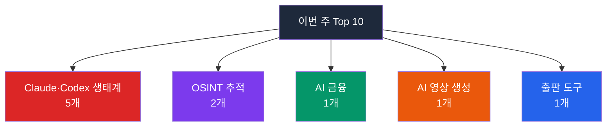

## 이번 주 트렌드 한눈에 보기

이번 주는 **"AI 코딩 도우미가 본격적으로 표준화되고 있다"** 라는 신호가 가장 또렷하게 잡혔습니다. Top 10 중 무려 절반(#1 warp, #2 mattpocock/skills, #5 ruflo, #7 awesome-codex-skills, #9 free-claude-code)이 Claude(앤트로픽이 만든 AI)·Codex(OpenAI의 코드 AI) 생태계에 속했고, 특히 **유명 개발자 Matt Pocock의 개인 .claude 폴더(#2)** 가 한 주에 31,091개의 별을 받으며 1위 warp(+27,872)까지 제친 점이 놀라웠습니다. 마치 "맛집 사장님의 비밀 양념 노트"가 통째로 공개되자 모두가 따라 만들기 시작한 분위기에 가깝습니다. 그 외에도 AI 금융(#3), AI 영상 자동 제작(#8), 사람·계정 추적 OSINT(#4 #6), 마크다운 차세대 출판 시스템(#10)이 골고루 진입했습니다.

---

## 1위. warp

| 항목 | 내용 |
|------|------|
| 만든 곳 | warpdotdev |
| 주 언어 | Rust |
| 이번 주 ⭐ | +27,872 |
| 전체 ⭐ | 54,920 |
| 라이선스 | AGPL-3.0 + MIT (듀얼) |
| 링크 | [warpdotdev/warp](https://github.com/warpdotdev/warp) |

### 이게 뭔가요?

개발자들이 명령어를 입력하던 까만 화면(터미널)에 AI 비서를 통째로 붙여놓은 도구입니다. 마치 카카오톡에 챗봇을 붙여 "회의 일정 잡아줘" 하면 자동으로 일정을 잡아주듯, 여기서는 "이 프로젝트의 버그를 분석해서 고쳐줘" 같은 말 한마디로 AI(인공지능)가 코드를 직접 분석하고 수정합니다. 오픈소스(누구나 무료로 쓸 수 있는 공개 소프트웨어)로 풀려 있습니다.

### 왜 이번 주에 주목받았나요?

ChatGPT를 만든 회사 OpenAI가 warp의 창립 스폰서로 발표되면서 신뢰도가 급상승했습니다. Claude(앤트로픽), Codex(OpenAI), Gemini(구글) 같은 여러 AI를 한 터미널 안에서 자유롭게 골라 쓸 수 있는 점, 그리고 "Oz"라는 오픈소스 커뮤니티 운영을 자동화하는 에이전트가 새로 공개된 점이 결정적이었습니다.

### 핵심 기능

- **여러 AI 에이전트 동시 활용**: Claude Code, Codex, Gemini CLI(키보드로 명령어를 입력해 조작하는 화면) 등 다양한 AI를 한 자리에서 비교·전환하면서 사용
- **반복 작업 자동화**: 깃허브 이슈(작업 요청 글) 분류, 기획서 작성, PR(코드 합치기 요청) 검토까지 AI가 처리
- **실시간 진행 모니터링**: build.warp.dev에서 AI가 지금 무슨 작업을 하고 있는지 시각적으로 추적
- **Rust 기반의 빠른 속도**: 가볍고 빨라서 기존 터미널을 거의 그대로 대체 가능

<strong>실전 예시: 1인 스타트업 개발자가 PR 리뷰 시간을 절반으로 줄인 사례</strong>

혼자 SaaS(클라우드 기반 소프트웨어 서비스)를 운영하는 개발자 박세훈 씨는 매일 외부 기여자들이 보내는 PR을 검토하느라 오전 시간을 통째로 썼습니다. warp에 Oz 에이전트를 연결한 뒤로는, 기여자들이 PR을 올리면 AI가 먼저 "이 코드는 보안 문제가 있을 수 있고, 다음 두 줄을 수정해야 합니다"라고 1차 리뷰를 자동으로 달아둡니다. 박세훈 씨는 그 위에서 최종 결정만 내리면 되어 PR 처리 시간이 절반으로 줄었습니다.

<strong>이런 분께 추천해요</strong>

- **터미널을 자주 쓰는 개발자**: 까만 화면에서 작업하는 시간이 긴 사람일수록 효과가 크게 납니다
- **오픈소스 메인테이너(공개 프로젝트 운영자)**: Oz 에이전트로 외부 기여자 응대를 자동화할 수 있습니다
- **여러 AI를 비교해보고 싶은 사람**: Claude·Codex·Gemini를 한 자리에서 같은 작업으로 시켜보고 결과 차이를 직접 비교할 수 있습니다

---

## 2위. mattpocock/skills

| 항목 | 내용 |
|------|------|
| 만든 곳 | Matt Pocock (개인) |
| 주 언어 | Shell |
| 이번 주 ⭐ | +31,091 (1위 warp 제친 주간 최다) |
| 전체 ⭐ | 60,876 |
| 라이선스 | MIT |
| 링크 | [mattpocock/skills](https://github.com/mattpocock/skills) |

### 이게 뭔가요?

영국의 유명 TypeScript 강사 Matt Pocock이 본인의 `.claude` 폴더(Claude Code가 작업 방식을 저장하는 비밀 노트)를 통째로 공개한 레포지토리(코드를 저장하는 온라인 공간, 일종의 프로젝트 폴더)입니다. 마치 셰프가 자신만의 레시피 노트를 공개한 것과 같습니다. AI에게 코드를 시킬 때마다 결과가 뒤죽박죽이라 답답했던 사람들이 "이 사람이 쓰는 방식 그대로 따라하자"며 몰려들었습니다.

### 왜 이번 주에 주목받았나요?

Matt Pocock은 약 6만 명의 구독자를 가진 TypeScript 뉴스레터를 운영하는 유명 강사입니다. 그가 "내가 실제로 쓰는 Claude Code 작업 흐름을 그대로 공개한다"고 발표한 직후 단 한 주 만에 31,091개의 별이 달렸습니다. AI 코딩 도우미를 어떻게 길들여야 하는지 모두가 답을 찾던 시점에 정답지가 공개된 것입니다.

### 핵심 기능

- **`/grill-with-docs`**: AI에게 일을 시키기 전에 충분히 인터뷰해서 프로젝트 공유 언어 문서(CONTEXT.md)를 함께 만드는 방식. 의사가 진단 전에 충분히 문진하는 것과 비슷합니다
- **`/tdd`**: 테스트를 먼저 짜고 코드를 짜는 검증된 개발 방식을 AI에게 강제로 적용
- **`/diagnose`**: 복잡한 버그가 생겼을 때 체계적으로 원인을 찾는 절차
- **`/improve-codebase-architecture`**: 시간이 지나며 엉망이 된 코드 구조를 다시 정리
- **`/triage`**: 쌓인 이슈(작업 요청)를 우선순위별로 자동 분류

<strong>실전 예시: AI가 매번 "엉뚱한 코드"를 만들어서 답답했던 개발자</strong>

프리랜서 개발자 김지윤 씨는 Claude Code에게 "로그인 기능 만들어줘"라고 시키면 매번 다른 라이브러리, 다른 폴더 구조로 코드를 짜와서 매번 처음부터 고쳐 써야 했습니다. mattpocock/skills를 설치한 뒤로는 `/grill-with-docs` 명령으로 AI가 먼저 30분간 프로젝트 규칙을 인터뷰하고, 그 결과를 CONTEXT.md에 정리해두기 시작했습니다. 다음부터는 AI가 그 규칙을 따라 일관성 있는 코드를 만들어줘서, 두 번 일하는 일이 없어졌습니다.

<strong>이런 분께 추천해요</strong>

- **AI 코딩 도구를 막 시작한 사람**: 따라쓰면 바로 효과가 나는 모범 답안 모음입니다
- **AI가 짠 코드의 품질에 자주 실망한 사람**: TDD(테스트 주도 개발)와 진단 절차로 품질이 눈에 띄게 올라갑니다
- **팀에 AI 도구를 도입하려는 리더**: 팀 전체가 같은 방식으로 AI를 다루도록 표준화할 수 있습니다

---

## 3위. TradingAgents

| 항목 | 내용 |
|------|------|
| 만든 곳 | TauricResearch |
| 주 언어 | Python |
| 이번 주 ⭐ | +13,293 |
| 전체 ⭐ | 69,296 |
| 라이선스 | Apache-2.0 |
| 링크 | [TauricResearch/TradingAgents](https://github.com/TauricResearch/TradingAgents) |

### 이게 뭔가요?

여러 명의 AI가 각자 다른 역할(기초 분석가, 시장 심리 분석가, 뉴스 분석가, 기술 분석가, 리스크 매니저)을 맡아 주식·암호화폐 같은 자산을 함께 토론하면서 매수/매도 결정을 내리는 시뮬레이터입니다. 마치 증권사의 리서치 팀 회의를 AI들끼리 자동으로 진행시키는 것과 비슷합니다. 학습용·연구용 시뮬레이션이며, 실제 자금을 자동으로 거래하라는 목적의 도구는 아닙니다.

### 왜 이번 주에 주목받았나요?

v0.2.4 버전이 발표되면서 결정 기록을 영구 저장하는 기능, 도커(개발 환경을 통째로 패키지로 만드는 기술) 지원, OpenAI·Anthropic·Google·DeepSeek 같은 주요 AI를 모두 자유롭게 바꿔 쓸 수 있는 다중 모델 지원이 추가되어 학생·연구자들의 관심이 폭발적으로 늘었습니다.

### 핵심 기능

- **AI 전문가 팀 구성**: 한 종목에 대해 4~5명의 AI가 각자 다른 시각으로 분석
- **강세파 vs 약세파 토론**: 매수 의견 AI와 매도 의견 AI가 근거를 주고받으며 균형 잡힌 결론 도출
- **결정 로그 영구 저장**: 과거 거래 결정과 결과를 기록해 다음 분석에 학습 자료로 활용
- **다양한 AI 자유 선택**: GPT-4, Claude, Gemini, DeepSeek 중 골라 쓰기

<strong>실전 예시: 금융공학 대학원생의 졸업 논문 실험 도구</strong>

금융공학 석사 과정 이수민 씨는 "다중 AI 토론이 단일 AI보다 더 좋은 투자 결정을 내릴 수 있는가"를 졸업 논문 주제로 잡았습니다. TradingAgents의 백테스트(과거 데이터로 시뮬레이션) 기능을 사용해 5년치 S&P500 종목 데이터로 단일 AI vs 다중 AI 토론 결과를 비교 실험했고, 의미 있는 데이터를 모아 논문 한 챕터를 완성했습니다.

<strong>이런 분께 추천해요</strong>

- **금융공학·AI 연구자**: 다중 에이전트 의사결정 구조를 실험할 수 있는 표준 플랫폼
- **퀀트(수치 기반 트레이더) 입문자**: 실제 자금 없이 AI 트레이더의 사고 과정을 배울 수 있음
- **금융사 R&D 팀**: 자체 자산 분석 시스템 프로토타입의 출발점으로 활용 가능

---

## 4위. maigret

| 항목 | 내용 |
|------|------|
| 만든 곳 | soxoj |
| 주 언어 | Python |
| 이번 주 ⭐ | +4,789 |
| 전체 ⭐ | 25,482 |
| 라이선스 | MIT |
| 링크 | [soxoj/maigret](https://github.com/soxoj/maigret) |

### 이게 뭔가요?

사용자명(닉네임) 하나만 입력하면 인스타그램·트위터·깃허브 등 3,000개 이상 사이트에서 그 사람이 어디에 계정을 갖고 있는지 자동으로 찾아주는 OSINT(공개 정보 수집) 도구입니다. 마치 "홍길동"이라는 이름을 검색창에 넣으면 모든 SNS·사이트의 홍길동 계정이 한 번에 뜨는 것과 같습니다. 이름은 명탐정 매그레 경감에서 따왔습니다.

### 왜 이번 주에 주목받았나요?

최근 AI 분석 모드가 추가되어 검색 결과를 자동으로 요약·해석한 조사 보고서를 만들어줍니다. 보안 조사관이 한참 들여다봐야 할 데이터를 AI가 한 페이지로 정리해주는 셈이라 보안·언론·디지털 포렌식 업계에서 빠르게 입소문이 났습니다.

### 핵심 기능

- **3,000+ 사이트 동시 검색**: 한 번 명령으로 광범위한 플랫폼을 통합 탐색
- **재귀 검색**: 첫 검색에서 발견한 다른 닉네임을 자동으로 다시 검색해 인물 그림을 점점 확장
- **다양한 출력 형식**: HTML 보고서, PDF, CSV(엑셀로 열리는 표), JSON, 관계 그래프 지원
- **AI 요약 모드**: 발견된 정보를 자연어 요약 보고서로 정리

<strong>실전 예시: 사칭 계정에 시달리던 인플루언서를 도운 보안 컨설턴트</strong>

보안 컨설턴트 정하늘 씨는 한 인플루언서가 "내 닉네임을 사칭한 사기 계정이 여기저기 깔려 있다"고 도움을 청해왔습니다. maigret로 해당 닉네임을 검색하니 47개 사이트에서 비슷한 변형 계정이 발견됐고, AI 분석 모드가 "그중 9개는 같은 시기에 만들어진 동일 IP 의심 계정"이라고 정리해줬습니다. 이 보고서를 근거로 각 플랫폼에 일괄 신고를 진행했습니다.

<strong>이런 분께 추천해요</strong>

- **보안·디지털 포렌식 조사관**: 사이버 범죄 수사·기업 보안 조사의 표준 도구
- **언론사 팩트체크 팀**: 익명 제보자 검증, 가짜뉴스 출처 추적
- **본인 디지털 흔적을 점검하려는 일반인**: 내 옛 닉네임이 어디에 흩어져 있는지 한 번에 확인

> **법적 주의**: 본인 동의 없이 타인을 추적하는 것은 다수 국가에서 GDPR(유럽 개인정보 보호법)·개인정보보호법 위반입니다. 합법적·교육적 목적에서만 사용해야 합니다.

---

## 5위. ruflo

| 항목 | 내용 |
|------|------|
| 만든 곳 | ruvnet |
| 주 언어 | TypeScript |
| 이번 주 ⭐ | +6,838 |
| 전체 ⭐ | 43,569 |
| 라이선스 | MIT |
| 링크 | [ruvnet/ruflo](https://github.com/ruvnet/ruflo) |

### 이게 뭔가요?

Claude Code를 위한 "AI 직원 100명짜리 회사 운영 시스템"입니다. 코딩·테스트·보안·문서화 같은 100가지 이상 전문 분야를 담당하는 AI 에이전트들이 자동으로 역할을 나눠 협업합니다. 한 사람이 여러 AI를 일일이 지시할 필요 없이, 마치 팀장에게 "이 프로젝트 끝내줘" 한 마디만 하면 팀장이 알아서 팀원에게 일을 분배하는 것과 같은 구조입니다.

### 왜 이번 주에 주목받았나요?

5월 5일 v3.6.30이 공개되면서 브라우저에서 즉시 시작 가능한 웹 UI(flo.ruv.io)와 자율 목표 계획 도구(goal.ruv.io)가 함께 발표됐습니다. 설치 없이 바로 시연해볼 수 있다는 점이 입소문을 탔습니다.

### 핵심 기능

- **100+ 전문 에이전트**: 영역별 전담 AI를 골라 호출하거나 자동 라우팅
- **에이전트 군집(swarm) 협업**: 계층 구조나 거미줄 구조로 AI들을 서로 연결
- **자가 학습 메모리**: 벡터 데이터베이스(의미 기반 검색이 가능한 저장소)를 사용해 과거 성공 사례를 학습
- **연합 통신**: 다른 회사·다른 컴퓨터의 에이전트와 안전하게 협업
- **MCP 서버 연동**: Claude Code와 표준 프로토콜로 직접 연결

<strong>실전 예시: 솔로 창업가가 외주 없이 MVP를 출시한 사례</strong>

푸드테크 창업가 한민지 씨는 시제품(MVP)을 만들어야 했지만 개발자 한 명을 채용할 예산이 없었습니다. ruflo의 "코드 작성 에이전트 + 테스트 에이전트 + 보안 검토 에이전트"를 한 군집으로 묶어 두 달 동안 매일 6시간씩 자율 진행시켰고, 백엔드(서버 쪽 코드) 70%, 결제 모듈, 보안 점검까지 자동으로 끝내 외주 없이 베타 출시까지 도달했습니다.

<strong>이런 분께 추천해요</strong>

- **1인 창업가·인디 해커**: 채용 비용 없이 여러 명분의 일을 AI에게 자동 분배
- **사이드 프로젝트 개발자**: 평일 본업 하면서 주말에 AI 군집을 돌려두고 진척 상황만 확인
- **멀티 에이전트 연구자**: 여러 AI의 협업 패턴을 실험할 표준 플랫폼

---

## 6위. GhostTrack

| 항목 | 내용 |
|------|------|
| 만든 곳 | HunxByts |
| 주 언어 | Python |
| 이번 주 ⭐ | +2,617 |
| 전체 ⭐ | 12,678 |
| 라이선스 | 명시되지 않음 |
| 링크 | [HunxByts/GhostTrack](https://github.com/HunxByts/GhostTrack) |

### 이게 뭔가요?

IP 주소(인터넷에서 컴퓨터를 식별하는 번호), 전화번호, 사용자명을 입력하면 그 정보를 추적해주는 OSINT 도구입니다. 마치 택배 송장번호로 위치를 추적하듯 인터넷상의 흔적을 따라가는 식입니다. 다만 본인이 동의하지 않은 사람을 추적하는 행위는 대부분의 국가에서 법적 문제로 이어질 수 있어 사용 전 반드시 합법성 확인이 필요합니다.

### 왜 이번 주에 주목받았나요?

OSINT(공개 정보 수집)에 대한 관심이 전 세계적으로 다시 커진 시기에 maigret(#4위)와 함께 노출되며 동반 상승한 것으로 보입니다. 다만 README가 매우 간단하고 라이선스가 명시되지 않아 maigret만큼 신뢰 가능한 도구로 보긴 어렵습니다.

### 핵심 기능

- **IP 추적**: IP 주소로 대략적인 지리적 위치 추정
- **전화번호 조회**: 통신사·국가 코드 등 공개 메타데이터 검색
- **사용자명 검색**: 주요 SNS에서 동일 닉네임 계정 탐색

<strong>실전 예시: 보안 입문 학생이 OSINT를 처음 배운 경로</strong>

대학 정보보호학과 1학년 박서영 씨는 "OSINT가 뭔지 직접 해보고 싶다"는 호기심에 GhostTrack을 깔아 본인 IP를 입력해봤습니다. 어느 정도까지 위치가 추정되는지(대략 시·도 단위) 직접 확인하면서 "역으로 내 정보를 보호하려면 VPN(가상 사설망, 내 IP를 숨기는 도구)이 왜 필요한지" 체감했고, 이후 보안 동아리에 가입해 본격적으로 공부를 시작했습니다.

<strong>이런 분께 추천해요</strong>

- **보안 입문자**: OSINT 개념을 자기 정보로 안전하게 체험해보는 용도
- **개인정보 자가 점검자**: 내 IP·전화번호로 어떤 정보가 노출되는지 확인
- **사이버 보안 강사**: 강의에서 "내 정보가 이렇게 추적됩니다" 시연용

> **법적 경고**: 라이선스 미명시이며, 타인 추적 시 법적 책임이 발생할 수 있습니다. 반드시 본인 정보·합법적 시연 용도로만 사용하세요.

---

## 7위. awesome-codex-skills

| 항목 | 내용 |
|------|------|
| 만든 곳 | ComposioHQ |
| 주 언어 | Python |
| 이번 주 ⭐ | +3,964 |
| 전체 ⭐ | 6,850 |
| 라이선스 | 명시되지 않음 (큐레이션 레포) |
| 링크 | [ComposioHQ/awesome-codex-skills](https://github.com/ComposioHQ/awesome-codex-skills) |

### 이게 뭔가요?

OpenAI Codex(코드 작성을 도와주는 AI)에게 "슬랙 메시지 보내기", "깃허브 이슈 자동 정리하기" 같은 실무 작업을 시킬 수 있는 1,000개 이상 앱 연동 skill 모음집입니다. mattpocock/skills(#2)가 한 사람의 비밀 노트라면, 이쪽은 Composio라는 회사가 큐레이션한 공식 앱스토어에 가깝습니다.

### 왜 이번 주에 주목받았나요?

Claude·Codex 양쪽에서 "skill"이 표준 패턴으로 자리잡으면서, 직접 만들지 말고 가져다 쓸 수 있는 이런 모음집의 가치가 크게 올라갔습니다. mattpocock/skills와 함께 Top 10 동반 진입한 점이 이번 주 흐름의 핵심을 잘 보여줍니다.

### 핵심 기능

- **gh-fix-ci**: 깃허브 자동화 빌드(CI, 코드를 자동으로 검사·배포하는 시스템)가 실패했을 때 원인 분석 + 수정안 제안
- **meeting-notes-and-actions**: 회의 녹음을 요약하고 담당자 태그가 붙은 할 일 목록으로 변환
- **notion-knowledge-capture**: 채팅 대화나 메모를 노션 페이지로 자동 정리
- **spreadsheet-formula-helper**: 엑셀·구글 시트 수식 작성·디버깅
- **support-ticket-triage**: 고객 문의 티켓을 자동 분류·우선순위 지정

<strong>실전 예시: 마케팅 팀장이 매주 회의록 정리에 쓰던 2시간을 회수한 사례</strong>

15명짜리 SaaS 회사의 마케팅 팀장 윤채린 씨는 매주 월요일 회의 녹음을 듣고 회의록을 손으로 정리하느라 평균 2시간을 썼습니다. awesome-codex-skills의 meeting-notes-and-actions를 도입한 뒤로는 녹음 파일을 업로드하면 5분 안에 "결정사항 / 담당자별 할 일 / 다음 주 리마인더"가 노션에 자동으로 채워지고, 본인은 검토만 합니다.

<strong>이런 분께 추천해요</strong>

- **소규모 SaaS 팀**: 외부 도구 결제 없이 AI로 운영 자동화의 표준 패턴을 빠르게 도입
- **개발자가 아닌 PM·디자이너**: 큐레이션된 skill을 골라 쓰는 것만으로도 자동화 가능
- **개인 사이드 프로젝트 운영자**: 깃허브·노션·슬랙 운영을 AI에게 위임

---

## 8위. Pixelle-Video

| 항목 | 내용 |
|------|------|
| 만든 곳 | AIDC-AI (Alibaba 산하 AI 그룹 추정) |
| 주 언어 | Python |
| 이번 주 ⭐ | +3,635 |
| 전체 ⭐ | 11,624 |
| 라이선스 | Apache-2.0 |
| 링크 | [AIDC-AI/Pixelle-Video](https://github.com/AIDC-AI/Pixelle-Video) |

### 이게 뭔가요?

주제 한 줄만 입력하면 AI가 시나리오 → 이미지 → 음성 해설 → 배경음악까지 만들어 한 편의 숏폼(짧은 세로 영상) 비디오를 자동으로 완성해주는 엔진입니다. 마치 카페에서 "아메리카노 한 잔" 주문하듯 "여름 다이어트 식단 영상 30초짜리" 같은 한 줄 주문으로 영상 한 편이 나옵니다.

### 왜 이번 주에 주목받았나요?

영상 편집 진입장벽을 거의 0으로 낮춘 데다, 오픈소스로 풀려 있어 1인 크리에이터·중소기업 마케팅 담당자들 사이에서 빠르게 퍼졌습니다. 중국·동아시아권에서 특히 큰 반응을 얻고 있습니다.

### 핵심 기능

- **자동 시나리오 생성**: 주제만 주면 AI가 해설 문안(나레이션)을 작성
- **AI 이미지·비디오 합성**: 각 장면에 맞는 시각 자료를 자동 생성
- **TTS(텍스트를 음성으로 바꾸는 기술) 음성 + 자동 BGM**: 자연스러운 음성 해설과 어울리는 배경음악 자동 매칭
- **다양한 레이아웃**: 세로형(틱톡·릴스·쇼츠), 가로형 모두 지원
- **다중 AI 자유 선택**: GPT, 알리바바 통의천문, DeepSeek 등 백엔드 자유롭게 교체

<strong>실전 예시: 1인 약국 사장이 인스타 릴스 운영을 시작한 사례</strong>

지방의 1인 약국을 운영하는 약사 강지호 씨는 "환절기 비염 관리법 같은 짧은 영상으로 단골을 늘리고 싶다"고 생각했지만, 영상 편집을 배울 시간이 없었습니다. Pixelle-Video에 "환절기 비염, 30대 직장인 대상, 30초"라는 주제만 입력했더니 자동으로 5편짜리 시리즈 초안이 나왔고, 약사 본인이 한두 군데만 손봐서 매주 인스타 릴스에 올리기 시작했습니다.

<strong>이런 분께 추천해요</strong>

- **1인 사업자·자영업자**: 마케팅 외주 비용 없이 인스타·틱톡 운영 가능
- **콘텐츠 크리에이터 입문자**: 편집 기술 없이 "주제만 정해서 던지는" 워크플로우
- **중소기업 마케팅 담당자**: 신제품 소개 영상 대량 생산용 도구

---

## 9위. free-claude-code

| 항목 | 내용 |
|------|------|
| 만든 곳 | Alishahryar1 |
| 주 언어 | Python |
| 이번 주 ⭐ | +5,787 |
| 전체 ⭐ | 21,590 |
| 라이선스 | MIT |
| 링크 | [Alishahryar1/free-claude-code](https://github.com/Alishahryar1/free-claude-code) |

### 이게 뭔가요?

유료 Claude API(프로그램끼리 대화하는 통로) 구독 없이 Claude Code를 쓰게 해주는 중간 변환기(프록시 서버)입니다. 마치 콘센트 모양이 다른 외국 가전제품을 한국 콘센트에 꽂게 해주는 변환 어댑터처럼, 무료 모델이나 본인 컴퓨터에서 돌아가는 모델의 응답을 Claude Code가 알아들을 수 있는 형식으로 바꿔줍니다.

### 왜 이번 주에 주목받았나요?

Claude Code 사용자가 폭발적으로 늘면서 "유료 구독 없이 쓰고 싶다"는 수요도 급증했습니다. 또 Claude Code 2.1.126 버전부터 추가된 `/model` 명령으로 모델을 자유롭게 바꿀 수 있게 되어 이 프록시의 활용도가 더 커졌습니다.

### 핵심 기능

- **모델 라우팅**: Opus(고급)·Sonnet(중간)·Haiku(빠름) 같은 요청을 각각 다른 무료 제공자로 자동 분배
- **다중 백엔드 지원**: NVIDIA NIM, OpenRouter 무료 모델, DeepSeek, Ollama(내 컴퓨터에서 AI 실행), llama.cpp(가벼운 로컬 AI 실행기) 호환
- **Anthropic API 완전 호환**: 기존 Claude Code를 그대로 쓰면서 백엔드만 교체
- **온디바이스(인터넷 없이 내 기기에서 직접 실행) 지원**: 인터넷 없이 노트북에서만 AI 코딩 가능
- **부가 기능**: 디스코드/텔레그램 봇, Whisper(음성 인식 AI) 연동

<strong>실전 예시: 학생이 월 20달러 구독 없이 졸업 프로젝트를 끝낸 사례</strong>

컴퓨터공학과 4학년 임도현 씨는 졸업 프로젝트로 Claude Code를 쓰고 싶었지만 월 20달러 구독료가 부담스러웠습니다. free-claude-code를 깔고 OpenRouter 무료 모델을 백엔드로 연결해서 한 학기 내내 무료로 사용했고, 보안 점검이 필요한 부분만 Ollama로 본인 노트북 안에서 처리해 데이터 유출 걱정도 줄였습니다.

<strong>이런 분께 추천해요</strong>

- **학생·취준생**: 유료 구독 없이 AI 코딩 도구를 학습용으로 사용
- **사내 보안이 엄격한 개발자**: 외부 클라우드에 코드를 보내지 않고 로컬 모델로 처리
- **AI 모델 비교 실험가**: 같은 코드 요청을 여러 무료 모델에 보내 응답 품질 비교

> **참고**: 비공식 프록시이며 각 백엔드 서비스의 약관 준수는 사용자 책임입니다.

---

## 10위. quarkdown

| 항목 | 내용 |
|------|------|
| 만든 곳 | iamgio |
| 주 언어 | Kotlin |
| 이번 주 ⭐ | +2,557 |
| 전체 ⭐ | 13,682 |
| 라이선스 | GNU GPLv3 (CLI는 AGPLv3) |
| 링크 | [iamgio/quarkdown](https://github.com/iamgio/quarkdown) |

### 이게 뭔가요?

기본 마크다운(텍스트로 글을 쓰는 가벼운 문법)에 변수·반복문·함수 같은 프로그래밍 기능을 더한 차세대 출판 시스템입니다. 한 번 글을 쓰면 그 한 소스로부터 책 PDF, 발표 슬라이드, 논문, 위키, 웹사이트까지 다 만들어집니다. 마치 한 번에 여러 모양의 빵으로 변형되는 마법 반죽 같은 도구입니다.

### 왜 이번 주에 주목받았나요?

논문·전자책·발표 슬라이드를 각각 다른 도구로 만들던 사람들이 "한 번에 끝내는 도구"를 찾아왔습니다. 특히 paged.js(웹 콘텐츠를 인쇄용 PDF로 깔끔하게 변환하는 라이브러리) 기반의 PDF 출력 품질이 기존 무료 도구 중 최상위 수준이라는 평가가 나오면서 작가·연구자 커뮤니티에서 입소문이 났습니다.

### 핵심 기능

- **함수형 마크다운**: `.somefunction {arg}` 형태로 일반 마크다운에 함수 호출을 끼워넣을 수 있음
- **여러 출력 동시 지원**: 같은 소스로부터 HTML / PDF / 슬라이드 / 위키를 한 번에 컴파일
- **표준 라이브러리**: 레이아웃·수학 계산·파일 입출력 같은 기능이 기본 내장
- **VS Code 라이브 프리뷰**: 코드 에디터에서 실시간 결과 확인
- **빠른 컴파일**: 큰 책 단위 문서도 빠르게 출력

<strong>실전 예시: 작가가 종이책·전자책·블로그 연재를 한 소스로 통합한 사례</strong>

에세이 작가 서지원 씨는 같은 글을 종이책 원고 → 전자책(EPUB) → 블로그 연재용 → 발표 슬라이드로 각각 따로 변환하느라 매번 포맷 깨짐을 잡는 데 며칠을 썼습니다. quarkdown으로 옮긴 뒤로는 원고 한 벌만 유지하면서 출력 옵션만 바꿔 네 가지 형태를 동시에 뽑게 됐고, 책 출간 후 슬라이드 발표 준비 시간이 1주일에서 반나절로 줄었습니다.

<strong>이런 분께 추천해요</strong>

- **작가·연구자**: 책·논문·발표 슬라이드를 한 소스로 관리
- **테크 블로거**: 블로그·뉴스레터·전자책을 같은 마크다운에서 분기 출력
- **기술 문서 담당자**: 사내 위키·외부 문서·PDF 매뉴얼을 동시 운영

---

## 이번 주 인사이트

### 분야별 현황

| 분야 | 진입 수 | 대표 프로젝트 |
|------|---------|-------------|
| Claude·Codex 생태계 | 5개 | warp, mattpocock/skills, ruflo |
| OSINT(공개 정보 수집) | 2개 | maigret, GhostTrack |
| AI 금융 | 1개 | TradingAgents |
| AI 콘텐츠 자동 생성 | 1개 | Pixelle-Video |
| 차세대 출판 도구 | 1개 | quarkdown |

### 이번 주의 공통 테마

이번 주는 **"AI 코딩 도구의 skill 패턴이 표준 산업으로 굳어지는 분기점"** 으로 기억될 가능성이 높습니다. 한 사람의 개인 `.claude` 폴더(#2)와 회사가 큐레이션한 skill 모음(#7)이 동시에 Top 10에 진입한 것은, 마치 스마트폰 시대에 앱스토어가 필수가 됐듯 AI 시대에는 "skill 모음"이 새로운 인프라가 되고 있다는 신호입니다. 동시에 OSINT 도구 2개의 동반 진입은 AI 시대에 디지털 흔적 추적·자기 정보 점검 수요가 다시 커지고 있음을 보여줍니다.

<strong>이번 주 하이라이트: mattpocock/skills</strong>

이번 주 가장 주목할 프로젝트는 단연 **mattpocock/skills** 입니다. Top 1위 warp(+27,872)를 누르고 한 주 만에 31,091개의 별을 받은 것도 놀랍지만, 더 의미 있는 사실은 이게 "회사 제품"이 아니라 **한 명의 개인이 자기 컴퓨터의 비밀 폴더를 그대로 공개한 결과물**이라는 점입니다.

이 사건은 AI 코딩 도구 사용법이 여전히 충분히 표준화되지 않았다는 증거이기도 합니다. 사람들이 "공식 문서를 더 보자"가 아니라 "잘하는 사람의 폴더를 통째로 베끼자"로 움직였다는 것은, 공식 가이드와 현장 실전 사이에 큰 간극이 있다는 뜻입니다. 앞으로 한 번 자리잡힌 skill 패턴은 npm(자바스크립트 패키지 관리 시스템)·pip(파이썬 패키지 관리 시스템)처럼 AI 시대의 표준 인프라로 굳어질 가능성이 높습니다. 그 표준의 첫 흔적이 이번 주 mattpocock/skills의 1위 등극으로 남은 셈입니다.

