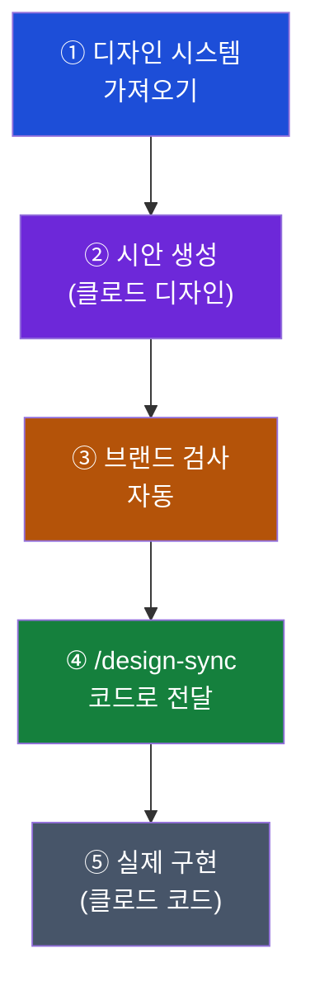

## 이게 뭔가요?

Claude Design(클로드 디자인 - 글로 설명만 하면 클로드가 홈페이지·프레젠테이션·앱 화면을 실제로 그려 주는 시각 제작 도구)이 2026년 6월 17일 큰 업데이트를 받았습니다. 이번 업데이트의 한 문장 요약은 **"이제 매일 쓰는 실무에서 우리 브랜드 톤을 흐트러뜨리지 않는다"** 입니다.

예전 Claude Design은 "예쁜 시안을 빨리 만들어 주는 도구"에 가까웠습니다. 멋지긴 한데, 만들 때마다 색·글꼴·버튼 모양이 조금씩 달라져서 우리 회사 색깔과 어긋나기 쉬웠습니다. 이번 업데이트는 그 빈틈을 두 방향으로 메웁니다.

1. **우리 브랜드 규칙을 먼저 학습** — 우리 회사의 색·글꼴·버튼 모양을 통째로 가져와서, 클로드가 그걸 지켜서 그리고 어긋나면 스스로 걸러냅니다.
2. **디자인을 코드로 매끄럽게 넘김** — 디자이너가 만든 시안을 개발 도구(Claude Code)로 한 번에 넘겨, 개발자가 스크린샷을 보고 처음부터 다시 만들 필요가 없게 합니다.

비유하자면, 예전에는 외주 디자이너에게 "느낌만" 맡기고 결과를 받아 본 뒤 "우리 색이랑 좀 다른데요"를 반복했다면, 이제는 우리 브랜드북을 외운 전속 디자이너가 처음부터 우리 규칙대로 그려 주고, 그 파일을 개발팀에 바로 인수인계까지 해 주는 셈입니다.

> 참고: Claude Design 자체가 처음이라면 먼저 기본 소개 문서(`claude-design-complete-guide`)를 보는 게 좋습니다. 이 문서는 그 위에 얹힌 **6월 업데이트의 새 기능**에 집중합니다.

## 왜 알아야 하나요?

비개발자·마케터·소상공인·기획자에게 이번 업데이트가 중요한 이유는 "혼자 예쁜 화면 한 장"에서 "팀이 함께 쓰는 실무 도구"로 성격이 바뀌었기 때문입니다.

- **브랜드가 안 흔들립니다** — 직원 누가 만들든, 몇 번을 다시 만들든 같은 색·같은 글꼴이 유지됩니다. 회사 규모가 커질수록 이게 큰 차이입니다.
- **디자인이 버려지지 않습니다** — 예전에는 클로드가 만든 멋진 시안이 "보기 좋은 그림"에서 끝나는 경우가 많았습니다. 이제는 그 시안이 실제 작동하는 제품으로 이어집니다.
- **반복 작업이 줄어듭니다** — 디자이너와 개발자가 같은 출발점에서 일하므로, "받은 시안을 개발자가 눈대중으로 다시 만드는" 중간 낭비가 사라집니다.

수치로도 변화가 확인됩니다. 출시 첫 주에 100만 명 넘게 Claude Design을 사용했고, 이번 업데이트에서 수백 건의 버그를 고쳤으며, **한 번 작업할 때 쓰는 토큰(token - AI가 글·이미지를 처리하는 최소 단위로, 사용량과 요금의 기준) 양이 줄고 오류 발생률도 크게 떨어졌습니다.** 같은 작업을 더 싸고 안정적으로 할 수 있게 됐다는 뜻입니다.

## 어떻게 하나요?

이번 업데이트의 핵심은 **"브랜드 → 시안 → 코드"로 이어지는 작업 흐름**입니다. 전체 그림을 먼저 본 뒤 단계별로 설명합니다.

### 방법 1: 우리 브랜드(디자인 시스템) 가져오기

디자인 시스템(design system - 버튼·색·글꼴·여백 규칙처럼 한 브랜드의 디자인 약속을 묶어 둔 것)을 세 가지 방법으로 클로드에 등록할 수 있습니다.

1. **깃허브(GitHub - 개발자들이 코드를 저장·공유하는 사이트)에서 가져오기** — 이미 개발팀이 쓰는 디자인 규칙이 코드로 정리돼 있으면 그걸 그대로 불러옵니다.
2. **디자인 파일에서 가져오기** — 디자인 도구로 만든 파일을 올립니다.
3. **직접 업로드** — 색·글꼴 정리표 같은 자료를 올립니다.

등록하고 나면 클로드는 시안을 만들 때마다 이 규칙을 지켜서 그리고, 규칙과 어긋나는 결과는 사용자에게 보여주기 전에 스스로 걸러냅니다. 관리자는 회사 표준 디자인 시스템을 **잠가 둘 수 있어서**, 직원이 임의로 다른 색·글꼴을 쓰지 못하게 통제할 수도 있습니다.

<strong>예시</strong>

약국 프랜차이즈 본사 마케팅 담당자가 회사 브랜드 색(예: 초록 계열)과 로고, 본문 글꼴을 한 번 등록해 둡니다. 이후 가맹점 안내 페이지를 만들 때 "신규 가맹 안내 페이지 만들어 줘"라고만 하면, 클로드가 알아서 그 초록색과 글꼴로 그립니다. 담당자가 매번 색 코드를 일일이 지정하지 않아도 됩니다.

### 방법 2: 시안을 코드로 넘기기 (디자인-코드 인수인계)

이번 업데이트의 가장 큰 변화는 **핸드오프(handoff - 디자이너가 만든 결과물을 개발자에게 넘기는 인수인계)** 가 매끄러워졌다는 점입니다. 두 가지 슬래시 명령(/로 시작하는 클로드 명령어)이 추가됐습니다.

| 명령어 | 누가 쓰나 | 하는 일 |
|--------|----------|---------|
| `/design-sync` | 개발자 (Claude Code 안에서) | 내 컴퓨터의 실제 코드에 들어 있는 디자인 규칙을 Claude Design으로 끌어옴 |
| `/design` | 개발자 (터미널에서) | 터미널을 떠나지 않고 디자인 프로젝트를 만들고·고치고·동기화 |

여기서 Claude Code(클로드 코드 - 키보드로 명령을 입력해 클로드에게 개발 작업을 시키는 화면)와 터미널(terminal - 검은 화면에 명령어를 입력하는 개발용 창)은 개발자가 쓰는 도구입니다. 비개발자는 직접 다룰 일이 드물지만, **"디자이너가 만든 시안이 개발자에게 어떻게 넘어가는지"** 를 알면 협업이 훨씬 수월해집니다.

핵심은 이것입니다. 예전에는 디자이너가 만든 화면을 캡처해서 개발자에게 보내면, 개발자가 그 그림을 보고 처음부터 다시 만들었습니다. 이제는 시안이 **진짜 부품(실제 버튼·색·간격)** 그대로 코드 쪽으로 넘어가므로, 개발자는 다시 만드는 대신 이어받아 완성합니다.

### 방법 3: 보이는 그대로 손으로 고치기

새 캔버스(canvas - 디자인 작업 화면)에는 요소를 마우스로 끌고(드래그), 크기를 바꾸고, 줄을 맞추는 도구가 생겼습니다. 이런 방식을 WYSIWYG(위지윅 - "보이는 그대로"라는 뜻으로, 화면에서 본 모습 그대로 결과가 나오는 편집 방식)라고 부릅니다.

예전에는 "이 버튼 좀 오른쪽으로 옮겨 줘"라고 글로 일일이 부탁해야 했다면, 이제는 직접 그 버튼을 집어서 옮기면 됩니다. 글로 설명하기 애매한 미세 조정을 손으로 바로 할 수 있습니다.

## 실전 예시

<strong>실전 케이스: 디자이너와 개발자가 한 팀으로 일하는 흐름</strong>

YMYD 같은 작은 팀에서 새 소개 페이지를 만든다고 해 봅시다.

1. **브랜드 등록** — 팀의 디자인 규칙(색·글꼴·버튼 모양)을 Claude Design에 한 번 등록합니다.
2. **디자이너 작업** — 디자이너가 대화로 소개 페이지 시안을 만듭니다. 클로드가 등록된 브랜드 규칙을 지켜 그리므로, 색이 어긋날 걱정이 없습니다.
3. **인수인계** — 개발자가 자기 작업 화면에서 `/design-sync`를 실행해 그 시안을 가져옵니다.
4. **구현** — 개발자는 스크린샷을 보고 다시 만드는 게 아니라, 넘어온 진짜 부품을 이어받아 실제 작동하는 페이지로 완성합니다.

예전이라면 2번과 4번 사이에 "캡처 → 전달 → 눈대중 재작업"이라는 낭비 구간이 있었지만, 이제는 그 구간이 사라집니다.

<strong>실전 케이스: 외부 도구로 내보내기</strong>

이번 업데이트로 외부 서비스 연결(커넥터 - connector, 클로드를 다른 프로그램과 이어 주는 기능)이 9개로 늘었습니다: Adobe, Base44, Canva, Gamma, Lovable, Miro, Replit, Vercel, Wix.

소상공인 사장님이 Claude Design에서 행사 안내 시안을 만든 뒤, 그 결과를 PDF(인쇄·공유용 문서 형식)나 PowerPoint(파워포인트 - 발표 슬라이드)로 내보내 거래처에 바로 보낼 수 있습니다. 또는 Canva(캔바 - 온라인 디자인 도구)로 넘겨 추가 손질을 할 수도 있습니다. "클로드에서 만들고 → 늘 쓰던 도구에서 마무리"가 가능해진 것입니다.

## 주의할 점

- **여전히 베타(beta - 정식 출시 전, 다듬는 중인 단계)입니다.** 유료 구독자에게 점진적으로 열리고 있으므로, 계정에 따라 일부 기능이 아직 안 보일 수 있습니다.
- **`/design-sync`·`/design`은 개발 도구(Claude Code) 안에서 쓰는 명령**입니다. 비개발자는 직접 칠 일이 거의 없으니, 협업하는 개발자에게 "이 시안 design-sync로 가져가 주세요"라고 요청하는 식으로 활용하세요.
- **브랜드 규칙을 한 번 잘 등록해 두는 게 핵심**입니다. 처음 등록을 대충 하면 클로드도 어긋난 시안을 만듭니다. "쓰레기를 넣으면 쓰레기가 나온다"는 원칙은 여기서도 같습니다.
- **자동 브랜드 검사가 사람 검토를 100% 대체하지는 않습니다.** 중요한 대외 자료는 발송 전 사람이 한 번 더 확인하세요.

## 정리

- Claude Design 6월 업데이트의 핵심은 **브랜드 일관성**과 **디자인-코드 인수인계** 두 가지입니다.
- 우리 디자인 규칙을 등록하면 클로드가 그걸 지켜 그리고, `/design-sync`로 그 시안을 개발 도구에 넘겨 실제 제품으로 잇습니다.
- 마우스로 직접 고치는 편집기, 9개 외부 도구 연결, PDF·PowerPoint 내보내기까지 더해져 "예쁜 그림"에서 "팀이 쓰는 실무 도구"로 올라섰습니다.

## 출처

- [Claude Design now stays on brand for daily work — Claude 공식 블로그](https://claude.com/blog/claude-design-stays-on-brand-for-daily-work)
- [Anthropic ships major Claude Design overhaul — VentureBeat](https://venturebeat.com/technology/anthropic-ships-major-claude-design-overhaul-with-design-system-imports-code-round-trips-and-a-fix-for-its-token-burning-problem)
- [Anthropic Adds Brand Controls, Code Sync to Claude Design — TechRepublic](https://www.techrepublic.com/article/news-anthropic-claude-design-overhaul-enterprise-teams/)
