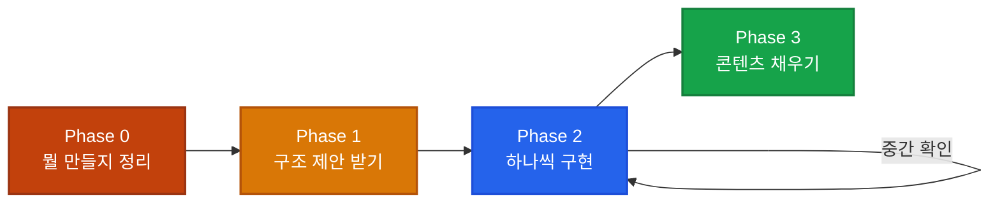

## 시작 전 준비 (Phase 0)

Claude에게 바로 "만들어줘"라고 하기 전에, 내가 뭘 만들고 싶은지 한 문단으로 정리하세요.

**준비 체크리스트:**
- [ ] 뭘 만들 건지 한 문단 설명 가능?
- [ ] 참고할 사이트나 이미지가 있나?
- [ ] 기술 스택 정했나? (모르면 Claude에게 추천 요청)
- [ ] CLAUDE.md 작성했나?

<div class="example-case">

비유: 인테리어 업체에 의뢰하기 전에

     "우리 집은 20평이고, 모던 스타일 좋아하고,
      이 잡지 사진 같은 느낌이면 좋겠어요"
     이 정도는 정리해가는 것
</div>

**실제 시작 순서 (따라하기):**
[1단계] 일반 터미널(명령 프롬프트)을 열고:

```bash
mkdir my-portfolio     # 프로젝트 폴더 만들기
cd my-portfolio        # 그 폴더로 이동
```

[2단계] Claude Code 실행:

```bash
claude                 # Claude Code가 실행됨
```

[3단계] Claude Code 대화창에서 대화 시작:
"개인 포트폴리오 사이트를 만들려고 해.
 <span class="keyword-highlight">CLAUDE.md 먼저 만들어줘</span>."

이후의 모든 대화는 Claude Code 대화창에서 자연어로 진행합니다.

## 첫 대화 (Phase 1) - 설계도 먼저

### 핵심: "아직 만들지 마"

아래 예시는 모두 Claude Code 대화창에서 자연어로 입력합니다.

"개인 포트폴리오 사이트를 만들려고 해.
 메인 페이지에 자기소개, 프로젝트 목록, 연락처가 있으면 좋겠어.
 <span class="keyword-highlight">어떤 구조가 좋을지 제안해줘</span>.
 <span class="keyword-highlight">아직 만들지는 마</span>."

-> Claude가 폴더 구조, 페이지 구성 등을 제안
-> 마음에 들면 "좋아, <span class="keyword-highlight">이 구조로 시작해줘</span>"

<div class="example-case">

비유: 건축가에게 "3층 건물 지어주세요" 대신

     "3층 건물인데, 1층은 가게, 2층은 사무실, 3층은 집이면 좋겠어요.
      설계도 먼저 보여주세요."
</div>

**왜 '아직 만들지 마'가 중요한가?**
이 말을 안 하면:
  Claude가 바로 코드를 작성하기 시작함
  -> 나중에 구조가 마음에 안 들면 처음부터 다시 해야 함

이 말을 하면:
  Claude가 구조만 제안함
  -> 확인하고 수정한 뒤 시작하니까 재작업이 없음

<div class="example-case">

비유: 미용실에서 바로 가위를 대는 것 vs

     "이렇게 자를 건데 괜찮으세요?" 먼저 물어보는 것
</div>

## 한 덩어리씩 구현 (Phase 2)

### 핵심: 한 번에 하나씩

<div class="example-case">

1차: "<span class="keyword-highlight">메인 페이지 레이아웃만 먼저 만들어줘</span>"
     -> 확인 -> 괜찮으면 다음으로

2차: "<span class="keyword-highlight">헤더와 네비게이션을 추가해줘</span>"
     -> 확인 -> 괜찮으면 다음으로

3차: "<span class="keyword-highlight">자기소개 섹션을 만들어줘</span>"
     -> 확인 -> 수정할 부분 있으면 수정 요청

비유: 집을 지을 때
     기초공사 -> 골조 -> 외벽 -> 내부 인테리어
     순서대로 하나씩. 한꺼번에 다 하면 엉망이 됨.
</div>

**나쁜 예시:**

<div class="example-case">

"메인 페이지, 소개 페이지, 프로젝트 갤러리, 블로그,
 다크모드, 반응형, 애니메이션 <span class="keyword-highlight">전부 만들어줘</span>"

-> 앞쪽 기능은 잘 만들지만
   뒤쪽 기능은 대충 되거나 빠짐

비유: 식당에서 10개 메뉴를 한꺼번에 주문하면
     뒤쪽 메뉴가 늦게 나오거나 퀄리티가 떨어지는 것
</div>

## 콘텐츠 채우기 (Phase 3)

골격이 완성되면 내용을 채워 넣습니다.

<div class="example-case">

"자기소개 섹션에 <span class="keyword-highlight">이 내용을 넣어줘</span>:
 '안녕하세요, 3년차 디자이너 김서연입니다.
  UI/UX 디자인을 전문으로 합니다.'"

"프로젝트 목록에 <span class="keyword-highlight">이 3개를 추가해줘</span>:
 1. 카페 앱 리디자인
 2. 여행 플랫폼 UI
 3. 금융 대시보드"

비유: 집의 골조가 완성된 후에
     가구를 배치하고, 그림을 걸고, 소품을 놓는 단계
</div>

## 유용한 표현들

| 상황 | 표현 | 비유 |
|------|------|------|
| 구조 먼저 볼 때 | "구조를 제안해줘. 아직 만들지 마." | 설계도 먼저 보기 |
| 한 부분만 수정 | "헤더만 수정해줘. 나머지는 건드리지 마." | 거실만 페인트칠 |
| 참고가 있을 때 | "이 사이트처럼 만들어줘" | 사진 보여주고 주문 |
| 디자인 확인 | "지금까지 만든 거 보여줘" | 중간 점검 |
| 스타일 통일 | "기존 스타일에 맞춰서 추가해줘" | 인테리어 톤 맞추기 |

## 자주 하는 실수

| 실수 | 왜 문제인가 | 올바른 방법 |
|------|-----------|-----------|
| 한 번에 전부 요청 | 뒤쪽 작업이 부실해짐 | 하나씩 순서대로 |
| 구조 확인 없이 바로 시작 | 나중에 전체 재작업 | "아직 만들지 마" 후 확인 |
| 추상적 요청 | 결과물이 기대와 다름 | 구체적으로 설명 |
| 참고자료 없이 요청 | Claude가 알아서 결정 | 참고 사이트/이미지 제공 |
| 중간 확인 없이 계속 진행 | 문제가 쌓여서 나중에 폭발 | 단계마다 확인 |

**예시 케이스:**

<div class="example-case">

(X) "<span class="keyword-highlight">포트폴리오 사이트 만들어줘</span>"
-> Claude가 알아서 구조, 디자인, 내용까지 결정
   결과물이 내 기대와 완전히 다를 수 있음

(O) "포트폴리오 사이트를 만들려고 해.
    이 사이트(참고 URL)랑 비슷한 느낌이면 좋겠어.
    <span class="keyword-highlight">메인 페이지 구조를 먼저 제안해줘</span>. <span class="keyword-highlight">아직 만들지 마</span>."
-> 구조 확인 후 하나씩 진행하니까 원하는 결과에 가까움

비유: "옷 만들어주세요" vs

     "이 사진처럼 네이비색 코트요. 기장은 무릎까지.
      먼저 디자인 스케치 보여주세요."
     구체적일수록 만족도가 높음
</div>

## 전체 흐름 요약

| Phase | 설명 | 비유 |
|-------|------|------|
| **Phase 0** | 내가 뭘 만들 건지 정리 | 의뢰서 작성 |
| **Phase 1** | Claude에게 구조 제안 받기 | 설계도 검토 |
| **Phase 2** | 하나씩 구현하며 중간 확인 | 시공 + 감리 |
| **Phase 3** | 콘텐츠 채우기 | 가구 배치 |



<div class="example-case">

비유: 집짓기 전체 과정
     의뢰 -> 설계도 -> 시공(단계별) -> 인테리어
     어느 단계도 건너뛰면 안 됨
</div>
