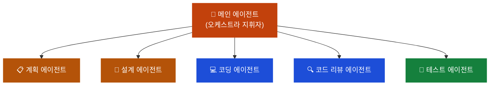
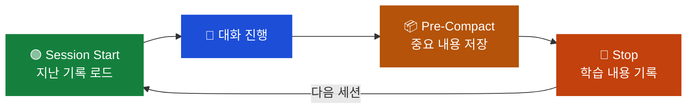

## 이게 뭔가요?

앤스로픽 해커톤에서 우승한 개발자 **어판 무스타파(Afan Mustafa)**가 10개월간 매일 Claude Code를 쓰면서 정리한 **오픈소스 완전 가이드**입니다. GitHub(코드 저장소 서비스) 스타 7만 개를 넘길 정도로 화제가 됐어요.

> 비유: 게임으로 치면 "뉴비 → 중수 → 고수" 레벨업 로드맵이에요. 같은 캐릭터(Claude Code)를 쓰더라도 스킬 트리를 어떻게 찍느냐에 따라 전투력이 열 배 차이 나는 것처럼요.

이 문서는 해당 가이드의 핵심 10가지를 **입문 → 중급 → 고급** 3단계로 나누어 정리합니다.

## 왜 알아야 하나요?

- **같은 도구, 다른 결과**: 똑같이 Claude Code를 쓰는데 어떤 사람은 10배 빠르게 일합니다. 차이는 "설정"과 "사용법"에 있어요
- **토큰(AI가 처리하는 텍스트 단위) 낭비 방지**: MCP(외부 도구 연결 기능)를 무턱대고 켜두면 사용 가능한 기억 공간이 20만 → 7만 토큰으로 줄어들 수 있어요
- **체계적 레벨업**: 무작정 따라하기보다 단계별로 익히면 실수 없이 올라갈 수 있어요

## 어떻게 하나요?

### 🟢 입문 레벨 (Tip 1~3) — "설정이 절반이다"

#### Tip 1: CLAUDE.md는 목차만 적어라 (프로그레시브 디스클로저)

CLAUDE.md는 Claude에게 "우리 프로젝트가 뭔지" 알려주는 설명서예요. 그런데 여기에 **모든 규칙을 다 적으면 안 돼요**.

핵심은 **어디서 찾을 수 있는지만** 적어두는 것.

> 비유: 회사에서 신입에게 업무 매뉴얼 100페이지를 통째로 주는 것보다, **목차만 주고 필요할 때 찾아보라고** 하는 게 훨씬 효율적이잖아요. 이걸 "프로그레시브 디스클로저(Progressive Disclosure)"라고 해요.

<div class="example-case">
<strong>💬 예시: 좋은 CLAUDE.md vs 나쁜 CLAUDE.md</strong>

```markdown
# ❌ 나쁜 예 — 모든 규칙을 다 적음
- 변수명은 camelCase를 쓴다
- API 응답은 반드시 try-catch로 감싼다
- 테스트 파일은 __tests__ 폴더에 넣는다
- CSS는 Tailwind만 쓴다
- 커밋 메시지는 한국어로...
(100줄 이상 계속)

# ✅ 좋은 예 — 목차만 적음
- 코딩 규칙: docs/coding-rules.md 참고
- API 가이드: docs/api-guide.md 참고
- 테스트 규칙: docs/testing.md 참고
```

</div>

#### Tip 2: 시스템 프롬프트 다이어트 — 안 쓰는 MCP는 꺼라

Claude Code에 MCP나 플러그인(추가 기능을 붙이는 확장 도구)을 많이 설치하면, 대화 시작 시 Claude가 읽어야 하는 설명서가 **약 2만 토큰**까지 차지할 수 있어요.

안 쓰는 것들을 꺼두면 **9,000 토큰**으로 반 이상 줄일 수 있습니다.

<div class="example-case">
<strong>📌 실전 케이스: 어판의 MCP 관리법</strong>

어판은 MCP를 **14개** 설치해뒀지만, 동시에 켜놓는 건 **5~6개뿐**이에요. 나머지는 필요할 때만 켜는 방식.

- MCP 너무 많이 켜두면: 사용 가능한 컨텍스트가 **20만 → 7만 토큰**으로 줄어듦
- MCP 정리 후: 같은 대화에서 **훨씬 긴 코드**를 다룰 수 있음

```bash
# MCP 목록 확인
claude mcp list

# 안 쓰는 MCP 비활성화 (settings.json에서 disabled로 변경)
```

</div>

#### Tip 3: 상태 줄로 토큰 사용량 모니터링

<div class="example-case">
<strong>💬 예시</strong>

```
/statusline
```

이 명령어를 실행하면 지금 토큰을 얼마나 썼는지 **실시간으로** 볼 수 있어요.

> 비유: 자동차 운전할 때 연료 게이지 없으면 불안하잖아요. 토큰도 마찬가지예요. **눈에 보여야 관리가 됩니다.**

</div>

---

### 🟡 중급 레벨 (Tip 4~7) — "컨텍스트 관리가 핵심"

#### Tip 4: 컨텍스트는 우유다 — 신선할 때 써라

대화가 길어질수록 앞에서 나눈 내용이 **점점 흐릿해져요**. 우유가 시간이 지나면 상하는 것처럼요. 이 현상을 **컨텍스트 부패(Context Degradation)**라고 부르는데, 원인이 4가지입니다.

| 원인 | 설명 |
|------|------|
| **주의력 희석** | 대화가 너무 길어지면 초반 지시 사항을 AI가 놓침 |
| **명령 충돌** | 이전 지시와 새 지시가 서로 충돌할 때 AI가 혼란 |
| **토큰 예산 압박** | 불필요한 파일로 AI의 사고 공간이 꽉 차버리는 현상 |
| **관련성 불일치** | 현재 작업과 무관한 코드가 컨텍스트에 혼입되는 경우 |

그래서 자동 압축(Auto Compact)에만 맡기지 말고, **적절한 타이밍에 직접 정리**해야 해요.

**언제 /clear, 언제 /compact?**

| 명령어 | 언제 쓰나 | 예시 상황 |
|--------|----------|----------|
| `/clear` | 완전히 다른 도메인으로 전환 | 웹 작업 끝내고 모바일 앱 시작 |
| `/compact` | 같은 기능의 다른 레이어로 이동 | 프론트엔드 완료 후 백엔드로 |

**언제 실행하나요?**
- 큰 기능 하나를 **완성했을 때**
- 작업 **방향이 바뀔 때**

> 중요한 맥락은 살리면서 불필요한 내용만 정리해 줍니다. 자동 압축만 믿으면 중요한 맥락이 날아갈 수 있어요!

#### Tip 5: 모델은 상황에 맞게 골라라

Claude Code에는 세 가지 모델이 있는데, 모든 작업에 가장 비싼 Opus를 쓸 필요가 없어요.

| 모델 | 용도 | 비유 |
|------|------|------|
| **Haiku** (가벼움) | 파일 찾기, 간단한 수정 | 편의점 도시락 |
| **Sonnet** (중간) | 여러 파일 동시 수정, 일반 코딩 | 레스토랑 단품 |
| **Opus** (강력함) | 전체 구조 설계, 복잡한 버그 | 풀코스 요리 |

<div class="example-case">
<strong>💬 예시: 모델 전환</strong>

```
/model sonnet    # 일반 코딩 작업
/model opus      # 아키텍처 설계, 복잡한 디버깅
/model haiku     # 간단한 검색, 파일 읽기
```

> 식당에서도 간단한 식사에 코스 요리를 시키진 않잖아요.

</div>

**settings.json 3줄로 비용 최대 80% 줄이기**

`~/.claude/settings.json` (Claude Code 설정 파일)에 아래 3줄을 추가하면 대부분의 작업에서 비용을 대폭 줄일 수 있어요.

```json
{
  "model": "claude-sonnet-4-6",
  "maxTokens": 10000,
  "smallModel": "claude-haiku-4-5-20251001"
}
```

| 설정 | 역할 |
|------|------|
| `model` | 기본 모델을 Opus → Sonnet으로 변경 (일반 코딩엔 Sonnet으로 충분) |
| `maxTokens` | AI 내부 사고(thinking)에 쓰이는 보이지 않는 토큰 비용 제한 |
| `smallModel` | 파일 검색·요약 등 단순 백그라운드 작업은 Haiku로 자동 처리 |

실제 사례: 이 설정을 적용하면 한 번 작업에 4,800원가량 들던 비용이 720원 수준으로 줄었다는 보고가 있어요. 매일 쌓이면 한 달 기준으로 큰 차이가 납니다.

#### Tip 6: Plan 모드 — 설계도 먼저, 코딩은 나중에

코딩부터 바로 시작하게 하면 잘못된 방향으로 달려가서 **토큰만 낭비**할 수 있어요.

**먼저 계획서를 쓰게 하고 → 내가 검토 → OK하면 그때 코딩 시작.**

> 비유: 건축할 때 설계도 없이 벽돌부터 쌓지 않는 것처럼요.

<div class="example-case">
<strong>📌 실전 사용법</strong>

```
# 방법 1: 직접 요청
"로그인 기능을 만들건데, 먼저 계획부터 세워줘. 코드는 내가 OK할 때까지 작성하지 마."

# 방법 2: Plan 모드 진입
/plan
```

</div>

#### Tip 7: 레퍼런스 코드를 같이 보여줘라

Claude에게 뭔가 만들어 달라고 할 때 **비슷한 오픈소스 코드를 같이 보여주면** 결과물이 확 좋아져요.

> 비유: 미술 시간에 빈 종이에 그리라는 것과 **참고 작품을 보고 그리라는 건** 완전히 다르잖아요.

<div class="example-case">
<strong>💬 예시</strong>

```
"이 GitHub 레포(URL)의 인증 로직을 참고해서 우리 프로젝트에 맞는 로그인 기능을 만들어줘."
```

빈 상태에서 "로그인 만들어줘"보다 **참고할 코드가 있으면** 품질이 훨씬 높아집니다.

</div>

---

### 🔴 고급 레벨 (Tip 8~10) — "클로드를 팀으로 진화시키기"

#### Tip 8: 서브 에이전트 — 혼자 일하지 말고 팀을 꾸려라

클로드 혼자 모든 일을 하는 게 아니라, **전문가 팀을 꾸리는 방식**이에요.

> 비유: 오케스트라 지휘자가 직접 모든 악기를 연주하지 않잖아요. 바이올린은 바이올리니스트에게, 피아노는 피아니스트에게 맡기듯이요.

어판의 시스템에는 **전문 에이전트가 16개** 있어요:



각 에이전트에게 **할 일을 하나씩만** 주고, 그 결과물을 다음 에이전트에게 넘기는 방식이에요.

#### Tip 9: Git(코드 버전 관리 도구) 워크트리 — 책상 5개에서 동시에 일하기

보통은 하나의 작업이 끝나야 다음 걸 시작하잖아요. **워크트리(Worktree)**를 쓰면 같은 프로젝트에서 **여러 작업 폴더를 동시에** 만들 수 있어요.

> 비유: 사무실에서 책상 하나로 일하던 걸, **책상 5개 놓고 동시에 진행**하는 거예요.

<div class="example-case">
<strong>📌 실전 케이스: 병렬 개발</strong>

```bash
# 워크트리 생성 (각각 독립된 작업 공간)
git worktree add ../feature-login feature/login
git worktree add ../feature-signup feature/signup
git worktree add ../bugfix-auth bugfix/auth

# 각 폴더에서 Claude를 따로 실행
cd ../feature-login && claude
cd ../feature-signup && claude
cd ../bugfix-auth && claude
```

에이전트 5개가 **동시에 다른 기능을 개발**할 수 있어요!

</div>

#### Tip 10: 훅(Hooks) — Claude에게 알람 시계 달아주기

훅은 **특정 시점에 자동으로 실행되는 명령어**예요.

> 비유: 아침에 알람이 자동으로 울리듯이, Claude가 특정 순간에 자동으로 뭔가를 실행하는 거예요.

**핵심 훅 3가지:**

| 훅 | 시점 | 하는 일 |
|-----|------|---------|
| **Session Start** | 새 대화 시작 시 | 지난 기록을 자동으로 불러옴 |
| **Pre-Compact** | 기억 정리 직전 | 중요한 내용을 먼저 저장 |
| **Stop** | 대화 종료 시 | 이번에 배운 걸 자동 기록 |



이 세 개를 조합하면 **대화가 끝나도 배운 걸 기억하는 시스템**이 완성돼요.

## 주의할 점

1. **MCP를 너무 많이 켜지 마세요** — Claude의 기억 공간(컨텍스트)이 크게 줄어듭니다
2. **자동 압축만 믿지 마세요** — 중요한 맥락이 날아갈 수 있어요. `/compact`로 직접 관리하세요
3. **보안에 신경 쓰세요** — Claude가 외부 데이터를 읽을 때 악의적인 명령이 숨어 있을 수 있어요. 이걸 "프롬프트 인젝션(prompt injection)"이라고 하는데, 어판의 가이드에는 이걸 자동으로 감지하는 보안 도구도 포함되어 있습니다

## 정리

- **설정이 절반이다**: CLAUDE.md 정리 + 시스템 프롬프트 다이어트만으로 체감 성능이 달라짐
- **컨텍스트는 우유처럼 관리하라**: 신선할 때 쓰고, 제때 정리하라
- **서브 에이전트 + 훅을 쓰면**: Claude가 단순 도구에서 **학습하는 팀**으로 진화한다

---

> 📺 **참고 영상**: [클로디컬 — 어판 무스타파의 Claude Code 완전 가이드](https://www.youtube.com/watch?v=QhZJyg47JW0)
