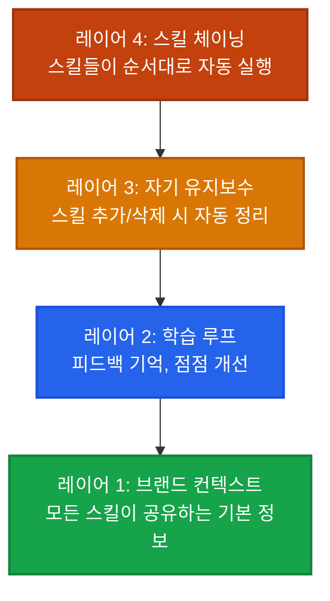

## 이게 뭔가요?

Claude Code 스킬(Skills)을 써본 적 있나요? 보통은 스킬을 **하나씩 따로따로** 사용합니다. 카피 쓸 때 카피 스킬, 리서치할 때 리서치 스킬, 이런 식으로요.

**Agentic OS**는 이 스킬들을 **하나의 시스템으로 연결**하는 방법입니다. 스킬끼리 정보를 공유하고, 이전에 받은 피드백을 기억하고, 새 스킬을 추가하면 알아서 정리까지 해주는 "자동 운영 체제"를 만드는 거예요.

비유하면 이래요:

> **스킬을 따로 쓰는 것** = 직원 5명이 서로 이야기 안 하고 각자 일하는 것. 매번 같은 설명을 반복해야 함.
> **Agentic OS** = 직원 5명이 같은 회의록을 공유하고, 어제 한 일을 기억하고, 신입이 오면 자동으로 업무 인수인계까지 해주는 팀.

## 왜 알아야 하나요?

스킬을 하나씩 따로 쓰면 이런 문제가 생겨요:

- **매번 같은 설명 반복**: "내 브랜드 톤은 이래, 타겟 고객은 이래" → 스킬마다 다시 알려줘야 함
- **어제 한 일을 기억 못 함**: 새 세션을 열면 Claude가 리셋돼서 처음부터 다시 시작
- **피드백이 사라짐**: "지난번 뉴스레터 너무 길었어"라고 했는데 다음에 또 길게 씀
- **스킬이 늘어날수록 관리가 힘듦**: 20개 스킬의 문서를 일일이 업데이트해야 함

Agentic OS를 구축하면 이 문제가 전부 해결됩니다. Claude가 **내 브랜드를 알고, 어제 한 일을 기억하고, 피드백을 반영하고, 스스로 정리**까지 해요.

## 어떻게 하나요?

Agentic OS는 **4개 레이어**로 구성됩니다. 하나씩 쌓아가면 돼요.

### 레이어 1: 공유 브랜드 컨텍스트 — "모든 스킬이 읽는 회사 소개서"

스킬마다 "내 브랜드는 이래요"를 반복하는 대신, **한 곳에 브랜드 정보를 모아두고** 모든 스킬이 거기서 읽어가게 만드는 겁니다.

마치 회사에 신입이 들어오면 사무실 벽에 붙은 "회사 소개서"를 읽으라고 하는 것과 같아요.

```
📁 brand-context/
├── voice.md          ← 브랜드 말투 (격식체? 친근체? 유머 스타일?)
├── icp.md            ← 이상적인 고객 프로필 (누구한테 말하는지)
├── positioning.md    ← 우리만의 차별점 (왜 우리를 선택해야 하는지)
├── samples/          ← 잘 된 콘텐츠 예시 ("이런 느낌으로 써줘")
└── assets.md         ← 로고, SNS 링크, 브랜드 컬러 등
```

<div class="example-case">
<strong>💬 예시: 브랜드 컨텍스트가 있을 때 vs 없을 때</strong>

**없을 때** — 카피라이팅 스킬 실행:
```
"SNS 게시물 써줘"
→ Claude: 일반적이고 무난한 광고 카피 생성 (누구 회사인지 모르니까)
```

**있을 때** — 같은 스킬 실행:
```
"SNS 게시물 써줘"
→ Claude: brand-context/voice.md 읽기 → icp.md 읽기 → samples/ 참고
→ 우리 브랜드 톤에 맞는, 타겟 고객을 정확히 겨냥한 카피 생성
```

</div>

**처음 세팅 방법**: 직접 파일을 하나하나 만들 수도 있지만, "브랜드 인터뷰 스킬"을 만들어서 Claude가 질문을 던지고 답변을 바탕으로 자동 생성하게 할 수도 있어요. 한 번만 하면 됩니다.

### 레이어 2: 학습 루프 — "피드백을 기억하는 시스템"

보통 AI는 **대화가 끝나면 다 잊어버리잖아요**. 학습 루프는 Claude가 피드백을 파일로 저장해서 다음에 참고하게 만드는 구조예요.

일기장에 비유하면: 매일 퇴근 전에 "오늘 뭘 했고, 뭐가 잘됐고, 뭘 고쳐야 하는지" 적어두는 것과 같아요.

```
📁 context/
├── soul.md           ← 에이전트의 정체성 (행동 원칙, 우선순위)
├── user.md           ← 사용자 선호도 ("간결한 불릿 포인트 선호")
├── memory.md         ← 장기 비즈니스 지식
├── learnings.md      ← 스킬별 피드백 기록 (핵심!)
└── memory/
    ├── 2026-03-15.md  ← 어제 한 일
    └── 2026-03-16.md  ← 오늘 한 일
```

<div class="example-case">
<strong>💬 예시: 학습 루프가 작동하는 과정</strong>

**1회차**: 뉴스레터 스킬로 글을 생성 → 너무 길어서 "절반으로 줄여줘" 피드백
→ `learnings.md`에 기록: "뉴스레터 스킬: 사용자가 길이 절반 선호"

**2회차**: 같은 스킬 실행 → learnings.md를 먼저 읽음 → 처음부터 짧게 작성

**3회차**: "이번엔 좀 더 데이터를 넣어줘" → 또 기록됨

이렇게 쓸수록 **내 취향에 맞게 알아서 조정**되는 거예요.

</div>

**단기 메모리(daily files)** 덕분에 새 세션을 열어도 "어제 뉴스레터 초안 작성했고, 피드백 반영해서 수정 중이었죠"라고 이어갈 수 있어요.

### 레이어 3: 자기 유지보수 (Heartbeat) — "알아서 정리하는 시스템"

스킬이 10개, 20개로 늘어나면 관리가 힘들어지잖아요. **Heartbeat(심장박동)**는 세션을 시작할 때마다 자동으로 시스템 상태를 점검하는 기능이에요.

자동차 시동 걸 때 자동으로 엔진 체크하는 것과 같아요.

**세션 시작 시 (Heartbeat):**
- 스킬 폴더를 스캔해서 새로 추가된 스킬 발견
- CLAUDE.md와 README에 자동 등록
- learnings.md에 새 스킬 섹션 추가
- MCP 서버가 추가됐으면 그것도 인식

**세션 종료 시 (Wrap-up):**
- 오늘 만든 결과물 정리
- 피드백 수집 → learnings.md 업데이트
- 변경사항 git commit

<div class="example-case">
<strong>💬 예시: 새 스킬을 추가했을 때</strong>

```
📁 skills/ 폴더에 "ugc-script/" 폴더를 새로 만듦

→ 다음 세션 시작 시 Heartbeat 자동 실행:
  ✅ "ugc-script 스킬 발견"
  ✅ 기존 스킬과 겹치는 부분 체크 (카피라이팅 스킬과 역할 분담 확인)
  ✅ CLAUDE.md에 등록
  ✅ learnings.md에 섹션 추가
  → "새 스킬이 등록되었습니다. 기존 copywriting 스킬과의 차이점: ..."
```

스킬을 그냥 폴더에 넣기만 하면 나머지는 시스템이 알아서 해요.

</div>

### 레이어 4: 스킬 체이닝 — "스킬끼리 협업하는 워크플로우"

개별 스킬이 아니라, **여러 스킬이 순서대로 자동 실행**되는 파이프라인이에요. 이게 Agentic OS의 진짜 핵심입니다.

공장 컨베이어 벨트에 비유하면: 원재료(리서치) → 가공(글쓰기) → 품질검사(인간화) → 포장(발행) 이 자동으로 이어지는 거예요.

<div class="example-case">
<strong>📌 실전 케이스: 콘텐츠 자동 생산 파이프라인</strong>

```
[트렌드 리서치 스킬]
  Reddit, X에서 이번 주 인기 주제 수집
  → research-brief.md 저장
        ↓
[콘텐츠 리퍼포징 스킬]
  최신 YouTube 영상 자막 추출 + 트렌드 리서치 결합
  → 뉴스레터 초안 생성
        ↓
[휴머나이저 스킬]
  AI 느낌 제거, 자연스러운 말투로 변환
        ↓
[카피라이팅 스킬]
  SNS용 짧은 홍보 문구 생성
        ↓
[발행]
  뉴스레터 발송 + SNS 게시
```

하나의 명령으로 리서치부터 발행까지 **전 과정이 자동**으로 돌아갑니다.
그리고 모든 단계에서 **브랜드 컨텍스트**를 참고하고, **learnings.md**의 피드백을 반영해요.

</div>

## 실전 예시

<div class="example-case">
<strong>📌 실전 케이스: 1인 사업자의 마케팅 자동화</strong>

**상황**: 블로그, 뉴스레터, SNS를 혼자 운영하는데, 매주 콘텐츠 만드는 데만 하루가 걸린다.

**Agentic OS 적용 후**:
1. 브랜드 컨텍스트 세팅 (1회, 약 30분)
2. 트렌드 리서치 → 콘텐츠 작성 → SNS 홍보 스킬 체이닝
3. 매주 월요일 자동 실행 (스케줄 작업 연동)
4. 결과물 확인 후 피드백만 주면 다음 주에 반영됨

**결과**: 하루 걸리던 콘텐츠 작업이 피드백 10분으로 줄어듦

</div>

<div class="example-case">
<strong>📌 실전 케이스: 스킬 중복 방지</strong>

**상황**: "블로그 글쓰기" 스킬과 "뉴스레터 작성" 스킬을 둘 다 만들었는데, 하는 일이 비슷해서 헷갈린다.

**Agentic OS 대응**:
- Heartbeat가 새 스킬 설치 시 기존 스킬의 front matter(역할 설명)를 전부 읽음
- "이 스킬은 기존 blog-writer 스킬과 70% 겹칩니다. 차이점을 명확히 해주세요" 알림
- 역할 분담을 정리해서 문서에 자동 반영

**결과**: 스킬이 20개가 넘어도 역할이 깔끔하게 정리된 상태 유지

</div>

## 4개 레이어 한눈에 보기



아래부터 위로 쌓아가세요. 레이어 1만 해도 효과가 크고, 4까지 가면 **비즈니스 운영 시스템**이 됩니다.

## 주의할 점

- **처음부터 다 만들려고 하지 마세요**: 레이어 1(브랜드 컨텍스트)부터 시작하고, 필요할 때 다음 레이어를 추가하세요.
- **스킬 마켓플레이스에서 받은 스킬은 그대로 쓰면 안 돼요**: 반드시 내 브랜드 컨텍스트를 채워 넣어야 제대로 된 결과물이 나옵니다. 남의 옷을 그냥 입으면 안 맞는 것과 같아요.
- **learnings.md는 정기적으로 리뷰**: 쌓이기만 하면 오래된 피드백이 현재 스킬을 방해할 수 있어요. 월 1회 정도 정리 추천.
- **스킬 수는 점진적으로**: 3~5개로 시작해서 시스템이 안정되면 늘려가세요.

## 정리

- **스킬을 따로 쓰면 도구**, 연결하면 **운영 시스템**이 된다
- 4개 레이어: 브랜드 컨텍스트 → 학습 루프 → 자기 유지보수 → 스킬 체이닝
- 쓸수록 내 비즈니스를 더 잘 이해하는 시스템으로 진화

> 참고 영상: [Agentic OS — Claude Code Skills를 시스템으로 연결하기](https://www.youtube.com/watch?v=5AfSB0sWihw)
