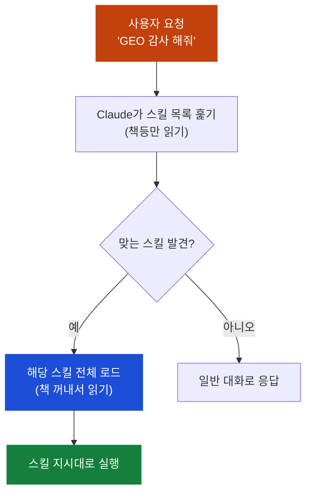
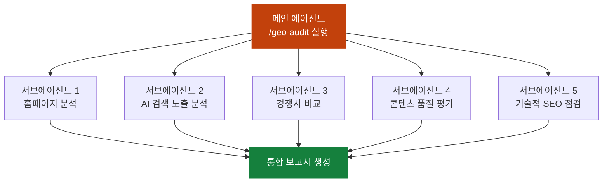

## 이게 뭔가요?

AI 에이전트가 대세라고 하죠? 모든 스타트업, 모든 개발자가 "에이전트, 에이전트"를 외치고 있습니다. 그런데 **Claude를 만든 Anthropic이 직접 "에이전트 그만 만들어라"라고 말했습니다.**

대신 뭘 만들라고 했냐면? **스킬(Skills)**입니다.

비유하면 이래요:

> **에이전트를 여러 개 만드는 것** = 모든 업무마다 새 직원을 뽑는 것. 세금용 직원, 법률용 직원, 마케팅용 직원... 채용비만 천문학적.
> **스킬을 만드는 것** = 한 명의 유능한 직원에게 업무 매뉴얼만 건네주는 것. 세금 매뉴얼, 법률 매뉴얼, 마케팅 매뉴얼... 같은 사람이 다 해냄.

## 왜 알아야 하나요?

AI 에이전트가 아무리 똑똑해도 **"전문성"이 없으면 쓸모가 반감**됩니다.

Anthropic이 든 예시가 딱 와닿아요:

> 세금 신고를 맡길 사람을 고르세요.
> - **A. 천재**: IQ가 하늘을 찌르지만 세금 신고를 해본 적이 없음
> - **B. 세무사**: 수천 건의 세금 신고를 해봐서 모든 규칙과 예외를 꿰고 있음
>
> 누구를 고르시겠어요? **당연히 B**죠.

지금의 AI 에이전트가 바로 A입니다. 뭐든 풀어낼 수 있지만, **당신의 업무 방식을 모르고, 지난번에 뭘 했는지도 기억 못 합니다.** 그래서 매번 새 에이전트를 만들게 되고, 관리가 감당이 안 됩니다.

스킬은 이 문제를 해결합니다. **하나의 에이전트 + 여러 개의 전문 매뉴얼 = 무한한 전문가**.

## 어떻게 하나요?

### 방법 1: 스킬의 기본 구조 이해하기

스킬의 핵심은 **Markdown(간단한 문서 작성 형식) 파일 하나**입니다. 신입 직원에게 건네는 업무 매뉴얼이라고 생각하세요.

```
.claude/skills/
└── blog-writer/
    └── skill.md        ← "블로그는 이렇게 써" 매뉴얼
```

`skill.md` 안에는 이런 내용이 들어갑니다:

```markdown
# 블로그 작성 스킬

## 언제 실행하나
사용자가 블로그 글을 요청하면

## 규칙
- 항상 3가지 구조로 작성: 문제 → 해결책 → 실천법
- 톤: 대화체, 전문용어 최소화
- 길이: 1,500~2,000자
- 마지막에 CTA(행동 유도) 포함

## 예시
(구체적인 예시 블로그 글)
```

이게 전부입니다. 5분이면 만들 수 있고, 코딩이 필요 없습니다.

<div class="example-case">
<strong>💬 예시: 리크루터의 채용 스킬</strong>

```markdown
# 이력서 평가 스킬

## 규칙
- 기술 역량 40%, 경험 30%, 문화 적합성 30%로 평가
- 5점 만점 스코어카드 작성
- "탈락" 판정 시 반드시 구체적 사유 기록
- 면접 질문 3개 자동 생성

## 평가 기준
(회사별 상세 기준...)
```

이걸 저장해두면, "이 이력서 평가해줘"라고만 말하면 **매번 회사의 기준대로** 평가합니다.

</div>

### 방법 2: 점진적 공개 — 왜 스킬이 프롬프트보다 나은가

Claude Code의 스킬은 **점진적 공개(Progressive Disclosure)**라는 방식으로 작동합니다. 쉽게 말하면:

> **프롬프트**: 책 100권을 한꺼번에 펼쳐놓고 읽기 → 정신없고 느림
> **스킬**: 책장에 꽂아두고, 필요한 책만 꺼내 읽기 → 깔끔하고 빠름



수백 개의 스킬을 등록해도 Claude가 느려지지 않는 이유가 바로 이것입니다. 필요한 것만 꺼내 씁니다.

### 방법 3: MCP(외부 도구 연결 기능)와 스킬의 관계

| 구분 | MCP (Model Context Protocol) | 스킬 (Skills) |
|---|---|---|
| **역할** | 외부 도구/데이터에 연결 | 그 도구로 **뭘 해야 하는지** 알려줌 |
| **비유** | 손 (도구를 잡을 수 있음) | 경험 (도구를 **어떻게** 쓰는지 앎) |
| **예시** | Slack API 연결 | "매주 월요일 팀 보고서를 Slack #general에 보내" |

둘을 함께 쓰면? **아무 도구나 연결하고 + 정확히 뭘 해야 하는지 아는** 진짜 전문가가 됩니다.

## 실전 예시

<div class="example-case">
<strong>📌 실전 케이스: GEO 감사 도구로 클라이언트 보고서 생성하기</strong>

GEO(Generative Engine Optimization)는 ChatGPT, Gemini, Perplexity 같은 **AI 검색 엔진에서 내 웹사이트가 잘 노출되도록 최적화**하는 것입니다. 기존 SEO(구글 검색 최적화)의 AI 시대 버전이에요.

이 영상에서는 12개의 스킬로 구성된 GEO 감사 도구를 시연합니다:

**1단계: 슬래시 명령 실행**
```
/geo-audit calendly.com
```

**2단계: Claude Code가 자동으로 5개 서브에이전트를 동시 실행**



이건 마치 **건축 현장의 원청-하청 구조**와 같습니다. 총괄 시공사(메인 에이전트)가 전기 기사, 배관공, 기초 공사팀(서브에이전트)을 동시에 보내는 거죠.

**3단계: 결과물**

- 플랫폼별(ChatGPT, Perplexity, Gemini, Bing) 점수 분석
- 핵심 발견사항 (예: "Calendly에 위키피디아 문서가 없음 — 치명적 결함")
- 주간 단위 실행 계획 (우선순위별 개선 액션)

**비즈니스 활용법**: 이 보고서를 잠재 클라이언트에게 무료로 보내고 → 유료 GEO 컨설팅으로 전환할 수 있습니다.

</div>

<div class="example-case">
<strong>💬 예시: 자연어로도 스킬이 실행된다</strong>

슬래시 명령(`/geo-audit`)을 꼭 외울 필요 없습니다. Claude Code에게 이렇게 말해도 됩니다:

```
"calendly.com의 AI 검색 최적화 상태를 분석해서 보고서 만들어줘"
```

Claude Code가 등록된 스킬 중 가장 적합한 것을 **알아서 찾아 실행**합니다. 책장에서 맞는 책을 자동으로 꺼내는 것과 같아요.

</div>

## 주의할 점

- **스킬 ≠ 에이전트**: 스킬은 에이전트를 대체하는 게 아니라, 에이전트에게 **전문성을 부여하는 방법**입니다. 에이전트는 하나면 충분하고, 스킬만 늘려가면 됩니다.
- **너무 긴 스킬은 역효과**: 매뉴얼이 50페이지면 아무도 안 읽듯, 스킬도 핵심만 담아야 효과적입니다.
- **서브에이전트 남발 주의**: 5개 서브에이전트가 동시에 돌면 강력하지만, 간단한 작업에 서브에이전트를 쓰면 오히려 느려질 수 있습니다.

## 정리

- Anthropic은 **"에이전트를 여러 개 만들지 말고, 하나의 에이전트에 스킬을 부여하라"**고 말합니다.
- 스킬은 마크다운 파일 하나로 5분 만에 만들 수 있고, 점진적 공개로 수백 개를 등록해도 성능 저하가 없습니다.
- MCP(도구 연결)와 스킬(전문성)을 결합하면 **아무 도구나 쓰면서 + 전문가처럼 행동하는** AI를 만들 수 있습니다.

---

> 📺 참고 영상: [Stop Building Agents — Build Skills Instead](https://www.youtube.com/watch?v=wqH1hTkA6qg)
