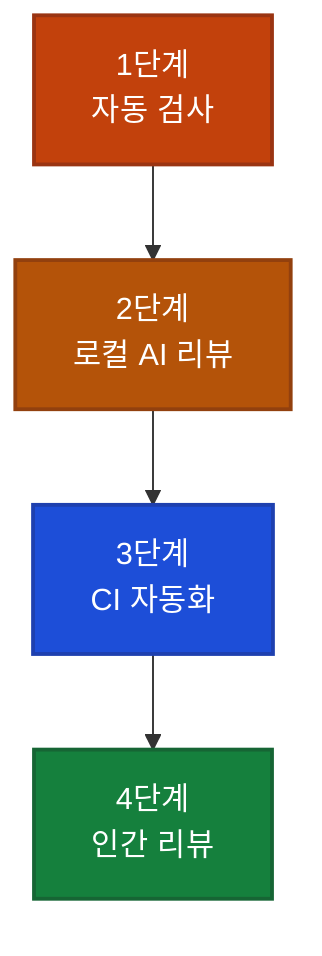

## 이게 뭔가요?

AI가 코드를 대신 써주는 시대가 됐지만, 문제가 하나 있습니다. AI가 만든 코드에는 사람이 짠 코드보다 버그, 보안 구멍, 논리 오류가 더 많다는 연구 결과가 있습니다.

요리사가 음식을 만들어줘도 먹기 전에 맛을 봐야 하듯이, AI가 코드를 짜줘도 배포하기 전에 반드시 검토가 필요합니다. 이 가이드는 Claude Code(AI 코딩 도구)를 활용해 코드 품질을 지키는 **4단계 리뷰 시스템**을 설명합니다.

## 왜 알아야 하나요?

리뷰 없이 AI 코드를 그냥 배포하면:
- SQL 인젝션(해커가 데이터베이스를 조작하는 공격)이 그대로 올라갈 수 있음
- 경쟁 상태(두 작업이 동시에 충돌하는 버그)를 놓칠 수 있음
- 작동은 하지만 너무 복잡해서 나중에 아무도 못 고치는 코드가 쌓임

반대로 이 4단계 시스템을 갖추면, 사람이 일일이 검토하지 않아도 대부분의 문제가 자동으로 걸러집니다.

## 4단계 리뷰 구조



## 어떻게 하나요?

### 1단계: Claude Code Hooks로 자동 검사

Hook(특정 시점에 자동 실행되는 기능)을 설정하면 Claude Code가 작업을 마친 직후 자동으로 코드 검사를 실행합니다. 마치 세탁기가 세탁이 끝나면 자동으로 탈수를 돌리는 것처럼요.

**자동으로 검사할 수 있는 것들:**
- **린팅(Linting)**: 코드 스타일 규칙 위반 확인 (예: 들여쓰기 오류)
- **타입 체크**: 변수 타입이 잘못 쓰였는지 확인
- **보안 스캐닝**: 알려진 보안 취약점 패턴 탐지
- **테스트 실행**: 기존 테스트가 여전히 통과하는지 확인

<div class="example-case">
<strong>예시: Ruby on Rails 프로젝트에 Hook 설정</strong>

Claude Code 설정 파일에 아래처럼 작성하면, Claude가 작업을 마칠 때마다 자동으로 린터(코드 스타일 검사 도구)와 보안 스캐너가 실행됩니다:

```json
{
  "hooks": {
    "PostToolUse": [
      {
        "matcher": "Write|Edit",
        "hooks": [
          {
            "type": "command",
            "command": "bundle exec rubocop --autocorrect && bundle exec brakeman -q"
          }
        ]
      }
    ]
  }
}
```

오류가 발견되면 Claude가 즉시 피드백을 받아 스스로 고칩니다.

</div>

### 2단계: 로컬에서 AI 코드 리뷰

코드를 GitHub에 올리기 전, 내 컴퓨터에서 AI 에이전트에게 검토를 맡깁니다.

**사전에 꼭 할 것 2가지:**
1. 코드를 실제로 직접 실행해보기 (화면이 깨져 있거나 앱이 시작도 안 되는 경우 바로 파악)
2. 변경된 부분(diff)을 눈으로 한 번 훑어보기

**리뷰 도구 선택지:**

| 도구 | 특징 |
|------|------|
| **커스텀 `/review` 커맨드** | 내 프로젝트에 맞게 검토 기준을 직접 설정 가능 |
| **CodeRabbit** | Claude Code CLI에 플러그인으로 설치, 심층 분석 |
| **Anthropic 공식 플러그인** | Claude Code 내 내장 옵션 (기본 제공) |

<div class="example-case">
<strong>예시: review.md 파일로 프로젝트 맞춤 리뷰</strong>

프로젝트 폴더에 `review.md` 파일을 만들고 팀 고유의 검토 기준을 적어두면, AI가 그 기준에 맞춰 코드를 검토합니다:

```markdown
# 코드 리뷰 기준

## 필수 확인
- SQL 쿼리는 반드시 파라미터화(직접 문자열 연결 금지)
- 외부 API 응답은 항상 null 체크
- 사용자 입력값은 저장 전 반드시 검증

## 중요도별 분류
- MUST FIX: 보안 취약점, 데이터 손실 가능성
- MINOR: 코드 개선 제안, 성능 최적화
```

Claude Code에서 실행:
```
/review
```

</div>

**효과적인 리뷰 항목 분류:**

| 분류 | 내용 |
|------|------|
| **반드시 수정 (MUST FIX)** | 보안 취약점, 데이터 손실 가능 버그 |
| **마이너 (MINOR)** | 코드 단순화 제안, 가독성 개선 |

### 3단계: GitHub CI(지속적 통합) 자동 리뷰

코드를 GitHub에 올리는 순간 자동으로 AI 리뷰가 시작됩니다. 이건 마치 건물 입구에 설치된 보안 게이트처럼, 사람이 없어도 항상 작동합니다.

**OpenAI Codex를 GitHub에 연동하면:**
- PR(풀 리퀘스트, 코드 변경 요청)을 올리면 자동으로 Codex가 분석
- 발견된 문제들이 댓글로 표시됨
- `@codex review`라고 댓글을 달면 수동으로도 실행 가능

<div class="example-case">
<strong>실전 케이스: SQL 인젝션 취약점 발견</strong>

개발자가 AI로 작성한 코드에서 실수로 SQL 인젝션(해커가 데이터베이스를 직접 조작할 수 있는 보안 구멍) 취약점이 생겼습니다.

**로컬 AI 리뷰 결과:**
- SQL 인젝션 취약점 발견 ✅
- 경쟁 상태(race condition) 가능성 발견 ✅
- 기타 마이너 이슈 다수 발견 ✅

**CodeRabbit으로 추가 검토:**
- SQL 인젝션 동일하게 발견 ✅
- 데이터베이스 스키마의 nullable 문제 추가 발견 ✅

→ 두 도구를 함께 쓰면 서로 다른 문제를 잡아냅니다.

</div>

### 4단계: 인간 리뷰 (꼭 필요한 경우)

1~3단계를 거치면 대부분의 문제가 이미 걸러집니다. 4단계에서 사람이 직접 봐야 하는 경우:

| 변경 유형 | 인간 리뷰 필요도 |
|-----------|----------------|
| 데이터베이스 구조 변경 | 높음 (필수) |
| 인프라/서버 설정 변경 | 높음 (필수) |
| 문서 수정 | 낮음 (자동화로 충분) |
| 소규모 버그 수정 | 낮음 (자동화로 충분) |

AI는 비즈니스 맥락, 법적 요구사항, 제품 방향 같은 외부 상황을 모릅니다. 중요한 변경일수록 사람의 눈이 필요합니다.

## 주의할 점

**가장 흔한 실수:**
- 테스트만 통과하면 안심하는 것 → 실제로 앱을 실행해서 눈으로 확인하는 습관 필수
- AI 리뷰 결과를 전부 다 고치려는 것 → MUST FIX와 MINOR를 구분하고, 중요한 것부터 처리

**도구 선택에 너무 고민하지 말 것:**
- 완벽한 도구는 없습니다. 어떤 도구든 "AI 코드는 항상 의심하고, 다른 AI에게 한 번 더 검토를 맡긴다"는 프로세스 자체가 핵심입니다.
- 가장 효과 대비 투자가 좋은 건: **GitHub에 자동 리뷰 한 번 설정해두기** — 설정 한 번으로 이후 모든 PR마다 무료로 검토가 됩니다.

## 정리

- AI 생성 코드는 리뷰 없이 배포하면 위험 — 보안 취약점과 버그가 숨어있을 수 있음
- Claude Code hooks → 로컬 AI 리뷰 → GitHub 자동화 → 인간 검토 4단계 순서로 쌓아가면 됨
- 특정 도구보다 **"항상 AI 코드를 의심하고 한 번 더 검토"하는 습관**이 더 중요

---

**참고 영상**: [How I Review AI-Generated Code](https://www.youtube.com/watch?v=As2xy_cSx00) — Owain Lewis (2026-03-27)
