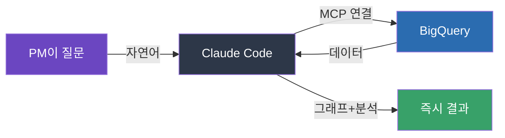

## 이게 뭔가요?

프로덕트 매니저(PM — 제품의 방향을 정하고 관리하는 역할)가 데이터를 보려면, 보통 데이터 사이언스 팀에 요청하고 기다려야 합니다. 직접 하려면 SQL(데이터베이스 질의 언어)을 배워야 하고, 잘 모르는 데이터베이스 구조를 파악해야 하죠.

**BigQuery MCP**를 쓰면 이 과정이 사라집니다.

> 비유: 도서관에서 책을 찾으려면 원래 분류 번호 체계를 알아야 해요. 그런데 사서에게 "마케팅 관련 최신 책 3권 추천해줘"라고 말하면 알아서 찾아주잖아요. BigQuery MCP가 바로 그 **사서 역할**을 해주는 겁니다. Claude Code에게 "다크 모드 사용 비율 보여줘"라고 말하면, 알아서 SQL을 짜고 데이터를 가져와 그래프까지 만들어줘요.

Anthropic의 Lisa Crofoot(제품 관련 기술 직군)가 실제 업무에서 어떻게 활용하는지 보여주는 영상입니다.

## 왜 알아야 하나요?

PM뿐 아니라 **데이터를 다루는 모든 비개발자**에게 해당되는 이야기예요:

- 데이터 분석 요청 → 대기 → 결과 확인 → 추가 요청… 이 반복이 **몇 시간~며칠** 걸림
- SQL을 모르면 데이터 사이언스 팀에 의존할 수밖에 없음
- 간단한 질문 하나에도 다른 팀의 일정에 맞춰야 함

Claude Code + MCP(Model Context Protocol — AI가 외부 도구/데이터에 접근하는 표준 방식)를 쓰면:

- **자연어로 질문** → 자동으로 SQL 작성 → 결과 + 그래프 즉시 생성
- 추가 분석도 대화하듯 바로 요청 가능
- PM이 **독립적으로** 데이터 기반 의사결정 가능

## 어떻게 하나요?

### 1단계: BigQuery MCP 설정

BigQuery(구글 클라우드의 대용량 데이터 분석 서비스)를 Claude Code에 연결하는 과정입니다.

> Anthropic에서는 데이터 사이언스 팀이 이 설정을 해줬어요. 회사에서 쓴다면 데이터 팀에 "BigQuery MCP 설정해달라"고 요청하면 됩니다.

MCP는 Claude Code가 외부 데이터 소스에 접근할 수 있게 해주는 **연결 통로**예요. BigQuery 외에도 다양한 데이터베이스, API에 연결할 수 있습니다.

### 2단계: 자연어로 데이터 분석 요청

설정이 끝나면, Claude Code에서 이렇게 요청하면 됩니다:

<strong>💬 예시: 다크모드 사용 비율 분석</strong>

**입력**: "최근 3개월간 다크 모드 사용 비율 추이를 보여줘. 데이터 테이블은 `product_usage`야"

**Claude Code가 하는 일:**
1. BigQuery에서 해당 테이블 조회
2. SQL 자동 작성 및 실행
3. 7일 이동평균, 전체 평균 등 자동 추가
4. 그래프 생성

> 영상에서 Lisa는 "내가 직접 만들었으면 이보다 못했을 것"이라고 할 정도로, 자동으로 추가한 분석 요소(이동평균 등)가 인상적이었다고 합니다.

<strong>💬 예시: 추가 분석 요청</strong>

**입력**: "플랜 유형별로 나눠서 다시 보여줘"

그러면 Claude Code가 기존 분석을 확장해서 플랜별 비교 그래프를 새로 만들어줍니다. 대화하듯 추가 요청만 하면 돼요.

### 3단계: AI 제품 평가(Eval) 생성

Eval(이밸 — AI 시스템의 품질을 측정하는 테스트 세트)을 만들 때도 Claude Code가 유용합니다.

<strong>💬 예시: 테스트 케이스 확장</strong>

**입력**: "이 AI 기능의 테스트 케이스 예시 2개를 줄게. 이걸 바탕으로 다양한 상황의 테스트 케이스 50개로 확장해줘"

Claude Code가 제품 경험과 상황을 이해하고, 다양한 엣지 케이스(예외 상황)를 포함한 테스트 세트를 만들어줍니다.

## 핵심 포인트 정리

| 전 (기존 방식) | 후 (Claude Code + MCP) |
|---|---|
| 데이터 팀에 요청 후 대기 | 자연어로 직접 분석 |
| SQL 작성 필요 | SQL 몰라도 됨 |
| 그래프 직접 만들기 | 자동 시각화 |
| 추가 분석마다 재요청 | 대화하듯 바로 추가 |
| 수 시간~수 일 소요 | 수 분 내 완료 |

## 이런 분에게 추천해요

- 제품 데이터를 자주 봐야 하는 PM
- SQL 없이 데이터 분석을 하고 싶은 마케터, 기획자
- AI 제품의 eval을 빠르게 만들어야 하는 팀
- 데이터 팀 대기 시간을 줄이고 싶은 모든 비개발 직군

> 💡 **Lisa Crofoot의 한마디**: "자동화 이상이에요. 혼자서는 할 수 없었던 일까지 가능해진 거예요. 제가 할 수 있는 범위 자체가 넓어진 겁니다."
