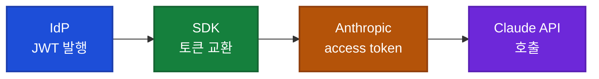

## 이게 뭔가요?

Anthropic이 Claude API(Claude를 프로그램에서 호출하는 통로)에 새로운 인증 방식을 추가했습니다. 이름은 **Workload Identity Federation**(워크로드 아이덴티티 페더레이션, 줄여서 WIF). 한국어로는 "프로그램 신원 연합"쯤 됩니다.

기존 방식은 **API 키**를 썼습니다. `sk-ant-`로 시작하는 긴 문자열 하나를 발급받아서, 모든 서버·코드·CI(자동 배포 시스템)에 심어두는 방식이죠.

비유하자면 이렇습니다.

| 항목 | 기존 API 키 | 새로운 WIF |
|------|-----------|-----------|
| **본질** | 비밀번호가 평생 적힌 종이쪽지 | 매일 발급되는 임시 출입증 |
| **유효 기간** | 사람이 직접 폐기 안 하면 영원 | 최대 24시간, 자동 만료 |
| **유출 시 피해** | 누군가 종이쪽지를 주우면 끝 | 다음날 출입증 무효 |
| **관리 부담** | 여러 서버에 같은 종이쪽지 복사 필요 | 회사 출입 시스템(IdP)이 알아서 발급 |

여기서 **IdP(Identity Provider, 신원 제공자)**는 이미 회사가 쓰고 있는 신원 인증 시스템을 말합니다. AWS, Google Cloud, GitHub Actions, Microsoft Entra ID, Okta 등이 모두 IdP입니다.

WIF는 **"이미 회사 출입증으로 인증된 프로그램이라면, Claude API용 별도 비밀번호 없이도 신원을 인정해주겠다"**는 약속입니다.

## 왜 알아야 하나요?

### 비개발자에게도 중요한 이유

API 키 유출 사고는 정말 흔합니다. 영상에서도 언급하듯, "GitHub에 실수로 커밋해버려서 황급히 폐기한 이야기"는 모든 개발팀에 한 번씩 있는 사건입니다.

회사 내부 사정을 모르는 비개발자도, **"우리 회사가 Claude API를 쓰는데 비밀번호가 평생 유효한 종이쪽지냐, 매일 새로 발급되는 출입증이냐"**의 차이만 알면 됩니다. 후자가 압도적으로 안전합니다.

### DevOps·보안 담당자에게 중요한 이유

- CI(지속적 통합), 컨테이너 이미지, 시크릿 매니저(비밀 정보 저장소)에서 **장기 API 키를 완전히 제거**할 수 있음
- 키 유출 시 영향 범위가 **최대 24시간**으로 제한됨 (자동 만료)
- IdP의 **CEL 식**(Common Expression Language, 조건식)으로 "이 프로젝트의 이 서비스만 호출 가능"식의 세밀한 권한 제어 가능
- 클라우드 IAM(Identity and Access Management, 권한 관리 시스템)과 일체화

### 일본어 영상 화자가 강조한 트레이드오프

> **WIF가 강력한 선택지가 되는 곳**: 엔터프라이즈, 여러 환경에 Claude를 박는 조직.
> **여전히 API 키가 더 편한 곳**: 로컬 개발, 단일 서버 소규모 운용.

회사 규모와 운용 체제에 따라 적재적소 선택하라는 게 영상의 결론입니다.

## 작동 원리 — 3단계 토큰 교환

WIF는 **OAuth 2.0**(권한 위임 표준)과 **RFC 7523의 JWT Bearer Grant**(토큰 기반 인증 규약)를 따릅니다. 흐름은 3단계로 단순합니다.



1. **IdP가 JWT(JSON Web Token, AI에게 보내는 "신원 증명서") 발행**
   - AWS, GCP, GitHub Actions 등이 자동 발급
2. **공식 SDK(Anthropic이 제공하는 개발 도구 모음)가 그 JWT를 Anthropic의 토큰 교환 엔드포인트로 전송**
   - 전송 주소: `POST /v1/oauth/token`
3. **Anthropic이 `sk-ant-oat01-`로 시작하는 단명 access token(접근 토큰) 반환**
   - 이걸 `Authorization: Bearer ...` 헤더로 Claude API 호출 시 사용
   - SDK가 토큰 자동 갱신까지 처리

지원 SDK: Python, TypeScript, Java, Go, Ruby, C#, PHP. 각 SDK에 federation 자격 증명을 다루는 표준 인터페이스가 있으며, 클래스명은 언어별로 다릅니다(예: Python은 `WorkloadIdentityCredentials`, TypeScript는 `oidcFederationProvider`, Go는 `option.WithFederationTokenProvider`).

## Claude 콘솔의 3개 리소스

WIF를 설정하려면 Claude 콘솔에서 3개의 리소스를 만들어야 합니다. 셋의 관계를 글로 풀면 이렇습니다.

### 1. Service Account (`svac_` 프리픽스)

워크스페이스(Workspace, 작업 공간) 단위로 과금·사용량 한도가 묶이는 단위. 사람이 아닌 프로그램의 신원입니다. 한국어로는 "프로그램 사용자 계정".

### 2. Federation Issuer (`fdis_` 프리픽스)

OIDC(OpenID Connect, 신원 확인 표준) IdP를 등록하는 자리. JWKS(JSON Web Key Set, IdP의 공개 키 모음) 소스를 3가지 모드 중 선택:

| 모드 | 설명 | 언제 쓰나 |
|------|------|----------|
| **Discovery** | IdP의 표준 경로(`/.well-known/openid-configuration`)에서 자동 취득 | 대부분 (AWS, GCP, GitHub) |
| **Explicit** | JWKS URL을 직접 지정 | URL 제어가 필요한 경우 |
| **Inline** | JWK 배열을 콘솔에 직접 붙여넣기 | 에어갭(인터넷 차단) 환경 |

### 3. Federation Rule (`fdrl_` 프리픽스)

JWT의 클레임(claim, 토큰 속 정보)을 Service Account에 매핑하는 규칙. 예: "GitHub 저장소 X의 main 브랜치 워크플로우만 Service Account A로 매핑". CEL 식으로 유연한 조건 가능.

```
Service Account (svac_) ← Federation Rule (fdrl_) ← Federation Issuer (fdis_) ← IdP
   (프로그램 신원)             (매핑 규칙)               (IdP 등록)              (실제 신원)
```

## 클라우드별 연동 방식

| 환경 | 핵심 차이 | 권장 방식 |
|------|----------|----------|
| **GCP** | 메타데이터 서버에서 ID 토큰 자동 취득 | `https://accounts.google.com` issuer 1개로 전체 GCP 서비스 커버. sub과 email 둘 다 매칭하면 "삭제 후 재생성 공격" 방어 |
| **AWS** | STS GetCallerIdentity API 권장 | 계정 단위 발행자 URL 사용. EKS는 IRSA(Pod별 IAM 역할) 활용. Anthropic용 audience와 IRSA용 audience를 **분리** |
| **GitHub Actions** | `token.actions.githubusercontent.com`에서 OIDC 토큰 발행 | CI 시크릿에서 `ANTHROPIC_API_KEY` 완전 제거 |
| **Kubernetes (자체 운영)** | 클러스터 내부 OIDC URL 사용 | Inline JWKS 모드로 등록 (외부 도메인 차단 환경 대응) |
| **Okta / Microsoft Entra ID** | 표준 OIDC | Discovery 모드로 등록 |

## JWT 검증의 깐깐한 규칙

영상에서 짚은 디테일입니다. 보안 담당자라면 반드시 알아야 합니다.

- **허용 서명 알고리즘**: RS256, RS384, PS256, PS384, ES256, ES384
- **거부**: HS256(공유 비밀키 방식), `none`(서명 없음)
- **JWT 최대 크기**: 16KB
- **시각 클레임**(`exp`, `nbf`, `iat`) 허용 오차: 30초
- **URL 제약**: HTTPS:443 + 공용 DNS만 허용. IP 직접 입력 불가

## Access Token 수명 계산

```
실제 access token 수명 = min(
  Federation Rule에 설정한 값,
  IdP가 발급한 JWT 수명의 2배
)
```

- 최소: 60초
- 최대: 86,400초 (24시간)

## 함정·팁

영상에서 화자가 강조한 운영 노하우입니다.

<div class="example-case">
<strong>함정 1: ANTHROPIC_API_KEY 환경 변수가 빈 문자열이면 API 키 경로가 선택됨</strong>

WIF로 이전할 때 환경 변수를 빈 문자열로 두면 SDK가 "API 키 인증을 시도하다 실패"합니다. WIF 경로로 가지 않습니다.

해결: 완전히 `unset`(삭제)해야 함. 빈 문자열도 안 됨.

확인 명령:
```
ant auth status
```
이 명령(Anthropic 공식 CLI인 `ant`의 서브커맨드)으로 현재 어떤 인증 경로가 선택되었는지 즉시 확인 가능.
</div>

<div class="example-case">
<strong>함정 2: 400 invalid_grant 에러는 콘솔에서만 진단 가능</strong>

WIF 인증 실패 시 Anthropic은 보안상 이유로 자세한 에러를 반환하지 않습니다. "왜 실패했는가"(issuer 불일치인지, 서명 검증 실패인지, 클레임 불일치인지)는 코드 로그에서 알 수 없음.

해결: Claude 콘솔의 **Auth History**(인증 이력) 화면을 열어서 거기서만 확인 가능.
</div>

### 추가 팁

- **OAuth scope 제한**: 현재는 `workspace:developer` 1종만. 읽기 전용·관리자(Admin) scope는 아직 미제공.
- **자격 증명 우선순위(5단계)**: ① 생성자 인자(코드에서 직접 주입) → ② `ANTHROPIC_API_KEY` / `ANTHROPIC_AUTH_TOKEN` 환경 변수 → ③ `ANTHROPIC_PROFILE` 환경 변수 → ④ Federation 환경 변수(`ANTHROPIC_FEDERATION_RULE_ID` 등) → ⑤ Active profile.
- **프로파일 파일**: 컨테이너 이미지에 베이크하면 멀티 환경 공통 이미지로 출하 가능.

## 실전 예시

<div class="example-case">
<strong>실전 케이스: GitHub Actions에서 Claude API 호출</strong>

**기존 방식 (API 키):**
1. Anthropic 콘솔에서 `sk-ant-...` 키 발급
2. GitHub 저장소 Settings → Secrets에 `ANTHROPIC_API_KEY`로 등록
3. 워크플로우에서 `${{ secrets.ANTHROPIC_API_KEY }}` 사용
4. 키 회전 시: 콘솔에서 새 키 발급 → 모든 저장소의 secret 갱신 → 잊은 곳에서 사고 발생

**WIF 방식:**
1. Anthropic 콘솔에 Federation Issuer 등록
   - URL: `https://token.actions.githubusercontent.com`
   - JWKS Source: Discovery
2. Federation Rule 등록
   - 조건: `repo == "myorg/myrepo" && ref == "refs/heads/main"`
   - 매핑 대상: Service Account `svac_프로젝트A`
3. GitHub Actions 워크플로우 YAML에 `permissions: id-token: write` 추가
4. 워크플로우에서 OIDC 토큰을 받아 Anthropic SDK에 전달
5. **API 키는 어디에도 없음**. 키 회전 작업 자체가 사라짐.
</div>

<div class="example-case">
<strong>실전 케이스: 자체 Kubernetes 클러스터(에어갭 환경)에서 Claude API 호출</strong>

상황: 보안 정책상 외부 도메인 접근이 제한되는 사내 Kubernetes 클러스터. AWS·GCP가 아닌 자체 운영.

해결:
1. 클러스터의 OIDC URL을 확인 (`kubectl get --raw /.well-known/openid-configuration`)
2. JWKS도 직접 추출 (`kubectl get --raw /openid/v1/jwks`)
3. Anthropic 콘솔의 Federation Issuer에 **Inline JWKS 모드**로 직접 붙여넣기
4. Pod에 ServiceAccount Token Volume Projection 설정
5. SDK가 자동으로 token을 읽어 Anthropic에 교환 요청

이 방식의 장점: 외부 IdP 없이도 사내 클러스터의 신원만으로 Claude API 호출 가능.
</div>

## 주의할 점

- **소규모는 오히려 API 키가 편함**: 로컬 개발이나 단일 서버 운용은 WIF 설정 비용이 더 큼.
- **상위 키가 남으면 진짜 키리스가 아님**: IdP에 도달하기 위한 장기 자격 증명이 위쪽 어딘가에 남아 있으면 결국 그게 새로운 약점이 됨. Anthropic도 "Defense in Depth"(다층 방어) 사고를 강조.
- **OpenAI 직접 API는 여전히 API 키만 지원**(2026년 5월 기준). 멀티 LLM 환경에서는 OpenAI 쪽 키 관리는 별도 필요.
- **2026년 5월 시점 정보**: 사양 변경 가능. 실제 도입 시 Anthropic 공식 문서 최신판 확인 필수.
- **조직 보안 정책 준수**: SCOPE 제한, audience 분리 등은 내부 보안 정책 검토 후 적용.

## 정리

- **비개발자 한 줄 요약**: API 키 = "비밀번호가 평생 적힌 종이쪽지", WIF = "매일 발급되는 임시 출입증". 후자가 압도적으로 안전.
- **DevOps 한 줄 요약**: AWS·GCP·GitHub·Kubernetes의 OIDC 토큰을 Anthropic이 직접 신뢰. CI·컨테이너의 장기 API 키 제거 가능.
- **선택 기준**: 엔터프라이즈·다중 환경은 WIF로, 개인·단일 서버 소규모는 API 키 유지가 현실적.

---

참고 영상: [【神アプデ】Claude APIがWorkload Identity Federationに対応！もうAPIキー不要](https://youtube.com/watch?v=kaYAmwPvMnw)
