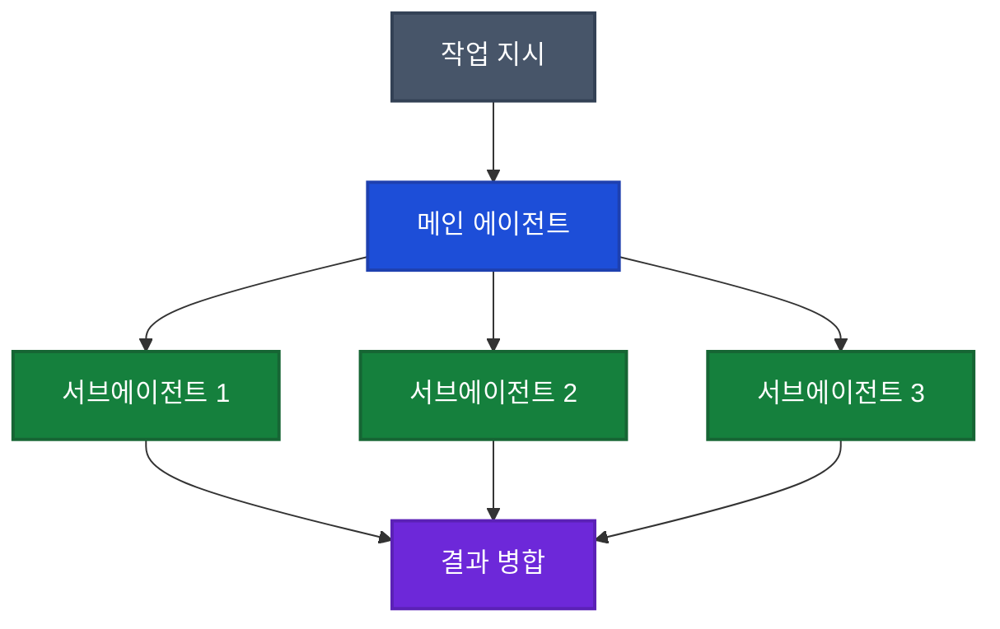
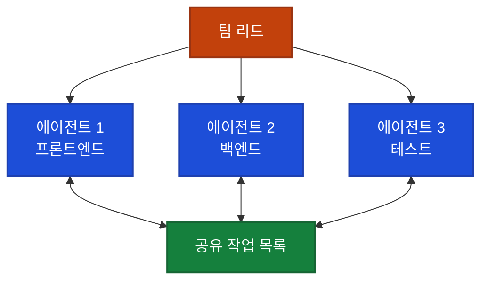

## 이게 뭔가요?

Claude Code를 하나의 대화창에서만 사용하고 계신가요? 그건 마치 직원 5명을 뽑아놓고 한 명만 일시키는 것과 같습니다.

Claude Code에는 **5가지 작업 패턴**이 있습니다. 혼자 순서대로 일하는 방식부터, 여러 명이 동시에 협업하는 방식, 심지어 내가 자리를 비워도 알아서 일하는 방식까지. 이 영상은 각 패턴이 **언제 적합한지**, **어떤 한계가 있는지**를 체계적으로 정리합니다.

> 비유: 레스토랑으로 치면 — 혼자서 주문받고 요리하고 서빙하는 1인 식당(패턴 1)부터, 주방장·서빙·홀매니저가 역할을 나눠 돌아가는 팀 레스토랑(패턴 4), 새벽에 자동으로 반죽을 준비해두는 예약 시스템(패턴 5)까지 있는 셈입니다.

## 왜 알아야 하나요?

- **시간 절약**: 독립적인 작업 3개를 순서대로 하면 3배 시간이 걸리지만, 동시에 돌리면 1배면 끝남
- **컨텍스트 관리**: 하나의 대화에 모든 걸 넣으면 Claude가 앞의 내용을 잊기 시작함 (컨텍스트 로트)
- **자동화**: 매일 반복하는 작업을 사람 없이 돌릴 수 있음

## 먼저 알아둘 것: 내장 서브에이전트

Claude Code는 사용자가 따로 지시하지 않아도 **이미 3가지 서브에이전트(보조 일꾼)**를 자동으로 활용하고 있습니다.

| 서브에이전트 | 역할 | 할 수 있는 일 | 사용 모델 |
|-------------|------|-------------|----------|
| **Explore** | 정찰병 | 파일 읽기, 폴더 구조 탐색 (읽기 전용) | Haiku (가장 빠르고 저렴) |
| **Plan** | 전략가 | 코드베이스 조사 후 전략 제시 (읽기 전용) | Plan 모드에서 자동 활성화 |
| **General Purpose** | 실무자 | 파일 읽기 + 쓰기, 복잡한 작업 처리 | 메인 대화와 동일 모델 |

> 비유: 여러분이 "이 프로젝트 인증 구조 어떻게 되어 있어?"라고 물으면, Claude는 뒤에서 Explore 에이전트를 조용히 보내서 파일을 살펴보게 합니다. 메인 대화창이 파일 내용으로 가득 차는 대신, 요약된 결과만 돌아옵니다.

터미널(키보드로 명령어를 입력하는 화면)에서 작업 중에 `explore tool`이라고 뜨는 걸 본 적 있다면, 바로 이 서브에이전트가 작동한 것입니다.

## 어떻게 하나요?

### 패턴 1: 순차 흐름 (Sequential Flow) [00:00~02:44]

가장 기본적인 방식입니다. 하나의 대화창에서 작업을 하나씩 순서대로 진행합니다.

```
나 → "랜딩페이지 만들어줘" → Claude가 완성
나 → "히어로 이미지 추가해줘" → Claude가 완성
나 → "문의 폼 넣어줘" → Claude가 완성
```

**장점**: 이전 작업의 맥락을 기억하고 있어서 자연스럽게 이어짐

**한계**: 대화가 길어질수록 Claude가 앞 내용을 잊기 시작함 — 이걸 **컨텍스트 로트(context rot)**라고 부릅니다. 터미널 하단의 초록색 바가 차면 한계에 가까워진 것입니다.

**대응법**:
- `/clear` 명령어로 대화를 정리하거나
- `/compact` 명령어로 대화 요약본을 만들어서 컨텍스트를 확보
- `CLAUDE.md`(프로젝트 설정 파일)와 스킬(자동화된 작업 명령)을 잘 구성해두면 필요한 정보를 그때그때 불러올 수 있음

<div class="example-case">
<strong>예시: 순차 흐름이 적합한 경우</strong>

블로그 포스트를 작성하면서 점점 다듬어가는 작업. "초안 써줘" → "톤을 좀 더 캐주얼하게" → "SEO 키워드 넣어줘" → "최종 검토해줘". 각 단계가 이전 결과에 의존하므로 하나의 대화에서 이어가는 게 자연스럽습니다.

</div>

### 패턴 2: 오퍼레이터 (The Operator) [02:44~07:34]

여러 터미널 창을 열어서, 각각에 **서로 독립적인 작업**을 맡기는 방식입니다. 여러분이 직접 감독관 역할을 합니다.

```
터미널 1: "온보딩 화면 만들어줘"
터미널 2: "결제 버그 고쳐줘"
터미널 3: "설정 페이지 디자인 바꿔줘"
```

**핵심 명령어**: `claude -w` (워크트리 모드)

```bash
claude -w "새 온보딩 플로우 구현"
claude -w "결제 버그 수정"
claude -w "사용자 설정 리디자인"
```

`-w` 플래그를 붙이면 Claude가 **워크트리(Work Tree)**라는 것을 만듭니다. 워크트리란 프로젝트의 **별도 복사본**으로, 각자 독립된 브랜치(가지)를 가집니다.

> 비유: 원본 문서를 복사해서 3부 만든 뒤, 각각 다른 사람에게 주고 "너는 1장 수정, 너는 3장 수정, 너는 5장 수정"이라고 시키는 것. 서로의 작업이 섞이지 않습니다.

**워크트리 정리**: 세션을 닫으면 Claude가 자동으로 처리합니다.
- 변경사항이 없으면 → 자동 삭제
- 변경사항이 있으면 → "어떻게 할까요?" 물어봄

<div class="example-case">
<strong>예시: 오퍼레이터가 적합한 경우</strong>

SaaS 앱을 만들고 있는데, 온보딩 플로우 제작 / 결제 버그 수정 / 설정 페이지 리디자인을 동시에 진행하고 싶을 때. 세 작업이 서로 코드를 공유하지 않으므로 각각 독립적으로 진행 가능합니다. 4~5개 터미널이 관리의 한계점입니다.

</div>

### 패턴 3: 분할 & 병합 (Split & Merge) [07:34~11:50]

하나의 대화창 안에서 Claude가 **알아서 여러 서브에이전트를 동시에 보내고**, 결과를 합쳐서 돌려주는 방식입니다.



**동시 실행**: 서브에이전트 수에 하드 리밋(고정 상한)은 없지만, 실용적으로는 **3~5개**가 권장됩니다. 너무 많으면 토큰 비용과 조율 부담이 급증합니다.

**핵심 제약**: 서브에이전트끼리는 서로 대화할 수 없습니다. 모든 정보는 메인 에이전트를 거쳐야 합니다 (허브 앤 스포크 구조).

> 비유: 사장님이 직원 5명에게 각자 경쟁사 조사를 시키고, 결과를 모아서 보고서를 만드는 것. 직원들끼리는 서로 뭘 조사하는지 모릅니다.

**빌더-검증자 체인**: 서브에이전트 하나가 코드를 작성하면, 다른 서브에이전트가 그걸 검토하는 흐름도 가능합니다. 단, 메인 에이전트를 거쳐 전달되어야 합니다.

또한 `.claude/agents/` 폴더에 **커스텀 서브에이전트**를 만들 수도 있습니다. 이름과 설명(description)을 잘 적어두면, Claude가 작업에 맞는 에이전트를 자동으로 선택해서 사용합니다.

<div class="example-case">
<strong>예시: 분할 & 병합이 적합한 경우</strong>

"경쟁사 5곳 분석해서 제안서 만들어줘"라고 하면, Claude가 서브에이전트 5개를 동시에 띄워 각각 한 회사씩 조사합니다. 순차 흐름으로 하면 5배 걸릴 작업이 병렬로 빠르게 끝납니다.

</div>

### 패턴 4: 에이전트 팀 (Agent Teams) [11:50~14:22]

서브에이전트끼리 **직접 소통**할 수 있는 가장 고급 패턴입니다. 공유 작업 목록을 통해 서로의 진행 상황을 파악하고, 메시지를 주고받습니다.



**현재 상태**: Opus 4.6과 함께 **연구 프리뷰(실험 기능)**로 출시. 아직 정식 기능이 아닙니다.

**활성화 방법**: `settings.json`에 아래 설정 추가 필요:

```json
{
  "env": {
    "CLAUDE_CODE_EXPERIMENTAL_AGENT_TEAMS": "1"
  }
}
```

**사용법**:
- 프롬프트에서 "에이전트 팀을 사용해줘"라고 명시적으로 요청 (서브에이전트와 달리 자동 선택되지 않음)
- 팀 구조를 직접 설명하거나 Claude가 결정하게 할 수 있음
- 터미널에서 `Shift+↓`로 팀원 간 순환 전환 (마지막 팀원 이후 팀 리드로 돌아감)
- 팀 리드를 거치지 않고 특정 팀원에게 직접 메시지 가능

**비용 주의**: 토큰 사용량은 팀 크기에 대략 비례합니다 (3명이면 ~3~4배, 5명이면 ~5~7배). Plan 모드에서는 약 **7배**까지 올라갈 수 있습니다. 에이전트들 간 공유 작업 목록 동기화, 팀 리드와의 소통 등에 토큰이 많이 소모됩니다.

<div class="example-case">
<strong>예시: 에이전트 팀이 적합한 경우</strong>

복잡한 SaaS 앱에서 프론트엔드 개발자, 백엔드 개발자, 테스트 개발자가 서로 소통하며 동시에 작업해야 할 때. 프론트엔드가 API 형식을 백엔드에 물어보고, 테스트가 양쪽 코드를 확인해야 하는 상황에서 유용합니다.

</div>

### 패턴 5: 헤드리스 (Headless) [14:22~17:49]

사람이 자리를 비워도 Claude가 **혼자서 작업을 완료**하는 방식입니다. 터미널 창도 필요 없고, 대화도 없습니다.

**핵심 명령어**: `claude -p` (프롬프트 모드)

```bash
claude -p "어제 커밋 내용을 분석해서 morning-report.md로 요약해줘"
```

`-p` 플래그는 "이 프롬프트를 처리하고 결과만 돌려줘"라는 뜻입니다. 대화 없이 비대화형으로 실행되지만, 도구 권한 설정(`--allowed-tools` 또는 `--permission-mode`)을 함께 지정해야 자동 실행이 원활합니다.

**자동 스케줄링과 결합하면 진가 발휘**:

```bash
# Mac/Linux: 매일 오전 7시에 자동 실행 (cron 설정)
0 7 * * * claude -p "어제 작업 요약해서 morning-report.md에 저장해줘"
```

> 비유: 빵집의 자동 반죽 기계를 새벽 4시에 예약 걸어두는 것. 주인이 출근하면 반죽이 이미 준비되어 있습니다.

**안전장치**: 특정 도구만 허용하려면 `--allowed-tools` 옵션 사용

```bash
# 읽기만 허용, 파일 수정은 금지
claude -p "코드 분석해줘" --allowed-tools Read,Grep,Glob
```

<div class="example-case">
<strong>예시: 헤드리스가 적합한 경우</strong>

매일 아침 전날의 작업 기록을 자동 요약하거나, 유튜브 영상 스크립트를 자동으로 소셜미디어 포스트로 변환하는 등 **결과물 검증이 쉬운 반복 작업**에 적합합니다. 되돌리기 어려운 작업(코드 배포 등)에는 아직 권장하지 않습니다.

</div>

## 5가지 패턴 한눈에 비교

| 패턴 | 내가 해야 할 일 | 병렬 처리 | 에이전트 간 소통 | 토큰 사용량 | 적합한 상황 |
|------|---------------|----------|----------------|-----------|-----------|
| **순차 흐름** | 직접 대화 | ❌ | - | 낮음 | 이전 작업에 이어서 하는 작업 |
| **오퍼레이터** | 여러 창 감독 | ✅ (수동) | ❌ | 보통 | 독립적인 작업 3~5개 |
| **분할&병합** | 지시만 | ✅ (자동) | ❌ (메인 경유) | 보통 | 같은 종류 작업 여러 개 |
| **에이전트 팀** | 지시만 | ✅ (자동) | ✅ (공유 목록) | 높음 (팀 크기 비례) | 협업 필요한 복잡한 프로젝트 |
| **헤드리스** | 없음 | ✅ (자동) | - | 보통 | 반복 작업, 자동화 |

## 주의할 점

- **에이전트 팀은 실험 기능**: 아직 연구 프리뷰 단계이므로 중요한 작업에 바로 투입하기보다 테스트 용도로 먼저 시도
- **토큰 비용 관리**: 에이전트 팀은 팀 크기에 비례하여 토큰을 사용하므로 (3명=~3배, Plan 모드=~7배), 서브에이전트로 충분한 작업에는 과한 선택
- **헤드리스 신뢰 문제**: 자동 실행이므로 결과를 쉽게 확인할 수 있는 작업에만 적용 (되돌리기 어려운 작업은 피할 것)
- **컨텍스트 로트**: 순차 흐름에서 대화가 길어지면 `/clear`나 `/compact`로 정리

## 정리

- Claude Code는 이미 내장 서브에이전트(Explore, Plan, General Purpose)를 자동으로 활용하고 있다
- 독립적인 작업은 `claude -w`로 워크트리를 만들어 병렬 처리, 같은 종류 반복 작업은 분할&병합으로 자동 처리
- 반복 자동화는 `claude -p`로 헤드리스 실행, 복잡한 협업이 필요할 때만 에이전트 팀 사용

---

> **출처**: [Every Claude Code Workflow Explained (& When to Use Each)](https://youtube.com/watch?v=38t5UBCa4OI) — Simon Scrapes (2026.04.07)
