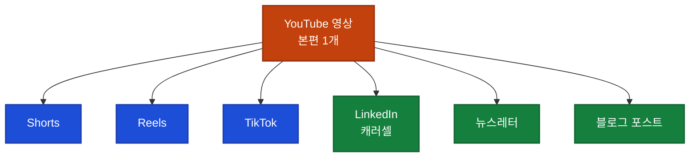

## 이게 뭔가요?

혼자 일하는 솔로프리너(1인 창업자)나 소상공인에게 "콘텐츠 마케팅"은 늘 부담입니다. 영상 1개 찍고, 숏폼으로 자르고, 인스타 릴스도 만들고, 링크드인 캐러셀도 올리고, 뉴스레터까지 써야 하는데 혼자서는 물리적으로 불가능합니다.

이 영상은 Claude Code(터미널에서 쓰는 Anthropic의 코딩 에이전트)와 Apify(웹사이트에서 데이터를 긁어오는 서비스)를 엮어, **콘텐츠 허브(한 곳에서 모든 콘텐츠를 관리하는 대시보드)** 를 직접 만드는 과정을 보여줍니다.

**일상 비유**: 빵집 1호점만 운영하던 사장님이 중앙 주방 하나를 만들고, 그 주방에서 나온 반죽을 지점 5곳에 배송하는 구조입니다. 영상 1개를 "중앙 반죽"으로 보고, 여러 채널에 맞게 모양만 바꿔 굽는 셈이죠.

> 이 영상은 자막이 제공되지 않아 제작자 설명(영상 설명란 텍스트)을 기반으로 정리했습니다. 구체적 수치나 코드는 원본에서 확인이 어려워 생략하고, **프레임워크·개념 위주**로 다룹니다.

## 왜 알아야 하나요?

YMYD처럼 약국 B2B 서비스를 하는 팀이든, 1인 코치·컨설턴트든, "한 번 만든 콘텐츠를 여러 채널에 쓰고 싶다"는 욕구는 동일합니다. 하지만 대부분 다음 문제에 걸립니다.

- 매주 아이디어가 바닥난다
- 채널마다 포맷을 새로 맞추는 시간이 다 소모된다
- 경쟁사 바이럴 콘텐츠는 뭐가 뜨는지 모른다
- Claude에게 "알아서 만들어줘" 해버리면 브랜드 톤이 엉망이 된다

이 영상은 위 문제를 설계 단계에서 차단하는 **사전 문서화·승인 모드·수집 자동화** 3가지 원칙을 제시합니다.

## 어떻게 하나요?

### 원칙 1: 코드 작성 전 브랜드 요구사항 문서 먼저

영상의 첫 번째 비법은 **"코드 한 줄 쓰기 전에 브랜드 요구사항 문서(Brand Requirements Document)를 먼저 작성한다"** 입니다. Claude가 "내가 원하는 것"이 아니라 "해달라는 대로"만 만들지 않게 하려면, 브랜드 톤·타깃 고객·금지 단어·색상·어투를 문서로 명시해두어야 합니다.

<div class="example-case">
<strong>예시: 브랜드 요구사항 문서에 들어갈 항목</strong>

- 누구에게 말하는가 (타깃 고객의 직업·상황·고민)
- 어떤 단어를 쓰고, 어떤 단어는 금지하는가
- 헤드라인 톤 (단정적 vs 친근 vs 전문)
- 금기 사항 (예: 자랑 포스트 금지, 단독 수치 금지)
- 브랜드가 대변하는 가치 한 줄

이 문서를 `CLAUDE.md`(프로젝트 루트에 두는 Claude용 규칙 파일)로 저장하면 세션마다 자동 참조됩니다.

</div>

### 원칙 2: 95% 신뢰 규칙 (95% Confidence Rule)

Claude Code가 "애매하면 일단 만들어버리는" 습관을 막기 위해, **"95% 확신이 없으면 명확화 질문을 먼저 던져라"** 는 규칙을 `CLAUDE.md`에 강제합니다.

`CLAUDE.md`에 넣을 규칙 예시:

```
작업 지시를 받으면 먼저 의도·제약·산출물을 95% 이해했는지 자문한다.
불확실한 점이 있으면 반드시 질문으로 확인한 뒤에만 구현을 시작한다.
추측으로 기본값을 선택하지 않는다.
```

비개발자에게 특히 유용합니다. 엉뚱한 결과물이 나와서 다시 지시하는 왕복 시간이 줄어듭니다.

### 원칙 3: Plan Mode로 빌드 전 승인

Plan Mode(계획 모드, Claude Code에서 `shift+tab`으로 전환)는 **실제 파일 수정 없이 계획서만 먼저 보여주는 기능**입니다. 승인 전까지 코드가 한 줄도 건드려지지 않습니다.

**일상 비유**: 리모델링 공사를 맡길 때, 벽을 뚫기 전에 도면부터 보여달라고 요구하는 것과 같습니다.

## 실전 예시: 콘텐츠 허브 구조

<div class="example-case">
<strong>실전 케이스: 매주 금요일 오전 자동 수집 → 허브 집결</strong>

영상에서 소개한 콘텐츠 허브 대시보드의 흐름입니다.

1. **금요일 오전**: Apify가 경쟁사 상위 바이럴 포스트를 TikTok·Instagram·LinkedIn·YouTube에서 긁어옴.
2. **허브 대시보드**: 수집된 포스트를 Claude가 분류·요약. "이번 주 내 분야에서 뭐가 떴는지" 한 화면에 정리.
3. **Sabrina Ramanov의 바이럴 훅 프레임워크**: 수집된 훅(콘텐츠 첫 3초의 시선 끌기 문장)을 프레임워크에 맞춰 분석 — 어떤 훅 유형이 이번 주 먹혔는지 판단.
4. **아이디어 생성**: 경쟁사 훅 패턴을 내 브랜드 톤에 맞게 변형한 초안을 Claude가 제안.

혼자 매주 트렌드 리서치에 하루를 쓰던 일을 30분 검토로 줄이는 구조입니다.

</div>

### 1→7 리퍼포지싱 파이프라인

영상 1개(YouTube)를 시작점으로, 다음 7개 채널용 콘텐츠로 자동 확장합니다.



각 채널마다 길이·포맷·CTA(Call To Action, 행동 유도 문구)가 달라지므로 Claude에게 "이 채널은 이런 톤으로 줄여줘" 식 프롬프트(AI에게 보내는 요청 메시지)를 미리 정해두면 매번 지시할 필요가 없습니다.

### 월간 활성화 계획

영상 제작자는 매월 다음을 기본 골격으로 잡습니다.

| 항목 | 개수 | 목적 |
|---|---|---|
| 리드 마그넷(lead magnet, 이메일 교환용 무료 자료) | 2개 | 이메일 리스트 확보 |
| 웨비나(webinar, 온라인 세미나) | 1개 | 고가 상품 설득 |
| 팟캐스트·스피킹 게스트 출연 | 꾸준히 | 새 오디언스 도달 |

### 저장·발송 자동화 흐름

```
Google Drive(원본 저장)
      ↓
Email(초안·승인 요청)
      ↓
Final Format(채널별 완성 포맷)
```

이 흐름은 각 단계에서 사람 검토를 거치므로, "AI가 멋대로 발행하는" 사고를 막습니다.

## 주의할 점

- **AI가 만든 초안을 그대로 발행하지 말 것**: 콘텐츠 허브는 "아이디어·초안 생성기"이지 "최종 발행자"가 아닙니다. 브랜드 리스크(엉터리 정보, 과장 표현, 법적 문제)는 사람이 막습니다.
- **경쟁사 바이럴 포스트 무단 복제 금지**: Apify로 긁어온 포스트는 "이번 주 뭐가 먹혔나" 분석용이지, 복붙용이 아닙니다. 저작권·상표권·플랫폼 정책 위반 가능성이 있습니다.
- **영상의 수치는 제작자 개인 경험**: "효율이 몇 배 올랐다" 같은 주장은 영상에서 구체 수치 제시 없이 일반적 홍보 문구로 서술됩니다. 본인 비즈니스에 적용하면 결과는 달라질 수 있습니다.
- **B2C 콘텐츠 마케팅 초점**: 이 시스템은 솔로프리너·코치·컨설턴트 같은 **B2C/D2C 개인 브랜드**에 맞게 설계되었습니다. B2B GTM(Go-to-Market, 신규 시장 진입) 자동화는 별도로 `claude-code-gtm-automation.md` 문서를 참고하세요. 타깃·판매 주기·톤이 다릅니다.

## 정리

- 코드 쓰기 전 브랜드 요구사항 문서와 95% 신뢰 규칙을 `CLAUDE.md`에 먼저 심으세요.
- 콘텐츠 허브는 매주 경쟁사 바이럴 수집 + 1→7 리퍼포지싱을 묶은 "중앙 주방" 구조입니다.
- Plan Mode·사람 검토를 끼워 AI가 멋대로 발행하는 일을 막는 것이 안전 장치입니다.

---

**참고 영상**: [I Built a FULLY AUTOMATED Content Marketing System with Claude Code (Small Business AI Coach)](https://youtube.com/watch?v=DAlO_-3wOUw)
