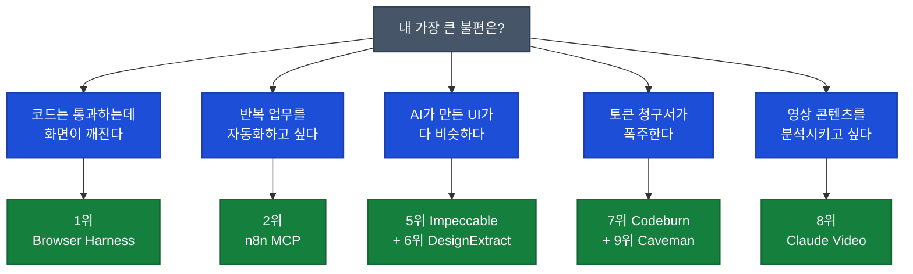

## 이게 뭔가요?

GitHub(개발자들이 코드를 공유하는 사이트)에는 매주 "Claude Code(Anthropic의 코딩 보조 AI)에 붙여 쓰는 오픈소스 도구"가 쏟아집니다. 문제는 대부분 한 번 설치하고 끝난다는 점입니다. 화려해 보여도 실제 작업에는 안 쓰게 되는 것이죠.

이 영상은 그 홍수 속에서 **2026년 5월 기준 진짜 작업 흐름을 바꿀 가능성이 있는 도구 10개**만 골라낸 큐레이션입니다. 평가 기준이 명확합니다.

1. Claude Code 작업 방식을 실제로 바꾸는가
2. 설치 후 바로 체감할 수 있는가
3. 자동화·디자인·브라우저·비용 관리처럼 반복 업무에 붙일 수 있는가
4. 그냥 장난감이 아니라 영상 콘텐츠로도 다시 쓸 수 있는가

**일상 비유**: 마치 새로 나온 주방 가전 100개 중에서 "한 번 사면 매일 쓸 만한 것" 10개만 추려준 가전 잡지 같습니다. 디자인이 예뻐서가 아니라 **매일 식탁 풍경이 바뀌는가**가 기준이죠.

## 왜 알아야 하나요?

Claude Code를 쓰는 한국 사용자(개발자·세미 개발자·1인 사업자)에게 도구 선택은 곧 시간과 비용 문제입니다.

- 화면 깨짐을 손으로 잡고 있다면 → 1번(브라우저 하네스)이 그 시간을 줄입니다
- 토큰 청구서가 폭주한다면 → 7번(코드번)이 어디서 새는지 보여줍니다
- AI가 만든 UI가 매번 비슷해 보인다면 → 5번(임팩커블)이 그 "AI 냄새"를 잡아줍니다

**아무 도구나 다 깔지 말고, 본인 워크플로우에서 가장 아픈 부분 1~2개에만 도구를 붙이는 것**이 영상의 핵심 권장입니다.

## TOP 10 한눈에 보기

| 순위 | 도구 | 한 줄 효과 | 그룹 |
|---|---|---|---|
| 1 | Browser Harness | 코드 통과/화면 깨짐 갭 메우기 | 능력 확장 |
| 2 | n8n MCP Server | 자연어로 자동화 워크플로우 초안 | 능력 확장 |
| 3 | OpenDesign | 코딩 에이전트를 디자인 엔진으로 | 능력 확장 |
| 4 | Graphify | 코드베이스를 지식 그래프로 | 품질·비용 관리 |
| 5 | Impeccable | "AI 냄새 나는 UI" 후처리 | 품질·비용 관리 |
| 6 | DesignExtract | 좋은 사이트의 디자인 시스템 추출 | 품질·비용 관리 |
| 7 | Codeburn | 토큰·비용 터미널 가계부 | 품질·비용 관리 |
| 8 | Claude Video | 영상 분석 능력 부착 | 특수 목적 |
| 9 | Caveman 계열 | 답변을 압축해 출력 토큰 절감 | 특수 목적 |
| 10 | CareerOps | 구직·이력서 자동화 | 특수 목적 |

> 이름·철자가 정확하지 않을 수 있는 항목은 GitHub에서 정확한 이름으로 검색하세요. 한글 발음 표기와 실제 영문 레포명이 다를 수 있습니다.

## 그룹 1: 능력 확장 (1~3위)

Claude Code가 원래 못 하던 영역을 새로 열어주는 도구들입니다.

### 1위. Browser Harness — 코드 통과/화면 깨짐 갭 메우기

Claude Code가 실제 Chrome 브라우저를 다루게 만드는 하네스(harness, 도구를 안전하게 묶어 쓰는 틀)입니다. 핵심은 "브라우저를 본다"가 아니라 **코딩 에이전트가 웹사이트를 열고, 클릭하고, 로그인 이후 화면까지 직접 확인**하는 방향으로 확장된다는 점입니다.

웹 자동화나 QA(Quality Assurance, 품질 검사) 테스트를 해 본 사람은 차이를 바로 압니다. 코드 테스트는 통과했는데 실제 화면은 깨지는 일이 흔합니다. Browser Harness는 그 마지막 확인 구간을 Claude Code 작업 안으로 끌어옵니다.

한 문장으로 말하면 **Claude Code를 코드 작성 도구에서 웹 작업 에이전트로 확장**시키는 도구입니다.

### 2위. n8n MCP Server — 자연어로 자동화 워크플로우 초안

n8n(엔에이트엔, 사람이 노드를 연결해 자동화 워크플로우를 만드는 도구)에 MCP(Model Context Protocol, Claude와 외부 도구를 잇는 표준) 서버가 붙은 형태입니다. 원래는 사람이 노드를 하나씩 끌어다 연결해야 했는데, MCP 서버가 붙으면 Claude Code가 워크플로우 자체를 만들고 수정하는 쪽으로 갑니다.

<strong>예시: 자연어 한 줄로 자동화 초안</strong>

이렇게 말할 수 있습니다.

> "Gmail 첨부 파일을 받아서 드라이브에 저장하고 슬랙으로 알려주는 자동화 만들어줘."

예전에는 사람이 노드를 하나씩 연결했습니다. 이제는 자연어 설명이 워크플로우 초안으로 바뀝니다.

**주의할 점은 보안입니다.** 자동화 도구는 이메일·문서·내부 시스템 권한을 만질 수 있습니다. 셀프 호스팅(자기 서버에 직접 올려 쓰는 방식)이라면 업데이트와 접근 제어를 반드시 챙겨야 합니다.

한 문장 평가: **업무 자동화와 AI 에이전트를 연결하는 가장 실용적인 다리.**

### 3위. OpenDesign — 코딩 에이전트를 디자인 엔진으로

Claude Design(Anthropic의 디자인 생성 기능)의 오픈소스 대안에 가까운 프로젝트입니다. 핵심은 Claude Code·Codex·Cursor 같은 코딩 에이전트를 **디자인 엔진처럼** 쓰는 것입니다. 웹사이트, 대시보드, 모바일 프로토타입(시제품), 발표 자료, 심지어 짧은 영상까지 디자인 대상으로 잡습니다.

여기서 중요한 변화는 역할의 이동입니다. Claude Code가 이제 코드만 쓰는 게 아니라 **디자인 팀의 초안 제작 역할까지** 가져오기 시작한 것이죠. 단, 결과물을 그대로 믿으면 안 됩니다. 브랜드 시스템·타이포그래피·레이아웃 검수는 여전히 사람이 해야 합니다.

한 문장 평가: **Claude Code가 개발자를 넘어 디자이너처럼 일하게 만드는 도구.**

## 그룹 2: 품질·비용 관리 (4~7위)

이미 쓰고 있는 Claude Code 작업의 품질을 올리고 비용을 줄여주는 도구들입니다.

### 4위. Graphify — 코드베이스를 지식 그래프로

폴더(코드·SQL·스키마·문서·이미지·영상까지)를 지식 그래프로 변환하는 AI 코딩 보조 스킬입니다. 큰 코드베이스를 매번 Claude Code에 통째로 먹이는 방식은 낭비가 큽니다. 필요한 맥락만 꺼내 쓰는 구조가 훨씬 효율적이죠.

<strong>예시: 결제 버그 수정</strong>

전체 프로젝트를 다시 읽히는 대신 **결제 흐름과 관련된 노드만 따라가게** 만듭니다. 토큰(AI가 읽고 쓰는 단위)도 절약되고, Claude도 덜 헤맵니다.

**주의점은 초기 단계 도구라는 점.** 그래프가 잘못 만들어지면 에이전트가 "그럴듯하게 틀린 맥락"을 따라갈 수 있습니다.

한 문장 평가: **큰 프로젝트를 Claude Code가 덜 헤매게 만드는 기억 장치.**

### 5위. Impeccable — "AI 냄새 나는 UI" 후처리

AI가 만든 뻔한 UI를 잡아주는 디자인 품질 스킬입니다. AI로 웹사이트를 만들면 이상하게 다 비슷해집니다. 보라색 그라데이션, 애매한 카드, 약한 시각 위계, 너무 작은 글씨. Impeccable은 이런 "AI 냄새"를 `polish`, `layout`, `typeset`, `colors`, `animate` 같은 명령으로 잡아냅니다.

Claude Code 사용자에게 중요한 이유는 단순합니다. 코딩 에이전트가 만든 프런트엔드(사용자 눈에 보이는 화면)를 **제품처럼 보이게 만드는 후처리 루프**가 생기기 때문입니다.

한 문장 평가: **AI가 만든 티 나는 UI를 제품 같은 UI로 끌어올리는 도구.**

### 6위. DesignExtract — 좋은 사이트의 디자인 시스템 추출

좋은 웹사이트의 디자인 시스템(색상·타이포그래피·간격·그림자·컴포넌트 규칙)을 뽑아내는 도구입니다. 그리고 그 결과를 Claude Code·Cursor·Windsurf·Tailwind·Figma 쪽에서 다시 쓰게 만듭니다.

이게 중요한 이유는 좋은 디자인을 **눈으로 베끼는 단계에서 끝나지 않기** 때문입니다. 디자인 언어를 구조로 가져와서 다음 생성 결과에 먹이는 것이죠. Impeccable이 결과물을 고치는 도구라면, DesignExtract는 좋은 레퍼런스를 재사용 가능한 규칙으로 바꾸는 도구입니다.

한 문장 평가: **좋은 디자인을 감으로 베끼는 게 아니라 구조로 가져오는 도구.**

### 7위. Codeburn — 토큰·비용 터미널 가계부

Claude Code, Codex, Cursor의 토큰 사용량과 비용을 보여주는 TUI(Text User Interface, 터미널 안에서 동작하는 시각 화면) 대시보드입니다. AI 코딩을 많이 쓰는 사람은 실력보다 **비용 감각**이 먼저 필요합니다. 어떤 세션에서 토큰이 많이 새는지, 어떤 도구가 비용을 잡아먹는지 알아야 하죠.

Codeburn은 그걸 터미널 안에서 보여주는 **AI 코딩판 가계부**에 가깝습니다.

**주의점은 정확도.** 비용 추적 도구는 항상 빠르게 변합니다. 각 서비스의 로그 형식이나 과금 정책이 바뀌면 정확도도 흔들릴 수 있습니다. 숫자를 절댓값으로 믿기보다 **어디서 많이 쓰는지 보는 방향**이 안전합니다.

한 문장 평가: **Claude Code 헤비 유저를 위한 토큰 가계부.**

## 그룹 3: 특수 목적 (8~10위)

특정한 상황에만 강력하게 작동하는 도구들입니다.

### 8위. Claude Video — 영상 분석 능력 부착

Claude가 영상을 이해하게 만드는 도구입니다. 영상 다운로드, 프레임(화면 한 장면) 추출, 전사(말을 글로 옮김), 그리고 Claude에 넘기는 흐름을 제공합니다.

<strong>예시: 콘텐츠 제작자가 활용하는 시나리오</strong>

제품 데모 영상, 강의 영상, 경쟁사 소개 영상, 회의 녹화까지 분석 대상으로 바뀝니다. 텍스트와 코드만 보던 에이전트가 이제 영상 맥락까지 보게 됩니다.

**다만 영상 분석은 비용과 시간이 큽니다.** 모든 영상을 다 먹이는 것보다 중요한 구간만 잘라서 분석시키는 방식이 현실적입니다.

한 문장 평가: **Claude가 텍스트와 코드뿐 아니라 영상까지 이해하게 만드는 도구.**

### 9위. Caveman 계열 — 토큰 다이어트 플러그인

Claude Code나 Codex의 답변을 **아주 압축된 말투**로 바꿔 출력 토큰을 줄이는 방식입니다. 코딩 세션에서는 대부분 짧게 말하고 바로 고치는 게 낫습니다. Caveman은 "말은 줄이고 작업은 그대로 하게" 만드는 다이어트 플러그인입니다.

**단점도 분명합니다.** 너무 줄이면 팀원에게 공유할 설명이나 리뷰 품질이 떨어질 수 있습니다. **개인 작업 세션에서는 좋고, 협업 문서에서는 끄는 것이 안전**합니다.

한 문장 평가: **Claude Code에게 말은 적게, 일은 그대로 하게 만드는 도구.**

### 10위. CareerOps — 구직·이력서 자동화

Claude Code를 기반으로 구직, 이력서, 포트폴리오, 지원 작업을 자동화하려는 프로젝트입니다. 공개 설명 기준 여러 스킬·모델·대시보드, PDF 생성, 배치(여러 건 묶어 처리) 기능을 갖춘 **구직 운영 시스템**에 가깝습니다.

앞의 도구들처럼 개발 워크플로우 자체를 바꾸는 힘은 상대적으로 약하지만, 방향은 흥미롭습니다. **개발자의 일뿐 아니라 개발자의 커리어 운영까지 에이전트화**하려는 실험이기 때문입니다.

한 문장 평가: **개발자의 커리어 관리까지 에이전트화하려는 실험.**

## 어디부터 시작할까?

본인이 가장 자주 겪는 문제부터 골라보세요.

## 실전 예시

<strong>실전 케이스: 1인 SaaS 운영자 진수 씨</strong>

진수 씨는 Claude Code로 자기 서비스를 직접 운영합니다. 매주 청구서를 보면 "어디서 토큰이 새는지" 모르는 게 가장 답답했습니다. 로그인 후 화면이 깨지는 이슈도 수동으로 잡고 있었고요.

진수 씨가 추천받은 조합:

1. **Codeburn 먼저 설치**: 어느 세션·어느 도구가 비용을 먹는지 1주 측정
2. **Browser Harness 추가**: 로그인 이후 화면 QA를 Claude Code에 위임
3. **Caveman은 개인 디버깅 세션에만**: 팀 공유 문서에는 끔

이 조합으로 "어디가 새는지 보고, 새는 곳을 막고, 작업 응답을 짧게" — 세 단계를 차례로 잡습니다.

<strong>실전 케이스: 사내 디자이너 없는 스타트업 기획자 민지 씨</strong>

민지 씨는 디자이너 없이 랜딩 페이지를 직접 만듭니다. AI로 만들면 매번 보라색 그라데이션에 비슷비슷한 카드 레이아웃이 나오는 게 고민이었죠.

민지 씨가 추천받은 조합:

1. **DesignExtract로 좋은 레퍼런스 사이트의 디자인 시스템을 먼저 뽑기** (색상·타이포·간격을 구조화)
2. **그 시스템을 OpenDesign에 입력**해 새 페이지 초안 생성
3. **Impeccable로 마지막에 "AI 냄새" 후처리** (`polish`, `typeset`, `colors` 명령)

세 도구가 각각 "좋은 규칙 추출 → 규칙으로 생성 → 결과 다듬기" 역할을 나눠 맡습니다.

## 주의할 점

- **레포 이름·철자 추측 금지**: 영상 자막에서 한글 발음으로만 표기된 도구는 **반드시 GitHub에서 정확한 이름으로 검색**해 확인하세요. 비슷한 이름의 무관한 레포에 속을 수 있습니다.
- **n8n MCP는 보안이 1순위**: 셀프 호스팅이면 업데이트·접근 제어가 필수. 자동화가 이메일·내부 문서 권한까지 만집니다.
- **Graphify의 "그럴듯한 거짓말" 위험**: 그래프가 잘못 만들어지면 Claude가 잘못된 맥락을 따라갑니다. 처음에는 작은 폴더로 검증.
- **Codeburn 숫자는 절댓값이 아닌 추세로**: 과금 정책이 바뀌면 정확도가 흔들립니다. "어디서 많이 쓰는지"의 비교 용도로만 신뢰.
- **Caveman은 협업 문서에서 끄기**: 너무 압축된 답변은 동료가 못 알아봅니다.
- **Claude Video는 비용 큼**: 영상 통째로 먹이지 말고 중요 구간만 자르세요.

## 정리

- 5월 신상 10개는 **능력 확장(1~3위) → 품질·비용 관리(4~7위) → 특수 목적(8~10위)** 순으로 그룹이 나뉩니다.
- 본인의 가장 아픈 부분 1~2개에만 도구를 붙이세요. 다 깔면 설치만 번거롭습니다.
- Claude Code는 단순 코딩 도구에서 **브라우저·자동화·디자인·영상·비용 관리까지 붙는 에이전트 작업 환경**으로 진화 중입니다.

## 참고: 정확한 GitHub 레포 (사후 검증)

영상의 한글 발음만으로는 정확한 레포 식별이 어렵습니다. 아래는 후속 사실 확인을 거쳐 매칭한 GitHub 주소입니다 (2026-05-07 기준).

| 순위 | 영상에서 들린 이름 | GitHub 레포 |
|------|-------------------|------------|
| 1 | Browser Harness | [browser-use/browser-harness](https://github.com/browser-use/browser-harness) |
| 2 | n8n MCP Server | [czlonkowski/n8n-mcp](https://github.com/czlonkowski/n8n-mcp) |
| 3 | OpenDesign | [nexu-io/open-design](https://github.com/nexu-io/open-design) |
| 4 | Graphify | [safishamsi/graphify](https://github.com/safishamsi/graphify) |
| 5 | Impeccable | [pbakaus/impeccable](https://github.com/pbakaus/impeccable) |
| 6 | DesignExtract | [Manavarya09/design-extract](https://github.com/Manavarya09/design-extract) |
| 7 | Codeburn | [getagentseal/codeburn](https://github.com/getagentseal/codeburn) |
| 8 | Claude Video | [jordanrendric/claude-video-vision](https://github.com/jordanrendric/claude-video-vision) |
| 9 | Caveman | [JuliusBrussee/caveman](https://github.com/JuliusBrussee/caveman) |
| 10 | CareerOps | [santifer/career-ops](https://github.com/santifer/career-ops) |

레포 운영 상황은 변할 수 있으니 설치 전에 README·최근 commit 일자를 확인하세요.

---

**참고 영상**: [Claude Code 사용자라면 알아야 할 5월 신상 도구 TOP 10 (민둥이)](https://youtube.com/watch?v=D6CZjYDKdmM)
