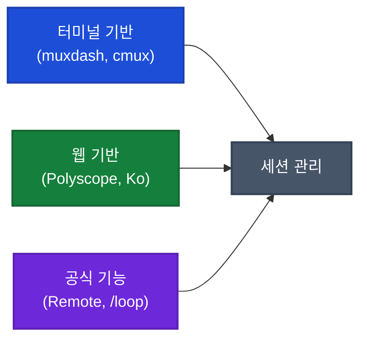

## 이게 뭔가요?

Claude Code를 하나만 쓸 때는 괜찮지만, **여러 프로젝트를 동시에 돌리기 시작하면** 금방 문제가 생깁니다. 터미널 탭이 10개, 20개 쌓이면서 "어느 탭에서 뭘 하고 있었지?" 하고 헤매게 되죠.

> 비유: 세탁기 3대를 동시에 돌렸는데, 어느 세탁기가 다 끝났는지 보려면 매번 가서 직접 확인해야 하는 상황입니다. 이 도구들은 **세탁기 3대를 한 화면에서 모니터링하는 컨트롤 패널** 같은 역할을 합니다.

이 영상에서는 44BITS 팟캐스트 멤버들이 직접 만들거나 써본 **Claude Code 멀티 세션 관리 도구들**을 비교 소개합니다. 터미널(TUI) 기반부터 웹 기반까지, 다양한 접근 방식을 다룹니다.

## 왜 알아야 하나요?

Claude Code를 제대로 활용하려면 **여러 개를 동시에 돌리는 게 핵심**입니다:

- 하나가 작업 중일 때 다른 걸 시키면 **대기 시간이 사라짐**
- 프로젝트 3개를 동시에 관리하면 생산성이 몇 배로 올라감
- 하지만 터미널만으로는 **어느 세션이 끝났는지, 뭘 하고 있는지 파악이 어려움**

영상에서 한 출연자는 멀티 세션 셋업을 잡은 후 **월 CC Usage 기준 $12,000~$30,000 상당**의 토큰을 사용한다고 밝혔습니다. Max 플랜은 $100/월(5배)과 $200/월(20배) 두 티어가 있으며, 실제 비용은 구독료뿐입니다. 셋업이 잡히면 토큰 활용량과 생산성이 동시에 급증한다는 이야기입니다.

## 어떻게 하나요?

### 방법 1: TUI(터미널 UI) 기반 도구

터미널 안에서 GUI처럼 화면을 나눠서 쓰는 방식입니다. CLI(키보드로 명령어 입력하는 화면)와 달리 TUI(Text User Interface)는 **화면 안에 패널, 탭, 목록 같은 시각 요소**가 있습니다.

#### muxdash (먹스대시)

tmux(터미널 화면 분할 도구)의 컨트롤 플레인 위에 만든 대시보드입니다.

- **왼쪽**: 세션 목록 (VS Code의 사이드바처럼)
- **오른쪽**: 선택한 세션의 작업 화면
- Ctrl+B로 왔다 갔다 하는 불편함 없이 **왼쪽 목록에서 바로 전환**

<strong>예시: muxdash 사용 시나리오</strong>

프로젝트 A, B, C를 동시에 작업 중일 때:
1. muxdash를 실행하면 왼쪽에 세 프로젝트가 목록으로 보임
2. A 프로젝트를 클릭하면 오른쪽에 Claude Code 화면이 표시됨
3. B로 전환하려면 왼쪽 목록에서 B를 선택하면 끝
4. Ctrl+B → 숫자키 누르며 탭 순환하는 수고가 사라짐

#### cmux (시먹스)

libghostty(Ghostty 터미널의 핵심 라이브러리) 기반으로 만든 macOS 네이티브 TUI 도구입니다. 프로젝트별 수직 탭과 자동 상태 표시 기능이 있습니다.

- **왼쪽 탭**: 프로젝트 단위 — 프로젝트 1, 2, 3이 세로로 정렬
- **탭 안에서 가로 전환**: 각 프로젝트 안에서 여러 세션을 탭으로 관리
- **자동 상태 표시**: 서버가 떠 있으면 포트 번호 자동 표시, Claude Code 완료 시 불이 반짝거림
- **브라우저 내장**: 오른쪽에 브라우저를 띄워서 결과를 바로 확인 가능

<strong>예시: cmux(시먹스)의 강점</strong>

왼쪽 서버 탭에서 에러 로그가 보일 때:
1. 오른쪽 Claude Code 세션에 "왼쪽에 있는 로그 에러 확인해 줘"라고 입력
2. Claude Code가 같은 화면의 서버 로그를 읽고 문제를 분석
3. 별도 터미널을 열 필요 없이 **한 화면에서 디버깅 완료**

### 방법 2: 웹 기반 도구

터미널의 한계를 넘어, 웹 브라우저에서 Claude Code를 관리하는 방식입니다.

#### 터미널의 한계점

| 문제 | 설명 |
|------|------|
| 끄기 무서움 | 터미널을 닫으면 세션이 날아갈까봐 컴퓨터를 계속 켜놔야 함 |
| 이미지 안 보임 | 브라우저 스크린샷 등을 터미널에서 확인 불가 |
| 확장 어려움 | 서브 메뉴, 모달, 이미지 같은 UI 요소를 추가하기 힘듦 |
| 텍스트 선택 문제 | 여러 패인(pane)이 있을 때 드래그하면 옆 패인까지 같이 선택됨 |

#### 웹 UI의 장점

- **이미지 표시**: 브라우저 스크린샷이 타임라인에 자동으로 표시됨
- **덱(Deck) 시스템**: 프로젝트별로 덱을 만들고, 각 덱에 여러 에이전트를 배치
- **모바일 접근**: 웹이니까 핸드폰에서도 작업 상태 확인 가능
- **세션 영속성**: 어제 하던 작업을 내일 이어서 할 수 있고, 끝난 작업은 "Done"으로 정리

<strong>예시: 웹 기반 도구의 실전 활용</strong>

5개 프로젝트를 동시에 관리하는 상황:
1. 웹 UI 왼쪽에 프로젝트 5개가 "덱"으로 나열됨
2. 각 덱을 클릭하면 해당 프로젝트의 Claude Code 세션들이 보임
3. Claude Code가 브라우저 스크린샷을 찍으면 **타임라인에 이미지가 바로 표시**
4. 작업이 끝나면 "Done" 처리하고 목록에서 정리
5. 다음 날 출근해서 어제 하던 작업을 바로 이어서 진행

### 방법 3: Claude Code 공식 기능 활용

서드파티 도구 없이도 Claude Code 자체 기능으로 멀티 세션 관리가 가능합니다.

- **Claude Code Remote**: 원격에서 Claude Code 세션에 접근할 수 있는 공식 기능
- **`/loop`**: 일정 간격(예: 5분)으로 명령을 반복 실행하는 기능 (세션을 켜둬야 동작)
- **Resume**: 이전 세션을 다시 불러와서 이어서 작업 가능

## 실전 예시

<strong>실전 케이스: "커밋도 AI가 하는 게 낫다"</strong>

영상 출연자들의 실전 워크플로우:

1. 코드 작업이 끝나면 Claude Code에 **"커밋해"** 라고 한국어로 말함
2. Claude Code가 변경 내용을 분석하고 적절한 커밋 메시지를 자동 생성
3. 커밋과 푸시까지 한 번에 처리

**왜 이렇게 하나?** AI가 현재 코드 변경의 맥락(context)을 더 정확히 파악하고 있어서, 사람이 대충 쓰는 커밋 메시지보다 더 정확한 메시지를 만들어 준다는 것이 출연자들의 경험입니다.

<strong>실전 케이스: 할 일 관리도 Claude Code에게</strong>

한 출연자의 할 일 관리 방식:

1. Claude Code에 "내일 할 일" 을 말로 설명
2. Claude Code가 맥락이 부족하면 다시 질문 → 충분한 정보 확보
3. 옵시디언(Obsidian, 노트 앱)에 할 일을 정리해서 저장
4. 다음 날 아침, Claude Code에 "옵시디언에서 오늘 할 일 가져와서 준비해 줘"라고 요청
5. 구글 캘린더, 조직도, 관련 문서까지 자동으로 정리해서 제공

**핵심 인사이트**: "내가 대충 쓴 메모는 내일 보면 뭔 뜻인지 모르지만, AI가 정리한 메모에는 최소한의 맥락이 남아 있다"

## 도구 비교 정리

| 구분 | TUI 도구 (cmux 등) | 웹 기반 도구 | Claude Code 공식 |
|------|---------------------|-------------|-----------------|
| 설치 난이도 | 중간 (tmux 필요) | 높음 (직접 구축) | 쉬움 (내장 기능) |
| 이미지 표시 | ❌ | ✅ | 제한적 |
| 모바일 접근 | ❌ | ✅ | ✅ (Remote) |
| 세션 안정성 | tmux에 의존 | 독립적 | 공식 지원 |
| 확장성 | 제한적 | 자유로움 | 로드맵 따라감 |

## 주의할 점

- 이 영상에서 소개된 도구 중 상당수는 **개인 프로젝트이거나 비공개**입니다. 공식 제품이 아니므로 안정성이 보장되지 않습니다.
- 멀티 세션을 많이 돌릴수록 **토큰 소비가 급증**합니다. Max 플랜($100/월 또는 $200/월)이라 실제 추가 비용은 없지만, 요금제에 따라 사용량 제한이 있을 수 있습니다.
- 터미널에서 Claude Code가 작업 중일 때 **엔터 키가 제대로 안 먹히는 버그**가 보고되었습니다(CPU 부하가 높을 때 빈줄로 처리됨). 서드파티 도구에서 이 문제를 해결하려고 시도 중입니다.

## 정리

- Claude Code를 **여러 개 동시에 돌리는 멀티 세션 워크플로우**가 파워 유저들의 핵심 사용 패턴
- 터미널 기반(cmux, muxdash)은 가볍고 빠르지만 한계가 있고, 웹 기반은 확장성이 높지만 구축이 필요
- "세탁기 앞에서 기다리지 말고 옆에서 다른 일을 하라" — 멀티 세션의 핵심 철학

> 📺 참고 영상: [Claude Code를 더 잘 쓰기 위한 도구들 | muxdash, Polyscope, Remote](https://youtube.com/watch?v=ER0mNV2APx4) — 44BITS (31분)
