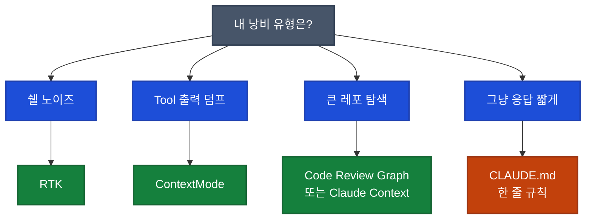

## 이게 뭔가요?

"Claude Code 토큰 사용량을 최대 90% 줄여준다"는 GitHub 레포(GitHub에 올라온 프로젝트 모음) 10개가 X(옛 트위터)에서 바이럴 됐습니다. 하지만 그 게시물은 실제 시연이 아니라 카드 이미지 모음이었습니다.

이 영상은 10개 레포 공식 페이지·벤치마크(성능 측정 결과)를 하나씩 검증하고, **"90%"라는 하나의 수치가 아니라 서로 다른 5개 계층의 문제**를 다루고 있다는 점을 정리합니다.

**일상 비유**: 전기 요금이 많이 나온다고 할 때 원인은 하나가 아닙니다. 에어컨을 오래 켠 것(출력 낭비), 낡은 냉장고(백그라운드 낭비), 켜둔 조명(시작부터 낭비)처럼 각각 원인이 다르죠. Claude Code 토큰 낭비도 같습니다. 원인별로 해결 도구가 다릅니다.

## 왜 알아야 하나요?

비개발자에게 토큰(AI가 읽고 쓰는 단어 조각 단위)은 곧 돈입니다. Claude Code를 쓰다 보면 매번 대화가 길어지고, 같은 파일이 반복해서 읽히면서 청구 금액이 늘어납니다. 절감 도구를 무턱대고 다 깔면 설치만 번거롭고 효과는 미미합니다.

**"내 낭비가 어느 계층에서 일어나는가"를 먼저 알고 맞는 도구를 고르는 것**이 핵심입니다.

## 토큰 낭비의 5가지 진짜 원인

영상에서 정리한 원인은 다음과 같습니다.

1. **도구 출력 반복**: Tool(Claude가 쓰는 외부 명령)이 JSON(데이터 표현 형식) 50~60KB를 뱉으면, 그게 다음 턴·그 다음 턴에도 계속 딸려갑니다.
2. **과도한 파일 읽기**: 요약만 필요한데 파일 전체를 한 번에 불러옵니다.
3. **Startup bloat(시작 부풀림)**: 세션 시작부터 문서·설정을 너무 많이 로드합니다.
4. **Context 포화 후 compact**: 대화창이 꽉 차면 요약 압축되며 세부 기억이 사라지고, 재설명에 또 토큰이 듭니다.
5. **출력 장황**: 6줄이면 될 답을 3문단으로 내는 습관입니다.

## 어떻게 하나요?

### 10개 레포를 5계층으로 재분류

| 계층 | 레포 이름 | 해결하는 낭비 유형 | 공식 수치 (제작자 발표) |
|---|---|---|---|
| 압축 | RTK | 터미널 명령 소음 | 약 89% 절감 (1,140만→140만 토큰) |
| 압축 | ContextMode | 거대한 Tool 출력 | 315KB→5.4KB, Playwright 스냅샷 56KB→수백B |
| 검색 | Code Review Graph | 큰 레포 리트리벌(검색) | 6개 오픈소스 기준 평균 8.2배 감소 |
| 검색 | Token Savior | 작업별 파일 탐색 | 90개 실전 태스크, 성공률 98.9% vs 기본 Claude 66.7% |
| 검색 | Claude Context (Zilliz) | 엔터프라이즈 코드베이스 | SWE-Bench에서 토큰 39%·도구 호출 36% 감소 |
| 경량 | Caveman | 출력 장황 | 69토큰→19토큰, 10개 과제 평균 65% |
| 경량 | Claude Token Efficient | CLAUDE.md 한 개로 강제 | 5개 프롬프트 기준 약 63% (저자는 "방향성 지표"라 명시) |
| 경량 | Claude Token Optimizer | 시작 로드 하이진 | 8,000 토큰→800 토큰 |
| 경량 | Token Optimizer MCP | Hook 캐시·압축 | 1,250 토큰→85 토큰 (캐시 히트 시) |
| 측정 | Alex Green's Token Optimizer | 낭비 위치 시각화 | 로컬 대시보드 제공 |

**주의**: 위 수치는 모두 **레포 제작자의 벤치마크 결과**입니다. 본인 프로젝트에서 같은 수치가 나온다는 보장은 없습니다. 재측정이 필요합니다.

### 주요 용어 해설

- **RTK**: Rust(프로그래밍 언어)로 만든 CLI(키보드 명령 프로그램) 프록시. 터미널 명령을 가로채 더 짧은 형태로 고쳐 보냅니다. 단, Claude 내장 Read·Grep·Glob에는 적용되지 않고, Bash 호출에만 적용됩니다.
- **SQLite**: 파일 하나로 쓰는 가벼운 데이터베이스. ContextMode는 큰 Tool 결과를 대화에 넣지 않고 SQLite에 담아두고 요약만 건네줍니다.
- **벡터 DB**: 데이터를 숫자 배열로 저장해 "비슷한 것"을 빨리 찾게 해주는 데이터베이스. Claude Context는 이걸로 코드베이스 의미 검색을 합니다.
- **MCP**: Model Context Protocol. Claude와 외부 도구를 연결하는 표준.
- **Hook**: 특정 시점에 자동 실행되는 기능 (예: 파일 저장 직전 자동 린트).
- **SWE-Bench**: 코딩 AI 성능 비교용 공개 벤치마크.

### 어느 도구를 골라야 하나: 결정 프레임워크



<div class="example-case">
<strong>예시: 쉘 로그에 파묻힌 세션</strong>

`git add`, `npm test`가 매번 수십 줄 로그를 찍는데 그게 전부 대화에 쌓인다면 → **RTK 우선**. 영상 기준 git add·git commit·cargo test류는 약 90% 절감 사례가 있습니다.

</div>

<div class="example-case">
<strong>예시: 50KB JSON을 뱉는 도구</strong>

API(프로그램 사이 대화 통로) 호출 결과나 Playwright(브라우저 자동화 도구) 스냅샷처럼 큰 덩어리가 자주 들어온다면 → **ContextMode**. 큰 결과를 SQLite에 따로 저장하고 요약만 회신시키는 구조입니다.

</div>

### 쉬운 팁: CLAUDE.md 한 줄 추가

도구 설치가 부담되면 가장 단순한 것부터 시도해보세요. 프로젝트 루트에 `CLAUDE.md` 파일(Claude에게 주는 규칙 파일)을 만들고 다음과 비슷한 줄을 넣습니다.

```
응답은 핵심만 3문장 이내로. 불필요한 서론·요약·재확인 문장 금지.
불필요한 파일 전체 읽기 금지. 필요한 부분만 Grep으로 먼저 찾고 읽을 것.
```

영상에서는 Claude Token Efficient 레포가 이런 방식으로 5개 프롬프트 기준 약 63% 감소를 보고했습니다(제작자 표현 그대로 "방향성 지표"입니다).

## 실전 예시

<div class="example-case">
<strong>실전 케이스: 레이어드 스택 쌓기</strong>

영상이 권장하는 실제 조합 순서입니다.

1. **먼저 측정**: Alex Green's Token Optimizer 같은 대시보드로 낭비 위치를 찾는다.
2. **쉘 소음이 1위라면**: RTK 설치.
3. **Tool 출력이 2위라면**: ContextMode 추가.
4. **큰 레포라면**: Code Review Graph 또는 Claude Context로 검색 교체.
5. **마지막으로**: CLAUDE.md로 출력 길이 규칙 강제.

한꺼번에 다 깔지 말고 하나씩 측정하며 쌓으라는 것이 영상의 핵심 권장입니다.

</div>

## 주의할 점

- **"90% 절감"은 repo 벤치 기준**: 제작자 손으로 만든 시나리오에서 나온 수치입니다. 같은 환경이 아니면 재현되지 않을 수 있습니다.
- **토큰 절약 ≠ 품질 유지**: 맥락을 지나치게 잘라내면 Claude가 정보 부족으로 헛소리를 하게 됩니다. 이를 "context starvation(맥락 굶주림)"이라 부릅니다.
- **측정 없는 최적화는 위험**: 대시보드로 before/after 비교 없이 도구만 쌓으면, 진짜 효과 있는지 모릅니다.
- **내장 도구에는 한계**: RTK는 Bash 호출에만 적용됩니다. Claude 내장 Read·Grep·Glob에는 작동하지 않는다는 점을 영상이 분명히 지적합니다.
- **위 수치는 공식 발표치**: 일부는 레포 README, 일부는 제품 사이트 주장, 일부는 저자 내부 테스트입니다. 출처가 다르다는 점을 잊지 마세요.

## 정리

- 토큰 절감 레포 10개는 **압축·검색·경량·측정** 5개 계층으로 다른 문제를 다룹니다.
- 자기 프로젝트에서 가장 크게 낭비되는 계층을 먼저 측정하고 맞는 도구 하나부터 적용하세요.
- "90%" 같은 수치는 레포 벤치 기준이며 자기 환경에서 재검증이 필요합니다.

---

**참고 영상**: [10 Claude Code Token Saving Repos, What Actually Looks Real? (TechWealth Hub)](https://youtube.com/watch?v=3HGK9fmhHiY)
