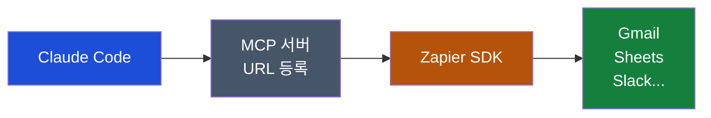

# Zapier MCP로 Claude Code에 9,000개 앱 연결하기

## 이게 뭔가요?

택배를 보낼 때마다 운송장을 직접 써야 한다면 번거롭습니다. 하지만 이미 등록해 둔 주소록에서 한 번에 고르면 훨씬 빠르죠.

Zapier SDK(소프트웨어 개발 도구)의 MCP(Model Context Protocol, AI가 외부 도구를 사용하는 표준 방식) 서버가 딱 그런 역할입니다. 여러분이 이미 Zapier에 연결해 둔 앱들—Gmail, Google Sheets, Slack 등—을 Claude Code가 그대로 가져다 씁니다. API 키(앱에 접근하는 비밀번호)를 따로 발급받거나, OAuth(앱 간 인증 연결) 설정을 반복할 필요가 없습니다.

현재 **베타**로 제공 중이며, Zapier 유료·무료 플랜에 포함됩니다. 단, 도구 호출 1회당 Zapier 태스크(Task) 2개를 소모합니다.

---

## 핵심 숫자

| 항목 | 수치 |
|------|------|
| 연결 가능한 앱 수 | 9,000개 이상 |
| 직접 HTTP 호출 가능 앱 | 3,600개 이상 |
| 추가 인증 설정 필요 여부 | 없음 (Zapier 계정 1회 로그인으로 끝) |
| 현재 요금 | Zapier 플랜 포함 (호출 1회당 태스크 2개 소모) |

---

## MCP 방식 vs SDK 방식 — 뭐가 다른가요?



일반 MCP 도구를 쓸 때는 "무언가를 만들어야" 하고 설정이 복잡합니다. Zapier SDK 방식은 함수(기능 단위)가 명확히 정의돼 있어서, Claude Code가 같은 요청을 해도 매번 일관된 결과를 냅니다. 예측 불가능한 응답이 줄어드는 게 핵심 차이입니다.

---

## 설정 방법

### 1단계 — Zapier 계정 준비

Zapier([zapier.com](https://zapier.com))에 로그인한 뒤, 평소에 쓰는 앱들을 미리 연결해 두세요. Gmail, Google Sheets, Slack 등 이미 연결돼 있다면 그대로 사용할 수 있습니다.

### 2단계 — MCP 서버 URL 복사

Zapier SDK 베타 페이지에서 MCP 서버 URL을 복사합니다. 형식은 아래와 같습니다.

```
https://mcp.zapier.com/api/mcp/...
```

### 3단계 — Claude Code에 등록

Claude Code 설정 화면에서 MCP 서버를 추가합니다.

터미널(명령 입력 창)에서 아래 명령어로 추가하거나, `.mcp.json` 설정 파일(프로젝트 루트 또는 홈 디렉토리)에 직접 등록합니다.

```bash
# 방법 1: claude mcp add 명령어 (Mac / Windows 공통)
```

```bash
claude mcp add zapier-sdk --url "복사한_URL을_여기에_붙여넣기"
```

### 4단계 — Zapier 로그인

등록 후 Claude Code가 브라우저 창을 열고 Zapier 로그인을 요청합니다. 한 번만 인증하면 이후에는 자동으로 연결됩니다.

---

## 실제 사용 예시

<div class="example-case">

### 예시 1: 이메일 한 줄로 보내기

**프롬프트:**
```
abc@example.com으로 제목 "이거 되나요?" 로 이메일 보내줘
```

**결과:** Claude Code가 Gmail 연결을 확인하고 즉시 발송합니다. API 설정이나 인증 코드 입력 없이 끝납니다.

이전에 같은 작업을 하려면 Gmail API 키 발급 → OAuth 동의 화면 설정 → 토큰 관리 단계를 거쳐야 했습니다.

</div>

<div class="example-case">

### 예시 2: 팀 업무 로그 자동 기록 앱 만들기

**프롬프트:**
```
팀원들이 완료한 업무를 입력하면 Google Sheets에 자동 저장되는 
간단한 앱을 Claude Code 프로젝트로 만들어줘
```

**결과:** Claude Code가 Zapier를 통해 Google Sheets 연결 권한을 확인하고, 입력 폼 → Sheets 저장까지 동작하는 앱을 생성합니다.

SDK 방식이기 때문에 "Sheets에 행 추가"라는 함수가 명확히 정의돼 있어, 실행할 때마다 동일한 방식으로 동작합니다.

</div>

---

## 지원되는 주요 앱 (예시)

Zapier에 연결된 앱이라면 모두 사용 가능합니다. 대표적인 앱은 다음과 같습니다.

| 카테고리 | 앱 예시 |
|----------|---------|
| 이메일 | Gmail, Outlook |
| 문서/스프레드시트 | Google Sheets, Google Drive, Notion |
| 커뮤니케이션 | Slack, Zoom |
| 마케팅 | YouTube, ConvertKit, Google Ads |
| 자동화 도구 | Apify |

---

## 주의사항

- 현재 **베타** 단계로, 일부 기능이 변경될 수 있습니다.
- 도구 호출 1회마다 Zapier 태스크 2개가 소모됩니다. 무료 플랜은 월 태스크 한도가 있으니 주의하세요.
- MCP 서버 URL은 **본인 전용**입니다. 타인과 공유하지 마세요.

---

## 요약

| 단계 | 할 일 |
|------|-------|
| 1 | Zapier에 앱 연결 (이미 돼 있으면 생략) |
| 2 | Zapier SDK 베타에서 MCP URL 복사 |
| 3 | `claude mcp add` 명령어로 URL 등록 |
| 4 | 브라우저에서 Zapier 1회 로그인 |
| 완료 | 9,000개 앱을 Claude Code에서 바로 사용 |
