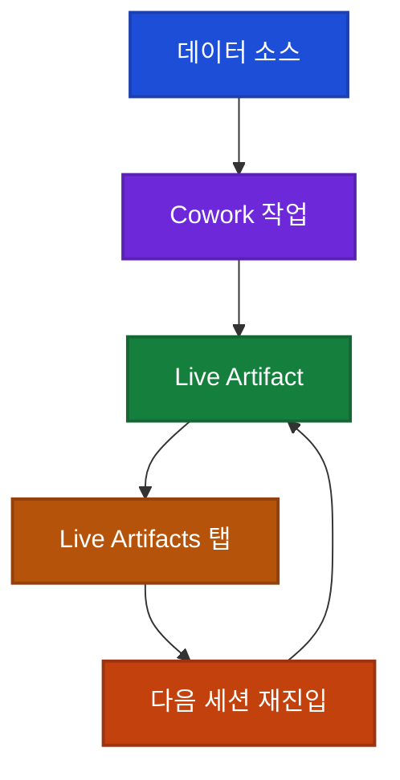

## 이게 뭔가요?

Claude **Live Artifacts**는 Claude Cowork(앤스로픽이 만든 "채팅 대신 결과물 위주" 작업 공간) 안에서 만들어지는 **살아 있는 산출물**입니다.

비유하자면 **매일 아침 집 앞에 배달되는 신문**입니다. 기존 Artifact가 "어제 받은 신문"이라면, Live Artifact는 **매일 새로 찍혀 오는 신문**입니다. 열 때마다 최신 데이터로 다시 채워집니다.

- **기존 Artifact**: Claude에게 "대시보드 만들어줘" 하면 → 한 번 그린 HTML·차트가 남음. 내일 데이터가 바뀌어도 그대로.
- **Live Artifact**: 같은 요청을 Cowork에서 하면 → **내 앱·파일과 연결된 대시보드**가 만들어지고, 내일 다시 열면 **그 시점의 데이터**로 새로 그려집니다.

## 왜 알아야 하나요?

비즈니스에서 진짜 필요한 건 "한 번 예쁘게 뽑은 차트"가 아니라 "매주 금요일에 자동으로 갱신되는 KPI(Key Performance Indicator, 핵심 성과 지표) 보드"입니다. 기존 AI 챗봇은 전자는 잘했지만 후자가 어려웠습니다.

Anthropic의 공식 포지셔닝을 인용하면 Cowork는 "채팅 창"이 아니라 **"결과물 우선(outcome first) 작업 실행 공간"** 입니다. 탭 이름만 봐도 방향이 드러납니다.

- Schedule tasks (작업 예약)
- Organize files (파일 정리)
- Build spreadsheets (스프레드시트 제작)
- Prepare reports (보고서 준비)
- Analyze notes (메모 분석)

Live Artifacts는 이 흐름의 **최종 산출물**에 해당합니다. 반복적으로 꺼내 쓰고, 매번 최신화되는 일감 결과물을 만드는 도구입니다.

## 기존 Artifact vs Live Artifact

| 항목 | 기존 Artifact | Live Artifact |
|------|---------------|---------------|
| 목적 | 1회성 결과물 | 반복 사용·지속 산출물 |
| 데이터 | 생성 시점 스냅샷 | 열 때마다 최신 데이터로 갱신 |
| 연결성 | 독립 | Slack·파일·브라우저 리서치·내부 툴에 연결 |
| 저장 | 대화 기록 안에 종속 | **새 "Live Artifacts" 탭**에 별도 저장 |
| 세션 | 현재 대화에서만 | 어떤 세션에서든 다시 열기 가능 |
| 버전 관리 | 없음 | **버전 히스토리** 제공 (롤백 가능) |

비유를 하나 더: **기존 Artifact가 "일회용 컵"이라면 Live Artifact는 "이름 써붙인 텀블러"** 입니다. 매번 새로 채우고, 잃어버리지 않으며, 어디서든 꺼내 쓸 수 있습니다.

## 공식이 말하는 4가지 특징

영상과 공식 스레드에서 확인된 핵심 약속입니다.

1. **아티팩트 구축**: Claude가 채팅 응답 대신 **실제 결과물**을 만듭니다.
2. **대시보드·트래커 형태**: 결과물은 KPI 카드, 차트, 표 같은 **운영 가능한 형식**입니다.
3. **사용자 데이터 소스 연결**: 내 앱과 파일에 물려 있어, 열 때마다 현재 데이터로 반영됩니다.
4. **버전 히스토리와 지속성**: 새 탭에 저장되고 버전이 남아, 다음 날·다음 달에 와서 이어서 쓸 수 있습니다.

## 샘플 대시보드 구성

공식 Cowork 페이지 안에 실제로 공개된 샘플 "주간 성과 보고서(Weekly performance report)"가 있습니다. 영상 분석에서 확인된 구성은 다음과 같습니다.

<strong>공식 샘플: Weekly Performance Report</strong>

이 페이지는 평범한 텍스트 응답이 아니라, 실제로 **렌더링된 비즈니스 대시보드**입니다.

- **KPI 카드 3종**: Active Users(활성 사용자), Revenue(매출), Conversions(전환수)
- **8주 매출 라인 차트(line chart)**: 지난 8주의 매출 추이를 선 그래프로 표시
- **트래픽 믹스 도넛 차트(donut chart, 가운데가 뚫린 원형 차트)**: 채널별 유입 비중
- **매출/사용자 토글**: 같은 차트 영역에서 지표 전환 가능 — **정적 이미지가 아니라 인터랙티브 요소**가 포함된 산출물임을 보여줌

정적인 보고서가 아니라 **"열어서 조작할 수 있는 대시보드"** 라는 점이 핵심입니다.

## Cowork의 작업 흐름

공식 Cowork 소개 영상에서는 "채팅 → 답변"이 아니라 **"지시 → 실행 → 산출물"** 의 흐름을 보여줍니다. 빠른 시작 화면(quick start)에 나오는 예시:

- Create a file (파일 생성)
- Crunch data (데이터 가공)
- Make a prototype (프로토타입 제작)
- Prep for the day (하루 준비)
- Organize files (파일 정리)
- Send a message (메시지 발송)

<strong>실전 케이스: 회의 녹음 → 액션 아이템</strong>

공식 영상이 보여주는 흐름:

1. Claude가 **회의 녹음 파일을 읽습니다**.
2. 핵심 포인트(key points)를 뽑아냅니다.
3. 액션 아이템(action items, 해야 할 일 목록)을 추출합니다.
4. 요약본을 작성합니다.
5. **결과물은 채팅에 남지 않고, "Artifacts 패널"에 저장**됩니다. 이름도 "Meeting summaries", "Action items", "Team standup deck"처럼 **결과물 이름으로** 정렬됩니다.

즉 "Claude가 답변했다"가 아니라 **"Claude가 업무 산출물을 만들어 뒀다"** 로 UI 자체가 달라집니다.

## 전체 구조 한눈에

Live Artifact가 핵심이고, 이 아티팩트가 **"Live Artifacts 탭"** 이라는 고정된 장소에 저장되기 때문에 세션이 끝나도 잃어버리지 않습니다. 다시 열면 그 시점의 데이터로 재생성됩니다.

## 연결 가능한 데이터 소스

영상과 공식 페이지에서 언급된 주요 연결 대상입니다.

| 카테고리 | 예시 |
|---------|------|
| 협업 도구 | Slack |
| 파일 | 내 컴퓨터·드라이브 문서 |
| 웹 | 브라우저 리서치(Claude가 직접 검색) |
| 내부 툴 | 커넥터(Connectors, 외부 도구 연결 기능)로 연결된 회사 시스템 |

공식 페이지의 고객 인용구도 이 방향성을 그대로 보여줍니다.

> "Cowork came back with an interactive dashboard, team byte-efficiency analysis, and a prioritized roadmap."
> (Cowork이 인터랙티브 대시보드, 팀 효율 분석, 우선순위 로드맵을 만들어 돌려줬다.)

즉 채팅 응답이 아니라 **"업무 결과물 패키지"가 한 번에 반환**되는 사용 경험입니다.

## 어떻게 써볼 수 있나요?

### 1단계: 활성화 확인

- **대상**: **Cowork이 활성화된 유료 플랜**에서 순차 롤아웃 중 (플랜별 정확한 범위는 공식 발표에서 구체화되지 않음 — Claude 앱 설정 화면에서 Cowork 메뉴가 보이면 사용 가능)
- **진입 경로**: Claude 앱을 최신 버전으로 업데이트(또는 다운로드) → **Cowork 진입**

### 2단계: 첫 Live Artifact 만들기

영상에서 강조하는 사용 아이디어입니다.

1. "매주 금요일에 분석 대시보드에서 지표를 뽑아와 업데이트"
2. "스크린샷을 스프레드시트로 변환"
3. "흩어진 메모에서 보고서 초안 작성"

이 중 하나를 Cowork에 요청하면 결과물이 **Live Artifact로 저장**됩니다. 다음 주에 같은 대시보드를 열면 **그 시점의 데이터로 다시 채워진 보고서**를 받게 됩니다.

### 3단계: 버전 히스토리 활용

수정 중에 "어제 버전이 더 나았는데" 싶을 때, **Live Artifacts 탭의 버전 히스토리**에서 이전 상태로 롤백할 수 있습니다. 비유하자면 **게임 세이브 포인트**가 자동으로 계속 찍히는 셈입니다.

## 솔직한 검증: 과장은 얼마나 될까

영상 후반부는 **한 걸음 물러서서** 이 발표가 얼마나 검증되는지 정리합니다.

- 최초 트윗 자체는 **공개된 스텝바이스텝 데모**가 아닙니다. 주로 프로모 이미지와 설명 중심입니다.
- 하지만 공식 Cowork 페이지·영상·샘플 Weekly Performance Report가 **같은 주장을 여러 각도에서 뒷받침**합니다.
  - 답변이 Artifacts 패널에 "산출물 이름"으로 정렬된다는 점
  - 보고서·스프레드시트·스케줄·커넥터·서브에이전트가 한 페이지에 통합되어 있다는 점
  - 실제 샘플 대시보드에 KPI 카드·차트·토글이 포함된다는 점

결론은 "티저가 조금 번드르르한 면은 있지만, **핵심 주장(지속·연결·갱신되는 대시보드 산출물)은 공식 자료로 충분히 검증된다**"입니다.

## 주의할 점

- **유료 플랜에서만 동작**: 무료 플랜 사용자는 Claude 앱을 업데이트해도 Live Artifacts 탭이 보이지 않을 수 있습니다.
- **앱 업데이트 필수**: 웹에서 Cowork에 들어갔는데 기능이 안 보이면, **데스크톱 앱을 최신 버전으로 재설치**하거나 업데이트하세요.
- **데이터 소스 연결 범위 확인**: Slack·파일·내부 툴에 Claude를 연결할 때는 **권한 범위**를 최소로 설정하세요. "전체 워크스페이스 읽기"보다 "특정 채널만"이 안전합니다.
- **"실시간 갱신"은 새로고침 기준**: 백그라운드에서 초 단위로 바뀌는 실시간 스트림이 아니라, **아티팩트를 "열 때" 현재 데이터로 재계산**되는 방식으로 이해하는 것이 정확합니다.
- **버전 히스토리 맹신 금지**: 롤백은 가능하지만, **원본 데이터 소스가 바뀌었다면 과거 버전을 열어도 숫자가 달라질 수 있습니다**. 중요한 보고서는 PDF로 따로 저장해 두세요.

## 정리

- **Live Artifact = 앱·파일에 연결되어 매번 새로 그려지는 비즈니스 산출물**. 기존 Artifact의 "1회성" 한계를 정면으로 깨는 업데이트입니다.
- **새 Live Artifacts 탭 + 버전 히스토리** 덕분에 어떤 세션에서든 다시 열어 이어갈 수 있고, 이전 상태로 롤백할 수도 있습니다.
- **유료 플랜 + 최신 앱 + Cowork 진입** 세 가지만 충족되면 바로 써볼 수 있습니다. KPI 대시보드, 회의 액션 아이템, 주간 보고서 같은 **반복되는 업무 산출물**에 가장 잘 맞습니다.

---

참고 영상:
- [Claude Cowork Live Artifacts, source-grounded review](https://youtube.com/watch?v=s7tCCRizI2M) (주 출처)
- [Anthropic Just Released Claude Live Artifacts](https://youtube.com/watch?v=IKpjVE-ApDc) (보조 출처)
