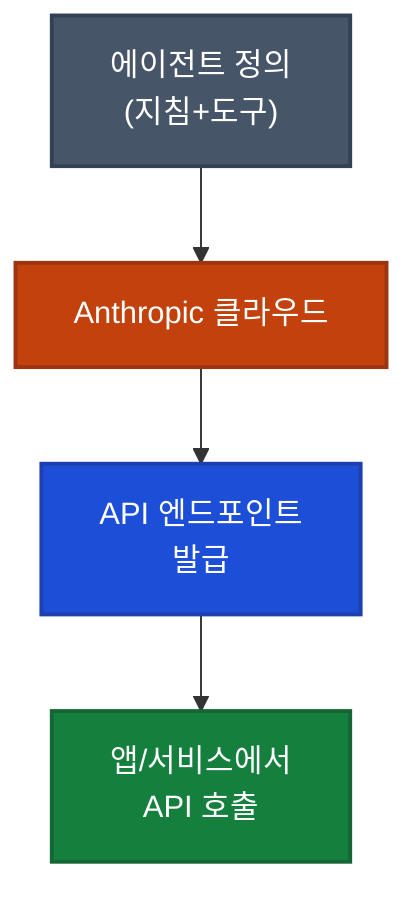

## 이게 뭔가요?

식당을 열 때 주방 인테리어, 화구 설치, 전기 배선을 직접 할 수도 있지만, 주방 시설이 다 갖춰진 공유 주방을 빌려서 바로 요리만 할 수도 있습니다.

**Claude Managed Agents**는 그 공유 주방과 같습니다. AI 에이전트를 운영하려면 원래 서버 설정, 인프라 관리, 보안 구성에 수개월이 필요했습니다. Managed Agents는 이 모든 인프라를 Anthropic이 대신 운영합니다. 개발자는 에이전트의 목적, 도구, 지침만 정의하면 즉시 API 엔드포인트(프로그램 간 통신 주소)를 받습니다.

> Notion, Canva, Cursor 등 기업들이 이미 프로덕션(실제 서비스)에서 사용 중입니다.

---

## 왜 알아야 하나요?

- **인프라 없이 즉시 배포**: 수개월 걸리던 서버 구성을 건너뛰고 바로 에이전트를 운영
- **내장 도구 4종**: 웹 검색, 코드 실행, 파일 관리, 컴퓨터 제어를 추가 설정 없이 사용
- **메모리 내장**: 대화 간 컨텍스트(문맥 정보)와 상태를 자동 유지
- **추가 비용 없음**: 표준 API 요금만 부과 — Managed Agents 자체에 별도 요금 없음
- **보안·컴플라이언스 내장**: 기업 환경에서 요구하는 격리 샌드박스(보안 실행 환경)와 감사 기록 제공

---

## Managed Agents가 제공하는 것



### 내장 도구 (Built-in Tools)

| 도구 | 설명 |
|------|------|
| **Web Search** | 인터넷 검색으로 최신 정보 조회 |
| **Code Execution** | 코드를 직접 실행하고 결과 반환 |
| **File Management** | 파일 생성, 읽기, 수정 |
| **Computer Use** | 화면 조작, 버튼 클릭 등 컴퓨터 자동화 |

### 핵심 특징

| 특징 | 내용 |
|------|------|
| **Persistent Memory** | 대화가 끊겨도 컨텍스트 유지 |
| **Long-running Tasks** | 시간이 오래 걸리는 작업 처리 가능 |
| **Parallel Tool Use** | 여러 도구를 동시에 활용 |
| **Intelligent Routing** | 작업에 맞는 도구를 자동 선택 |
| **Isolated Sandbox** | 에이전트별 격리된 실행 환경 |

---

## 어떻게 사용하나요?

### 에이전트 생성 (콘솔에서)

1. [console.anthropic.com](https://console.anthropic.com) 접속 → **Agents** 탭
2. **Create Agent** 클릭
3. 이름, 설명, 시스템 지침 입력
4. 필요한 도구 선택 (Web Search, Code Execution 등)
5. 생성 완료 → **API 엔드포인트 URL** 발급

### API로 호출하기

발급받은 엔드포인트에 POST 요청을 보내는 것이 전부입니다. 별도의 인프라 구성이 없습니다.

```bash
curl -X POST "https://api.anthropic.com/v1/agents/{agent_id}/messages" \
  -H "x-api-key: $ANTHROPIC_API_KEY" \
  -H "content-type: application/json" \
  -d '{"messages": [{"role": "user", "content": "오늘 AI 뉴스 요약해줘"}]}'
```

응답에는 결과 텍스트 외에 **토큰 사용량 breakdown**(input, cache, output별 사용량)이 포함돼 비용 추적이 편합니다.

---

## 실전 예시

<div class="example-case">
<strong>예시 1: Notion Custom Agents — 실제 도입 사례</strong>

Notion은 Claude Managed Agents를 자사 제품에 통합해 **Custom Agents** 기능으로 출시했습니다 (Notion 3.3, 2026년 2월). Notion의 제품 관리자(PM) Eric Liu가 직접 데모를 진행했으며, 두 가지 사용 패턴이 확인됩니다.

**엔지니어링 팀:**
- Claude에게 코드 작업을 직접 위임하여 배포(shipping)까지 처리
- 별도 인프라 구성 없이 Notion 워크스페이스 내에서 실행

**비개발 팀 (마케팅, 영업 등):**
- 프레젠테이션 제작, 문서 자동화 등 다양한 업무를 에이전트에 위임
- 코딩 지식 없이도 에이전트 활용 가능

Anthropic의 인프라가 모든 실행 환경을 담당하므로, Notion 팀은 별도 서버나 큐(Queue, 작업 대기열) 시스템을 구축하지 않았습니다.

</div>

<div class="example-case">
<strong>예시 2: n8n에서 뉴스 에이전트 연결</strong>

n8n(노코드 자동화 플랫폼)과 Managed Agents를 연결하면 코딩 없이 뉴스 수집 에이전트를 구동할 수 있습니다.

1. console.anthropic.com에서 "뉴스 에이전트" 생성 (Web Search 도구 선택)
2. API 엔드포인트 URL 복사
3. n8n의 HTTP Request 노드에 URL과 API 키 입력
4. 트리거 설정 (예: 매일 오전 8시)

이후 n8n이 매일 에이전트를 호출하고, 에이전트가 오늘의 뉴스를 검색해 요약 결과를 반환합니다.

</div>

---

## 언제 Managed Agents를 쓸까?

| 상황 | 추천 도구 |
|------|----------|
| 팀 내부 도구를 빠르게 배포하고 싶다 | **Managed Agents** |
| 장기 실행 리서치·분석 작업이 필요하다 | **Managed Agents** |
| 인프라 관리 없이 보안 컴플라이언스가 필요하다 | **Managed Agents** |
| 로컬에서 직접 Claude Code를 사용해 개발한다 | **Claude Code** |
| 커스텀 인터페이스로 Claude 모델을 사용한다 | **직접 API 호출** |

---

## 주의할 점

- **API 키 필요**: Claude Pro/Max 구독과 별개로 [platform.anthropic.com](https://platform.anthropic.com)에서 API 키를 발급받아야 합니다. 사용량에 따라 별도 비용이 발생합니다.
- **Claude Code와 다른 서비스**: Managed Agents는 Claude Code(터미널 기반 코딩 도구)가 아닌, 클라우드에서 실행되는 별도의 API 서비스입니다.
- **Cowork 기능**: 사용자와 에이전트가 실시간으로 협업하는 Cowork 기능이 포함돼 있습니다. 페어 프로그래밍과 유사한 방식으로 에이전트와 함께 작업할 수 있습니다.

---

## 정리

- Claude Managed Agents는 인프라 없이 AI 에이전트를 클라우드에 배포하는 Anthropic 공식 서비스
- 콘솔에서 에이전트를 생성하면 API 엔드포인트를 바로 받아 어떤 시스템에서도 호출 가능
- 웹 검색·코드 실행·파일 관리·컴퓨터 사용 도구와 메모리가 내장되어 있으며 추가 API 요금 외 별도 비용 없음

---

> 📺 **출처**: [Introducing Claude Managed Agents](https://youtube.com/watch?v=I1BvAHOsjBU) — Claude (Anthropic 공식 채널, 2026.04.08)
> 📺 **추가 출처**: [How Notion built with Claude Managed Agents](https://youtube.com/watch?v=45hPRdfDEsI) — Claude (Anthropic 공식 채널, 2026.04.08)
