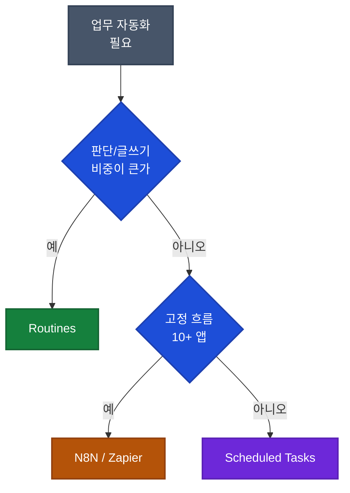

## 이게 뭔가요?

Claude Routines(클로드 루틴)은 Anthropic이 최근 출시한 자동화 기능입니다. 지정해 둔 상황이 발생하면 Claude가 자동으로 반응해서 처리해 주는 구조입니다. 영상 제작자는 기존 AI 스케줄 기능(Scheduled Tasks)과 Routines의 차이를 이렇게 비유합니다.

- **Scheduled Tasks** = 알람시계. 시간이 되면 울린다. 뭔가 실제로 일어났는지와 상관없이.
- **Routines** = 초인종 + 알람시계를 겸한 도구. 이벤트 기반 트리거(리드 유입, 리뷰 작성 등)가 핵심이지만, 공식 문서 기준으로 시간 스케줄 트리거도 함께 지원합니다.

예를 들어 "매일 아침 8시 브리핑을 보내라"도 "새 상담 신청이 들어오면 답장 초안을 써라"도 둘 다 루틴으로 만들 수 있습니다. 루틴은 Anthropic 클라우드(Anthropic이 운영하는 원격 서버)에서 돌아가므로 내 노트북이 꺼져 있어도 작동합니다.

## 왜 알아야 하나요?

스프레드시트·CRM·Slack·이메일을 오가며 같은 패턴의 업무를 수작업으로 처리하고 있다면, 그중 Claude가 판단·작성을 담당할 수 있는 부분을 Routines로 옮길 수 있습니다. 영상에서 강조하는 포인트는 두 가지입니다.

1. **속도-우선(Speed to lead)**: 상담 유입 후 응답이 몇 시간 걸리던 것을 몇 분 안으로 단축. 영상 제작자는 이를 "서비스업에서 전환율의 가장 강한 예측 변수"라고 말합니다(근거는 제시되지 않은 일반론 수준으로 받아들이는 편이 안전합니다).
2. **서비스 상품화**: AI 에이전시(AI 대행 업무를 파는 사업자)는 이 루틴 각각을 "설치형 서비스"로 팔 수 있다는 관점.

다만 Routines도 만능이 아닙니다. N8N·Zapier 같은 흐름도(워크플로우) 도구와의 경계도 아래에서 설명합니다.

## 어떻게 하나요?

### 1. Routine의 3요소

```
Routine = Instructions + Workspace + App Access
          (무엇을 할지)  (참고 자료)  (쓸 수 있는 앱)
```

| 요소 | 설명 | 비유 |
|---|---|---|
| Instructions | 사람 언어로 쓴 지시문 | 신입 직원 업무 매뉴얼 |
| Workspace | Claude가 참고하는 자료 폴더(브랜드 보이스·FAQ·가격표 등) | 업무용 바인더 |
| App Access | Slack·Gmail·Google Drive·Notion 등 접근 권한 | 사무실 열쇠 꾸러미 |

### 2. Instructions 작성 5요소 구조

영상 제작자는 어떤 업무든 이 5단 구조로 10분 안에 지시문을 쓸 수 있다고 설명합니다.

1. **Role(역할)**: "당신은 나의 리드 팔로우업 담당자입니다"
2. **Goal(목표)**: "새 리드 도착 후 2분 이내 맞춤 팔로우업 이메일 초안 작성"
3. **Steps(단계)**: 읽을 것 → 판단할 것 → 만들 것 순서로 분해
   - 읽기: 신청 폼 내용·가능한 공개 정보
   - 판단: 문의 성격에 맞는 관심사 추정
   - 생성: 상대를 언급한 짧고 따뜻한 팔로우업 이메일 초안
4. **Output(출력)**: 어디에·어떤 형식으로. "Slack 내 지정 채널에 100자 이내로 초안 게시"
5. **Rules(규칙)**: 하지 말 것. "내가 승인하기 전엔 절대 직접 전송 금지"·"제네릭 템플릿 사용 금지"

### 3. Scheduled Tasks·N8N과의 구분

| 축 | Scheduled Tasks | Routines | N8N/Zapier |
|---|---|---|---|
| 트리거 | 시간(매일 8시 등) | 이벤트(리드·리뷰·결제 등) 또는 시간 | 시간·이벤트 모두 가능 |
| 실행 장소 | 내 컴퓨터가 열려 있어야 함 | Anthropic 클라우드 (내 PC 꺼져 있어도 OK) | 각 서비스 서버 |
| 도중 질문 | 중간에 허락을 물어봄 | 처음부터 끝까지 자율 실행 후 사람이 결과 검토 | 흐름도에 정의된 대로 |
| 적합 업무 | 매일 요약·정리 | 판단·작성이 들어가는 반응형 업무 | 10개 앱을 정해진 순서로 잇는 고정 플로우 |

영상 제작자의 선택 기준: "Claude가 직접 읽고·생각하고·쓰는 일이라면 Routines. 10개 앱을 엄격한 조건으로 엮는 플로우 자체가 제품이면 N8N." 단정적인 주장이므로 실제 팀 도구 스택에 따라 판단하는 편이 좋습니다.



### 4. 13가지 즉시 적용 템플릿

영상에서 소개한 10개 이벤트(doorbell) + 3개 스케줄(alarm clock) 템플릿입니다.

**이벤트 트리거 10개 (사건이 생기면 실행)**

| # | 루틴 | 트리거 | Claude가 하는 일 |
|---|---|---|---|
| 1 | 신규 리드 팔로우업 | 상담 폼 제출 | 내용 읽고 맞춤 이메일 초안 작성 → Slack에 게시 |
| 2 | 부정 리뷰 대응 | 1~2점 리뷰 등록 | 핵심 불만 파악, 차분한 공개 답변 초안, 내부엔 근본 원인 플래그 |
| 3 | 부재중 전화 회수 | 전화 시스템에 미수신 로그 | 누가·왜 걸었는지 추정하고 콜백 문자/메일 초안 |
| 4 | 연체 인보이스 독촉 | 회계 툴에 연체 플래그 | 고객 관계에 맞는 정중한 결제 리마인더 작성 |
| 5 | 취소 예약 재전환 | 예약 취소 발생 | 재예약 메시지 또는 리텐션 오퍼 초안 |
| 6 | 문의 폼 분류·라우팅 | 웹사이트 문의 제출 | 영업/지원/파트너십/채용/스팸 분류 후 담당자에게 전달+1차 답변 초안 |
| 7 | 신규 고객 온보딩 | 구매·구독 시작 | 구매 내역 맞춤 웰컴 메시지·체크리스트 초안 |
| 8 | 긴급 서포트 요약 | 티켓에 Urgent 라벨 | 이슈 요약·해결 경로 제안·답변 초안을 팀 채널에 게시 |
| 9 | 장바구니 복구 | 이커머스 장바구니 이탈 감지 | 해당 고객·상품 맞춤 복구 메시지(가격/타이밍/신뢰 이의 반박) |
| 10 | 이탈 위험 대응 | 다운그레이드/해지 플로우 진입 | 사용 이력 기반 잔류 제안 초안 + 팀에 이탈 플래그 |

**스케줄 기반 3개 (정해진 시각에 실행)**

| # | 루틴 | 실행 시점 | 결과물 |
|---|---|---|---|
| 11 | Founder 아침 브리핑 | 매일 아침(예: 월요일 8시) | Slack·이메일·캘린더·프로젝트 툴·분석 데이터 취합 → 오늘의 우선순위·대기 결정 한 페이지 |
| 12 | 주간 제품 브리핑 | 매주 금요일 오후 | 한 주의 고객 불만·기능 요청·지원 물량·이탈 신호·출시 내역을 한 페이지 요약 |
| 13 | 경쟁사 런치 모니터링 | 매주 월요일 아침 | 경쟁사 사이트·릴리스 노트·SNS 점검, 변화 있으면 포지셔닝·로드맵 영향 초안, 없으면 "변화 없음" 한 줄 |

### 5. Workspace 설계 팁

Workspace에 올려 두면 모든 루틴이 공유하는 자료가 됩니다. 영상에서 권장한 항목:

- 브랜드 보이스 가이드(말투·금지어)
- 이메일 템플릿(톤 참조용 - 그대로 쓰는 용도 아님)
- 가격표
- 고객 FAQ

**포인트**: Workspace 문서를 개선할 때마다 그 자료를 참조하는 모든 루틴이 같이 똑똑해집니다. 문서를 루틴마다 따로 복사해 넣지 말고 한 곳에 두는 편이 유지보수에 유리합니다.

### 6. App Access 권한 최소화

영상이 반복해 강조하는 부분입니다.

- 접근 권한이 많을수록 할 수 있는 일은 늘지만 위험도 커진다
- 각 루틴마다 **그 업무에 꼭 필요한 앱만** 연결
- 예: "부정 리뷰 대응" 루틴에 Google Drive 전체 권한은 불필요. 해당 리뷰 소스 + Slack(초안 게시) 정도로 충분

## 실전 예시

<div class="example-case">
<strong>실전 케이스: 1인 컨설턴트의 "새 리드 → 2분 응답" 루틴</strong>

문제 상황: 개인 홈페이지에 상담 신청이 하루 2~3건 들어오는데, 본업 사이사이에 답하려다 보니 평균 응답이 6시간 이상 걸림.

Instructions 예시:

```
[Role] 당신은 나의 리드 팔로우업 담당자입니다.
[Goal] 새 상담 신청 접수 후 2분 내에 맞춤 답장 초안을 작성합니다.
[Steps]
1) 폼 내용 읽기 (이름, 회사, 문의, 공개 정보)
2) 문의 성격 파악 (컨설팅 유형 추정, 주요 관심 3개 도출)
3) 상대 회사·직무에 맞춰 100~150자 답장 초안 작성
[Output] Slack #new-leads 채널에 `@won 확인 요청` 태그와 함께 초안 게시
[Rules]
- 직접 전송 금지. 내 승인 후 내가 보낸다.
- "안녕하세요" 등 제네릭 문장 금지. 반드시 상대 회사·직무 언급.
- 가격은 언급하지 않음. "미팅에서 설명드리겠습니다"로 유보.
```

Workspace에는 `brand-voice.md`(말투 가이드), `faq.md`(자주 나오는 질문·답), `past-winning-emails.md`(성과 좋았던 과거 이메일 3통)를 올려 둡니다.

App Access는 Slack만 연결(폼 자체는 Typeform·Google Forms 웹훅이 Claude로 이벤트를 쏘는 구조 가정).

</div>

<div class="example-case">
<strong>실전 케이스: Founder 월요일 아침 브리핑</strong>

매주 월요일 오전 8시에 실행되도록 스케줄 설정. Claude가 연결된 앱들을 순회하며 다음을 한 페이지로 작성합니다.

- Slack: 주말 동안 멘션된 쓰레드 요약
- Gmail: 읽지 않은 메일 중 긴급 플래그
- Calendar: 이번 주 결정이 필요한 미팅
- Notion: 내가 담당자로 지정된 보류 항목
- Analytics: 주말 가입자·매출 변동 요약

"뭐가 일어났는가 / 오늘 긴급한 것 / 결정이 대기 중인 것 / 추천 공격 계획" 4섹션으로 출력. 출력 위치는 개인 Notion 페이지.

영상 제작자는 "보통 매일 아침 30~45분 걸리던 6개 앱 순회가 커피 내리기 전에 끝난다"고 표현합니다. 실제 단축 폭은 사용 중인 도구 개수와 팀 규모에 따라 달라집니다.

</div>

## 주의할 점

**사람 승인 단계 유지**
- 영상 전체 기조는 "Claude가 초안을 쓰고, 사람이 보낸다"입니다. 고객에게 직접 자동 전송하는 흐름은 말투 사고·오답·법적 리스크를 키웁니다. Rules에 "절대 직접 발송 금지"를 명시해 두는 습관이 안전합니다.

**과장된 기대치 주의**
- "속도-우선이 전환율의 최대 예측 변수"·"절반이 N8N보다 빠르다" 같은 영상 속 주장은 일반론이거나 영상 제작자의 경험 기반 의견입니다. 실제 비즈니스 임팩트는 팀의 기존 응답 속도·리드 품질·영업 프로세스에 따라 달라지므로, 도입 전후 A/B 비교를 권장합니다.

**권한 남용 위험**
- Claude가 이메일 전송 권한까지 가지면 잘못된 초안을 실제 고객에게 보낼 수 있습니다. 테스트 단계에서는 `dry run`(실제 전송 없이 초안만 만드는 모드)만 쓰고, 충분히 검증된 뒤에야 발송 권한을 부여하는 식으로 단계적으로 열어야 합니다.

**N8N이 사라지지 않는다**
- "Routines가 N8N을 죽인다"라는 단정은 과합니다. 10개 앱을 정확한 조건으로 엮는 고정 플로우가 제품 그 자체인 경우(예: 재고 동기화, 결제 상태 전파)에는 여전히 N8N·Zapier·Make가 유리합니다. Routines는 "Claude가 판단·작성을 담당하는 구간"을 대체할 뿐입니다.

## 정리

- Routines는 사건이 생겼을 때 Claude가 Anthropic 클라우드에서 자율적으로 반응하는 이벤트형 자동화다. Scheduled Tasks(시간형)와 N8N(고정 플로우)의 중간 지점을 채운다.
- 영상이 제시한 13개 템플릿은 서비스업·SaaS·이커머스·1인 비즈니스에 공통으로 쓰기 쉬운 시작점이다. 특히 리드 응답·부정 리뷰 대응·긴급 티켓 요약 3개가 구현 난이도 대비 효과가 큰 편으로 분류된다.
- 반드시 "사람 승인"을 Rules에 넣고, App Access는 최소 권한·단계적 확대로 가져가는 것이 사고를 막는다.

---

**참고 영상**
- [Claude Routines Just Launched. Here Are 13 You Need.](https://youtube.com/watch?v=KpG2yBi5I10)
