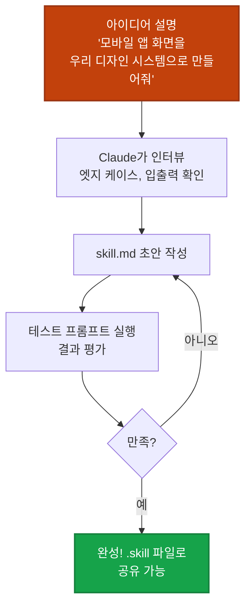

## 이게 뭔가요?

Claude Code 안에는 **디자이너를 위한 숨겨진 플러그인**들이 있습니다. 이걸 "Skills"라고 부르는데요, 평소에 Claude에게 "랜딩 페이지 만들어줘"라고 하면 나오는 그 뻔한 결과물 — 보라색 그라데이션, 둥근 카드, Inter 폰트 — 기억나시죠?

**Skills를 켜면 Claude가 "디자이너처럼 생각"한 다음에 코드를 씁니다.** 그 차이가 엄청납니다.

비유하자면:

> **Skills 없이** = 인테리어 경험 없는 사람에게 "예쁘게 꾸며줘"라고 하는 것. 결과? IKEA 카탈로그 그대로 베끼기.
> **Skills 사용** = 전문 인테리어 디자이너에게 컨셉 보드와 브랜드 가이드를 주고 의뢰하는 것.

## 왜 알아야 하나요?

Claude로 UI를 생성하면 흔히 이런 결과물이 나옵니다:

- 😩 **보라색 그라데이션** 배경 (어디서 많이 본 그거)
- 😩 **흰 배경 + 둥근 카드** 반복 (Pinterest 검색 결과 같은 느낌)
- 😩 **Inter 폰트** 하나로 제목부터 본문까지 전부 처리
- 😩 **호버 효과 없음**, 버튼이 클릭 가능한지조차 애매

이걸 업계에서는 **"AI 슬롭(AI Slop)"**이라고 부릅니다. Claude의 Skills 시스템은 바로 이 문제를 해결하기 위해 만들어졌습니다.

## 어떻게 하나요?

### 스킬 1: Frontend Design (핵심 스킬)

이 스킬은 Claude에게 **디자인 씽킹 프로세스**를 강제합니다. 코드 한 줄 쓰기 전에 4가지를 먼저 고려해요:

1. **Purpose** — 이 화면의 목적이 뭔지
2. **Tone** — 어떤 분위기를 전달할지
3. **Constraints** — 어떤 제약이 있는지
4. **Differentiation** — 뻔하지 않으려면 뭘 다르게 할지

그리고 이 스킬에는 **"AI 슬롭 금지 목록"**이 내장되어 있습니다:

| ❌ 금지 항목 | ✅ 대신 이렇게 |
|-------------|---------------|
| Inter, Arial 같은 뻔한 폰트 | 개성 있는 폰트 페어링 |
| 보라색 그라데이션 | 브랜드에 맞는 커스텀 컬러 |
| 흰 배경 + 둥근 카드 반복 | 목적에 맞는 레이아웃 구성 |
| 아무 효과 없는 버튼 | hover, focus, active 상태 전부 구현 |

<div class="example-case">
<strong>💬 예시: Frontend Design 스킬 활용</strong>

Claude에게 평소처럼 말하면 됩니다:

```
SaaS 대시보드 랜딩 페이지 만들어줘.
타겟은 스타트업 창업자, 톤은 신뢰감 있으면서 현대적으로.
```

스킬이 활성화되어 있으면 Claude가 **타이포그래피, 컬러, 모션, 공간 구성, 분위기**까지 고려한 결과물을 생성합니다. "아, 이건 확실히 AI가 만든 거네"라는 느낌이 확 줄어요.

</div>

### 스킬 2: Implement Design (Figma → 코드)

Figma에서 디자인한 화면을 Claude에게 주면 **1:1에 가까운 코드**로 변환해주는 스킬입니다.

**작동 방식:**

1. Figma URL을 Claude에 붙여넣기
2. 스킬이 Figma MCP 서버를 통해 **실제 디자인 데이터**를 읽어옴
   - Auto Layout 설정, 타이포그래피, 컬러값, 스페이싱 토큰 등
3. 디자인 스크린샷을 시각적 참고자료로 활용
4. 아이콘/이미지 등 에셋 다운로드
5. 프로젝트의 **기존 컴포넌트 라이브러리**에 맞춰 코드 생성
6. 검증 체크리스트 자동 실행 (레이아웃, 타이포, 컬러, 인터랙션, 반응형, 접근성)

<div class="example-case">
<strong>📌 실전 케이스: Figma 디자인을 코드로 변환</strong>

**준비물**: Figma MCP 서버 연결이 필요합니다.

```
이 Figma 화면을 코드로 변환해줘:
https://www.figma.com/file/abc123/MyDesign?node-id=1:234
```

Claude가 URL에서 파일 키와 노드 ID를 파싱 → Figma API로 디자인 데이터를 가져와서 → 프로젝트의 기존 버튼, 인풋 등 컴포넌트를 재활용해서 코드를 생성합니다.

**스크린샷을 Claude에 붙여넣는 것과 다른 점**: 스크린샷은 "비슷하게" 만들지만, 이 스킬은 **실제 디자인 속성값**을 읽어서 정확하게 변환합니다.

</div>

### 스킬 3: Theme Factory (10가지 프로 테마)

10개의 **전문가가 만든 테마 프리셋**을 제공합니다. 각 테마에는 컬러 팔레트와 폰트 페어링이 포함돼 있어요.

- 🎯 **용도**: 랜딩 페이지, 대시보드, 프레젠테이션, 보고서, 슬라이드 등 뭐든 적용 가능
- 🎨 **특징**: 무작위 색 조합이 아니라 **특정 상황**에 맞게 설계된 테마
  - 기업 프레젠테이션용, 크리에이티브 피칭용, 에디토리얼 레이아웃용 등

<div class="example-case">
<strong>💬 예시</strong>

```
이 대시보드에 Theme Factory의 corporate 테마를 적용해줘
```

컬러와 폰트가 한번에 일관되게 바뀝니다. 20분 동안 색상 고르고 폰트 조합 실험할 필요가 없어요.

</div>

### 스킬 4: Brand Guidelines (브랜드 일관성 자동화)

**"우리 회사 브랜드에 맞게 만들어줘"를 자동화**하는 스킬입니다.

기본적으로는 Anthropic의 브랜드 가이드라인이 탑재되어 있지만, 진짜 가치는 **이걸 템플릿으로 삼아 내 회사 브랜드로 커스텀하는 것**에 있습니다.

**설정하면 이런 것들이 자동 적용됩니다:**

- Hex 코드 (Primary, Secondary 등)
- 폰트 스택 (제목용, 본문용)
- 스페이싱 규칙
- 로고 사용 규칙
- 톤 & 매너

<div class="example-case">
<strong>📌 실전 케이스: 소규모 팀의 브랜드 일관성</strong>

디자인 시스템 전담 인력이 없는 5인 스타트업을 상상해보세요:

1. Brand Guidelines 스킬을 자사 브랜드 컬러, 폰트, 규칙으로 세팅
2. **마케팅 팀, 영업 팀** 등 비디자이너에게도 공유
3. 누가 Claude로 만들든 **자동으로 브랜드 가이드를 따르는 결과물**이 나옴

→ 더 이상 "이거 우리 브랜드 컬러 아닌데..." 하고 수정할 일이 줄어듭니다.

</div>

### 스킬 5: Canvas Design (시각 아트 생성)

UI가 아닌 **실제 시각 디자인 작품**(포스터, 그래픽, 소셜 이미지 등)을 PNG/PDF로 생성하는 스킬입니다.

**독특한 2단계 프로세스:**

1. **디자인 철학 수립** — Claude가 먼저 "미학 매니페스토"를 작성 (시각적 원칙, 형태, 색상, 구도 규칙 정의)
2. **캔버스에 표현** — 그 철학을 바탕으로 실제 이미지 파일을 생성

Photoshop이나 Illustrator를 대체하진 않지만, **시각적 방향성을 빠르게 탐색**하는 용도로 유용합니다.

## Skill Creator로 나만의 스킬 만들기

기존 스킬로 부족하다면? **Skill Creator**라는 "스킬을 만드는 스킬"이 있습니다.



**스킬의 구조는 간단합니다:**

```
my-skill/
├── SKILL.md        ← 핵심 지시서 (이름, 설명, 트리거, 실행 규칙)
├── scripts/        ← (선택) 보조 스크립트
└── references/     ← (선택) 참고 문서
```

<div class="example-case">
<strong>💬 예시: 커스텀 스킬 아이디어</strong>

- **"UX 카피라이터"** 스킬 — 우리 브랜드 보이스에 맞는 마이크로카피 생성
- **"모바일 스크린 생성기"** 스킬 — 자사 디자인 시스템 컴포넌트로 앱 화면 생성
- **"접근성 검수"** 스킬 — 생성된 UI의 WCAG 가이드라인 준수 여부 자동 체크

만든 스킬은 `.skill` 파일로 패키징해서 팀원에게 공유하거나, 다른 기기에 설치할 수 있습니다.

</div>

## 주의할 점

- **Figma MCP 연결 필수**: Implement Design 스킬을 쓰려면 먼저 Figma MCP 서버를 Claude에 연결해야 합니다. 이게 없으면 Figma URL을 붙여넣어도 디자인 데이터를 못 읽어요.
- **Skills ≠ 마법**: 스킬이 결과물의 퀄리티를 높여주지만, 좋은 프롬프트와 구체적인 요구사항은 여전히 중요합니다.
- **Brand Guidelines는 직접 세팅해야**: 기본은 Anthropic 브랜드로 되어있으니, 자사 브랜드로 반드시 커스텀하세요.
- **Canvas Design은 보조 도구**: Photoshop/Illustrator 대체가 아닌, 방향성 탐색용으로 활용하세요.

## 정리

- **Frontend Design 스킬** 하나만 켜도 "AI가 만든 티"가 확 줄어든다
- **Figma MCP + Implement Design**으로 디자인→코드 변환 정확도를 높일 수 있다
- **Skill Creator**로 우리 팀에 딱 맞는 커스텀 스킬을 만들어 공유할 수 있다

---

> 📺 참고 영상: [Claude Code Skills for Designers](https://www.youtube.com/watch?v=Iup1WlUyj9M)
