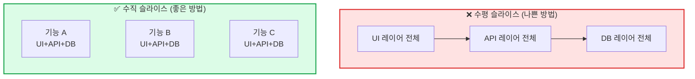

## 이게 뭔가요?

10년차 엔지니어 Matt Pocock이 **매일 실제로 사용하는 Claude Code 스킬 5개**를 공개한 영상입니다. 핵심은 개별 스킬이 아니라 **스킬을 체이닝(연결)해서 파이프라인을 만드는 것**이에요.

카카오톡으로 비유하면, 스킬 하나하나는 **이모티콘**이고, 이 파이프라인은 **대화 흐름 자체**입니다. 이모티콘을 아무 데나 던지면 의미 없지만, 대화 맥락에 맞게 쓰면 소통이 훨씬 잘 되죠.


## 왜 알아야 하나요?

AI 에이전트의 가장 큰 약점은 **기억력이 없다**는 것입니다. 아무리 똑똑해도 매번 새로 태어나는 셈이에요. 그래서 **프로세스(절차)**가 중요합니다.

- 프로세스 없이 AI에게 "기능 만들어줘" → 대충 만들고 끝, 품질 들쭉날쭉
- 프로세스 있으면 → 매번 같은 품질, 점점 나아지는 코드

이 파이프라인을 쓰면:
- 아이디어 단계에서 **빠뜨린 것**을 잡아냄
- PRD로 **목적지를 명확히** 정의함
- 이슈 분해로 **실행 가능한 단위**로 쪼갬
- TDD로 **코드 품질**을 올림
- 아키텍처 개선으로 **코드베이스 자체**를 좋게 만듦

## 어떻게 하나요?

### 스킬 1: Grill Me (질문 공세) [00:00]

**단 3문장**으로 된 스킬입니다. 짧지만 가장 강력합니다.

```
Interview me relentlessly about every aspect of this plan
until we reach a shared understanding.
Walk down each branch of the design tree,
resolving dependencies between decisions one by one.
If a question can be answered by exploring the codebase,
explore the codebase instead.
```

**디자인 트리(Design Tree)**라는 개념이 핵심이에요. 나무처럼 가지를 따라가며 결정을 내리는 거예요.

<div class="example-case">
<strong>💬 예시: 검색 페이지 설계</strong>

"검색 페이지를 만들자" → 가지 1: 고급 검색? 텍스트 박스?
→ 고급 검색 선택 → 가지 2: 어떤 필터? 어떤 정렬?
→ 필터 결정 → 가지 3: 날짜 범위? 카테고리?
→ 이렇게 모든 가지를 끝까지 따라감

</div>

실전에서는 **16~50개 질문**을 주고받으며 30분~45분이 걸릴 수 있습니다. Matt Pocock은 복잡한 기능일수록 이 과정이 길어진다고 합니다.

<div class="example-case">
<strong>📌 실전 케이스: 문서 편집 기능 추가</strong>

Matt이 자신의 코스 영상 편집기에 문서 편집 기능을 추가할 때:

1. 마크다운 파일에 리서치 결과를 정리
2. `/grill-me` 실행: "이 기능을 오른쪽 패널에 추가하고 싶어"
3. Claude가 코드베이스를 먼저 탐색
4. 질문 16개를 연달아 던짐:
   - "문서는 어디에 저장되나요?"
   - "UI 레이아웃은?"
   - "어떤 모드에서 문서 패널이 보이나요?"
   - "문서 생명주기는?"
   - ... 등등

결과: 구현 전에 모든 결정을 내림

</div>

**핵심 교훈**: 스킬은 길 필요가 없습니다. **적절한 타이밍에 적절한 단어**를 주는 것이 중요합니다.

---

### 스킬 2: Write a PRD (기획서 작성) [05:30]

Grill Me로 공유 이해에 도달하면, 그 이해를 **문서로 고정**합니다. PRD(Product Requirements Document)는 "우리가 어디로 가는지" 적은 **목적지 문서**예요.

스킬의 구조:

```
1. 사용자에게 상세한 설명 요청
2. 코드베이스 탐색해서 주장 검증
3. 사용자를 집요하게 인터뷰 (Grill Me 재사용)
4. 구현에 필요한 주요 모듈 스케치
5. 완전한 이해에 도달하면 → 템플릿으로 PRD 작성
6. GitHub 이슈로 제출
```

<div class="example-case">
<strong>💬 예시: PRD 결과물</strong>

**문제 정의**: 글 작성 페이지에서 AI 상호작용 시마다 전체 문서가 재생성됨

**해결책**: 글 작성기에 분할 패널 문서 편집 경험 추가
- 왼쪽: 채팅 유지
- 오른쪽: 새 문서 패널

**사용자 스토리**: 수많은 유저 스토리가 "원하는 동작"을 자연어로 기술

**구현 결정사항**: 과하게 구체적이지 않게 (코드가 PRD와 달라지면 문제)

</div>

**중요**: PRD는 **목적지(destination)**를 설명합니다. **여정(journey)**은 아직 정하지 않습니다.

---

### 스킬 3: PRD to Issues (이슈 분해) [08:30]

목적지(PRD)가 정해졌으면, 이제 **여정**을 계획합니다. 큰 PRD를 **독립적으로 잡을 수 있는 이슈**로 쪼개는 스킬이에요.

핵심 원칙: **수직 슬라이스(Vertical Slice)**



- **수평 슬라이스**: "먼저 DB 전체 만들고, 그 다음 API 전체..." → 통합할 때 터짐
- **수직 슬라이스**: "기능 A를 UI부터 DB까지 얇게 관통" → 통합 문제 빨리 발견

<div class="example-case">
<strong>📌 실전 케이스: 문서 편집 PRD 분해</strong>

복잡한 PRD가 단 4개 슬라이스로 분해됨:

1. **편집 엔진** (테스트 포함) — 핵심 기반, 이게 안 되면 전체 불가
2. **UI 패널 통합** — 1번에 의존하지 않음, **병렬 작업 가능**
3. **채팅-문서 연동** — 1번(편집 엔진)에 의존
4. **Monaco 에디터 토글** — 2번에 의존

블로킹 관계까지 설정:
- 이슈 2는 이슈 1과 **독립적** → 동시 작업 가능
- 이슈 3은 이슈 1이 **완료되어야** 시작
- 이슈 4는 이슈 2가 **완료되어야** 시작

</div>

**트레이서 불릿(Tracer Bullet)**: 미지의 통합 지점을 먼저 관통하는 얇은 슬라이스를 만들어, 접근법이 유효한지 빠르게 검증합니다.

---

### 스킬 4: TDD (테스트 주도 개발) [12:00]

이슈가 분해되면 실제 구현에 들어갑니다. **레드-그린-리팩터** 루프로 코드 품질을 올리는 스킬이에요.

```
1. 사용자와 인터페이스 변경 사항 확인
2. 테스트할 동작 합의
3. 테스트 가능하도록 인터페이스 설계
   ↓ (루프 시작)
4. 실패하는 테스트 1개 작성 (🔴 레드)
5. 테스트 통과하는 코드 작성 (🟢 그린)
6. 리팩터링 후보 확인 (🔄 리팩터)
   ↓ (완료될 때까지 반복)
```

**인터페이스(Interface)**가 왜 중요한가:

- **나쁜 코드베이스**: 작은 모듈이 뒤죽박죽 → AI가 관계 파악 어려움 → 테스트 경계 불명확
- **좋은 코드베이스**: 큰 모듈 + 얇은 인터페이스 → AI가 쉽게 탐색 → 인터페이스에서 테스트

<div class="example-case">
<strong>💬 예시: TDD 루프 실행 결과</strong>

편집 엔진 이슈를 TDD로 구현한 결과:
- "순수 함수 문서 편집 엔진, 28개 테스트로 모든 수락 기준 커버"
- Claude Code가 자동으로 이슈에 코멘트, 닫기, 다음 이슈 언블록

</div>

**주의할 점**: LLM은 자기가 방금 작성한 코드를 리팩터링하기 **꺼려합니다**. 컨텍스트 윈도우에 자기 코드가 있으면 "소중하게" 여기기 때문이에요. 컨텍스트를 초기화하면 훨씬 과감하게 리팩터링합니다.

---

### 스킬 5: Improve Codebase Architecture (아키텍처 개선) [15:00]

TDD가 잘 작동하려면 코드베이스 자체가 잘 구조화되어야 합니다. 이 스킬은 **얕은 모듈을 깊은 모듈로** 만들어줍니다.

```
1. 코드베이스를 자연스럽게 탐색 — AI가 혼란스러운 지점 발견
2. "깊은 모듈로 만들 수 있는" 후보 목록 제시
3. 사용자가 후보 선택
4. 서브에이전트 3개를 병렬로 띄워 각각 다른 인터페이스 디자인 제안
5. 디자인 비교 → 최적안 선택 (하이브리드 가능)
6. GitHub 이슈로 리팩터링 RFC 생성
```

<div class="example-case">
<strong>💬 예시: 아키텍처 개선 질문</strong>

AI가 코드베이스를 탐색하며 찾는 것들:
- "하나의 개념을 이해하려면 여러 작은 파일을 왔다갔다해야 하는 곳은?"
- "테스트 가능성만을 위해 순수 함수로 추출했지만, 진짜 버그는 호출 방식에 숨어있는 곳은?"
- "밀접하게 결합된 모듈이 통합 리스크를 만드는 곳은?"

</div>

**핵심 원칙**: "쓰레기 코드베이스에서는 AI도 쓰레기를 만듭니다." 코드베이스를 개선할수록 AI 출력 품질도 올라갑니다.

**사용 빈도**: 주 1회 정도, 또는 대규모 기능 개발 후에 실행하면 효과적입니다.

## 실전 예시

<div class="example-case">
<strong>📌 실전 케이스: 전체 파이프라인 — 문서 편집 기능 추가</strong>

**상황**: 코스 영상 편집기에 분할 패널 문서 편집 기능을 추가하고 싶음

**1단계 — Grill Me**: 리서치 파일을 주고 "이 기능에 대해 질문해줘"
→ 16개 질문으로 모든 결정 사항 정리 (30분)

**2단계 — Write a PRD**: "PRD 써줘"
→ 문제 정의 + 해결책 + 사용자 스토리 + 구현 결정 → GitHub 이슈로 생성

**3단계 — PRD to Issues**: "이슈로 분해해줘"
→ 4개 수직 슬라이스 + 블로킹 관계 설정 → 각각 GitHub 이슈 생성

**4단계 — TDD**: Ralph 루프가 각 이슈를 TDD로 구현
→ 이슈 1: "편집 엔진 + 28개 테스트" → 자동 완료 → 이슈 3 언블록

**5단계 — Architecture**: 기능 완성 후 코드베이스 점검
→ 새 기능이 기존 구조와 잘 맞는지 확인, 필요시 리팩터링

</div>

## 주의할 점

- **스킬 길이 ≠ 효과**: Grill Me는 3문장인데 가장 강력합니다. 불필요하게 긴 스킬을 만들지 마세요.
- **TDD에는 좋은 코드 구조가 필수**: 모듈 경계가 불명확한 코드에서는 TDD가 어렵습니다. 아키텍처 개선을 먼저 하세요.
- **LLM의 자기 코드 편향**: AI는 자기가 방금 쓴 코드를 고치기 꺼립니다. 리팩터링이 필요하면 컨텍스트를 초기화하세요.
- **PRD를 과하게 구체적으로 쓰지 마세요**: 코드가 PRD와 달라지면 구현 시 혼란이 생깁니다. 목적지만 명확히, 여정은 유연하게.

## 정리

- **5개 스킬**이 하나의 파이프라인: 아이디어 → 질문 공세 → 기획서 → 이슈 분해 → TDD 구현 → 아키텍처 개선
- AI 에이전트는 기억력이 없으므로 **프로세스(스킬)로 품질을 보장**해야 합니다
- 코드베이스 품질이 곧 AI 출력 품질입니다 — **쓰레기 인, 쓰레기 아웃**

> 📺 참고 영상: [5 Skills I Use Every Day in Claude Code](https://www.youtube.com/watch?v=EJyuu6zlQCg) — Matt Pocock
