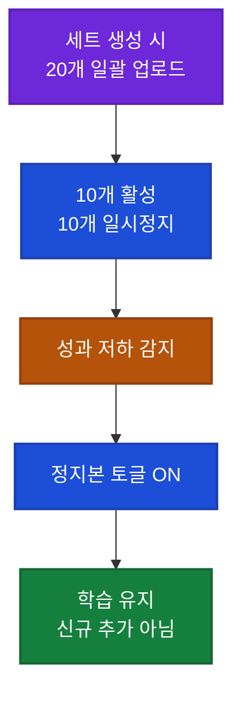

## 이게 뭔가요?

Facebook 광고를 돌려본 사람이라면 "같은 타깃인데 왜 광고마다 결과가 다르지?"라는 경험이 있을 겁니다. 이 영상(포르투갈어, 제작자 Ana)은 **Facebook의 최신 알고리즘 Andromeda(안드로메다)가 크리에이티브(ad creative, 광고 영상·이미지 소재)를 4개 층으로 뜯어 읽는다**는 점을 설명합니다.

그래서 해결책은 "Claude에게 광고 카피를 쓰게 하는 것"이 아니라, **"Claude를 소비자 행동 전문가로 훈련시켜 시그널(알고리즘이 읽는 신호)을 먼저 매핑하게 하는 것"** 입니다.

**일상 비유**: 약국에 신규 환자가 들어왔을 때, 약사는 단순히 "어떤 증상?"만 묻지 않습니다. 표정·옷차림·걸음걸이·말투를 종합해 "이 분은 지금 어떤 상황인가"를 빠르게 읽습니다. Andromeda도 똑같습니다. 영상의 배경·단어·감정·시작 3초를 모두 읽고 "누구에게 보낼지"를 결정합니다.

> 영상 제작자는 "시그널을 심은 후 7일에 300건 판매"라고 주장합니다. 이는 **제작자 본인 경험**이며 시장·제품·예산이 다르면 결과는 다를 수 있습니다.

## 왜 알아야 하나요?

비개발자 마케터·자영업자에게 Facebook 광고는 여전히 가장 접근성 높은 유료 채널입니다. 하지만 흔한 실수 패턴이 있습니다.

- Claude에게 "광고 문구 써줘"만 시킴 → 결과물이 일반적(generic)이라 알고리즘이 일반적 오디언스로 보냄
- 광고 10개를 올렸는데 예산이 1~2개에만 쏠림
- 첫날·이튿날은 팔리다가 3일 만에 캠페인이 죽음

영상은 이 모든 문제를 **"시그널이 누락됐기 때문"** 으로 진단합니다.

## Andromeda가 읽는 4개 레이어

| 레이어 | 읽는 것 | 예시 차이 |
|---|---|---|
| 시각 레이어 | 배경·색·얼굴·사물·구도 | 방 안 촬영 vs 스튜디오 vs 야외는 다른 시그널 |
| 시맨틱 레이어 | 말과 글자의 의미·톤·의도 | 같은 단어라도 단정 vs 친근 톤이 다르게 해석 |
| 감정 레이어 | 긴급·공포·욕망·신뢰·유머·배경음악 | 빠른 컷 + 긴박 BGM = 긴급성 시그널 |
| Hook 레이어 (첫 3초) | 영상 도입부에서 시선을 멈추게 하는지 | Andromeda가 별도 점수로 매김 |

- **Hook(광고 첫 3초에 보이는 도입 장면·문장)**: 이 점수가 낮으면 같은 세트 안에서도 예산이 거의 안 붙습니다. 영상에서 "20개 올려도 이기는 광고는 1~2개"인 이유가 이것입니다.
- **시맨틱 지문(semantic fingerprint)**: Andromeda는 크리에이티브마다 고유 임프린트(imprint, 고유 지문)를 만듭니다. 서로 비슷한 크리에이티브는 알고리즘이 **"하나의 광고"로 묶어버려서** 10개 올려도 입찰 경매에는 1개만 들어갑니다. 중복 페널티입니다.

## 어떻게 하나요?

### 기존 접근 vs 새로운 접근

**기존 (비추천)**: "Claude야, 내 상품 팔 광고 카피 써줘"
→ 일반적 카피 → 알고리즘이 일반적 시그널 읽음 → 일반적 오디언스에 전달 → 클릭 비싸고 전환 낮음.

**새로운 접근 (영상 권장)**: "Claude야, 너는 소비자 행동 전문가다. 내 상품·고객을 알려줄 테니 시그널을 매핑해달라."
→ 심리·상황·감정이 담긴 프롬프트 → 알고리즘이 구체 시그널을 읽음 → 실제 구매 직전 오디언스에 도달.

### Claude에게 던질 4개 매핑 질문

영상에서 제시한 프롬프트 구조의 핵심은 다음 4개 질문입니다.

1. **구매 직전 고객의 인생 상황은?** (몇 시, 어디, 무엇을 하고 있을 때 결심이 서는가)
2. **Hook 3초에 멈추게 할 문장은?** (상품 얘기가 아니라 **고객이 혼자 중얼거린 문장**)
3. **구매 직전 감정과 구매 직후 감정은?** (예: 죄책감→안도감)
4. **이미 시도했다가 실패한 것은?** (경쟁 대안의 실망 지점)

<strong>예시: 영상의 실제 사례 — 천연 화장품 창업 강의</strong>

- **상품**: 천연 화장품 만들기 강의 (부업·소자본 창업 타깃)
- **고객**: 아이와 시간을 더 보내고 싶은 온라인 부수입이 필요한 워킹맘

Claude가 매핑한 결과:

- **구매 직전 상황**: "이른 아침 아이를 유치원에 보내고, 버스 안이나 마트 줄에서 '뭔가 해야 하는데 집 밖에 하루 종일 나갈 순 없어'라고 생각하는 순간"
- **Hook 3초 문장**: "수입은 필요해요. 그런데 애랑 같이 있는 시간은 포기 못 해요." → **상품 얘기 없음, 고객이 혼자 삼켜온 문장 그대로**
- **구매 전 감정**: 죄책감·정체감·뒤처진다는 조급함
- **구매 후 감정**: 주도감·안도·남편에게 자랑하고 싶은 자부심
- **이미 시도하고 실패한 것**: 의류 리셀, 화장품 방문판매(아본·나투라), 여러 부업 강의

이 매핑을 먼저 끝낸 뒤에야 Claude에게 광고 스크립트를 요청합니다.

### 27개 변형 조합 기법

하나의 매핑이 끝나면 Claude에게 다음을 요청합니다.

- Hook 3개
- Body(본문 중간부) 3개
- CTA(Call To Action, 행동 유도 버튼) 3개

3 × 3 × 3 = 27개의 조합이 생깁니다. 영상은 "영상 찍는 수고 없이 변형만으로 27개 소재를 확보하는 방법"이라 설명합니다. 다만 각 조합의 **시각 레이어**(옷·배경·촬영 각도)도 달라야 Andromeda가 서로 다른 크리에이티브로 인식합니다.

### 캠페인 운영: 20개 올리고 로테이션

영상에서 공개한 **"컨설팅에서만 알려주던 팁"** 입니다.

- 한 세트(ad set)에 크리에이티브 20개를 한꺼번에 업로드한다
- 20개 중 10개는 즉시 일시정지(pause), 10개만 활성화
- 시간이 지나 성과가 떨어지면 정지해둔 10개를 토글로 켠다 (신규 추가가 아니라 **토글**)

**왜 토글인가**: 새 크리에이티브를 "추가"하면 Facebook이 캠페인 학습을 **리셋**합니다. 성과가 일시 떨어집니다. 반면 처음부터 20개를 올려두고 꺼뒀다가 켜면 **학습 상태가 유지**됩니다.

## 실전 예시

<strong>실전 케이스: B2B 약국 타깃 광고에 응용하기</strong>

YMYD처럼 약사·약국장 대상 B2B 서비스를 광고한다고 가정해봅시다. 이 방법론의 핵심 원칙은 다음과 같이 이식됩니다.

- **Hook 첫 3초는 약사 스스로 혼잣말한 문장이어야 한다**. 예: "야간 조제 한 명에 의존하는 구조, 이게 언제까지 갈까" — 서비스 얘기가 아니라 **약국장 혼자 떠올린 생각**
- **구매 직전 상황**: 평일 늦은 오후, 마감 정리 중 인력난·폐업률 뉴스를 본 순간
- **구매 전 감정**: 막막함·책임감 피로
- **구매 후 감정**: "이걸로 한 달은 버틴다"는 안도감
- **이미 시도했다가 실패한 것**: 일반 구인 플랫폼, 아는 사람 소개, 광고 전단

이 매핑 위에 Hook·Body·CTA 3개씩 조합하면, 시맨틱 지문이 중복되지 않는 크리에이티브 여러 개가 나옵니다.

## 주의할 점

- **"7일 300건"은 영상 제작자 개인 경험**: 시장·상품·객단가·예산에 따라 결과는 크게 다릅니다. 맹신 금지.
- **Andromeda 알고리즘 내부 동작은 Meta가 공식 문서로 공개한 것이 아닙니다**: 영상 설명은 업계 관찰·실험 기반 해석입니다. 정확한 점수 체계는 외부에서 알 수 없습니다.
- **시그널 매핑은 "대체"가 아니라 "선행"**: Hook 3개·Body 3개·CTA 3개 뽑아내도 결국 **촬영·편집은 사람이 해야** 합니다. Claude는 기획 파트너이지 제작자가 아닙니다.
- **27개 변형이라 해도 시각 레이어가 똑같으면 중복으로 묶임**: 같은 옷·같은 방·같은 각도로 27개 찍으면 Andromeda는 1개로 간주합니다. 배경·복장·구도를 바꿔야 실제 변형이 됩니다.
- **영상 자체가 본인 컨설팅 홍보**: 영상 마지막에 유료 1:1 컨설팅 안내가 있습니다. 주장에 편향이 있을 수 있다는 점을 전제로 판단하세요.

## 정리

- Andromeda는 크리에이티브를 시각·시맨틱·감정·Hook 4레이어로 읽고 고유 지문을 만듭니다. 비슷한 광고는 1개로 묶입니다.
- Claude를 "소비자 행동 전문가"로 훈련시켜 구매 상황·Hook 문장·감정·실패 경험 4가지를 먼저 매핑한 뒤 카피 제작으로 넘어갑니다.
- 한 세트에 20개 업로드 후 토글로 로테이션하면 학습 리셋 없이 크리에이티브 피로를 관리할 수 있습니다.

---

**참고 영상**: [Fiz 300 VENDAS em 7 dias: Usando um ÚNICO Prompt no CLAUDE CODE (Descomplica Ads)](https://youtube.com/watch?v=ZSp6JFUF2fM)
