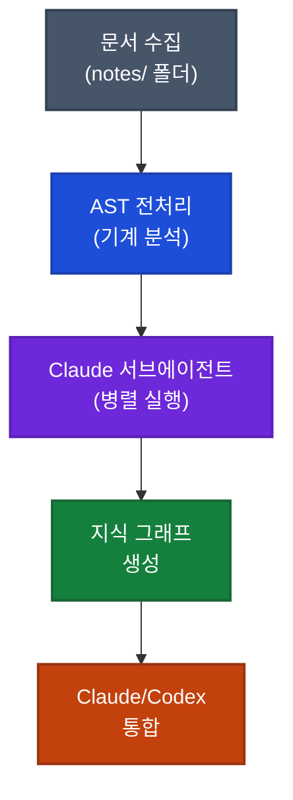

## 이게 뭔가요?

**Graphify(그래피파이)**는 내가 가진 문서들을 AI(인공지능)가 빠르게 검색하고 답변할 수 있는 지식베이스로 변환해주는 도구입니다.

쉽게 비유하면: 회사에 신입사원이 들어왔을 때 모든 보고서를 처음부터 끝까지 읽게 시키는 것(LM Wiki 방식)과, 먼저 목차와 핵심 키워드만 정리해주고 필요할 때 찾아보게 하는 것(Graphify 방식)의 차이입니다. 두 번째 방법이 훨씬 빠르고 저렴하죠.

기존 도구인 **LM Wiki**는 문서를 AI 에이전트(자동으로 작업을 수행하는 AI)가 전부 읽어서 처리하기 때문에 토큰(AI 사용 비용 단위)을 많이 소비했습니다. Graphify는 먼저 기계적으로 문서 구조를 분석한 뒤, 핵심 뼈대만 AI에게 전달하여 비용을 대폭 줄입니다.

## 왜 알아야 하나요?

- **토큰 절감**: 대규모 문서 기준 최대 71.5배 비용 절감 (소규모 문서 기준 약 5.4배)
- **Claude 통합**: `graphify claude install` 명령어 한 줄로 Claude Code에 지식베이스 연결 가능
- **Codex 지원**: OpenAI Codex CLI(키보드로 명령어를 입력하는 AI 도구)와도 통합 가능
- **시각화 제공**: 내 지식이 어떻게 연결되어 있는지 그래프로 확인 가능

내 마크다운(Markdown — 간단한 형식의 텍스트 문서) 파일, 논문, 이미지 등을 모아두면 AI가 그 안에서만 답변하는 나만의 위키가 완성됩니다.

## 어떻게 하나요?

### 방법 1: 처음부터 세팅하기 (4단계)

**1단계: 프로젝트 폴더 생성 및 Graphify 설치**

UV(파이썬 패키지 관리자)로 가상 환경(다른 프로젝트와 독립된 작업 공간)을 만들고 Graphify를 설치합니다.

```bash
# 새 폴더 만들기
mkdir my-knowledge-base
cd my-knowledge-base

# Graphify 설치 (패키지 이름 끝에 y가 두 개)
pip install graphifyy
```

> **참고**: UV 가상 환경 설정이 처음이라면 Claude에게 "UV로 가상 환경 만들고 graphifyy 설치해줘"라고 요청하면 됩니다.

**2단계: 지식 파일 모으기**

프로젝트 폴더 안에 `notes/` 폴더를 만들고 문서를 넣습니다.

```
my-knowledge-base/
└── notes/
    ├── 내-마케팅-전략.md
    ├── 제품-스펙.md
    └── 회의록-2026.md
```

어떤 형식이든 가능합니다: 마크다운, PDF, 이미지, 코드 파일 모두 지원.

**3단계: Graphify 실행 (지식 그래프 생성)**

```bash
graphify ./notes
```

이 명령어를 실행하면 Graphify가 자동으로:
1. AST(Abstract Syntax Tree — 문서 구조를 뼈대로 변환하는 기술) 분석으로 기계적 전처리
2. Claude 서브에이전트들이 병렬로 실행되어 개념, 관계, 핵심 내용 추출
3. 지식 그래프(노드와 연결선으로 이루어진 지식 지도) 생성

처리 시간은 파일 수에 따라 5~10분 정도 소요됩니다.

**4단계: Claude / Codex에 통합**

```bash
# Claude Code와 통합
graphify claude install

# 또는 OpenAI Codex CLI와 통합
graphify codex install
```

이후부터는 해당 프로젝트 폴더에서 Claude나 Codex에게 질문하면, 내가 넣어둔 문서 안에서만 답변합니다.

<div class="example-case">
<strong>예시: 마케팅 지식베이스 구축</strong>

```bash
mkdir marketing-kb
cd marketing-kb
pip install graphifyy

# notes 폴더에 마케팅 자료 복사
mkdir notes
# (Mac: 파인더에서 드래그 / Windows: 파일 탐색기에서 드래그 / 또는 cp 명령어로 복사)

# 그래프 생성 (5~10분 소요)
graphify ./notes

# Claude에 연결
graphify claude install
```

이제 이 폴더에서 Claude에게 "경쟁사 분석 어떻게 돼 있어?"라고 물으면 내 문서 기반으로 답변해줍니다.

</div>

### 방법 2: LM Wiki 자료 그대로 이전하기

기존에 LM Wiki를 사용하고 있었다면, `raw/` 폴더에 있던 파일들을 Graphify의 `notes/` 폴더로 복사만 하면 됩니다. 폴더 구조를 따로 정리할 필요 없이 그냥 넣으면 됩니다.

## 실전 예시

<div class="example-case">
<strong>실전 케이스: 25개 마크다운 문서로 위키 만들기</strong>

영상 제작자가 실제로 25개의 마크다운 파일(각종 메모, 가이드, 정리 문서)을 `notes/` 폴더에 넣고 `graphify ./notes`를 실행한 사례입니다.

- **처리 시간**: 약 5~6분
- **결과물**: `graphify-out/` 폴더에 3개 파일 생성
  - `graph.html` — 지식 그래프 시각화 (브라우저에서 열람 가능)
  - `graph-report.md` — 분석 요약 리포트
  - `graph.json` — 기계 처리용 데이터

`graph.html`을 열면 문서들이 어떻게 연결되어 있는지 인터랙티브 그래프로 확인 가능합니다. 인스타그램 관련 문서들이 한 클러스터로 모이고, 전혀 다른 주제는 별도 노드로 분리되는 식입니다.

</div>



## 주의할 점

- **패키지 이름 주의**: PyPI(파이썬 패키지 저장소)에서 패키지 이름은 `graphifyy` (y가 두 개)이지만, 실행 명령어는 `graphify` (y 하나)입니다. 헷갈리지 않도록 주의하세요.
- **처리 시간**: 문서가 많을수록 시간이 걸립니다. 25개 파일 기준 5~6분 예상.
- **Claude API 키 필요**: Graphify가 내부적으로 Claude 서브에이전트를 사용하므로 Claude API(프로그램끼리 대화하는 통로) 키 설정이 필요합니다.
- **토큰 절감 폭은 문서 크기에 따라 다름**: 소규모 문서(4~6개)에서는 5배 내외, 대규모 코퍼스(50개 이상)에서는 최대 71.5배까지 절감됩니다.

## 정리

- Graphify는 LM Wiki의 토큰 낭비를 해결한 지식베이스 도구로, AST 기반 전처리 후 Claude 서브에이전트가 병렬로 내용을 추출합니다.
- `pip install graphifyy` → `graphify ./notes` → `graphify claude install` 세 단계로 나만의 위키를 완성할 수 있습니다.
- 대규모 문서 기준 최대 71.5배 토큰 절감이 가능해, 요금제가 제한적인 사용자에게 특히 유용합니다.

---

참고 영상: [LLM Wiki를 업그레이드한 Graphify 개념 + 실습 가이드 — 편집자P](https://www.youtube.com/watch?v=s15ojX1P4NY)
