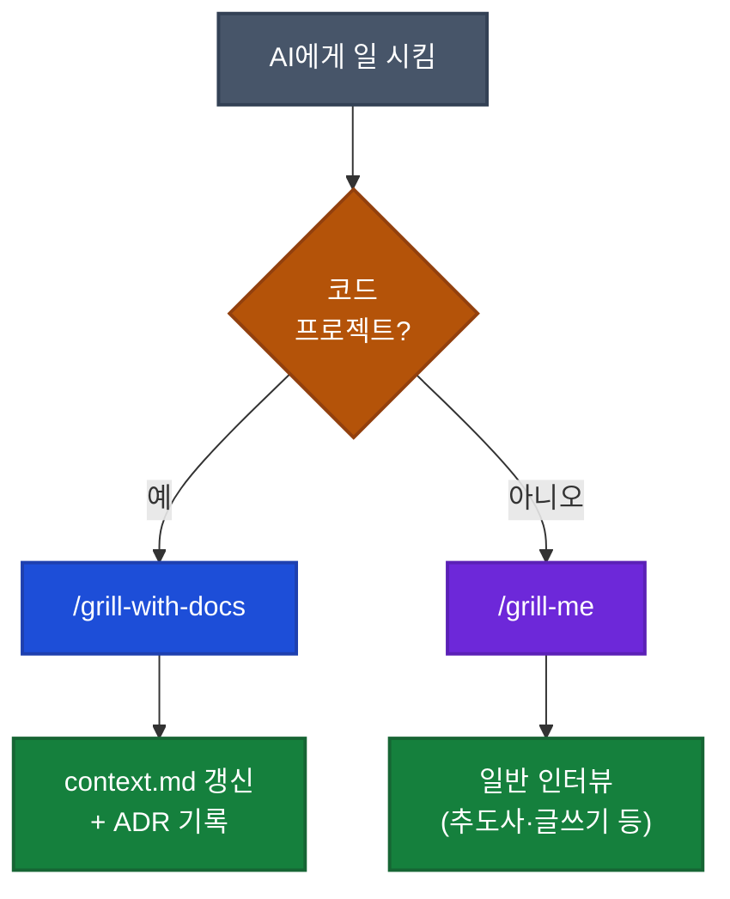

## 이게 뭔가요?

영상 화자(저자 보충: Total TypeScript 강의로 유명한 Matt Pocock, AI Hero 운영자)가 만든 새 스킬(특정 명령어로 호출되는 작업 묶음) `/grill-with-docs`에 대한 영상입니다. 기존 인기 스킬 `/grill-me`가 코딩에는 부족하다고 판단해 새로 만든 것입니다.

`/grill-me`는 AI가 사용자에게 질문을 끈질기게 던져 요구사항을 끌어내는 스킬입니다. 영상에서 Matt 본인이 표현하길 "interviews you until you reach a shared understanding"(공유된 이해에 도달할 때까지 인터뷰). 좋긴 한데 코딩에서 한 가지 문제가 있었습니다 — **매번 같은 도메인 용어를 처음부터 다시 설명해야 한다**는 점입니다.

영상에서 Matt가 든 실제 예시: 자신의 강의 사이트 코드베이스에서 "standalone video"는 어떤 Lesson이나 Course에도 연결되지 않은 비디오를 가리키는 **term of art**(쓰는 사람들끼리만 통하는 약속 용어)인데, AI는 이를 모르므로 매 세션 시작마다 "standalone video란 ..." 같은 설명을 반복해야 했다는 것. 회사 위키 같은 공유 문서가 있으면 한 번에 끝날 일을 매번 재설명하는 셈입니다.

`/grill-with-docs`는 그 위키 역할을 하는 `context.md`(repo 루트에 두는 도메인 용어집)를 자동으로 읽고, 새로 합의된 용어가 생기면 거기에 추가합니다. 도메인 주도 설계(DDD, Domain-Driven Design)에서 말하는 **ubiquitous language**(공유 언어) 개념을 AI 코딩에 적용한 것입니다.

## 왜 알아야 하나요?

코드베이스에서 Claude Code를 쓸 때 가장 답답한 순간이 있습니다. 영상 사례 + 일반적 사례를 섞어 보면:

- (영상 발화) AI가 verbose하게 풀어 부를 때 — "이미 standalone video라는 이름이 있어"라고 매번 지적해야 함
- (영상 발화) 좋은 합의 용어가 나와도 어디에도 문서화되지 않아 다음 세션에선 다시 0부터 시작
- (저자 보충) 다른 개발자가 짠 코드를 보면 같은 개념을 다른 이름으로 부르고 있을 때

이 문제는 AI 탓이 아니라, **공유 언어가 어디에도 문서화되어 있지 않아서**입니다. `context.md` 하나만 만들어두면:

- AI가 짠 코드의 변수명·파일명이 팀 용어와 일치
- 프롬프트(AI에게 보내는 요청)가 짧아짐 → 토큰(AI가 처리하는 글자 단위) 절감
- 새 팀원이 합류해도 그 문서 하나만 읽으면 됨

## 어떻게 하나요?

### 방법 1: context.md를 repo 루트에 만들기

repo 최상위(`package.json`이나 `pyproject.toml`이 있는 위치)에 `context.md` 파일을 만들고, 도메인 용어집을 작성합니다.

<div class="example-case">
<strong>예시: 영상 강의 사이트의 context.md</strong>

```markdown
# Context

이 앱은 강의 사이트입니다.

## 엔티티

- **Course**: 하나의 강의 코스
- **CourseVersion**: 같은 코스의 여러 버전 (개정판)
- **Lesson**: 코스 안의 개별 강의
- **Standalone Video**: 어떤 Lesson이나 Course에도 속하지 않은 독립 영상
  (즉, `lessonId`가 비어 있는 비디오)
- **Pitch**: 영상의 "패키징" — 제목, 설명, 프레이밍.
  **하나의 Pitch는 여러 Standalone Video를 가질 수 있음** (1:N, 0개도 가능).
  Mr. Beast식으로 여러 Pitch 안을 먼저 만들어 두고
  좋은 것을 골라 영상으로 발전시킴
```

</div>

### 방법 2: CLAUDE.md에 context.md 포인터 추가

`.claude/CLAUDE.md`나 프로젝트 루트의 `CLAUDE.md`에 context.md 경로를 명시합니다. `/grill-with-docs` 스킬은 자동으로 찾지만, 다른 작업에서도 AI가 참조하도록 만드는 방법입니다.

<div class="example-case">
<strong>예시: CLAUDE.md에 추가할 한 줄</strong>

```markdown
## 도메인 용어

이 프로젝트의 공유 언어는 `/context.md`를 참고하세요.
모든 변수명·파일명·UI 텍스트는 이 용어집을 따라야 합니다.
```

</div>

### 방법 3: 모노레포라면 context map으로 분리

monorepo(여러 프로젝트를 하나의 저장소에 모은 구조)에서는 영역별로 공유 언어가 다를 수 있습니다. 그럴 땐 bounded context(경계 지어진 영역)별로 `context.md`를 따로 둡니다.

```
repo-root/
├── context-map.md          # 전체 context 인덱스
├── apps/
│   ├── checkout/
│   │   └── context.md      # 결제 도메인 용어집
│   └── catalog/
│       └── context.md      # 상품 도메인 용어집
```

### 방법 4: 중요한 결정은 ADR로 기록 (Matt는 "되돌리기 어려운 결정"만 권장)

ADR(Architectural Decision Record, 아키텍처 결정 기록)은 "왜 이 결정을 내렸는지"를 markdown 파일로 남기는 관행입니다.

**영상에서 Matt의 기준** (자막 원문 "You only want to create an ADR when the decision is hard to reverse"): **되돌리기 어려운 결정만** ADR로 남길 것. 라이브러리 교체처럼 언제든 다시 바꿀 수 있는 결정은 ADR 불필요. 노이즈를 줄이려는 의도입니다.

**저자 보충 (영상 외부 사실)**: ADR이라는 관행 자체는 Michael Nygard가 2011년 블로그 글로 제안한 것으로, 원래 정의는 "모든 중요한 아키텍처 결정"으로 더 포괄적입니다(라이브러리 선택도 포함). 즉 Matt의 기준은 일반 ADR보다 엄격한 개인 룰. 둘 중 어느 쪽을 따를지는 팀이 정합니다.

| 결정 유형 | Nygard 원래 정의 | Matt의 엄격한 룰 |
|----------|----------------|----------------|
| 라이브러리 A → B 교체 | ✅ 기록 | ❌ 불필요 (가역적) |
| DB 스키마에 외래 키 cascade 설정 | ✅ 기록 | ✅ 기록 |
| Pitch와 StandaloneVideo의 1:N 관계 확정 | ✅ 기록 | ✅ 기록 |
| CSS 클래스명 케이스 통일 | (선택) | ❌ 불필요 |

## 실전 예시

<div class="example-case">
<strong>실전 케이스: 새 엔티티(Pitch) 추가 — Matt Pocock의 영상 데모</strong>

Matt는 "강의 사이트에 Pitch라는 새 개념을 추가하고 싶다"고 `/grill-with-docs`를 실행했습니다. 일반 인터뷰 스킬과 어떻게 달랐는지:

**1단계: 기존 용어 먼저 확인**
- AI(영상 자막 ①): "Ooh, context.md is rich. Standalone video is already defined as ... a video with lesson ID equals null."
- AI(영상 자막 ②, 이어지는 발화): "Before going further, I want to surface attention with the glossary."
- 풀이: "context.md가 잘 채워져 있네요. Standalone Video는 이미 'Lesson에 연결되지 않은 비디오(lessonId가 비어 있음)'로 정의되어 있습니다. 진행하기 전에 이 용어집과의 정렬을 먼저 짚고 싶습니다."
- 일반 `/grill-me`라면 바로 구현 질문으로 갔겠지만, `/grill-with-docs`는 **언어 정렬을 먼저** 합니다.

**2단계: cardinality(개수 관계) 질문**
- AI(영상 자막): "whether one pitch holds many standalone videos or one pitch corresponds to exactly one standalone video"
- 풀이: "하나의 Pitch가 여러 Standalone Video를 가지나요, 아니면 정확히 1:1인가요?"
- Matt: "1:N으로 가자(영상 원문 "I'm just going to say correct")"

**3단계: 용어 충돌 감지 → Matt의 결정**
- AI(영상 자막): "whether we keep standalone video as any pitched or unpitched lesson or we redefine it to mean specifically unpitched unlessoned video"
- 풀이: "Standalone Video를 'pitched·unpitched 무관하게 Lesson에 연결 안 된 모든 비디오'로 유지할지, 아니면 'unpitched + unlessoned 비디오'로 좁혀 재정의할지?"
- 이 질문이 중요한 이유: 답에 따라 UI(Pitch가 있는 영상을 별도 섹션으로 분리할지 vs 같이 표시할지)가 완전히 달라짐.
- **Matt의 결정**: "기존 정의 유지. **Pitching은 Standalone Video의 metadata로 둔다**" — 별도 섹션을 만드는 대신 메타데이터로 부착하기로.

**4단계: Pitch의 운영 의미 — status, 0개 비디오 허용 여부**
- AI(영상 자막): "Okay, we need some status semantics here. So, each pitch can be idle or scheduled or shipped here."
- Matt: "free-form transition으로 가자 — 자동 전환 없이 내가 직접 토글. 나중에 'YouTube로 보내기' 같은 자동화는 위에 얹으면 됨."
- AI(영상 자막): "Can a pitch exist with zero videos?"
- Matt: "Absolutely. 처음엔 영상 아이디어를 Pitch로 모아두니까(Mr. Beast식 패키징 우선)."

**5단계: 언어 정의가 삭제 정책까지 끌고 간다**
- Matt(스스로 인지, 자막 원문 "this language also goes into things as concrete as deletion cascades"): "이 언어 정의가 deletion cascade까지 영향을 주네. 나는 `on delete restrict`로 가겠다. 평소에도 삭제보다는 archive로 처리하니까."
- 핵심 교훈: 공유 언어 정의는 단순 용어집이 아니라 **DB 외래 키 정책 같은 구현 결정**까지 자연스럽게 끌고 옵니다. (AI가 따로 묻기 전에 Matt 본인이 "이 결정의 파급효과"를 인지한 장면)

**6단계: context.md 자동 업데이트**
- 합의된 내용이 context.md에 추가됨:
  - `Pitch` 정의
  - `PitchStatus` (idle, scheduled, shipped)
  - `Pitched Standalone Video`, `Unattached Standalone Video` 같은 새 용어

영상에서 Matt는 "이게 bike-shedding(사소한 것에 시간 쓰기)처럼 보일 수 있지만, **이 언어가 모든 변수명·파일명·UI 텍스트의 기반**이 되기 때문에 절대 사소하지 않다"고 강조합니다.

</div>

## /grill-me와 /grill-with-docs, 언제 뭘 쓸까?



영상에서 Matt가 든 인상적인 사례: **누군가 어머니 추도사를 쓰려고 `/grill-me`를 사용**해서 AI가 어머니에 대한 기억을 끌어냈다고 합니다. 코드와 무관한 영역에서는 여전히 `/grill-me`가 강력합니다.

## 주의할 점

**1. 초기 프로젝트일수록 오히려 일찍 시작하라 (영상 입장)**
"빈 repo엔 채울 게 없지 않나"라는 직관과 달리, Matt는 영상에서 "if you are really early on in a project ... I'd still probably recommend using Grill with Docs because you just get so much more out of that shared language"라고 말합니다. 프로젝트 초기야말로 공유 언어를 정립할 적기이며, 인터뷰 세션 자체가 빈 context.md를 채우는 과정입니다.

**2. context라는 이름이 과부하 상태 (Matt 본인도 인지)**
영상에서 Matt는 "context is like super overloaded, so I'm sort of uncomfortable, but maybe okay with it"이라고 말합니다 — "Context"가 React Context, Go context, LLM context window 등 너무 많은 의미와 겹쳐 본인도 약간 불편하지만 그냥 쓰는 중. (저자 보충: 팀에서 헷갈리면 `glossary.md`나 `domain.md`로 파일명을 바꿔도 됩니다. 단, 그러면 `/grill-with-docs` 스킬이 자동으로 찾지 못하므로 스킬 정의를 함께 수정해야 합니다.)

**3. ADR 남발은 노이즈, 누락은 정보 손실 — 팀 룰을 정하세요**
영상에서 Matt는 "되돌리기 어려운 결정만 ADR로 기록"하라고 권장합니다. 반면 Nygard의 원래 정의는 더 넓어서 라이브러리 선택 같은 가역적 결정도 포함합니다. 어느 쪽이든 **일관된 기준을 팀이 합의**하는 게 핵심입니다 — Matt 방식(엄격, 노이즈↓)이든 Nygard 방식(포괄, 정보 손실↓)이든.

**4. /grill-me는 아직 죽지 않았다**
영상 제목이 자극적이지만 Matt가 명시합니다 — "코드베이스가 없으면 /grill-me를 쓰세요." 추도사, 블로그 글, 사업 계획 등 코드와 무관한 작업에는 여전히 /grill-me가 더 적합합니다.

**5. `/ubiquitous-language`는 `/grill-with-docs`에 통합됨**
영상 원문: "Wouldn't it be great if I just combine the two into a new skill?" — Matt가 기존 두 스킬(/grill-me + /ubiquitous-language)을 합쳐 /grill-with-docs를 만들었다고 설명. 또 영상에서 그는 "Grill me를 productivity area로 옮겼다"고 했으므로, 그의 스킬 묶음에는 이 외에도 다른 스킬들이 함께 있습니다(전체 목록은 [Matt Pocock의 skills GitHub 저장소](https://github.com/mattpocock/skills)나 [AI Hero](https://aihero.dev)에서 확인). 직접 비슷한 스킬을 만들고 싶다면 영상의 원리(인터뷰 + context.md 자동 탐색 + 갱신)를 참고해 본인의 `.claude/skills/`에 작성해도 됩니다.

## 정리

- **/grill-me는 코드베이스에 약함** — 도메인 용어를 매번 재설명해야 함
- **/grill-with-docs는 context.md를 자동으로 읽고 갱신** — DDD의 공유 언어 개념을 AI 코딩에 적용
- **얻는 이점**: 토큰 절감, 정확한 변수·파일명, 탐색 가능한 코드베이스
- **분류 규칙**: 코드베이스 있음 → `/grill-with-docs`, 없음 → `/grill-me`
- **ADR 기준은 팀이 합의** — Matt는 "되돌리기 어려운 결정만"으로 엄격하게, Nygard 원래 정의는 "모든 중요한 아키텍처 결정"으로 포괄적

---

**참고 영상**: [I stopped using /grill-me for coding. Here's what I use instead](https://youtube.com/watch?v=6BB6exR8Zd8) (Matt Pocock, 15:16)
