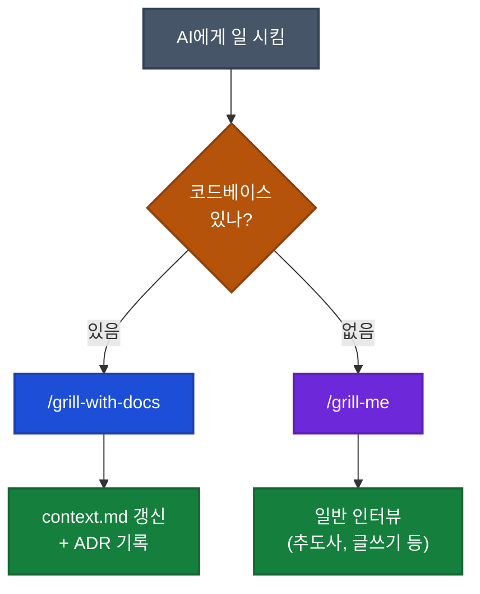

## 이게 뭔가요?

Matt Pocock(TypeScript 강의로 유명한 개발자)이 만든 새 스킬(특정 명령어로 호출되는 작업 묶음) `/grill-with-docs`에 대한 영상입니다. 기존 인기 스킬 `/grill-me`가 코딩에는 부족하다고 판단해 새로 만든 것입니다.

`/grill-me`는 AI가 사용자에게 질문을 끈질기게 던져 요구사항을 끌어내는 스킬입니다. 좋긴 한데 코딩에서 한 가지 문제가 있었습니다 — **매번 같은 도메인 용어를 처음부터 다시 설명해야 한다**는 점입니다.

비유하자면, 새 동료가 출근할 때마다 "우리 회사에서 '셀러'는 입점업체를 말하고, '셀러 어드민'은 그들의 관리 페이지를 말해요"라고 반복 설명하는 상황입니다. 한 번 정리해서 회사 위키에 올려두면 모두가 같은 용어를 쓸 수 있는데, AI에게는 그런 위키가 없었던 셈입니다.

`/grill-with-docs`는 그 위키 역할을 하는 `context.md`(repo 루트에 두는 도메인 용어집)를 자동으로 읽고, 새로 합의된 용어가 생기면 거기에 추가합니다. 도메인 주도 설계(DDD, Domain-Driven Design)에서 말하는 **ubiquitous language**(공유 언어) 개념을 AI 코딩에 적용한 것입니다.

## 왜 알아야 하나요?

코드베이스에서 Claude Code를 쓸 때 가장 답답한 순간이 있습니다.

- AI가 변수명을 `userListingPage`라고 짓는데, 우리 팀은 `seller-admin`이라고 부르는 페이지일 때
- "이건 우리가 standalone video라고 부르는 거예요"라고 매 세션 첫 메시지마다 설명할 때
- 다른 개발자가 짠 코드를 보면 같은 개념을 다른 이름으로 부르고 있을 때

이 문제는 AI 탓이 아니라, **공유 언어가 어디에도 문서화되어 있지 않아서**입니다. `context.md` 하나만 만들어두면:

- AI가 짠 코드의 변수명·파일명이 팀 용어와 일치
- 프롬프트(AI에게 보내는 요청)가 짧아짐 → 토큰(AI가 처리하는 글자 단위) 절감
- 새 팀원이 합류해도 그 문서 하나만 읽으면 됨

## 어떻게 하나요?

### 방법 1: context.md를 repo 루트에 만들기

repo 최상위(`package.json`이나 `pyproject.toml`이 있는 위치)에 `context.md` 파일을 만들고, 도메인 용어집을 작성합니다.

<div class="example-case">
<strong>예시: 영상 강의 사이트의 context.md</strong>

```markdown
# Context

이 앱은 강의 사이트입니다.

## 엔티티

- **Course**: 하나의 강의 코스
- **CourseVersion**: 같은 코스의 여러 버전 (개정판)
- **Lesson**: 코스 안의 개별 강의
- **Standalone Video**: 어떤 코스나 레슨에도 속하지 않은 독립 영상
  (즉, `lessonId === null`인 비디오)
- **Pitch**: 영상의 "패키징" — 제목, 설명, 프레이밍.
  하나의 standalone video는 여러 pitch를 가질 수 있고,
  최종적으로 가장 좋은 pitch를 골라 영상을 제작
```

</div>

### 방법 2: CLAUDE.md에 context.md 포인터 추가

`.claude/CLAUDE.md`나 프로젝트 루트의 `CLAUDE.md`에 context.md 경로를 명시합니다. `/grill-with-docs` 스킬은 자동으로 찾지만, 다른 작업에서도 AI가 참조하도록 만드는 방법입니다.

<div class="example-case">
<strong>예시: CLAUDE.md에 추가할 한 줄</strong>

```markdown
## 도메인 용어

이 프로젝트의 공유 언어는 `/context.md`를 참고하세요.
모든 변수명·파일명·UI 텍스트는 이 용어집을 따라야 합니다.
```

</div>

### 방법 3: 모노레포라면 context map으로 분리

monorepo(여러 프로젝트를 하나의 저장소에 모은 구조)에서는 영역별로 공유 언어가 다를 수 있습니다. 그럴 땐 bounded context(경계 지어진 영역)별로 `context.md`를 따로 둡니다.

```
repo-root/
├── context-map.md          # 전체 context 인덱스
├── apps/
│   ├── checkout/
│   │   └── context.md      # 결제 도메인 용어집
│   └── catalog/
│       └── context.md      # 상품 도메인 용어집
```

### 방법 4: 중요한 결정은 ADR로 기록 (Matt는 "되돌리기 어려운 결정"만 권장)

ADR(Architectural Decision Record, 아키텍처 결정 기록)은 "왜 이 결정을 내렸는지"를 markdown 파일로 남기는 관행입니다. Michael Nygard가 2011년 제안한 원래 정의는 **모든 중요한 아키텍처 결정**을 짧은 markdown으로 기록하는 것입니다(라이브러리 선택도 포함).

영상에서 Matt Pocock은 이보다 엄격한 기준을 제시합니다 — **되돌리기 어려운 결정만** ADR로 남기라는 것. 노이즈를 줄이기 위한 그의 개인 룰이며, ADR의 일반적 정의는 아닙니다. 둘 중 어느 쪽을 따를지는 팀이 정합니다.

| 결정 유형 | Nygard 원래 정의 | Matt의 엄격한 룰 |
|----------|----------------|----------------|
| 라이브러리 A → B 교체 | ✅ 기록 | ❌ 불필요 (가역적) |
| DB 스키마에 외래 키 cascade 설정 | ✅ 기록 | ✅ 기록 |
| Pitch와 StandaloneVideo의 1:N 관계 확정 | ✅ 기록 | ✅ 기록 |
| CSS 클래스명 케이스 통일 | (선택) | ❌ 불필요 |

## 실전 예시

<div class="example-case">
<strong>실전 케이스: 새 엔티티(Pitch) 추가 — Matt Pocock의 영상 데모</strong>

Matt는 "강의 사이트에 Pitch라는 새 개념을 추가하고 싶다"고 `/grill-with-docs`를 실행했습니다. 일반 인터뷰 스킬과 어떻게 달랐는지:

**1단계: 기존 용어 먼저 확인**
- AI: "context.md를 봤습니다. Standalone Video는 `lessonId === null`인 비디오로 정의되어 있네요. 새로 추가하는 Pitch가 이것과 어떻게 관계되는지 먼저 정리해야 합니다."
- 일반 `/grill-me`라면 바로 구현 질문으로 갔겠지만, `/grill-with-docs`는 **언어 정렬을 먼저** 합니다.

**2단계: cardinality(개수 관계) 질문**
- AI: "하나의 Pitch는 여러 Standalone Video를 가질 수 있나요, 아니면 1:1인가요?"
- Matt: "1:N입니다."

**3단계: 용어 충돌 감지**
- AI: "기존 Standalone Video 정의로는 '아무 데도 속하지 않은 영상'인데, Pitch가 붙으면 더 이상 standalone이 아닌 건가요? 정의를 바꿔야 할까요?"
- 이 질문이 중요한 이유: 답에 따라 UI(Pitch가 있는 영상을 별도 섹션으로 분리할지 vs 같이 표시할지)가 완전히 달라짐.

**4단계: 삭제 정책까지 정의**
- AI: "Pitch가 삭제되면 연결된 Standalone Video는 어떻게 되나요? cascade로 같이 삭제? 아니면 restrict로 막을까요?"
- Matt: "restrict로. 나는 보통 삭제 대신 archive 처리합니다."

**5단계: context.md 자동 업데이트**
- 합의된 내용이 context.md에 추가됨:
  - `Pitch` 정의
  - `PitchStatus` (idle, scheduled, shipped)
  - `Pitched Standalone Video`, `Unattached Standalone Video` 같은 새 용어

영상에서 Matt는 "이게 bike-shedding(사소한 것에 시간 쓰기)처럼 보일 수 있지만, **이 언어가 모든 변수명·파일명·UI 텍스트의 기반**이 되기 때문에 절대 사소하지 않다"고 강조합니다.

</div>

## /grill-me와 /grill-with-docs, 언제 뭘 쓸까?



영상에서 Matt가 든 인상적인 사례: **누군가 어머니 추도사를 쓰려고 `/grill-me`를 사용**해서 AI가 어머니에 대한 기억을 끌어냈다고 합니다. 코드와 무관한 영역에서는 여전히 `/grill-me`가 강력합니다.

## 주의할 점

**1. context.md를 너무 일찍 만들지 말 것**
프로젝트 첫날 빈 repo에 context.md 만들어봐야 채울 내용이 없습니다. **인터뷰 세션을 몇 번 돌린 뒤** 반복되는 용어가 보이기 시작할 때 만드는 게 자연스럽습니다. 단, Matt는 "정말 초기 단계라면 오히려 /grill-with-docs로 공유 언어 정립부터 하는 게 좋다"고 덧붙입니다.

**2. context라는 이름이 과부하 상태인 점 인지**
프로그래밍에서 "context"는 React Context, Go context.Context, LLM context window 등 너무 많은 의미로 쓰입니다. `context.md`라는 이름이 헷갈리면 `glossary.md`나 `domain.md`로 바꿔도 무방합니다.

**3. ADR 남발은 노이즈, 누락은 정보 손실 — 팀 룰을 정하세요**
영상에서 Matt는 "되돌리기 어려운 결정만 ADR로 기록"하라고 권장합니다. 반면 Nygard의 원래 정의는 더 넓어서 라이브러리 선택 같은 가역적 결정도 포함합니다. 어느 쪽이든 **일관된 기준을 팀이 합의**하는 게 핵심입니다 — Matt 방식(엄격, 노이즈↓)이든 Nygard 방식(포괄, 정보 손실↓)이든.

**4. /grill-me는 아직 죽지 않았다**
영상 제목이 자극적이지만 Matt가 명시합니다 — "코드베이스가 없으면 /grill-me를 쓰세요." 추도사, 블로그 글, 사업 계획 등 코드와 무관한 작업에는 여전히 /grill-me가 더 적합합니다.

**5. `/ubiquitous-language`는 이미 deprecated — `/grill-with-docs`에 통합됨**
영상이 정확히 그 통합 과정을 설명합니다. 현재 [Matt Pocock의 skills GitHub 저장소](https://github.com/mattpocock/skills)와 [AI Hero](https://aihero.dev) 모음에는 `/grill-me`와 `/grill-with-docs` 두 개만 활성 상태입니다. 직접 비슷한 스킬을 만들고 싶다면 영상의 원리(인터뷰 + context.md 자동 탐색 + 갱신)를 참고해 본인의 `.claude/skills/`에 작성해도 됩니다.

## 정리

- **/grill-me는 코드베이스에 약함** — 도메인 용어를 매번 재설명해야 함
- **/grill-with-docs는 context.md를 자동으로 읽고 갱신** — DDD의 공유 언어 개념을 AI 코딩에 적용
- **얻는 이점**: 토큰 절감, 정확한 변수·파일명, 탐색 가능한 코드베이스
- **분류 규칙**: 코드베이스 있음 → `/grill-with-docs`, 없음 → `/grill-me`
- **ADR은 되돌리기 어려운 결정만** 기록 (라이브러리 교체는 X, DB 스키마는 O)

---

**참고 영상**: [I stopped using /grill-me for coding. Here's what I use instead](https://youtube.com/watch?v=6BB6exR8Zd8) (Matt Pocock, 15:16)
