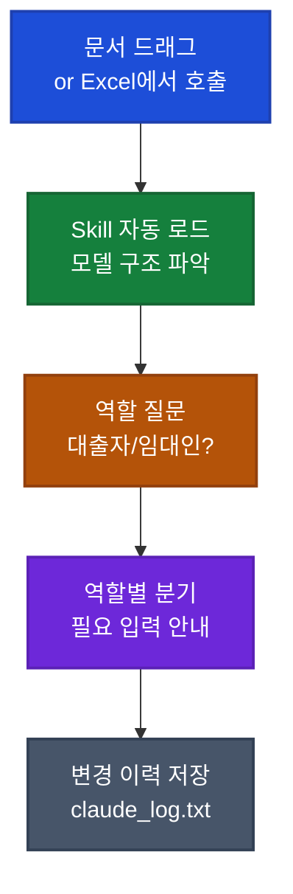

## 이게 뭔가요?

상업용 부동산 전문 채널 **Adventures in CRE**가 자체 제작한 Excel 모델 "Ground Lease Valuation"(토지 임대차 평가 모델)을 **Claude Skill**(클로드 스킬, AI에게 부착하는 도메인 전문가의 작업 매뉴얼)로 패키징한 사례입니다.

먼저 두 가지 용어부터 풀어둡니다.

- **Skill(스킬)**: Claude에게 "특정 작업을 어떻게 처리해야 하는지"를 미리 적어둔 패키지. 한 번 등록하면 Claude가 그 매뉴얼을 매번 자동으로 따라 함. 한국어로는 "AI에게 외주 주는 사용 설명서"에 가깝습니다.
- **Ground Lease(토지 임대차, 한국에선 흔치 않은 지상권 형태)**: 건물은 임차인이 짓고 토지만 장기 임대하는 미국 부동산 거래 형태. 임대 기간이 보통 50~99년.

영상 화자가 가장 강조하는 메시지는 이겁니다.

> "이 AI 스킬은 너희가 부동산 금융 모델링을 이해하지 않아도 된다는 뜻이 아니야. 4학년 때 손으로 장제법(긴 나눗셈)을 배우고 나서야 어른이 되어 계산기를 쥐었지. 그 순서가 거꾸로면 안 돼. **모델 원리를 모르면 이 스킬도 쓰면 안 된다.**"

비유하자면 이렇습니다.

> **Skill 없이** = 부동산 전문가가 만든 복잡한 Excel을 받아든 신입 직원. 어떤 셀에 뭘 넣어야 하는지부터 막힘.
> **Skill 있음** = 같은 Excel + 옆에서 "당신이 대출자입니까 임대인입니까? 이 셀엔 NOI를 입력해야 하는데 모르면 placeholder 넣고 진행해도 됩니다" 안내해주는 디지털 사수.

## 왜 알아야 하나요?

이 영상의 진짜 의미는 부동산이 아니라 **"도메인 전문가의 Excel 자산을 어떻게 조직 자산화할 것인가"**입니다.

### 한국에서도 똑같이 적용되는 직무

- **재무 컨설턴트**: 회사 가치 평가 모델, M&A DCF 모델
- **세무사·회계사**: 세무 시뮬레이션 Excel
- **부동산 컨설턴트**: 임대료 분석, 수익률 계산기
- **법무·법인설립 사무소**: 계약 검토 체크리스트
- **약국·병원 운영자**: 매출 분석 템플릿
- **B2B 영업**: 견적 산출 도구

위 직무 모두 "이 Excel은 나만 알아" 상태의 자산이 있습니다. **Skill 패키징 + Claude in Excel 결합**의 3박자가 갖춰지면, 비전문 동료가 안내받으면서 그 모델을 정확히 사용하게 만들 수 있습니다.

## Skill의 위치 정립 — 가드레일 먼저

영상에서 화자가 시연 시작 전 1분간 강조하는 부분입니다. 자기 분야에서 Skill을 만들기 전에 본인부터 답해야 할 질문:

| 질문 | 의미 |
|------|------|
| 이 모델의 원리를 우리 팀이 아는가? | 모르면 Skill을 쓰는 동료도 "왜 이 결과가 나왔는지" 검증 불가 |
| 잘못된 결과가 의사결정에 들어가면 누가 책임지나? | 분명히 정해두지 않으면 책임 회피 발생 |
| Disclaimer(고지문)를 모델 출력에 의무 포함시켰나? | 영상 화자도 매번 "전문가 검토 필수"를 모델 출력에 자동 삽입 |

## 어떻게 하나요?

### 1단계: Skill 설치

1. Claude 좌측 메뉴의 **Customize**(맞춤 설정) 진입
2. **Skills** 항목 선택
3. 우측 상단 **+** 버튼 → **Create skill**(직접 만들기) 또는 **Upload skill**(파일 업로드)
4. 설치 후 **Personal Skills** 섹션에 등재됨 (Team/Enterprise 플랜에서는 Workspace Skills 섹션도 함께 노출)
5. 새 채팅 열어서 사용 시작

### 2단계: 두 가지 사용 환경 선택

영상에서 화자는 두 환경 모두 시연합니다.

**환경 A: 일반 채팅에서 파일 업로드**

1. 채팅창에 Excel 모델·관련 문서를 드래그
2. `/` 슬래시 명령으로 해당 Skill 호출
3. 대화하며 진행
4. **단점**: 모델 재계산 단계가 필요. Claude가 셀을 직접 갱신하지 못함.

**환경 B: Claude in Excel 애드인** (영상 화자 추천)

1. **Claude in Excel** 애드인을 Excel에 설치
2. Excel에서 모델을 직접 연 상태로 사이드바에서 Skill 호출
3. Claude가 셀을 직접 갱신 → Excel이 라이브 재계산
4. **장점**: 결과를 즉시 시각적으로 확인. 채팅 환경의 "재계산 단계" 자동 생략.

### 3단계: Skill 호출 시 진행되는 4단계

영상에서 시연한 가상 ground lease 평가의 실제 흐름입니다.

1. **문서/모델 인식**: 사용자가 가상 lease 문서를 드래그하거나 Excel에서 호출
2. **Skill 자동 로드**: Claude가 Skill 파일을 읽고 모델 구조·셀 위치를 파악
3. **역할 확인 질문**: "당신은 lender(대출자)입니까, lease holder(임차인)입니까, land owner(토지 소유주)입니까?" — 역할에 따라 워크플로우 분기
4. **필수 입력 안내**: 역할별로 필요한 시장 가정(NOI, cap rate, discount rate)을 하나씩 질문
5. **변경 이력 자동 저장**: `claude_log.txt` 파일을 별도로 만들어 어떤 셀을 바꿨는지 기록 (영상에서 "Always Allow"로 매번 묻지 않게 설정 권장)

## 역할별 분기 — 같은 모델, 다른 입력

영상의 핵심 통찰입니다. 같은 ground lease 모델이라도 사용자 역할이 다르면 필요한 입력이 다릅니다.

| 역할 | 평가 대상 | 핵심 질문 |
|------|----------|----------|
| **Lender(대출자, 은행)** | 담보 가치 | "토지 가치가 leasehold 가치 대비 얼마나 안전한가?" |
| **Lease Holder(임차인)** | 사용권 가치 | "남은 임대 기간 동안 내가 받을 수 있는 cash flow는?" |
| **Land Owner(토지 소유주)** | 임대료 수익권 | "이 토지를 지금 매각하면 얼마인가?" |

Skill이 첫 호출 시 역할을 묻고, 그에 맞춰 **다른 워크플로우로 자동 분기**합니다. 한 모델이 여러 사람의 도구가 되는 핵심 메커니즘.

<strong>예시: 영상의 land owner 시나리오 시연</strong>

영상 화자가 "Capital Tower 200 Peach Tree Center"라는 가상 lease 문서를 드래그하고 Skill 호출.

1. Claude가 문서에서 **deal terms 자동 추출**: 토지 면적, 건물 면적, 임대 시작/종료, 기본 임대료, escalation(임대료 상승) 조건, net lease 여부
2. **역할 질문** → 사용자가 "land owner, leased fee" 선택
3. Claude가 필요한 시장 가정 질문:
   - 안정화된 NOI(순영업소득)는?
   - 시장 cap rate(자본환원율)는?
   - Ground lease cash flow의 discount rate(할인율)는?
4. 사용자가 "NOI는 모름, discount rate는 6.5%로 가자, 나머지는 placeholder" 답변
5. Claude가 모든 입력을 **각 셀의 정확한 위치에 자동 입력**, 어느 셀을 바꿨는지 사용자에게 보고
6. **결과 해석**: "leased fee interest = $85.8M, going-in cap rate = 4.95%. 이 cap rate가 6% 부동산 cap rate보다 낮은 건 ground lease cash flow가 채권 같은 안전 자산이기 때문에 자연스러움"
7. `claude_log.txt`에 변경 이력 자동 저장

## 실전 예시 — 한국 직무에 적용

<strong>실전 케이스: 한국 회계법인의 회사가치 평가 자동화</strong>

상황: 회계사 박씨가 자체 제작한 DCF(현금흐름할인법) Excel 모델을 보유. 신입 컨설턴트들이 매번 "어느 셀에 뭘 넣어야 하는지" 물어봄.

Skill 패키징 후:
- Skill에 "역할 질문" 추가: "당신은 매수 측입니까, 매도 측입니까, 자문 측입니까?"
- 각 역할별로 다른 가정 입력 절차 분기
- 신입이 모델을 열고 Skill 호출 → 안내받으며 진행 → `claude_log.txt`로 누가 어떤 가정을 넣었는지 자동 기록
- 박 회계사는 **각 케이스의 가정 추적이 자동화**되어 검토 시간 단축

<strong>실전 케이스: 한국 부동산 컨설턴트의 임대 수익률 모델</strong>

상황: 컨설턴트 이씨가 상가·오피스·주택별로 다른 임대 수익률 계산 Excel을 운영. 고객사마다 답변에 1시간씩 걸림.

Skill 패키징:
- 첫 질문: "물건 유형은? (상가/오피스/주택/지식산업센터)"
- 유형별로 다른 입력 항목 안내 (공실률, 관리비, 보증금 등)
- Claude in Excel 애드인 사용 → 셀 자동 갱신, 라이브 재계산
- 출력에 의무 disclaimer: "본 결과는 참고용이며, 실제 투자 결정 전 현장 실사 필수"

고객사가 Excel을 직접 받아 Skill 호출 → 자체적으로 시뮬레이션 → 컨설턴트는 검토와 자문에만 집중.

## Skill 작성 시 영상이 강조한 포인트

1. **변경 이력 별도 log 파일 권장**: `claude_log.txt` 같은 별도 파일로 어떤 셀을 언제 바꿨는지 자동 기록. "Always Allow"로 매번 묻지 않게 설정.
2. **역할별 분기 첫 질문 필수**: 같은 모델도 lender·tenant·landlord 관점이 다르면 필요한 입력이 다름. Skill이 먼저 묻게 만들어야 함.
3. **모델 출력에 disclaimer 의무 포함**: "전문가 검토 필요" 같은 문구를 Skill이 매 결과에 자동 삽입하도록 작성.
4. **Excel 환경에서는 재계산 단계 자동 스킵**: Skill이 chat 환경용으로 작성된 "재계산하라" 단계를 Claude in Excel에서는 자동 생략. 한 Skill로 두 환경 커버.

## 주의할 점

- **모델 원리를 모르면 Skill 쓰지 마라**: 영상의 첫 1분이 통째로 이 경고. AI가 잘못된 결과를 내도 사용자가 검증할 수 없음.
- **첫 버전은 반드시 오류 있음**: 영상 화자도 "this is the first version, there certainly are errors"라고 명시. 사용자에게 피드백 채널 열어둘 것.
- **외부 공유 시 모델 원본 함께**: Skill만 공유하고 Excel 모델 없이는 작동 불가. 두 자산을 묶어서 배포.
- **민감 데이터 주의**: 실제 lease 문서·재무 데이터를 Claude에 업로드할 때 회사 보안 정책 확인 필수.
- **Personal Skills vs Workspace Skills**: 영상에서는 Personal Skills로 시연. 팀 공유 시 워크스페이스 단위 등록 방식 검토 필요.

## 정리

- **Skill = "도메인 전문가가 작성한 AI용 사용 설명서"**. Excel 모델만 공유하면 신입은 못 쓰지만, Skill을 함께 묶으면 안내받으며 사용 가능.
- **3박자 결합**: 도메인 모델(Excel) + Skill 패키징 + Claude in Excel 라이브 재계산. 셋이 다 있어야 비전문 동료가 정확히 쓸 수 있음.
- **역할 분기·log 자동 기록·disclaimer 의무 삽입**이 영상이 강조한 핵심 설계 원칙.

---

참고 영상: [Claude Skill: Ground Lease Valuation - Use AI with our Excel Model](https://youtube.com/watch?v=zlvKDSzU4LY)
