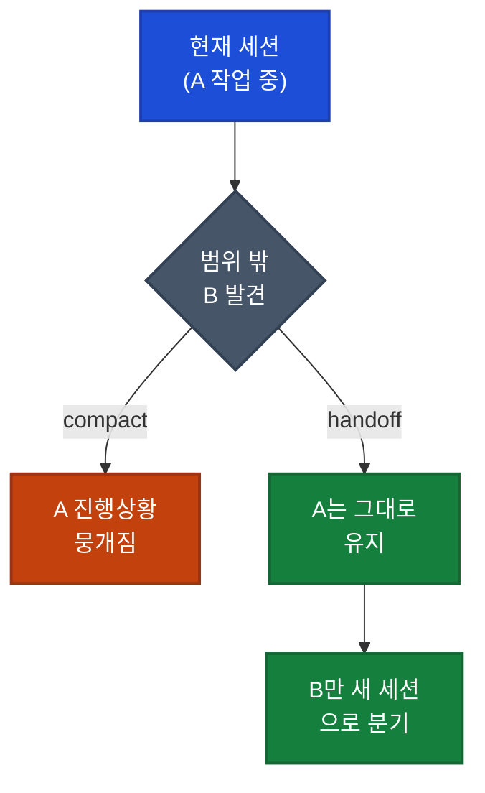

## 이게 뭔가요?

**handoff(핸드오프, 인수인계)** 스킬은 지금 하고 있는 AI 대화의 내용을 **한 장의 요약 문서**로 압축해서, **다른 새 대화에게 넘겨주는** 기능입니다.

> 비유: 야간 근무 간호사가 퇴근하기 전에 **인수인계 노트**를 써두는 것과 같습니다. "이 환자는 이런 상태고, 다음에 이걸 해야 한다"를 한 장에 정리해두면, 다음 근무자가 처음부터 다시 파악하지 않고 바로 이어서 일할 수 있죠. handoff는 AI 대화판 인수인계 노트입니다.

이 스킬을 만든 사람은 Matt Pocock으로, 그의 공개 스킬 저장소(`mattpocock/skills`)는 공개 약 4개월 만에 **11만 개가 넘는 GitHub 스타**를 받을 만큼 널리 쓰입니다. handoff 스킬의 본체는 의외로 짧습니다 — "지금 대화를 요약한 인수인계 문서를 작성해서, 작업 폴더가 아니라 **운영체제의 임시 디렉토리**에 저장하라"는 한 문단이 핵심입니다.

> 용어 풀이
> - **세션(session)**: AI와 주고받는 하나의 연속된 대화. 새 창을 열면 새 세션이 시작됩니다.
> - **컨텍스트 윈도우(context window)**: AI가 한 번에 기억할 수 있는 대화의 총량. "AI의 단기 기억 용량"이라고 보면 됩니다.
> - **스킬(skill)**: 자주 쓰는 작업 방식을 미리 적어둔 재사용 가능한 지침 묶음. `/이름` 형태로 불러서 씁니다.

## 왜 알아야 하나요?

### 컨텍스트에는 '똑똑한 구역'과 '멍청한 구역'이 있습니다

Claude Code가 쓰는 컨텍스트 윈도우는 **100만(1M) 토큰**으로 매우 큽니다(토큰은 AI가 글자를 세는 단위 — 한글 한 글자가 대략 1~2토큰). 하지만 영상 제작자는 같은 윈도우 안에도 **smart zone(똑똑한 구역)**과 **dumb zone(멍청한 구역)**이 있다고 설명합니다.

- 대화 **초반**: 내용이 적어 AI가 집중을 잘 합니다 → 답이 정확합니다.
- 대화 **후반**: 내용이 쌓이면서 AI의 주의가 분산됩니다 → 답이 점점 흐려집니다.

제작자는 100만 토큰을 광고하지만 **본인은 약 12만(120k) 토큰만 넘어가도 '멍청한 구역'에 들어선 느낌**이라고 말합니다. 즉, 광고된 용량을 다 믿고 한 대화에 모든 걸 욱여넣으면 안 되고, 컨텍스트를 알뜰하게 써야 한다는 뜻입니다.

> 주의: "120k 토큰부터 멍청해진다"는 제작자 본인의 체감 기준이며, 공식 수치가 아닙니다. 작업 종류에 따라 체감이 다를 수 있습니다.

### compact만으로는 부족한 순간이 있습니다

Claude Code에는 이미 **compact(컴팩션, 압축)**라는 내장 기능이 있습니다. 긴 대화를 요약본으로 줄여서, '멍청한 구역'에 빠진 대화를 다시 '똑똑한 구역'으로 되돌리는 기능이죠. 용량이 거의 찼을 때(약 95%) 자동으로 작동하는 **auto-compact(자동 압축)**도 있습니다.

하지만 compact는 **어디까지나 한 세션 안에서만** 일어납니다. 영상에서 지적하는 한계는 이렇습니다:

- 압축을 반복하면 이전 대화의 **요약이 지층처럼 쌓여(sediment)** 비효율이 생깁니다.
- 무엇보다, **다른 작업으로 갈라지고 싶을 때** compact는 답이 아닙니다.

예를 들어 A 작업을 하다가 갑자기 **범위 밖의 리팩토링거리(B)**를 발견했다고 합시다. 선택지는 셋입니다:

1. 지금 세션에서 그냥 B도 한다 → A와 B가 섞여 컨텍스트가 오염되고, 둘 다 '멍청한 구역'에 빠짐
2. compact를 한다 → 지금까지 쌓은 A의 진행 상황이 뭉개짐
3. **B만 떼어내 별도 세션에 넘긴다** → A 세션은 깨끗하게 유지, B는 독립적으로 진행 ✅

handoff는 바로 **3번**을 가능하게 해줍니다. compact가 "한 세션을 길게 이어가는" 도구라면, handoff는 "작업을 깨끗하게 갈라내는" 도구입니다.

## 어떻게 하나요?

### 방법 1: 기획 중 '범위 밖' 작업 넘기기

영상 제작자가 가장 자주 쓰는 상황은 **grilling(그릴링)** 중입니다. grilling은 AI가 기획 단계에서 사용자에게 질문을 퍼부어가며 요구사항을 다듬는 작업을 말합니다(제작자의 또 다른 스킬). 이 도중에 "이건 지금 할 일이 아니지만 언젠가 해야 할 일"이 튀어나오면 그 자리에서 handoff로 넘깁니다.

<strong>예시</strong>

기획 대화 2번째 질문에서 사용자가 말합니다:
"나중에 이 반복 로직과 완료 신호를 별도 API로 분리해야 할 것 같아. **이 작업은 별도 에이전트로 넘기자(hand off).**"

그러면 두 가지가 동시에 일어납니다:
1. **지금 기획이 더 선명해집니다** — "그건 범위 밖, 나중에 처리"로 정리되니 현재 질문이 깔끔하게 닫힙니다.
2. **다음 세션용 인수인계 문서가 만들어집니다** — "GitHub 이슈를 등록하고, 반복 로직과 완료 신호를 별도 API로 분리하도록 설계"라는 초점이 담긴 마크다운 파일이 생성됩니다.

나중에 이 파일을 다른 에이전트에게 그대로 건네면 이슈가 만들어집니다.

### 방법 2: 프로토타입으로 갈라졌다가 다시 돌아오기

기획 중 받는 질문은 두 종류입니다. **말로 답할 수 있는 것**과, **직접 코드로 만들어봐야 답이 나오는 것**(예: UI 화면, 까다로운 로직). 후자는 handoff로 프로토타입 세션에 넘깁니다.

<strong>실전 케이스: 부모 → 자식 → 부모로 되돌아오는 'DIY 서브에이전트'</strong>

1. 기획 세션 13번째 질문에서: "어려운 부분(창 간 통신, SDK 연동)을 **프로토타입으로 만들도록 넘겨라(hand off to prototype).**"
2. 넘겨받은 프로토타입 세션에서 실제 UI를 구현합니다. 이 세션은 **16.9만(169K) 토큰**까지 커졌습니다 — 원래 기획 세션에 욱여넣었다면 절대 안 들어갔을 분량입니다.
3. 프로토타입이 끝나면: "여기서 배운 것 중 코드에 안 드러나거나 비자명한 것들을 인수인계 문서로 정리해서 **원래 기획 세션으로 되돌려달라(hand off back).**"
4. 기획 세션은 그 문서를 받아 다시 이어가고, 프로토타입 결과까지 반영한 PRD(제품 요구사항 문서)와 이슈를 완성합니다.

이 **부모 → 자식 → 부모** 흐름은, 무거운 작업 하나를 별도 컨텍스트에서 처리하고 그 학습만 압축해 부모에게 돌려주는 구조입니다. 영상은 이를 "직접 만든 서브에이전트(DIY sub agent)"라고 부릅니다.

### 방법 3: 다른 AI 도구에게 넘기기

handoff 결과물은 **그냥 마크다운 파일**입니다. 특정 AI에 묶인 형식이 아니라서, Claude Code에서 만든 인수인계서를 **Codex나 Copilot CLI 같은 다른 코딩 AI**에게 그대로 건넬 수 있습니다. 한 AI가 한 작업을 다른 AI에게 교차 검토(adversarial review)시키는 식의 협업이 마크다운 한 장으로 가능해집니다.

### 넘길 때는 '목적'을 반드시 말하세요

영상에서 강조하는 핵심 사용법: **handoff할 때마다 "왜 넘기는지, 다음 세션이 뭘 할 건지"를 항상 설명하라**는 것입니다. 다음 세션의 초점을 모르면 좋은 인수인계서를 쓸 수 없기 때문입니다. (제작자는 음성 받아쓰기로 이 설명을 빠르게 쏟아낸다고 합니다.)

## handoff 스킬의 설계 원칙

영상 후반부에서 스킬에 담긴 규칙들을 하나씩 설명합니다. 직접 비슷한 스킬을 만들 때 참고할 만합니다.

| 원칙 | 이유 |
|------|------|
| **추천 스킬 목록 포함** | 인수인계서에 "다음 세션이 불러야 할 스킬"을 적어두면, 문서를 붙여넣는 순간 필요한 스킬이 자동으로 켜집니다. 다음에 뭘 써야 할지 고민할 필요가 없습니다. |
| **이미 있는 내용은 중복 금지** | 다른 마크다운 파일이나 GitHub 이슈에 있는 내용은 다시 적지 말고 **'포인터(가리키는 링크·경로)'만** 남깁니다. 문서가 비대해지는 걸 막습니다. |
| **임시 디렉토리에 저장** | 인수인계서는 **일회용**입니다. 코드베이스에 오래 남아 썩는 문서가 되지 않도록, 운영체제 임시 폴더에 저장합니다. |
| **민감정보 리댁션** | API 키, 비밀번호, 개인정보(PII)는 자동으로 가립니다. 아무 데나 떠도는 마크다운 파일에 비밀이 새지 않도록. |
| **인자를 다음 세션 초점으로** | 사용자가 넘긴 인자(다음 세션이 할 일 설명)를 문서의 방향으로 삼아 맞춤 작성합니다. |

## 주의할 점

- **handoff ≠ compact**: 같은 세션을 길게 이어갈 거면 compact, 작업을 깨끗하게 갈라낼 거면 handoff입니다. 용도가 다릅니다.
- **목적 없이 넘기지 마세요**: "왜 넘기는지"를 안 적으면 인수인계서 품질이 떨어집니다. 항상 다음 세션의 목표를 한 줄이라도 설명하세요.
- **인수인계서는 보관용 문서가 아닙니다**: 임시 폴더에 두고 쓰고 버리는 게 정상입니다. 영구 문서로 착각해 코드베이스에 커밋하면 나중에 쓰레기가 됩니다.
- **이 스킬은 공식 내장 기능이 아닙니다**: handoff는 Matt Pocock 개인이 만든 공개 스킬(`mattpocock/skills`의 `productivity/handoff`)입니다. Claude Code에 기본 포함된 `/compact`와는 다릅니다.

## 정리

1. **handoff = AI 대화판 인수인계서** — 지금 대화를 한 장으로 압축해 다른 세션에 넘깁니다.
2. **compact는 한 세션을 잇고, handoff는 작업을 갈라냅니다** — 범위 밖 일이 튀어나오면 현재 세션을 더럽히지 말고 따로 떼어내세요.
3. **부모→자식→부모 패턴**이 강력합니다 — 무거운 프로토타입을 별도 세션에서 처리하고, 학습만 압축해 돌려받으면 컨텍스트를 알뜰하게 쓸 수 있습니다.

---

> 참고 영상: [/handoff is my new favourite skill — Matt Pocock](https://youtube.com/watch?v=dtAJ2dOd3ko)
