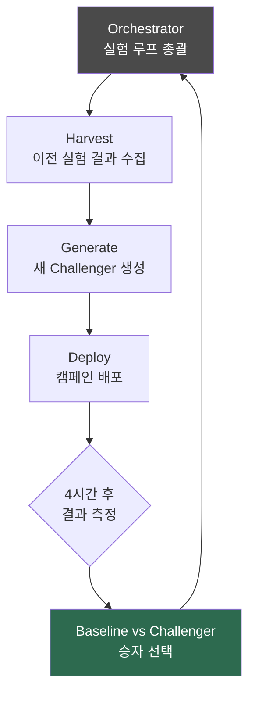

## 이게 뭔가요?

**Auto Research(자동 연구)**는 AI 에이전트가 스스로 실험을 설계하고, 실행하고, 결과를 평가하고, 다음 실험을 반복하는 파이프라인입니다.

마치 과학실험을 인간 대신 AI가 24시간 계속 진행하는 것과 같습니다. 연구자가 퇴근하고 자는 동안에도 실험은 멈추지 않고, 아침에 출근하면 수십 번의 실험 결과 로그가 쌓여 있습니다.

AI 연구자 Andre Karpathy(안드레 카르파시)가 자신의 머신러닝 모델 훈련에 이 개념을 적용했고 — Nick Saraev는 이 원리를 **비즈니스 마케팅 자동화**에 그대로 가져왔습니다. Claude Code와 결합하면 콜드 이메일, 랜딩 페이지, 광고, 챗봇 스크립트 등 어떤 성과 지표든 자동으로 계속 개선할 수 있습니다.

## 왜 알아야 하나요?

**알면 좋은 점:**
- **사람이 자는 동안에도 A/B 테스트가 계속 실행됩니다** — 하루 24번 실험하면 사람이 수동으로 진행하는 것보다 수십 배 더 빠르게 최적화됨
- **모든 실험 결과가 누적됩니다** — `resource.md` 같은 파일에 "무엇이 왜 효과적이었는지"를 쌓아가며 AI가 점점 더 정교한 판단을 내림
- **Claude Code로 처음부터 끝까지 세팅할 수 있습니다** — 레포 클론부터 GitHub Actions(깃허브 액션, 자동화 스케줄러) 배포까지 지시만 하면 완성

**모르면 놓치는 것:**
- 수동 A/B 테스트는 하루에 2~3번이 한계 — 빠른 피드백 루프(feedback loop)의 경쟁 우위를 못 살림
- 실험 결과를 사람이 분석하고 다음 실험을 설계하는 데 시간·비용 낭비

## Karpathy의 원래 아이디어

Andre Karpathy는 LLM(대형 언어 모델) 훈련 실험을 자동화하기 위해 이 파이프라인을 만들었습니다.

**원래 적용 방식:**

| 항목 | 내용 |
|------|------|
| 실험 단위 | 하이퍼파라미터(hyperparameter, 모델 훈련 설정값) 조정 |
| 한 번 실험 시간 | 5분 훈련 |
| 측정 지표 | 검증 손실(validation loss, 모델 정확도) |
| 루프 결과 | 시작 대비 검증 손실이 눈에 띄게 감소 |

핵심 구조는 **가설 → 실험 → 측정 → 승자 선택 → 반복**입니다. 이 구조 자체는 머신러닝 전용이 아닙니다. 측정 가능한 지표가 있고 API(Application Programming Interface, 프로그램 간 통신 규약)로 변경사항을 배포할 수 있으면 **어디든 적용 가능**합니다.

## 비즈니스 적용 조건

Auto Research를 자신의 업무에 적용하려면 **세 가지 조건**이 필요합니다:

| 조건 | 설명 | 예시 |
|------|------|------|
| **명확한 지표** | 숫자로 측정 가능한 목표 | 이메일 답변율, 전환율, 클릭률 |
| **빠른 피드백** | 결과를 빨리 알 수 있는 루프 | 시간~일 단위 (주 단위 이상은 느림) |
| **API 접근** | 변경사항을 코드로 배포 가능 | 마케팅 플랫폼 API, 웹사이트 빌더 API |

### 잘 맞는 케이스

| 분야 | 최적화 대상 | 측정 지표 | API |
|------|------------|----------|-----|
| 콜드 이메일 | 이메일 문구 | 답변율 | Instantly API 등 |
| 랜딩 페이지 | 페이지 카피·레이아웃 | 전환율(CVR) | Webflow, WordPress API |
| 광고 소재 | 광고 카피·이미지 | 클릭률(CTR), 전환율 | Facebook, Google Ads API |
| 챗봇 스크립트 | 응대 템플릿 | 고객 만족도(CSAT) | 챗봇 플랫폼 API |
| 상품 설명 | 이커머스 상세 페이지 | 판매량, 전환율 | Chrome DevTools MCP |
| 뉴스레터 | 제목(subject line) | 오픈율 | 이메일 플랫폼 API |

### 잘 안 맞는 케이스
- 결과 측정에 수 주 이상 걸리는 것 (피드백이 너무 느림)
- 숫자로 측정하기 어려운 "따뜻함", "브랜드 이미지" 같은 추상적 목표
- API 접근이 없는 플랫폼

## 어떻게 세팅하나요?

### Step 1: Auto Research 레포 클론

Claude Code에서 이렇게 지시합니다:

```
현재 작업 디렉토리에 karpathy/autoresearch 레포를 클론해줘
```

Claude Code가 GitHub에서 레포를 다운로드합니다. 이 레포 안의 `program.md` 파일이 AI 에이전트의 핵심 실험 가이드 역할을 합니다.

### Step 2: 자신의 케이스에 맞게 지시

레포 맥락을 읽은 상태에서 Claude Code에 지시합니다:

<div class="example-case">
<strong>예시: 콜드 이메일 최적화 파이프라인 생성</strong>

```
auto-research 폴더의 내용을 참고해서 비슷한 파이프라인을 만들어줘.
단, 머신러닝이 아니라 콜드 이메일용이야.

- 최적화할 지표: 답변율(reply rate)
- 사용 플랫폼: Instantly
- 변경 대상: 이메일 카피(copy)
- GitHub Actions로 매 1시간마다 자동 실행되게 해줘
- API 크리덴셜은 나중에 줄게
```

</div>

Claude Code가 `orchestrator.py`, `instantly_client.py`, GitHub Actions 워크플로우 파일까지 전부 생성합니다.

### Step 3: 생성된 파일 구조 확인

Claude Code가 만들어주는 주요 파일:

| 파일 | 역할 |
|------|------|
| `orchestrator.py` | 전체 실험 루프를 총괄하는 상위 에이전트 |
| `[플랫폼]_client.py` | 해당 플랫폼 API 호출 도구 |
| `baseline.md` | 최초 기준 버전 (내가 직접 작성) |
| `resource.md` | 실험 결과와 학습 내용이 누적되는 파일 |
| `.github/workflows/` | GitHub Actions 스케줄 설정 |

### Step 4: API 키 등록

```
Instantly API 키 받는 방법:
Settings → Integrations → API Keys → Create API Key → Scopes: All → 복사
```

Claude Code에 "어디서 API 키를 받을 수 있어?"라고 물어보면 플랫폼별로 안내해줍니다.

### Step 5: 베이스라인 작성 + GitHub에 푸시

- `baseline.md`에 최초 이메일 / 광고 카피 등 작성
- GitHub에 레포 푸시
- GitHub Actions가 스케줄에 따라 자동 실행 시작

## 실전 예시: 콜드 이메일 자동 최적화

Nick Saraev가 실제로 구축한 사례입니다.

**파이프라인 구조:**



**실제 실험 로그:**

| 구분 | 내용 |
|------|------|
| Baseline | 기존 이메일 카피 (처음엔 내가 직접 작성) |
| Challenger 가설 | "현재 이메일이 너무 길고, 오퍼가 묻혀있고, CTA가 불명확함" |
| Challenger 전략 | 75단어 이내, 리스크 역전(risk reversal) 앞배치, 구체적 시간 제안 |
| 판정 | 충분한 테스트 후 승자가 새 Baseline이 됨 |

**결과 누적 메커니즘:**

매 실험 후 `resource.md`에 학습 내용이 쌓입니다. "짧은 이메일이 답변율을 높였다", "구체적 숫자 포함 시 효과적" 같은 내용이 계속 축적되면, 이후 실험에서 AI가 더 정교한 Challenger를 만들 수 있습니다.

<div class="example-case">
<strong>Slack 알림 설정 예시</strong>

실험이 진행되는 동안 결과를 실시간으로 확인하고 싶다면 Slack Webhook(웹훅, 외부 서비스에 알림을 보내는 연결)을 추가할 수 있습니다.

```
Slack webhook URL을 추가해서 새 Challenger나 Baseline이 생성될 때마다
Slack으로 알림이 오게 해줘
```

Slack에서 받는 알림 예시:
```
[Auto Research] 새 Challenger 생성
  가설: 이메일이 너무 김 → 75단어 이내로 축약
  예상 효과: 답변율 +0.8%p
  캠페인 배포 완료
```

</div>

## GitHub Actions로 클라우드 자동화

로컬에서만 실행하면 컴퓨터를 꺼놓을 때 파이프라인이 멈춥니다. GitHub Actions를 쓰면 내 컴퓨터 없이도 클라우드에서 실행됩니다.

```yaml
# .github/workflows/auto-research.yml 예시
name: Auto Research Loop
on:
  schedule:
    - cron: '0 * * * *'  # 매 시간 실행
```

설정 방법은 Claude Code에 "GitHub Actions로 매 시간마다 실행되게 해줘"라고 지시하면 됩니다.

## 주의할 점

- **처음에는 사람이 쓴 Baseline이 대부분 이깁니다** — Challenger가 Baseline을 이기기 시작하려면 수십 번의 실험 누적이 필요. 포기하지 말고 계속 돌리세요
- **API 비용과 광고비를 모니터링하세요** — 자동 루프가 돌면서 예상보다 많은 비용이 발생할 수 있음
- **resource.md가 너무 길어지면 정리 필요** — 500~1,000번 실험 후에는 과거 학습 내용을 압축해야 함
- **API가 없는 플랫폼은 Chrome DevTools MCP로 대체 가능** — 단, 자동화 안정성이 낮음

## 정리

- **Auto Research** = AI가 가설 → 실험 → 측정 → 선택을 자율 반복하는 파이프라인
- Claude Code로 **레포 클론 → 자신의 케이스에 맞게 지시 → GitHub Actions 배포**까지 완성 가능
- 핵심 조건: 명확한 지표 + 빠른 피드백 + API 접근
- 콜드 이메일, 랜딩 페이지, 광고, 챗봇 스크립트 등 **어느 분야든 적용 가능**

---

> 📺 **참고 영상**: [Claude Code + Karpathy's Autoresearch = The New Meta](https://youtube.com/watch?v=4Cb_l2LJAW8) — Nick Saraev (24:42)
