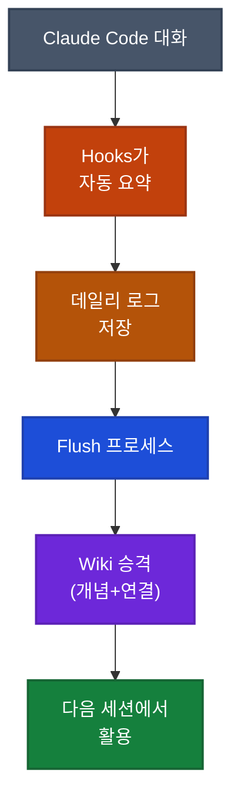

## 이게 뭔가요?

Claude Code와 대화하면서 내린 결정, 발견한 문제점, 배운 패턴들이 세션이 끝나거나 컨텍스트가 압축되면 사라져버린 경험이 있으신가요?

이 영상은 AI 연구자 Andrej Karpathy(안드레 카르파시)가 공개한 **LLM 지식 베이스** 아키텍처를 Claude Code의 **내부 데이터(세션 대화 기록)**에 적용하여, 대화할수록 스스로 똑똑해지는 메모리 시스템을 만드는 방법을 보여줍니다.

> 비유: 회사에 신입이 들어와서 매일 업무 일지를 쓰는데, 주 1회 팀장이 그 일지들을 읽고 핵심 노하우만 뽑아서 "팀 위키"에 정리해두는 것과 같습니다. 나중에 다른 신입이 오면 위키만 읽어도 바로 일할 수 있죠. 이 시스템이 하는 일이 바로 그겁니다 — 팀장 역할을 AI가 자동으로 합니다.

## 왜 알아야 하나요?

- **세션이 끝나도 지식이 남는다**: Claude Code의 기본 메모리(`CLAUDE.md`)는 수동 관리가 필요하지만, 이 시스템은 자동으로 대화 내용을 정리하고 축적
- **프로젝트별 전문가가 된다**: 코드베이스마다 별도 지식 베이스가 쌓이므로, 같은 프로젝트에서 반복적인 설명이 불필요
- **벡터 DB나 RAG가 필요 없다**: 마크다운 파일 + 인덱스만으로 동작하므로 설치가 간단하고 비용이 들지 않음
- **Obsidian(옵시디언)에서 시각적으로 확인 가능**: 지식이 어떻게 연결되어 있는지 그래프로 볼 수 있음

## Karpathy의 원래 아이디어: 컴파일러 비유

Karpathy는 LLM 지식 베이스를 **코드 컴파일 과정**에 비유했습니다.


| 단계 | 코드 비유 | 지식 베이스에서의 역할 |
|------|----------|---------------------|
| **소스 코드** | `.js`, `.py` 파일 | 원본 자료 (논문, 기사, 메모) |
| **컴파일러** | 소스를 실행파일로 변환 | LLM이 원본을 요약·정리·연결 |
| **실행파일** | 앱을 실행하는 바이너리 | Wiki — 정리된 개념 + 연결 관계 |
| **테스트** | 코드 린팅/테스트 | 빠진 정보, 깨진 링크, 오래된 데이터 점검 |
| **런타임** | 앱을 실행하여 사용 | Wiki를 검색하여 질문에 답변 |

핵심 포인트: Karpathy는 "복잡한 RAG(검색 증강 생성)가 필요할 줄 알았는데, LLM이 인덱스 파일을 자동으로 잘 관리한다"고 밝혔습니다. 벡터 데이터베이스 없이 **마크다운 인덱스 파일 하나**로 에이전트가 어디를 찾아봐야 할지 파악합니다.

## 어떻게 하나요?

### 이 시스템의 핵심 차이점

Karpathy의 원래 시스템은 **외부 데이터**(인터넷 기사, 논문)를 가져와 정리하는 것이었지만, Cole Medin이 만든 시스템은 **내부 데이터**(Claude Code와의 대화 기록)를 자동으로 수집합니다.

| 항목 | Karpathy 원본 | Cole Medin 버전 |
|------|-------------|----------------|
| 데이터 소스 | 외부 기사, 논문 | Claude Code 세션 대화 로그 |
| 입력 방식 | Obsidian Web Clipper로 수동 수집 | Hooks(훅)로 자동 수집 |
| 처리 도구 | 별도 스크립트 | Claude Agent SDK(에이전트 개발 도구) |
| 용도 | 연구 주제 정리 | 프로젝트별 개발 지식 축적 |

### 방법 1: 빠른 설치 (프롬프트 하나로)

Claude Code에서 아래와 같이 입력하면 전체 시스템이 자동 설치됩니다:

<div class="example-case">
<strong>예시: 설치 프롬프트</strong>

Cole Medin의 GitHub 저장소를 클론하고 Claude Code Hooks(특정 시점에 자동 실행되는 기능)를 설정하라는 프롬프트를 Claude Code에 입력합니다. 저장소 README의 Quick Start 섹션에 정확한 프롬프트가 있으며, 클론부터 훅 설정까지 한 번에 처리됩니다.

</div>

### 방법 2: 구조 이해하고 설정하기

#### 폴더 구조

```
프로젝트/
├── daily_logs/          ← "소스 코드" (세션 대화 요약이 자동 저장)
│   ├── 2026-04-06.md
│   └── 2026-04-07.md
├── knowledge/           ← "실행파일" (Wiki — 에이전트가 검색하는 곳)
│   ├── index.md         ← 전체 지식 목록 (에이전트의 출발점)
│   ├── concepts/        ← 개념별 정리 문서
│   └── connections/     ← 개념 간 연결 관계
└── agents.md            ← 시스템 전체 설명 (에이전트의 규칙서)
```

#### 3가지 Hooks가 하는 일

이 시스템은 **Claude Code Hooks(훅)** 3개만으로 동작합니다. 별도 프로그램 설치가 필요 없습니다.

| Hook 이벤트 | 실행 시점 | 하는 일 |
|------------|----------|--------|
| `session_start` | Claude Code 세션 시작 | `agents.md` + `index.md` 로딩 → 에이전트가 시스템과 지식 구조를 이해 |
| `pre_compact` | 컨텍스트 압축 직전 | 현재 대화 내용을 Claude Agent SDK로 전송 → 요약 생성 → 데일리 로그에 저장 |
| `session_end` | 세션 종료 | `pre_compact`와 동일 — 대화 요약을 데일리 로그에 저장 |

> 비유: `session_start`는 출근해서 어제 업무일지를 읽는 것, `pre_compact`와 `session_end`는 퇴근 전에 오늘 업무일지를 쓰는 것입니다.

#### Flush 프로세스: 데일리 로그 → Wiki 승격

하루에 한 번, **flush 프로세스**가 데일리 로그에서 핵심 개념과 연결 관계를 추출하여 Wiki(`knowledge/` 폴더)로 승격합니다.



#### Obsidian으로 시각화 (선택사항)

Obsidian(옵시디언, 무료 마크다운 메모 앱)을 사용하면 지식 베이스를 **그래프 뷰**로 시각적으로 확인할 수 있습니다. 개념들이 어떻게 연결되어 있는지 한눈에 파악 가능합니다.

설정 방법:
1. Obsidian 설치 (무료)
2. "Open folder as vault" → 프로젝트 폴더 선택
3. 그래프 뷰에서 지식 연결 관계 확인

## 실전 예시

<div class="example-case">
<strong>실전 케이스: 프로젝트 주의사항 즉시 답변</strong>

프로젝트에서 이미 여러 번 Claude Code와 대화하며 버그를 잡고, 아키텍처를 결정하고, 주의할 점을 발견했다고 가정합니다.

새 세션을 열고 "이 프로젝트에서 주의할 점이 뭐야?"라고 물으면, Claude Code가 `index.md`를 출발점으로 관련 Wiki 문서를 검색하고 **10초 만에** 핵심 주의사항을 정리해서 답합니다. 참조한 KB 문서 목록도 함께 보여줍니다.

지식 베이스가 없었다면? git log를 뒤지고, 코드베이스를 탐색하는 서브에이전트를 띄워야 해서 훨씬 느리고, 대화에서 배운 교훈은 아예 찾을 수 없었을 것입니다.

</div>

<div class="example-case">
<strong>실전 케이스: 복리 효과로 점점 똑똑해지는 에이전트</strong>

1. 질문: "인증 모듈 리팩터링할 때 뭘 주의해야 해?" → Wiki에서 관련 교훈 검색 → 답변
2. 답변을 바탕으로 추가 웹 리서치 진행
3. 세션 종료 → Hook이 자동으로 이번 대화 요약을 데일리 로그에 저장
4. Flush 프로세스가 새 개념을 Wiki에 추가
5. 다음에 비슷한 질문을 하면 **이전 답변 + 새 리서치 결과**까지 포함된 더 풍부한 답변

이것이 **복리 효과(compounding loop)** — 쓸수록 지식이 쌓이고, 답변 품질이 올라갑니다.

</div>

## Claude Code 기본 메모리와의 차이

| 항목 | Claude Code 기본 메모리 | 이 시스템 (LLM 지식 베이스) |
|------|----------------------|--------------------------|
| 저장 위치 | `~/.claude/` 내 메모리 파일 | 프로젝트 내 `knowledge/` 폴더 |
| 저장 방식 | Claude가 판단하여 수동 저장 | Hook이 매 세션 자동 저장 |
| 구조 | 평면적 메모 목록 | 개념 + 연결 관계 + 인덱스 (Wiki 구조) |
| 검색 | 메모리 파일 순차 확인 | 인덱스 기반 탐색 (그래프 구조) |
| 커스터마이징 | 제한적 | 프롬프트/스크립트 수정 자유 |
| 시각화 | 없음 | Obsidian 그래프 뷰 |

## 주의할 점

- **Claude Agent SDK는 별도 API 키 필요**: 영상에서는 "Claude Code 구독을 그대로 쓸 수 있다"고 했지만, 실제로는 Claude Agent SDK에 **별도 Anthropic API 키**(platform.claude.com에서 발급)가 필요합니다. Claude Pro/Max 구독과는 별개의 비용이 발생합니다
- **Flush 타이밍**: 데일리 로그에서 Wiki로의 승격은 즉시가 아니라 Flush 프로세스 실행 시점에 일어남
- **프로젝트별 설정 필요**: 코드베이스마다 별도로 설정해야 하므로, 자주 사용하는 프로젝트에 먼저 적용하는 것이 효율적

## 정리

- Karpathy의 LLM 지식 베이스 아키텍처를 Claude Code 세션 대화에 적용하여, 대화할수록 자동으로 지식이 쌓이는 메모리 시스템
- Claude Code Hooks 3개(`session_start`, `pre_compact`, `session_end`)만으로 동작 — 별도 설치 불필요
- 벡터 DB 없이 마크다운 인덱스 파일 기반으로 검색하므로 간단하고 효과적

---

> **출처**: [I Built Self-Evolving Claude Code Memory w/ Karpathy's LLM Knowledge Bases](https://youtube.com/watch?v=7huCP6RkcY4) — Cole Medin (2026.04.06)
