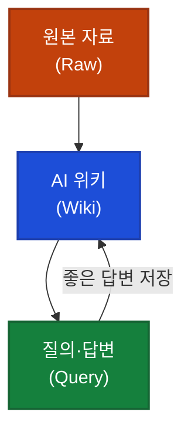

## 이게 뭔가요?

오랫동안 쓰던 메모 앱을 열어보면 이런 상황이 자주 생깁니다. "분명히 어디 적어뒀는데... 어디 있더라?" 글이 수백 개 쌓여 있지만 정작 필요할 때 찾기가 어렵고, 비슷한 내용이 여러 군데 흩어져 있고, 서로 연결도 안 되어 있습니다.

**LLM Wiki(대규모 언어 모델 기반 위키)**는 이 문제를 근본적으로 다르게 접근합니다. AI(인공지능)가 내 메모들을 읽고, 요약하고, 서로 연결해서 **계속 자라나는 지식 정원**을 만들어주는 시스템입니다.

마치 오래된 도서관에 새 사서가 들어와서 책들을 주제별로 분류하고, 관련 책끼리 안내 카드를 붙이고, 매일 새 책이 들어오면 그 자리에 맞게 정리해주는 것과 같습니다. 그 사서 역할을 Claude(클로드, Anthropic이 만든 AI)가 맡습니다.

이 개념은 AI 연구자 Andrej Karpathy(안드레 카르파시, OpenAI 창립 멤버이자 테슬라 전 인공지능 총괄)가 제안했으며, Obsidian(옵시디언, 마크다운 기반의 개인 노트 앱)과 Claude Code(클로드 코드, AI가 파일을 직접 읽고 수정하는 CLI(명령줄 인터페이스) 도구)를 함께 사용해 구현합니다.

---

## 왜 알아야 하나요?

기존에 AI를 문서 검색에 활용하는 방식(RAG, Retrieval-Augmented Generation — 질문할 때마다 관련 문서를 검색해서 AI에게 보여주는 방식)은 매번 원본 파일을 전부 읽어야 합니다. 파일이 많아질수록 느려지고, AI가 읽는 토큰(token, AI가 글자를 처리하는 단위, 많을수록 비용 증가)도 늘어납니다.

LLM Wiki는 반대로 생각합니다. **미리 한 번 정리해두면, 그 다음부터는 정리본만 읽으면 됩니다.** 세션(session, AI와의 한 번의 대화)당 사용하는 토큰이 최대 89%까지 줄어든다는 실측 결과도 있습니다.

개인 지식 관리(PKM, Personal Knowledge Management) 관점에서도 의미가 있습니다. AI가 정리해준 위키(wiki, 체계적으로 정리된 지식 문서)는 내가 직접 정리한 것보다 훨씬 일관성이 높고, 놓쳤던 연결 고리를 발견해주기도 합니다.

---

## 어떻게 작동하나요?

LLM Wiki는 세 계층으로 이루어집니다.

**Raw (원본 계층):** 내가 수집한 자료들 — 기사, 메모, 회의록, 코드 스니펫(snippet, 짧은 코드 조각) 등. 절대 수정하지 않습니다. Obsidian Web Clipper(웹 페이지를 마크다운(markdown, 간단한 기호로 서식을 표현하는 문서 형식)으로 저장하는 브라우저 확장)로 수집합니다.

**Wiki (AI 관리 계층):** Claude가 작성하고 관리하는 정리본. 요약 페이지, 개념 설명, 관련 항목 연결 등이 자동 생성됩니다.

**Query (질의 계층):** 자연어로 질문하면 위키에서 관련 내용을 찾아 답해줍니다. 가치 있는 답변은 새 위키 페이지로 저장되어 지식이 계속 쌓입니다.

---

## 세 가지 핵심 작업

### Ingest — 새 자료 추가

새 메모나 문서를 Raw 폴더에 넣으면, Claude가 자동으로:
1. 내용을 읽고 요약 페이지 작성
2. 기존 위키 페이지와 연결 고리 파악
3. `[[위키링크]]` 형식(Obsidian에서 노트를 서로 연결하는 방식)으로 관계 표시

<strong>예시: 새 아티클을 읽고 수집할 때</strong>

Claude Code에 "AI 에이전트 설계에 관한 이 글을 위키에 추가해줘"라고 하면, Claude는 글을 읽고 요약 페이지를 만든 뒤, 기존에 있던 "AI 에이전트" 페이지와 "프롬프트 설계" 페이지에 자동으로 연결합니다. 다음에 "에이전트 설계 원칙이 뭐야?"라고 물으면 이 글도 포함해서 답해줍니다.

### Query — 지식 질의

"지금까지 모은 자료에서 X에 대해 어떻게 정리되어 있어?"라고 물으면, Claude가 위키에서 관련 페이지를 찾아 종합해서 답변합니다.

### Lint — 위키 건강 점검

`/wiki-lint` 명령어로 정기적으로 점검합니다:
- 오래되어 업데이트가 필요한 페이지 감지
- 연결이 끊어진 고아 페이지 정리
- 같은 개념을 다른 이름으로 쓴 불일치 항목 정정

---

## 폴더 구조

Obsidian 볼트(vault, Obsidian이 관리하는 노트 저장 폴더) 안에 아래처럼 구성합니다:

| 폴더/파일 | 역할 |
|----------|------|
| `raw/` | 원본 자료 보관 (수정 금지) |
| `wiki/` | Claude가 작성·관리하는 위키 |
| `index.md` | 전체 위키 분류 목록 |
| `log.md` | 작업 기록 (언제 뭘 추가했는지) |
| `CLAUDE.md` | Claude에게 주는 운영 규칙과 스키마 |

---

## 실전 예시

<strong>실전 케이스: 뿔뿔이 흩어진 3년치 업무 메모 정리</strong>

스타트업 마케팅 팀장 이수연 씨는 3년 동안 Notion, Apple Notes, 카카오톡 저장 메시지에 업무 인사이트를 분산 저장해왔습니다. 정작 필요할 때는 "어디 있더라?" 하며 10분씩 낭비하기 일쑤였고, 비슷한 실수를 반복하기도 했습니다.

모든 자료를 마크다운으로 변환해 Raw 폴더에 넣고 `/wiki-compile`을 실행했습니다. Claude가 주제별로 위키 페이지를 생성하고, "경쟁사 분석", "SNS 실험 결과", "카피라이팅 원칙" 같은 항목으로 자동 분류했습니다. 이제 "작년에 인스타 광고에서 효과적이었던 방식이 뭐였지?"라고 물으면 3년치 자료에서 바로 찾아줍니다.

<strong>실전 케이스: 개발 팀의 지식 공유 문제 해결</strong>

6인 개발팀을 이끄는 박준호 CTO는 팀원들이 각자 다른 방식으로 기술 결정을 기록하거나 아예 기록하지 않는 문제를 겪었습니다. "왜 이렇게 설계했어요?"라는 질문에 "그때 그 분이 그랬어요"라는 답이 돌아오는 상황이 반복됐습니다.

팀 Obsidian 볼트에 LLM Wiki를 적용하고, 모든 기술 결정 기록(ADR, Architecture Decision Record — 기술 선택의 이유를 남기는 문서)을 Raw에 쌓기로 했습니다. Claude가 이를 주제별 위키로 정리해두니, 신입이 "왜 Redis를 쓰나요?"라고 물으면 위키에서 바로 찾아줍니다. 온보딩(onboarding, 신규 팀원이 업무에 적응하는 과정) 시간이 크게 줄었습니다.

---

## 주의할 점

**자동 업데이트가 안 됩니다.** 원본 파일을 수정하면 위키도 직접 다시 컴파일해야 합니다. 정기적으로 `/wiki-lint`를 실행하는 습관이 필요합니다.

**용어 일관성이 핵심입니다.** 같은 개념을 어떤 메모에선 "에이전트", 다른 메모에선 "agent"로 쓰면 연결이 약해집니다. Raw 파일을 추가할 때부터 일관된 용어를 쓰는 것이 좋습니다.

**도구보다 도메인 지식이 중요합니다.** 영상에서 편집자P는 이 점을 특히 강조합니다. AI가 아무리 잘 정리해줘도, 내가 어떤 주제로 어떤 질문을 하고 싶은지 모르면 위키는 텅 빈 정원이 됩니다.

**Claude Code 전용입니다.** 이 시스템은 Claude Code가 파일을 직접 읽고 쓸 수 있어야 작동합니다. 다른 AI 도구에서는 동작하지 않습니다.

---

## 정리

- LLM Wiki는 AI가 내 메모를 미리 정리해둔 위키를 유지·관리해주는 시스템으로, 매번 원본을 읽는 대신 정리본만 참조해 토큰 비용을 크게 줄입니다.
- Raw(원본) → Wiki(AI 정리본) → Query(질의) 세 계층으로 이루어지며, Ingest·Query·Lint 세 작업으로 운영합니다.
- 도구 설정보다 꾸준한 자료 수집 습관과 용어 일관성이 시스템의 품질을 결정합니다.

---

**참고 영상:** [LLM Wiki 입문 가이드 — 편집자P](https://youtube.com/watch?v=S6w4g2OQlVQ)
