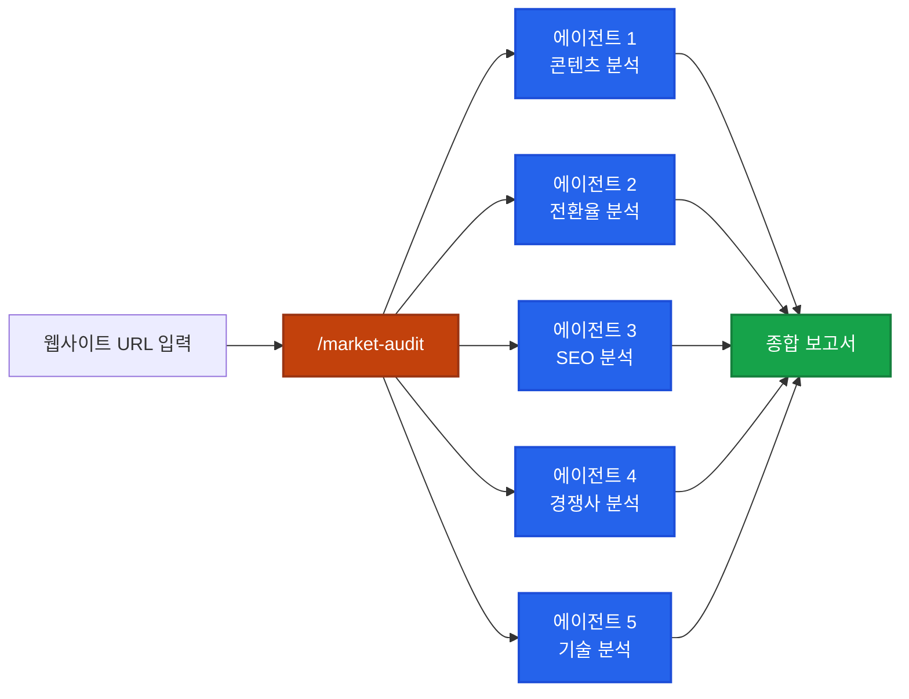

## 이게 뭔가요?

마케팅 에이전시에 웹사이트 분석을 맡기면 월 500~1,000만원 정도 받습니다. 이 도구는 **Claude Code의 Skills 기능을 활용해서 같은 수준의 마케팅 감사(audit)를 무료로** 해주는 도구예요.

명령어 하나(`/market-audit`)를 입력하면 5개의 AI 에이전트가 동시에 출동해서:
- 웹사이트 콘텐츠와 메시지 분석
- SEO(검색 엔진 최적화) 점검
- 경쟁사 조사
- 전환율 최적화 분석
- 기술적 문제 점검

을 수행하고, 결과를 **전문적인 PDF 보고서**로 뽑아줍니다.

비유하면 이래요:

> **원래**: 마케팅 컨설턴트를 고용해서 2주간 분석 → 보고서 받기 (수백만원)
> **이 도구**: Claude Code에 웹사이트 주소 붙여넣기 → 2분 후 PDF 보고서 완성 (무료)

## 왜 알아야 하나요?

- **사업하는 사람**: 내 웹사이트의 마케팅 문제점을 무료로 진단받을 수 있음
- **프리랜서/부업**: 이 도구로 잠재 고객에게 무료 감사 보고서를 보내면 → 유료 컨설팅으로 전환 가능
- **Claude Code 사용자**: Skills를 활용한 실전 비즈니스 자동화 사례를 배울 수 있음

실제 사례에서 메디스파(피부과 시술 클리닉) 웹사이트를 분석했더니:
- 보톡스 패키지 가격이 페이지마다 다른 **치명적 오류** 발견
- 전체 사이트에 메타 설명이 **하나도 없는** SEO 문제 발견
- 경쟁사 3곳의 강약점까지 비교 분석

이런 걸 사람이 하면 며칠, AI가 하면 **2분**입니다.

## 어떻게 하나요?

### 1단계: 도구 설치 (1분)

GitHub에 공개된 저장소에서 설치 명령어 하나로 끝납니다.

<div class="example-case">
<strong>💬 예시: 설치 과정</strong>

```
1. VS Code 또는 원하는 에디터 열기
2. 터미널 열기
   - Mac: Cmd+` (백틱)
   - Windows: Ctrl+` (백틱)
3. GitHub 저장소의 설치 명령어 복사 → 터미널에 붙여넣기 → Enter
4. "Installation complete" 메시지 확인
```

설치가 끝나면 Claude Code에서 `/market`을 입력하면 15개 마케팅 명령어가 보입니다.

</div>

### 2단계: 전체 마케팅 감사 실행

```
/market-audit https://example.com
```

이 한 줄이면 5개 에이전트가 동시에 분석을 시작합니다.



분석이 완료되면 100점 만점 점수와 함께 상세 결과가 나옵니다.

### 3단계: PDF 보고서 생성

```
/market-report-pdf
```

감사 결과를 클라이언트에게 보낼 수 있는 **전문적인 PDF**로 변환합니다.

PDF에 포함되는 내용:
- 전체 마케팅 점수 (100점 만점)
- 항목별 점수 (콘텐츠, SEO, 전환율, 브랜드 신뢰도 등)
- 치명적/높음/보통/낮음 등급의 발견사항
- 우선순위별 액션 플랜 (이번 주 / 1~3개월 / 3~6개월)
- 경쟁사 비교 분석

## 15개 스킬 전체 목록

전체 감사(`/market-audit`) 외에도 개별 분석을 따로 실행할 수 있습니다.

| 명령어 | 기능 | 언제 쓰나 |
|--------|------|-----------|
| `/market-audit` | 전체 마케팅 감사 (5개 에이전트 병렬) | 처음 분석할 때 |
| `/market-competitors` | 경쟁사 3단계 분석 | 경쟁 환경만 파악할 때 |
| `/market-copy` | 광고 카피 생성 | 광고 문구가 필요할 때 |
| `/market-email` | 이메일 시퀀스 생성 | 이메일 마케팅 할 때 |
| `/market-social` | SNS 콘텐츠 생성 | 소셜 미디어 운영할 때 |
| `/market-seo` | SEO 감사 | 검색 노출을 개선할 때 |
| `/market-funnels` | 퍼널 분석 | 고객 전환 흐름을 볼 때 |
| `/market-report-pdf` | PDF 보고서 생성 | 클라이언트에게 전달할 때 |

나머지 7개도 랜딩페이지, 기술 분석, 전략 수립 등 다양한 마케팅 작업을 커버합니다.

## 실전 예시

<div class="example-case">
<strong>📌 실전 케이스: 지역 메디스파 마케팅 감사</strong>

**상황**: 샌프란시스코의 메디스파 "Knobhill Aesthetics" 웹사이트를 분석

**과정**:
1. `/market-audit https://knobhillaesthetics.com` 실행
2. 5개 에이전트가 동시에 분석 시작 (약 2분 소요)
3. 결과: **64/100점** (C-)

**발견된 치명적 문제**:
- 보톡스 패키지 가격이 페이지마다 다름 (1,400달러 vs 1,500달러)
- 전체 사이트에 메타 설명(meta description)이 하나도 없음 → 구글 검색 노출 최악

**경쟁사 분석 결과**:
- Haze Valley Medical Aesthetics, Skin Spirit, Serenity Medspa 3곳 비교
- 각 경쟁사의 소셜 미디어 활동, 가격 전략, 콘텐츠 전략 분석

**PDF 보고서**: `/market-report-pdf`로 생성 → 전문적인 디자인의 PDF 완성

</div>

<div class="example-case">
<strong>📌 실전 케이스: 무료 감사 보고서로 클라이언트 확보하기</strong>

**상황**: AI 마케팅 컨설팅을 시작하고 싶은데 포트폴리오가 없다

**전략**:
1. 동네 가게/병원/학원 웹사이트를 `/market-audit`으로 분석
2. PDF 보고서를 생성해서 **무료로** 이메일 전송
3. "이런 문제를 발견했습니다. 무료 상담 한번 해볼까요?" 제안
4. 상담 후 월 200~500만원 리테이너 계약 제안

**왜 효과적인가**:
- 무료 보고서가 이미 엄청난 가치를 제공 (에이전시에 맡기면 수십만원)
- 치명적 문제(가격 오류 등)를 발견해주면 신뢰 확보
- 우선순위별 액션 플랜이 있어서 "당장 뭘 해야 하는지" 명확

</div>

## 이 도구의 작동 원리

이 도구가 특별한 이유는 Claude Code의 **Skills 시스템**을 활용하기 때문입니다.

각 스킬은 `skill.md` 파일 하나로 되어 있어요. 이 파일 안에 "당신은 마케팅 전문가입니다. 이런 순서로 분석하세요"라는 상세한 지침이 들어있고, Claude Code가 이 지침을 따라 전문가처럼 행동하는 겁니다.

비유하면: 신입 마케터에게 **업계 최고 수준의 매뉴얼**을 주면 금방 전문가처럼 일하는 것과 같아요. `skill.md`가 바로 그 매뉴얼입니다.

## 주의할 점

- **권한 허용 필요**: 분석 중에 웹사이트 접속 권한을 여러 번 물어봄. "Allow" 클릭 필요
- **토큰 소비가 큼**: 5개 에이전트가 동시에 돌아가므로 한 번 실행에 토큰이 많이 소모됨
- **결과 검증 필수**: AI가 생성한 보고서를 클라이언트에게 보내기 전에 반드시 직접 읽고 확인하세요. 가끔 오류가 있을 수 있음
- **비공개 사이트는 분석 제한**: 로그인이 필요하거나 차단된 페이지는 분석이 제한될 수 있음

## 정리

- Claude Code Skills로 15개 마케팅 분석 도구를 **무료로** 설치 가능
- `/market-audit` 한 줄로 5개 에이전트가 동시 분석 → 2분 만에 완료
- PDF 보고서까지 자동 생성 → 클라이언트에게 바로 전달 가능한 퀄리티

> 참고 영상: [AI Marketing Tool with Claude Code](https://www.youtube.com/watch?v=eorc3jLBqIA)
