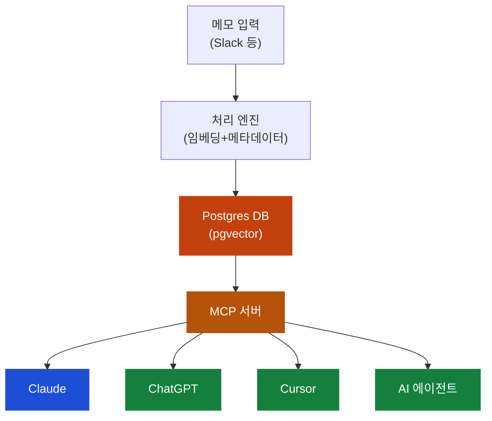

## 이게 뭔가요?

Claude에서 열심히 대화하면서 쌓은 맥락이 있잖아요. 그런데 ChatGPT로 넘어가면? 처음부터 다시 설명해야 합니다. Cursor로 가면? 또 처음부터. 새 AI 에이전트를 쓰고 싶으면? 또 처음부터.

**Open Brain**은 이 문제를 해결하는 **나만의 AI 메모리 시스템**입니다. 내 생각, 결정, 메모를 **하나의 데이터베이스**에 저장하고, MCP(외부 도구 연결 프로토콜)를 통해 **어떤 AI든** 접근할 수 있게 만드는 거예요.

비유하면 이래요:

> **지금**: 5개 카페에 단골 바리스타가 각각 있는데, 서로 내가 뭘 좋아하는지 모름. 매번 "아이스 아메리카노, 시럽 빼고, 얼음 적게"를 반복해야 함
> **Open Brain**: 내 취향이 적힌 카드를 갖고 다니면, 어떤 카페에 가든 카드를 보여주면 끝

## 왜 알아야 하나요?

### 지금 AI 메모리의 문제점

- **Claude의 메모리**는 ChatGPT가 못 읽음
- **ChatGPT의 메모리**는 Cursor가 못 읽음
- **모든 플랫폼**이 메모리로 사용자를 가두려 함 (락인 전략)

이건 마치 **5개 책상에 따로 놓인 메모지**와 같아요. 각 책상에서만 볼 수 있고, 다른 책상으로 가져갈 수 없습니다.

### AI 에이전트 시대의 필수 인프라

최근 자율형 AI 에이전트(Open Claw 등)가 폭발적으로 성장하고 있는데, 에이전트가 제대로 일하려면 **나에 대한 맥락**이 필요합니다. 내가 뭘 하고 있는지, 어떤 결정을 내렸는지, 누구와 일하는지를 알아야 좋은 결과를 내놓거든요.

Open Brain이 있으면:
- **모든 AI 도구**에서 같은 맥락을 공유
- **새 AI 도구**를 시도할 때 처음부터 시작하지 않음
- **AI 에이전트**가 내 맥락을 읽고 더 정확하게 행동
- **플랫폼 종속 없음** — 내 데이터는 내가 소유

## 어떻게 하나요?

### 전체 아키텍처



### 핵심 구성요소 3가지

**1. Postgres 데이터베이스 (저장소)**

내 모든 생각과 메모가 저장되는 곳이에요. Postgres는 30년 넘게 쓰인 안정적인 데이터베이스로, 특정 회사에 종속되지 않습니다.

비유: 내 서재에 있는 **만능 파일 캐비넷**. 어떤 서류든 넣을 수 있고, 아무도 이걸 없앨 수 없음.

**2. 벡터 임베딩 (의미 검색)**

일반 검색은 "키워드"로 찾지만, 벡터 검색은 **"의미"**로 찾습니다.

<div class="example-case">
<strong>💬 예시: 키워드 검색 vs 의미 검색</strong>

```
내가 저장한 메모: "사라가 회사 그만두고 컨설팅 시작할까 고민 중이래"

키워드 검색: "경력 변화" → ❌ 못 찾음 (메모에 "경력"이라는 단어가 없으니까)
의미 검색:   "경력 변화" → ✅ 찾음! (의미상 커리어 전환 이야기니까)
```

벡터 임베딩이 바로 이 "의미 검색"을 가능하게 해주는 기술이에요.

</div>

**3. MCP 서버 (연결 다리)**

MCP(Model Context Protocol)는 AI 도구들이 외부 데이터에 접근하는 **표준 프로토콜**이에요. USB-C처럼 하나의 규격으로 모든 기기를 연결하는 것과 같습니다.

MCP 서버를 통해 제공되는 3가지 도구:
- **의미 검색**: "지난달 경력 관련 생각 찾아줘"
- **최근 목록**: "이번 주에 뭘 기록했지?"
- **통계**: "내가 어떤 주제를 많이 생각하는지 패턴 보여줘"

### 실제 사용 흐름

<div class="example-case">
<strong>💬 예시: 생각 저장부터 활용까지</strong>

**저장 (5초):**
```
[Slack 채널에 입력]
"사라랑 이야기했는데, 회사 구조조정 이후로 많이 힘들어하더라.
컨설팅 사업을 시작할까 고민 중이래."

→ 시스템이 자동으로:
  ✅ 원문 저장
  ✅ 벡터 임베딩 생성 (의미 변환)
  ✅ 메타데이터 추출 (사람: 사라, 주제: 경력, 타입: 대화 메모)
  ✅ Slack에 확인 메시지 표시
```

**활용 (Claude에서):**
```
나: "경력 전환을 고민하는 사람들에 대한 메모 찾아줘"
Claude: (MCP로 Open Brain 검색)
→ "사라에 대한 메모를 찾았습니다. 구조조정 이후 컨설팅 시작을 고민 중..."
```

**활용 (ChatGPT에서):**
```
나: "사라에게 보낼 응원 이메일 초안 써줘"
ChatGPT: (같은 MCP로 같은 Open Brain 검색)
→ 사라의 상황을 이미 알고 있으므로 맥락에 맞는 이메일 작성
```

</div>

### 설치 (약 45분, 코딩 경험 불필요)

상세 설치 가이드는 원본 영상의 Substack 컴패니언 가이드에 있지만, 큰 그림은 이렇습니다:

1. **Supabase 프로젝트 생성** (무료 티어)
   - Postgres DB + pgvector 확장 활성화
   - Edge Function 배포 (메모 처리 + 임베딩 생성)

2. **Slack 연동** (또는 원하는 메신저)
   - Slack 봇 생성 → 특정 채널에 메시지 쓰면 자동 저장

3. **MCP 서버 설정**
   - Claude/ChatGPT/Cursor 등에서 접속할 수 있도록 MCP 서버 구성

**월 운영 비용**: 약 10~30센트 (하루 20개 메모 기준). 오늘 아침 커피보다 쌉니다.

## 실전 예시

<div class="example-case">
<strong>📌 실전 케이스: 기존 AI 메모리를 Open Brain으로 이전</strong>

**상황**: Claude와 ChatGPT를 번갈아 쓰는데, 각각 쌓인 메모리가 있어서 도구 전환이 불편하다.

**해결**:
1. Open Brain 설치 (45분)
2. "메모리 마이그레이션" 프롬프트 실행
   - Claude 메모리 → Open Brain으로 추출/저장
   - ChatGPT 메모리 → Open Brain으로 추출/저장
3. 이후 모든 AI에서 MCP로 Open Brain 접속

**결과**: 어떤 AI를 열든 "내가 뭘 하고 있었는지" 이미 알고 있음. 처음부터 설명하는 시간 제로.

</div>

<div class="example-case">
<strong>📌 실전 케이스: AI 에이전트에 맥락 제공하기</strong>

**상황**: AI 에이전트한테 "내 이번 주 업무를 정리해줘"라고 시키고 싶은데, 에이전트가 내 업무를 전혀 모른다.

**해결**:
1. 매일 업무 메모를 Open Brain에 저장 (Slack에 한 줄씩)
2. 에이전트가 MCP로 Open Brain에 접근
3. "이번 주 기록된 내용을 기반으로 주간 보고서 만들어줘"

**결과**: 에이전트가 내 한 주간의 기록을 읽고 알아서 주간 보고서를 생성. 내가 일일이 설명할 필요 없음.

</div>

## 기존 세컨드 브레인과의 차이

| 구분 | 기존 세컨드 브레인 (Notion, Obsidian 등) | Open Brain |
|---|---|---|
| **설계 대상** | 사람이 읽기 위해 | AI와 사람 모두를 위해 |
| **검색 방식** | 키워드, 폴더 구조 | 의미 기반 벡터 검색 |
| **AI 접근** | 해당 앱 내에서만 | MCP로 모든 AI에서 접근 |
| **에이전트 호환** | 제한적 | 네이티브 지원 |
| **플랫폼 종속** | 앱에 종속 | 내가 소유한 DB |
| **관계** | 대체가 아님 | 아래에 깔리는 **인프라 레이어** |

> Open Brain은 Notion이나 Obsidian을 **대체**하는 게 아닙니다. 그 **아래에 깔리는 기반 인프라**예요. 기존 도구는 계속 쓰되, 핵심 데이터는 Open Brain에 저장하는 구조입니다.

## 주의할 점

- **사용해야 복리 효과가 생김**: 시스템은 입력할수록 똑똑해집니다. 설치만 하고 안 쓰면 빈 서재와 같아요. 매일 1~2개라도 저장하는 습관이 핵심.
- **메타데이터 추출이 완벽하지 않음**: AI가 메모에서 사람 이름이나 주제를 가끔 틀리게 분류할 수 있어요. 하지만 벡터 검색이 이를 보완하므로 큰 문제는 아닙니다.
- **초기 설치가 약간 기술적**: 45분 정도 걸리고, Supabase/MCP 설정이 필요해요. 코딩 경험이 없어도 가이드를 따라 할 수 있지만, AI에게 "이 영상 보고 따라 만들어줘"라고 시키는 것도 방법입니다.
- **민감한 정보 주의**: 개인 DB에 저장되지만, Supabase 클라우드를 사용하므로 극도로 민감한 정보(비밀번호 등)는 넣지 마세요.

## 정리

- **Open Brain** = Postgres DB + 벡터 임베딩 + MCP 서버로 만드는 **플랫폼 독립 AI 메모리**
- 어떤 AI를 쓰든 같은 맥락을 공유 → 도구 전환 비용 제로
- AI 에이전트 시대의 필수 인프라 — 쓸수록 **복리로 가치가 쌓이는** 시스템

> 참고 영상: [Open Brain — 에이전트 시대의 AI 메모리 아키텍처](https://www.youtube.com/watch?v=2JiMmye2ezg)
