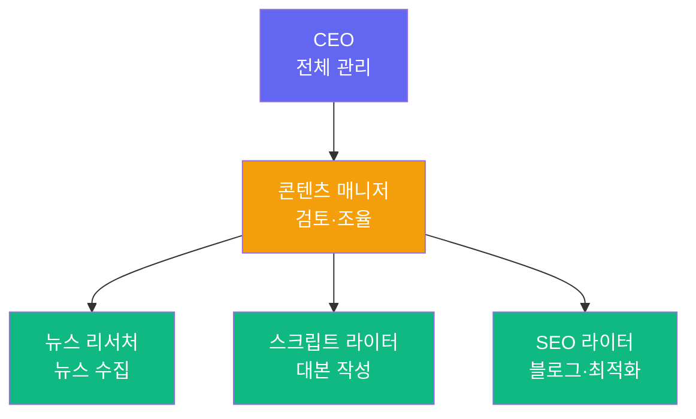

## 이게 뭔가요?

회사에는 대표, 팀장, 팀원이 있고 각자 역할에 맞게 일하죠. **PaperClip AI**는 이 회사 구조를 AI 에이전트로 그대로 만들어주는 프레임워크(뼈대 도구)입니다.

> 비유: 레고로 회사를 짓는다고 생각하세요. CEO 블록, 매니저 블록, 직원 블록을 조립하면, **대표가 알아서 팀장에게 일을 나눠주고, 팀장이 팀원에게 세부 작업을 배분**합니다. 사람은 "이거 해줘"라고 말만 하면 됩니다.

무료 오픈소스(MIT 라이선스)이고, `npx` 명령어 하나로 바로 시작할 수 있습니다. 2026년 3월 출시 3주 만에 GitHub 스타 30,000개를 넘긴 화제의 프로젝트입니다.

## 왜 알아야 하나요?

AI 에이전트 하나만으로는 복잡한 업무를 처리하기 어렵습니다:
- 리서치, 글쓰기, 검토를 한 에이전트가 전부 하면 품질이 떨어짐
- 여러 에이전트를 수동으로 관리하면 지시가 복잡해짐
- 작업 순서(파이프라인)를 직접 조율해야 함

PaperClip AI를 쓰면:
- **"팀 구성해줘"** 한마디로 필요한 에이전트 자동 추천 및 생성
- CEO가 알아서 하위 에이전트에게 **업무 자동 분배**
- 순차 실행(리서치 끝 → 글쓰기 시작)과 **병렬 실행**(유튜브+블로그 동시) 모두 지원
- 대시보드에서 **실시간 모니터링** — 누가 뭘 하고 있는지 한눈에 파악
- API 사용 **비용 추적** 기능 내장

## 어떻게 하나요?

### 1단계: 설치 및 실행

```bash
npx paperclipai onboard --yes
```

실행하면 `localhost:3100`에서 대시보드가 열립니다.

### 2단계: 회사(워크스페이스) 만들기

1. 대시보드에서 **회사 이름** 입력 (예: "내콘텐츠팀")
2. 첫 번째 에이전트 = **CEO(대표)** 생성
3. CLI(명령줄 도구) 에이전트 선택 — Claude Code 등 사용 가능
4. AI 모델 선택 후 **Test** 버튼으로 연결 확인
5. **Next** 클릭

### 3단계: 팀 구성 요청

CEO에게 자연어로 지시합니다:

```
유튜브 콘텐츠를 만들 팀을 구성해줘.
작업: AI 뉴스 리서치 → 중요도 선정 → 스크립트 작성 → SEO 블로그 생성
```

CEO가 필요한 에이전트를 자동 추천합니다:



사용자가 **"승인"**이라고 말하면 에이전트들이 자동 생성됩니다.

### 4단계: 파이프라인 실행

작업이 자동으로 순서대로 흘러갑니다:

| 순서 | 에이전트 | 작업 | 다음 단계 |
|------|---------|------|----------|
| 1 | 뉴스 리서처 | AI 관련 뉴스 10개 수집 | 콘텐츠 매니저에게 보고 |
| 2 | 콘텐츠 매니저 | 탑 3 주제 선정 | 스크립트 라이터 활성화 |
| 3 | 스크립트 라이터 | 유튜브 대본 작성 | SEO 라이터 활성화 |
| 4 | SEO 라이터 | 블로그 글 + SEO 최적화 | 최종 결과 CEO에게 보고 |

각 단계에서 콘텐츠 매니저가 **검토 후 승인**해야 다음으로 넘어갑니다.

### 5단계: 모니터링

대시보드에서 확인할 수 있는 것들:
- **Organization 탭**: 조직도 — 에이전트 계층 구조와 상태(실행중/대기) 표시
- **Inbox**: 에이전트들이 올린 이슈와 보고
- **Work**: 태스크 관리, 프로젝트별 묶기, 어사이니(담당자) 지정
- **Cost**: API 사용 비용 실시간 추적
- **Activity Log**: 전체 에이전트 활동 기록

## 실전 활용 아이디어

| 분야 | 팀 구성 예시 |
|------|-------------|
| **콘텐츠 제작** | 리서처 → 스크립트 라이터 → SEO 라이터 |
| **소프트웨어 개발** | 플래너 → 개발자 → 테스터 → 배포 담당 |
| **마케팅** | 시장 조사 → 카피라이터 → 디자인 기획 |

## 주의할 점

- CLI 에이전트 연결 시 **API 키가 필요**합니다 — 모델 사용료는 별도 발생
- Cost 탭에서 비용을 정기적으로 확인하세요
- 에이전트가 추가 팀원을 추천할 수 있음 — 필요 없으면 거절 가능

## 요약

| 항목 | 내용 |
|------|------|
| 도구 이름 | PaperClip AI |
| 가격 | 무료 (오픈소스) |
| 공식 사이트 | [paperclip.ing](https://paperclip.ing/) |
| 설치 | `npx paperclipai onboard --yes` |
| 핵심 기능 | 멀티 에이전트 팀 구성, 자동 업무 분배, 파이프라인 실행 |
| CLI 지원 | Claude Code, Codex 등 |
| 대시보드 | 조직도, 이슈, 비용, 활동 로그 |

> 출처: [코드팩토리 YouTube](https://youtube.com/watch?v=Am5y6x-erJs) (2026. 3. 30.)
