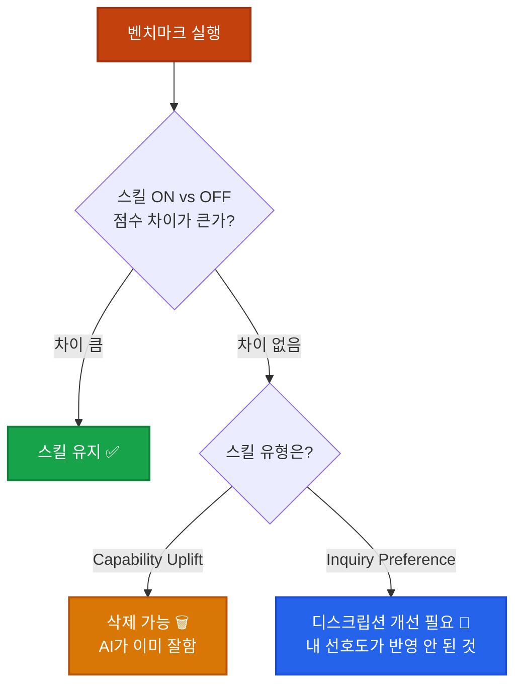

## 이게 뭔가요?

Claude Code에서 스킬(Skills)을 만들 때, 예전에는 **직접 써보고 → 결과가 이상하면 → 스킬 파일을 수정하고 → 다시 써보고**를 반복해야 했습니다. 운동선수가 코치 없이 혼자 연습하는 것과 비슷했죠.

**스킬 크리에이터(Skill Creator) V2**는 이 과정을 완전히 자동화합니다. 스킬을 만들어주는 것은 물론이고, **테스트 케이스를 자동으로 생성**하고, **벤치마크를 돌려서 점수를 매기고**, **부족한 부분을 알아서 개선**까지 해줍니다.

비유하자면:

> **이전**: 요리사가 혼자 만들고, 혼자 맛보고, 혼자 수정하는 것
> **지금**: 요리사가 만들면 **자동 시식단**이 7가지 기준으로 평가하고, "간이 좀 부족해요"라고 리포트까지 써주는 것

## 왜 알아야 하나요?

스킬을 만들어본 사람이라면 이런 경험이 있을 겁니다:

- 😤 **자동 트리거가 안 됨**: "이 상황에서 알아서 실행돼야 하는데" → 실행 안 됨
- 😤 **품질 들쭉날쭉**: 같은 스킬인데 어떨 때는 잘 되고, 어떨 때는 엉뚱한 결과
- 😤 **모델이 발전하면 스킬이 필요 없어질 수도**: AI가 이미 잘하는 걸 스킬로 만들어놓은 건 아닌지 확인 불가

스킬 크리에이터 V2는 이 세 가지 문제를 한 번에 해결합니다:

1. **디스크립션 자동 최적화** → 자동 트리거 정확도 대폭 향상
2. **벤치마크(Evals)** → 스킬 품질을 숫자로 확인 가능
3. **스킬 vs 기본 Claude 비교** → 이 스킬이 진짜 필요한지 판단 가능

## 어떻게 하나요?

### 방법 1: 스킬 크리에이터 설치 및 실행

스킬 크리에이터는 **플러그인**으로 설치합니다. 한 번만 설치하면 자동 업데이트됩니다.

**Claude Code (터미널)에서:**
```bash
# 플러그인 목록에서 설치
/plugins
# → "skill-creator" 검색 → 설치
```

**Cline/Windsurf (에디터)에서:**
```
Add Plugin → "skill creator" 검색 → 추가
```

설치 후 사용법은 간단합니다:

```
/skill-creator SNS 포스트 크리에이터

주제를 알려주면 스스로 리서치를 하고
쓰레드, 페이스북, X에 각각 어울리는 말투의
포스트를 자동으로 만들어주는 스킬을 제작해줘
```

이렇게 입력하면 스킬 크리에이터가 알아서:

1. 인터뷰 질문 (포스트 언어, 출력 형식 등)
2. SKILL.md 파일 생성
3. 테스트 케이스 자동 생성 (예: 3개 프롬프트)
4. 평가 기준 7개 자동 설정
5. 벤치마크 실행 → 결과 리포트

<div class="example-case">
<strong>💬 예시: SNS 포스트 스킬 만들기</strong>

```
사용자: /skill-creator SNS 포스트 크리에이터
Claude: 포스트 작성 언어는 한국어인가요? 영어도 지원해야 하나요?
사용자: 자동 감지
Claude: [투두리스트 생성] → 스킬 생성 시작
      → 테스트 케이스 3개 생성
      → 평가 기준 7개 설정:
        ✓ 플랫폼 전부 포함했는지
        ✓ 언어 일치하는지
        ✓ X 글자수 제한(280자) 준수
        ✓ 해시태그 포함 여부
        ✓ 구체적 수치/팩트 포함
        ✓ 플랫폼별 톤 차별화
        ✓ 톤 지정 반영 여부
      → 벤치마크 자동 실행 → 결과 리포트
```

</div>

### 방법 2: 기존 스킬 업그레이드

이미 만들어둔 스킬도 스킬 크리에이터로 개선할 수 있습니다.

```
/skill-creator 기존 스킬 개선

내 /weekly-report 스킬을 개선해줘.
트리거가 잘 안 되고, 결과물 품질이 들쭉날쭉해.
```

스킬 크리에이터가 기존 SKILL.md를 읽고 → 디스크립션 최적화 → 벤치마크 실행 → 이터레이티브 개선을 반복합니다. **사용자가 만족할 때까지** 계속 개선합니다.

<div class="example-case">
<strong>💬 예시: 트리거 안 되는 스킬 고치기</strong>

```
문제: /meeting-summary 스킬이 자동 트리거 안 됨
      → 회의록 파일 열어도 스킬이 실행 안 됨

스킬 크리에이터 실행 후:
  1. 디스크립션 최적화 (implicit trigger 패턴 개선)
  2. filePattern 매칭 규칙 추가
  3. 벤치마크: 트리거 성공률 40% → 92%
  4. 리포트: "description에 파일 확장자 패턴 추가로 해결"
```

</div>

## 스킬의 두 가지 유형 이해하기

Anthropic은 스킬을 두 가지 유형으로 공식 분류했습니다:

| 유형 | 설명 | 예시 | 수명 |
|------|------|------|------|
| **Capability Uplift** | AI가 못하는 걸 가능하게 만드는 스킬 | PDF 생성, 특정 API 연동 | 모델 발전 시 불필요해질 수 있음 |
| **Inquiry Preference** | AI가 할 수는 있지만, 내 방식대로 하게 만드는 스킬 | 주간보고서 양식, 브랜드 톤 유지 | 영구적 — 내 선호도이므로 |

이 구분이 중요한 이유는 **벤치마크로 스킬 필요성을 판단**할 수 있기 때문입니다:



<div class="example-case">
<strong>📌 실전 케이스: 스킬이 필요 없어진 경우</strong>

6개월 전 만든 "마크다운 표 정리" 스킬이 있다고 가정합니다.

```
벤치마크 결과:
  스킬 사용 시 점수: 8.5/10
  스킬 미사용 시 점수: 8.3/10
  → 차이: 0.2점 (거의 없음)

결론: Claude가 이미 마크다운 표 정리를 잘하게 됨
      → Capability Uplift 스킬이므로 삭제 가능
      → 스킬 하나 줄이면 컨텍스트 절약
```

</div>

## 새로 추가된 프론트매터 옵션들

SKILL.md 파일의 프론트매터에 새로운 옵션들이 추가되었습니다:

| 옵션 | 설명 | 사용 예시 |
|------|------|----------|
| `model_only: false` | `true`로 설정하면 **모델이 자동 트리거 불가** — 사용자가 직접 `/스킬명`으로만 실행 | 위험한 작업, 비용 큰 작업 |
| `user_invocable: true` | `false`로 설정하면 **사용자가 슬래시 커맨드로 실행 불가** — 모델만 자동 실행 | 내부 헬퍼 스킬 |
| `allowed_tools` | 이 스킬이 사용할 수 있는 도구 제한 | MCP 사용 차단 등 |
| `model` | 이 스킬 실행 시 사용할 모델 지정 | 가벼운 스킬은 Haiku로 |
| `context: fork` | 서브에이전트를 생성해서 스킬 실행 | 메인 컨텍스트 보호 |
| `hooks` | 이 스킬에만 적용되는 훅 정의 (YAML 형식) | 스킬 실행 전/후 자동 작업 |

<div class="example-case">
<strong>💬 예시: 안전한 스킬 설정</strong>

```yaml
---
name: deploy-production
description: "프로덕션 배포 스킬 — 실수 방지를 위해 수동 트리거만 허용"
model_only: false       # 모델이 알아서 실행 못하게
user_invocable: true    # 사용자만 /deploy-production으로 실행
model: sonnet           # 비용 절약을 위해 Sonnet 사용
allowed_tools:          # 사용 가능한 도구 제한
  - Bash
  - Read
context: fork           # 서브에이전트에서 실행 (메인 컨텍스트 보호)
hooks:
  PostToolUse:
    - matcher: "Bash"
      hooks:
        - type: command
          command: "echo '배포 명령어 실행됨' >> deploy.log"
---
```

</div>

## 벤치마크(Evals) 상세 작동 방식

벤치마크는 스킬 크리에이터가 자동으로 실행하지만, 직접 이해하면 더 효과적으로 활용할 수 있습니다.

### 작동 순서

1. **테스트 케이스 생성**: 스킬의 대표적 사용 시나리오 3~5개 자동 생성
2. **평가 기준 설정**: 스킬 목적에 맞는 평가 항목 자동 결정
3. **A/B 테스트 실행**: 같은 프롬프트를 스킬 ON / 스킬 OFF로 동시 실행
4. **결과 비교**: 토큰 사용량, 소요 시간, 테스트 통과율 등 비교
5. **리포트 생성**: 점수 + 개선 제안

### 멀티에이전트 지원

벤치마크는 **백그라운드에서 서브에이전트가 병렬로** 실행합니다. 스킬 ON 테스트와 스킬 OFF 테스트를 동시에 돌리기 때문에, 기다리는 동안 다른 작업을 할 수 있습니다.

## 자동 트리거(Implicit Trigger) 개선

이번 업데이트에서 가장 체감이 큰 변화입니다.

**이전**: 스킬의 `description`을 아무리 잘 써도 자동 트리거 성공률이 낮았음
**지금**: 스킬 크리에이터가 디스크립션을 최적화해주면 **자동 트리거 정확도가 크게 향상**

스킬 크리에이터가 디스크립션을 최적화하는 방식:

- 트리거 키워드를 명확하게 배치
- 파일 패턴(`filePattern`) 매칭 규칙 추가
- 부정 조건("이럴 때는 실행하지 마") 명시
- 유사 스킬과의 구분 기준 추가

<div class="example-case">
<strong>📌 실전 케이스: 자동 트리거 최적화</strong>

```
[Before] description: "코드 리뷰를 해주는 스킬"
→ 트리거 성공률: 약 40%

[After] 스킬 크리에이터가 최적화한 description:
"Pull Request 또는 코드 변경 사항의 품질을 검토합니다.
git diff 출력, .ts/.tsx/.py 파일 편집 후, 또는 사용자가
'리뷰', 'review', '검토'를 언급할 때 자동 실행됩니다.
단순 파일 읽기나 탐색에는 실행하지 않습니다."
→ 트리거 성공률: 약 90%
```

</div>

## 주의할 점

- **스킬 크리에이터는 플러그인으로 설치하세요.** 직접 파일을 복사하면 자동 업데이트가 안 됩니다.
- **벤치마크는 토큰을 소비합니다.** A/B 테스트를 여러 번 돌리면 비용이 발생하므로, 중요한 스킬 위주로 실행하세요.
- **Capability Uplift 스킬은 주기적으로 재평가하세요.** 모델이 업데이트될 때마다 벤치마크를 다시 돌려서 아직 필요한지 확인하는 게 좋습니다.
- **`model_only: false`와 `user_invocable: false`를 동시에 설정하면 아무도 실행할 수 없습니다.** 둘 중 하나는 `true`여야 합니다.

## 정리

- **스킬 크리에이터 V2** = 스킬을 만들고 + 테스트하고 + 개선까지 자동화하는 올인원 도구
- **벤치마크(Evals)** = 스킬이 진짜 도움 되는지 숫자로 증명 (스킬 ON vs OFF 비교)
- **새 프론트매터 옵션** = `model_only`, `context: fork`, `hooks` 등으로 스킬 동작을 세밀하게 제어 가능

---

> 📺 참고 영상: [Claude Skills V2 업데이트!](https://www.youtube.com/watch?v=t81f188Tvec) — 코딩팩토리 (2026.03.18)
