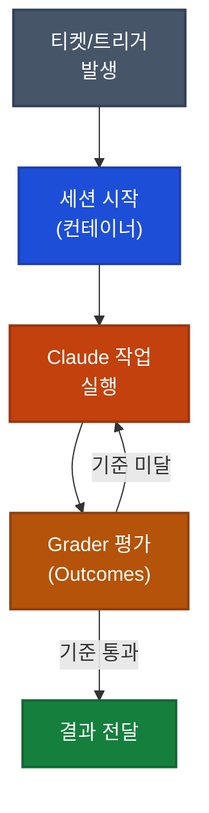
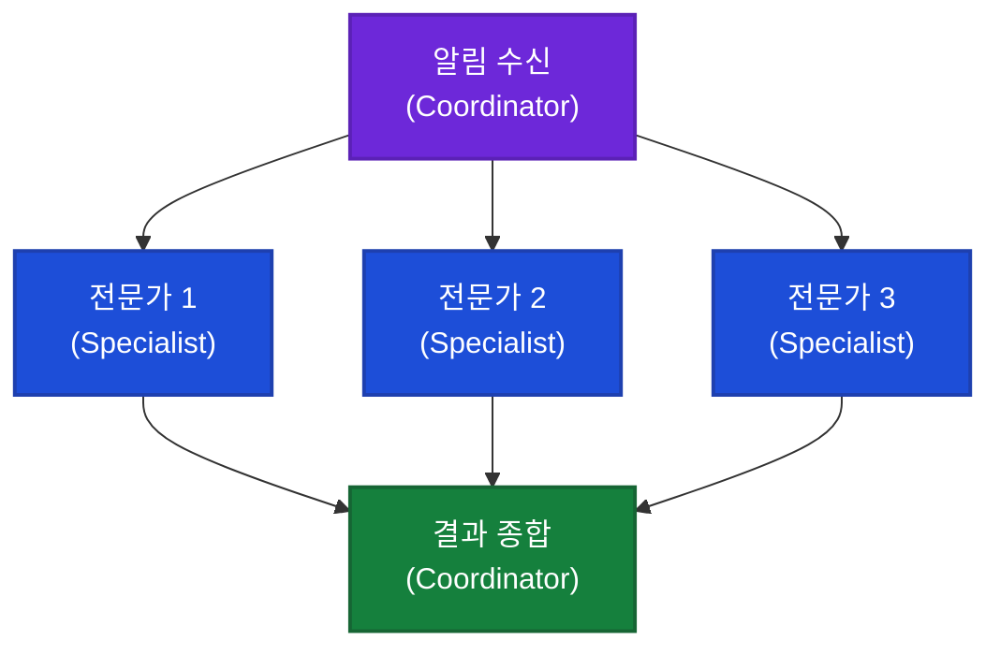

## 이게 뭔가요?

학교 과제를 제출하면 선생님이 채점 기준표를 보고 "이 부분이 부족해"라고 피드백을 줍니다. 학생은 그걸 보고 다시 써서 제출하고, 만점이 될 때까지 반복합니다.

**Claude Managed Agents의 Outcomes(결과 평가 기능)**가 바로 그런 방식입니다. 당신이 "이런 기준을 통과해야 한다"고 정하면, 별도의 평가자가 Claude의 작업 결과를 채점합니다. Claude는 그 피드백을 읽고 다시 작업해서 기준을 통과할 때까지 반복합니다. 사람이 일일이 검토하지 않아도 됩니다.

이 영상은 Anthropic 공식 채널에서 Managed Agents의 실제 동작을 세 가지 데모로 보여줍니다 — 칸반 보드(업무 관리 도구) 연동, SaaS(클라우드 소프트웨어) 가격 추적 에이전트, 멀티에이전트(여러 AI가 협력하는 구조) 인시던트 대응.

> 기본 개념(Managed Agents가 무엇인지, 어떻게 생성하는지)은 [Claude Managed Agents 입문 문서](/docs/youtube-update/claude-managed-agents-intro)를 먼저 참고하세요.

---

## 왜 알아야 하나요?

- **자동 반복 작업**: Outcomes 기능을 쓰면 Claude가 기준 충족 전까지 스스로 재작업. 사람이 중간에 검토할 필요 없음
- **병렬 처리**: 컨테이너(격리된 실행 공간)를 여러 개 띄워 여러 작업을 동시에 실행
- **팀처럼 협력**: 코디네이터 에이전트가 전문 에이전트들에게 작업을 나눠 주고 결과를 종합
- **기억하는 에이전트**: 지난주에 뭘 발견했는지 기억해서 이번주 분석에 활용 — 매번 처음부터 시작하지 않음
- **사람이 통제하는 지점**: 외부에 무언가를 보내기 전(예: Slack 메시지) 사람이 확인하고 승인하는 구조 설정 가능

---

## Managed Agents가 실제로 어떻게 돌아가나요?



각 세션은 독립된 격리 환경(VM/가상 컴퓨터) 안에서 실행됩니다. 이 환경 안에는 파일시스템(파일 저장 공간) 접근, bash(터미널 명령어 실행), 웹 검색 도구가 기본으로 갖춰집니다. 작업 결과는 이벤트 스트림(실시간 데이터 흐름)을 통해 외부 앱으로 실시간 전달됩니다.

---

## 데모 1: 칸반 보드 + Outcomes (루브릭 평가)

<div class="example-case">
<strong>시나리오: 웹사이트 성능 최적화 자동화</strong>

칸반 보드에서 "웹사이트 성능 최적화" 티켓을 "진행 중" 칸으로 드래그합니다. 이 동작이 자동으로 새 에이전트 세션을 시작시킵니다.

**환경 구성**
- Lighthouse(웹 성능 측정 도구)와 Puppeteer(브라우저 자동화 라이브러리)가 미리 설치된 환경
- GitHub(코드 저장소) 레포지토리가 컨테이너에 마운트(연결)됨

**Outcomes(평가 기준) 설정**
```
✅ Lighthouse 점수 90점 이상
✅ 렌더 블로킹 리소스 없음
✅ 모든 이미지 lazy load(지연 로딩) 적용
```

**실행 과정**
1. Claude가 Lighthouse 감사(성능 분석) 실행
2. 이미지 압축, CSS 인라인화(스타일을 HTML 안에 포함), 스크립트 지연 로딩 적용
3. 모든 tool call(도구 실행 기록)이 이벤트 스트림으로 칸반 보드에 실시간 표시
4. Grader(평가자 — 별도 context window에서 실행)가 기준 충족 여부 평가
5. 미달 시 → Claude가 피드백 읽고 재작업 → Grader 재평가
6. Lighthouse 96점 달성 → 완료

첫 번째 작업이 실행 중인 상태에서 두 번째 티켓을 드래그하면, 두 번째 컨테이너가 별도로 시작됩니다. 두 개의 세션, 두 개의 컨테이너, 두 개의 작업이 동시에 실행됩니다.

</div>

---

## 데모 2: 메모리가 있는 SaaS 가격 추적 에이전트

<div class="example-case">
<strong>시나리오: 매주 스탠드업 전 SaaS 가격 변동 리포트</strong>

회사가 쓰는 모든 SaaS(클라우드 소프트웨어 구독 서비스) 도구의 가격과 플랜 변경을 추적하고, 스탠드업(팀 회의) 전에 리포트를 준비하는 에이전트입니다.

**에이전트가 하는 일**
1. 메모리 스토어(기억 저장소)에서 지난주 발견 내용 확인
2. 각 SaaS 도구의 현재 가격 페이지 웹 검색
3. 플랜 변경, 계약에 영향 줄 신규 기능 감지
4. 샌드박스 안에서 Python으로 비용 분석 실행
5. Excel 스프레드시트에 요약 작성
6. 완료 후 Slack에 링크 게시 + Asana(업무 관리 도구)에 검토 작업 생성 — 둘 다 MCP(외부 도구 연결 기능) 서버 통해 실행
7. 이번 주 변경 사항을 메모리 스토어에 저장

**메모리가 없을 때 vs 있을 때**

| 상황 | 메모리 없음 | 메모리 있음 |
|------|------------|------------|
| 다음 주 리포트 | 동일한 정적 가격 데이터 나열 | "클라우드 컴퓨팅 비용이 지난주 대비 15% 하락" |
| 패턴 인식 | 불가 | 과거 데이터와 비교해 변화 감지 |

</div>

---

## 데모 3: 멀티에이전트 인시던트 대응

<div class="example-case">
<strong>시나리오: 모니터링 알림 → 자동 인시던트(장애) 분석</strong>

모니터링 스택(서버 상태 감시 시스템)에서 알림이 발생하면, 백엔드(서버 측 코드)의 커스텀 툴이 알림 데이터를 새 세션으로 전달합니다.

**멀티에이전트 구조**



- **Coordinator(코디네이터)**: 알림을 받아서 3명의 Specialist(전문가 에이전트)에게 작업 위임
- **각 Specialist**: 자체 context window(AI 처리 공간)에서 실행, 공유 파일시스템 접근
- **결과 종합**: Coordinator가 3개의 분석 결과를 하나의 인시던트 요약으로 통합

**권한 정책(Permissions Policy)**

Slack에 메시지를 보내기 전, 화면에 초안이 표시됩니다. 담당자가 확인하고 승인하면 메시지가 전송됩니다. 민감한 외부 동작에 human-in-the-loop(사람이 중간에 개입하는 구조)를 넣을 수 있습니다.

**메모리로 패턴 인식**

코디네이터가 메모리 스토어에서 과거 인시던트를 확인합니다. "이건 2주 전 DNS(도메인 이름 시스템) TTL(도메인 캐시 유효 기간) 잘못 설정으로 발생했던 문제와 유사합니다." 다음에 비슷한 알림이 발생하면, 에이전트는 처음부터 진단하는 대신 이 컨텍스트부터 시작합니다.

</div>

---

## Managed Agents 핵심 구성 요소 정리

| 구성 요소 | 설명 | 언제 쓰나 |
|-----------|------|----------|
| **Sessions** | 격리된 컨테이너에서 실행되는 작업 단위 | 모든 에이전트 실행 |
| **Environments** | 필요한 패키지가 미리 설치된 실행 환경 | 특정 도구 필요 시 |
| **Outcomes** | 기준 기반 자동 재작업 루프 | 품질 기준이 명확한 작업 |
| **Memory** | 세션 간 컨텍스트 유지 저장소 | 주기적 반복 작업 |
| **Multi-agent** | Coordinator + Specialist 분업 구조 | 복잡한 병렬 분석 |
| **Permissions** | 외부 동작 전 human approval | Slack, 이메일 등 외부 전송 |
| **MCP** | 외부 서비스 연결 (Slack, Asana 등) | 외부 시스템 연동 |

> **참고**: Outcomes, 멀티에이전트 코디네이션, 메모리는 현재 limited research preview(제한된 사전 체험) 단계입니다. 조기 접근 신청: [claude.com/form/claude-managed-agents](http://claude.com/form/claude-managed-agents)

---

## 주의할 점

- **Outcomes ≠ 무한 루프**: 평가 기준을 지나치게 엄격하게 설정하면 Claude가 기준을 충족하지 못해 계속 재시도할 수 있습니다. 현실적인 기준을 설정하세요
- **메모리 스토어 설계**: 무엇을 기억하고 무엇을 잊을지를 명확히 설계해야 합니다. 모든 것을 기억하면 오히려 노이즈가 됩니다
- **권한 정책 필수 권장**: 외부 시스템(Slack, 이메일 등)으로 자동 전송하는 에이전트에는 반드시 human approval 단계를 넣으세요

---

## 정리

- Outcomes로 기준 기반 자동 재작업 루프를 만들 수 있어, 사람이 중간 검토 없이도 품질 보장 가능
- 메모리 스토어로 에이전트가 과거 경험을 축적하고 패턴을 인식 — 반복 실행할수록 더 똑똑해짐
- Coordinator + Specialist 멀티에이전트 구조로 복잡한 분석을 병렬 처리하고 권한 정책으로 외부 동작을 사람이 통제 가능

---

> 📺 **출처**: [What is Managed Agents?](https://youtube.com/watch?v=NLWiIj47IdI) — Claude (Anthropic 공식 채널, 2026.04.09)
